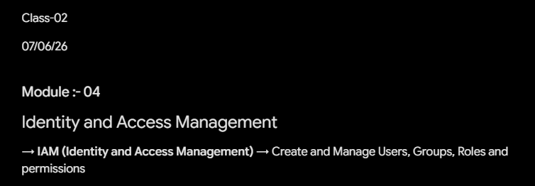


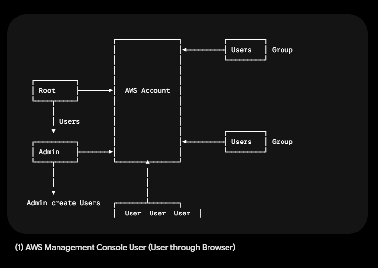


---

Here is the transcribed text formatted clean and structured in Markdown:

---

# Class-02

**Date:** 07/06/26

### Module 04: Identity and Access Management

* **IAM (Identity and Access Management):** Create and manage Users, Groups, Roles, and permissions.

┌───────────────┐          ┌─────────┐
                      │               │◄─────────┤ Users   │ Group
                      │               │          └─────────┘
                      │               │
  ┌──────────┐        │               │
  │ Root     ├───────►│  AWS Account  │
  └────┬─────┘        │               │
       │              │               │
       │ Users        │               │
       ▼              │               │          ┌─────────┐
  ┌──────────┐        │               │◄─────────┤ Users   │ Group
  │ Admin    ├───────►│               │          └─────────┘
  └────┬─────┘        └───────▲───────┘
       │                      │
       │                      │
       ▼                      │
 Admin create Users   ┌───────┴───────┐
                      │ User User User│

---

## 1. AWS Management Console User *(User through Browser)*

### Users Types

* AWS Management Console Access User
* CLI User

### Least Privilege Principle

*(Richard & John, newly joined the company)*

#### Assigned Permissions:

* **EC2 ReadOnly** Permission
* **S3 ReadOnly** Permission
* **CloudWatch Read** Permission


┌─────────────────────────┐
         │ Richard                 │
         │   │                     │
         │   ▼                     │
         │  User                   │
         │                         │
         │ John                    │
         │   │                     │
         │   ▼                     │
         │  User                   │
         └─────────────────────────┘
                      ▲
                      │
                      │         ┌───────────┐         ┌────────────────┐
 Root ──────► Admin ──┴────────►│   Users   │◄────────┤ IT Department  │
                                └───────────┘ Group   └───────┬────────┘
                                                              │
                                                              ├─► EC2 Full
                                                              ├─► S3 Full
                                                              ├─► RDS Full
                                                              ├─► ECS Full
                                                              ├─► EKS Full
                                                              └─► EFS Full

                                ┌───────────┐
                                │   Users   │ Group
                                └───────────┘

--------------xxxxxxxxxx------------


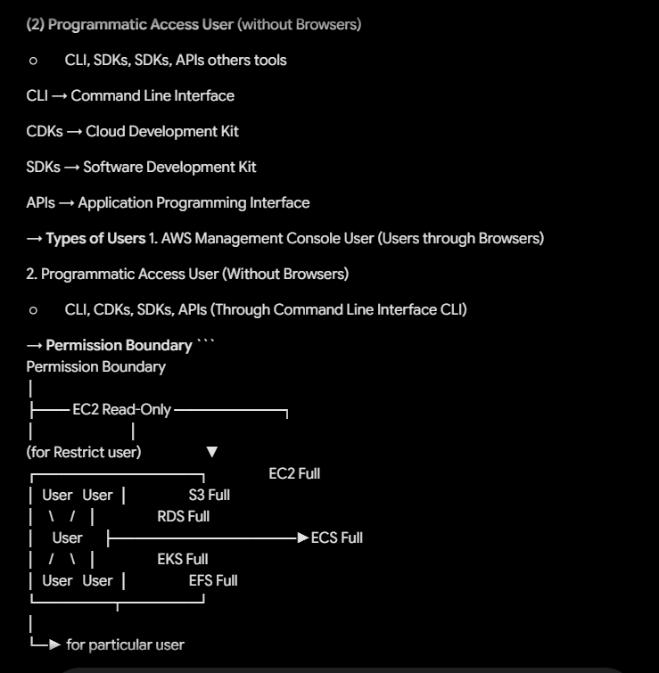


---

**(2) Programmatic Access User** (without Browsers)

* CLI, SDKs, SDKs, APIs others tools

CLI → Command Line Interface

CDKs → Cloud Development Kit

SDKs → Software Development Kit

APIs → Application Programming Interface

→ **Types of Users** 1. AWS Management Console User (Users through Browsers)

2. Programmatic Access User (Without Browsers)

* CLI, CDKs, SDKs, APIs (Through Command Line Interface CLI)

---

→ **Permission Boundary** ```
Permission Boundary
│
├─── EC2 Read-Only ──────────┐
│                            │
(for Restrict user)                   ▼
┌───────────────┐                  EC2 Full
│  User   User  │                  S3 Full
│    \     /    │                  RDS Full
│     User      ├─────────────────►ECS Full
│    /     \    │                  EKS Full
│  User   User  │                  EFS Full
└───────┬───────┘
│
└─► for particular user

```


```

Permission Boundary
│
├─── EC2 Read-Only ──────────┐
│                            │
(for Restrict user or                 ▼
entire group)               ┌───────────┐ Group              EC2 Full
│ User User │                    S3 Full
│           ├───────────────────►RDS Full
│ User User │                    ECS Full
└─────┬─────┘                    EKS Full
Group │                          EFS Full
│
└─► for entire group
│
▼
all users in this group

```

```

-------------xxxxxxxxxxxxxx----------


---

→ **LAB for AWS Management Console User** *(Users through Browser)* **Step 1 :-** IAM ──► (Search - IAM)

↓

IAM Users

↓

Create User

→ **User details** → User name

* ProdAdmin

☑ Provide user access to the AWS Management console

→ Console password

→ Custom password

* Admin@12345

→ **Set Permissions** → Permissions options

→ Attach policies directly

→ Permissions policies

* (search)

✓ AdministratorAccess

→ **Tags** → Key

* Project

→ Value

* Training

→ **Download .csv file** (for Username & password)


--------------xxxxxxxxxxxxx-----------


---

**Step 2 :- Console sign in details** → **Console sign-in-URL** * ─────────────────────

→ **Username** * ProdAdmin

→ **Console Password** * ─────────────────────

(copy user link)

│

└─────────────┐

▼

**Step 3 :- Open New tab (browser)** → **Copy and paste User link** ↓

**login through ProdAdmin** **Step 4 :-** IAM

↓

IAM Users

↓

ProdAdmin

↓

→ **Permission Policies** * AdministratorAccess

**Step 5 :- In ProdAdmin Account** → IAM

↓

IAM Users

↓

Create User

→ **User details** → **User name** * Richard

✓ Provide User access to the AWS Management console


-------------xxxxxxxxxxxxx---------


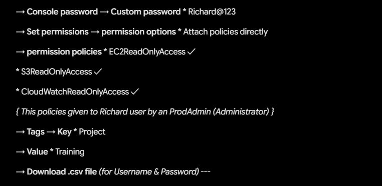


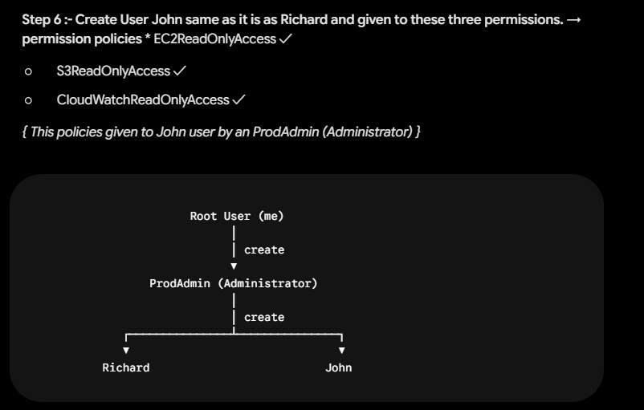


---

→ **Console password** → **Custom password** * Richard@123

→ **Set permissions** → **permission options** * Attach policies directly

→ **permission policies** * EC2ReadOnlyAccess ✓

* S3ReadOnlyAccess ✓

* CloudWatchReadOnlyAccess ✓

*{ This policies given to Richard user by an ProdAdmin (Administrator) }*

→ **Tags** → **Key** * Project

→ **Value** * Training

→ **Download .csv file** *(for Username & Password)* ---

**Step 6 :-** **Create User John same as it is as Richard and given to these three permissions.** → **permission policies** * EC2ReadOnlyAccess ✓

* S3ReadOnlyAccess ✓
* CloudWatchReadOnlyAccess ✓

*{ This policies given to John user by an ProdAdmin (Administrator) }*

```
                       Root User (me)
                             │
                             │ create
                             ▼
                 ProdAdmin (Administrator)
                             │
                             │ create
             ┌───────────────┴───────────────┐
             ▼                               ▼
          Richard                          John

```

-------xxxxxxxxxx------------


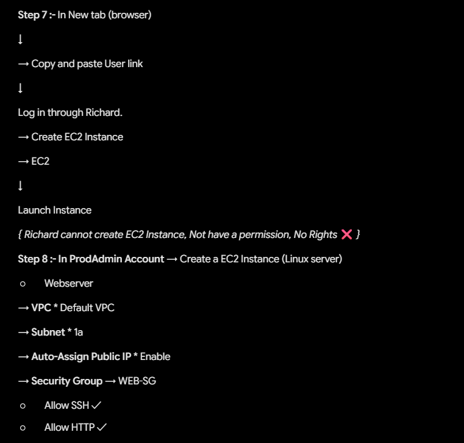


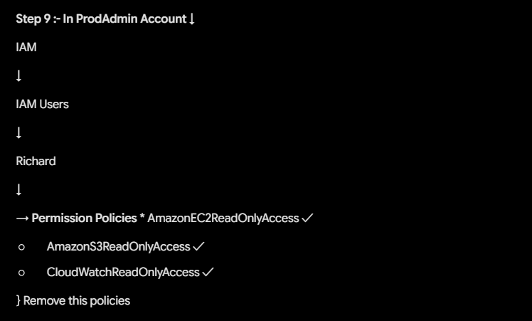


---

**Step 7 :-** In New tab (browser)

↓

→ Copy and paste User link

↓

Log in through Richard.

→ Create EC2 Instance

→ EC2

↓

Launch Instance

*{ Richard cannot create EC2 Instance, Not have a permission, No Rights ❌ }*

---

**Step 8 :- In ProdAdmin Account** → Create a EC2 Instance (Linux server)

* Webserver

→ **VPC** * Default VPC

→ **Subnet** * 1a

→ **Auto-Assign Public IP** * Enable

→ **Security Group** → WEB-SG

* Allow SSH ✓
* Allow HTTP ✓

---

**Step 9 :- In ProdAdmin Account** ↓

IAM

↓

IAM Users

↓

Richard

↓

→ **Permission Policies** * AmazonEC2ReadOnlyAccess ✓

* AmazonS3ReadOnlyAccess ✓
* CloudWatchReadOnlyAccess ✓

} Remove this policies


------------xxxxxxxxxxxxxx------------


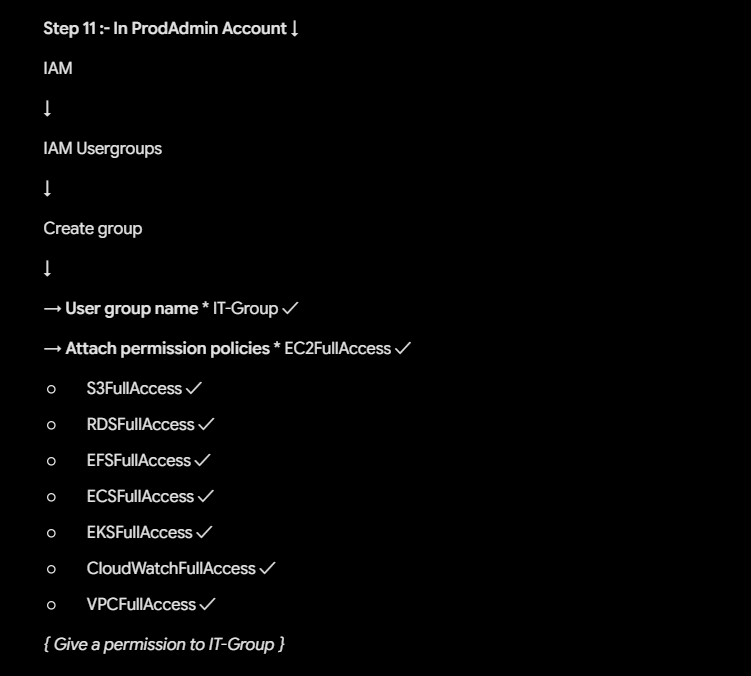


---

→ **Remove** → **Add permissions** → **Attach permissions** * EC2FullAccess

* S3FullAccess

* CloudWatchFullAccess

*{ Add this policies to Richard User }*

---

**Step 10 :- In Richard Account** ↓

EC2

→ **Webserver** ──► **stop** ──► **yes ✓** *{ bcz Richard have a EC2 Full Access }*

---

**Step 11 :- In ProdAdmin Account** ↓

IAM

↓

IAM Usergroups

↓

Create group

↓

→ **User group name** * IT-Group ✓

→ **Attach permission policies** * EC2FullAccess ✓

* S3FullAccess ✓
* RDSFullAccess ✓
* EFSFullAccess ✓
* ECSFullAccess ✓
* EKSFullAccess ✓
* CloudWatchFullAccess ✓
* VPCFullAccess ✓

*{ Give a permission to IT-Group }*


------------xxxxxxxxxxx----------


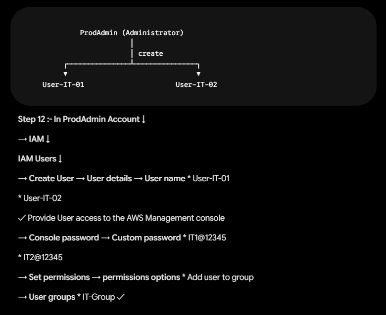


---

```
             ProdAdmin (Administrator)
                         │
                         │ create
         ┌───────────────┴───────────────┐
         ▼                               ▼
    User-IT-01                      User-IT-02

```

**Step 12 :- In ProdAdmin Account** ↓

→ **IAM** ↓

**IAM Users** ↓

→ **Create User** → **User details** → **User name** * User-IT-01

* User-IT-02

✓ Provide User access to the AWS Management console

→ **Console password** → **Custom password** * IT1@12345

* IT2@12345

→ **Set permissions** → **permissions options** * Add user to group

→ **User groups** * IT-Group ✓

```
           ProdAdmin (Administrator)
                       │
                       │ Create Group
                       ▼
                   IT-Group
                       │
                       │ User Members
       ┌───────────────┴───────────────┐
       ▼                               ▼
  User-IT-01                      User-IT-02
       ▲                               ▲
       │          Permission ✓         │
       └───────────────────────────────┘

```

---

**Step 13 :-** IAM

↓

IAM Usergroup

↓

IT-Group

↓

→ **Users** → User-IT-01

→ User-IT-02

*{ member users of ITGroup all permission }*

→ **Permissions** → **permission policies** * ─────────────────────

*{ all this permissions given to User1 & User2 individually }*

---------xxxxxxxxx----------


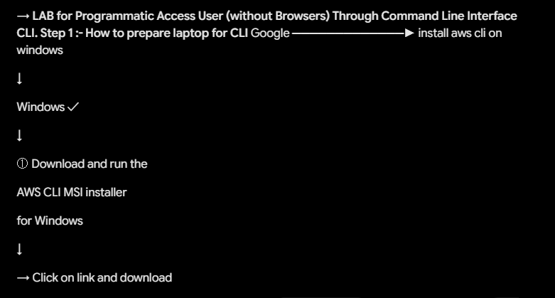


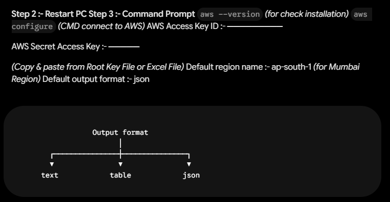


---

→ **LAB for Programmatic Access User (without Browsers)** **Through Command Line Interface CLI.** **Step 1 :- How to prepare laptop for CLI** Google ─────────────► install aws cli on windows

↓

Windows ✓

↓

① Download and run the

AWS CLI MSI installer

for Windows

↓

→ Click on link and download

**Step 2 :- Restart PC** **Step 3 :- Command Prompt** `aws --version` *(for check installation)* `aws configure` *(CMD connect to AWS)* AWS Access Key ID :- ─────────

AWS Secret Access Key :- ─────

*(Copy & paste from Root Key File or Excel File)* Default region name :- ap-south-1 *(for Mumbai Region)* Default output format :- json

```
                 Output format
                       │
       ┌───────────────┼───────────────┐
       ▼               ▼               ▼
     text            table            json

```

------------xxxxxxxxxxxx--------


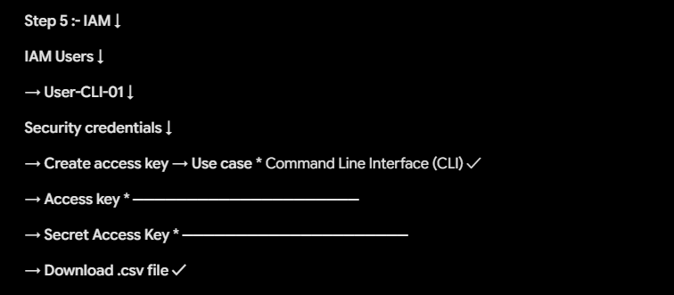


Here is the transcribed text from your image:

---

**Step 4 :- In ProdAdmin Account** → **Create a CLI User** → **IAM** ↓

**IAM Users** ↓

→ **Create User** → **User Name** * User-CLI-01

☒ Provide User access to the AWS Management console

→ **Set permissions** → **permission options** * Attach policy directly

→ **permission policies** * Administrator Access

```
                      CLI User
                         │
                         ▼
              ✓ Admin (Administrator)

```

---

**Step 5 :- IAM** ↓

**IAM Users** ↓

→ **User-CLI-01** ↓

**Security credentials** ↓

→ **Create access key** → **Use case** * Command Line Interface (CLI) ✓

→ **Access key** * ─────────────────────

→ **Secret Access Key** * ─────────────────────

→ **Download .csv file ✓**


-----------xxxxxxxxxxxx-----------


---

**Note :- ► Best Practices** **Access key and Secret Access Key of a User can be stored in AWS Secrets Manager or in Parameter Store AWS Systems Manager**

---

**Step 6 :-** `aws s3 ls`

`aws s3 mb s3://mybucket`

`aws s3 ls`

`dir *.png`

`dir *.pdf`

`dir`

`aws s3 cp newkey.pem s3://mybucket` *(Upload file in bucket)* `aws s3 ls s3://mybucket` *(for check objects in bucket)* `aws s3 rb s3://mybucket --force` *(for delete bucket)* `cls`

*{ CLI User ──► Administrator }* *{ Full access to create bucket }*

---------xxxxxxxxxxxx--------


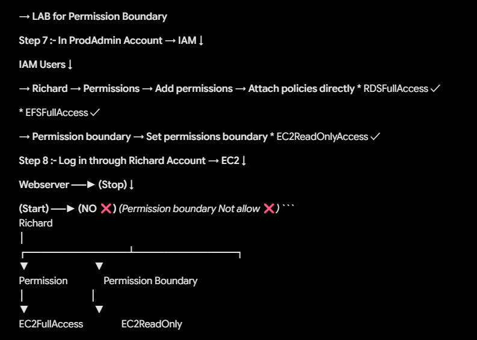


---

→ **LAB for Permission Boundary**

**Step 7 :- In ProdAdmin Account** → **IAM** ↓

**IAM Users** ↓

→ **Richard** → **Permissions** → **Add permissions** → **Attach policies directly** * RDSFullAccess ✓

* EFSFullAccess ✓

→ **Permission boundary** → **Set permissions boundary** * EC2ReadOnlyAccess ✓

---

**Step 8 :- Log in through Richard Account** → **EC2** ↓

**Webserver** ──► **(Stop)** ↓

**(Start)** ──► **(NO ❌)** *(Permission boundary Not allow ❌)* ```
Richard
│
┌──────────────┴──────────────┐
▼                             ▼
Permission                Permission Boundary
│                             │
▼                             ▼
EC2FullAccess                 EC2ReadOnly

```

```


__________XXXXXXXXXX___________