---

### **Lab 3: Role-Based Access Control (RBAC)**

* **Objective:** Enable an IAM User (`Dev-User`) to temporarily assume a higher-privileged IAM Role (`Developer-Role`) using Security Token Service (STS) switch-role functionality.
* **Key Takeaways:**
* **Two-Way Trust Relationship:** 1. The **Role’s Trust Policy** must explicitly permit the User's ARN to assume it (`sts:AssumeRole`).
2. The **User’s Permission Policy** must permit the user to perform the `sts:AssumeRole` action on the Role’s ARN.
* **Temporary Privilege Escalation:** Instead of assigning permanent admin permissions (`EC2FullAccess`, `S3FullAccess`) directly to users, users assume roles temporarily to execute specific administrative tasks.


---


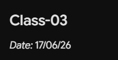


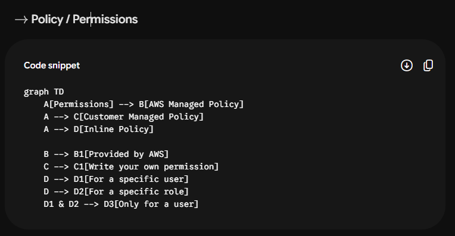


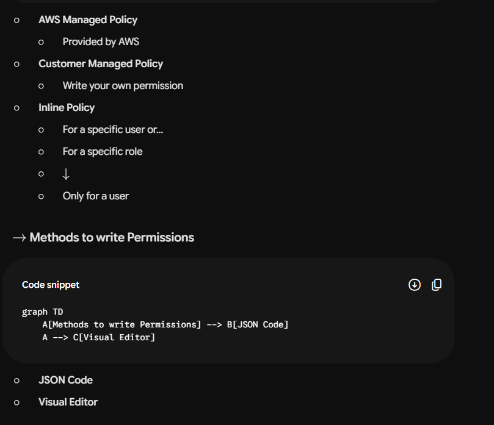


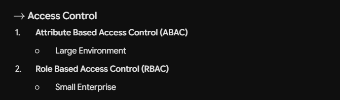


---

## **Class-03**

*Date:* 17/06/26

---

### **$\rightarrow$ Policy / Permissions**

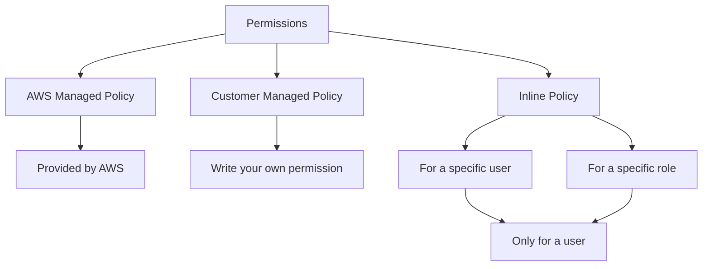
```mermaid
graph TD
    A[Permissions] --> B[AWS Managed Policy]
    A --> C[Customer Managed Policy]
    A --> D[Inline Policy]

    B --> B1[Provided by AWS]
    C --> C1[Write your own permission]
    D --> D1[For a specific user]
    D --> D2[For a specific role]
    D1 & D2 --> D3[Only for a user]

```

* **AWS Managed Policy**
* Provided by AWS


* **Customer Managed Policy**
* Write your own permission


* **Inline Policy**
* For a specific user or...
* For a specific role
* $\downarrow$
* Only for a user


---

### **$\rightarrow$ Methods to write Permissions**

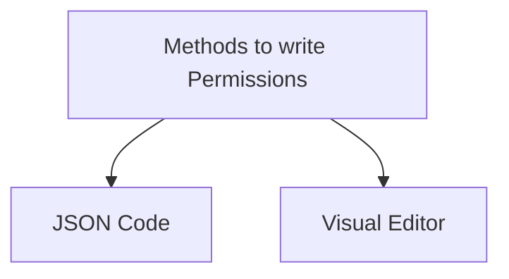
```mermaid
graph TD
    A[Methods to write Permissions] --> B[JSON Code]
    A --> C[Visual Editor]

```

* **JSON Code**
* **Visual Editor**

---

### **$\rightarrow$ Access Control**

1. **Attribute Based Access Control (ABAC)**
* Large Environment


2. **Role Based Access Control (RBAC)**
* Small Enterprise


------------xxxxxxxxxxx--------


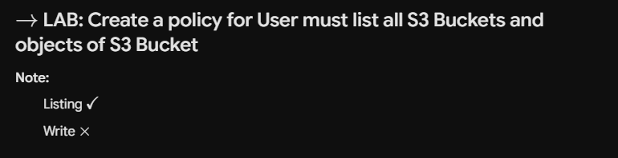


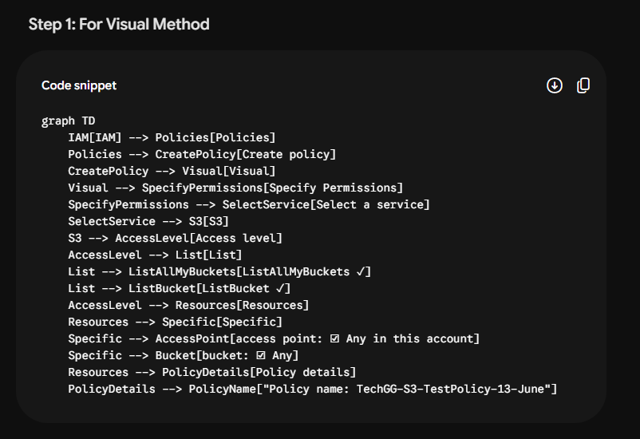


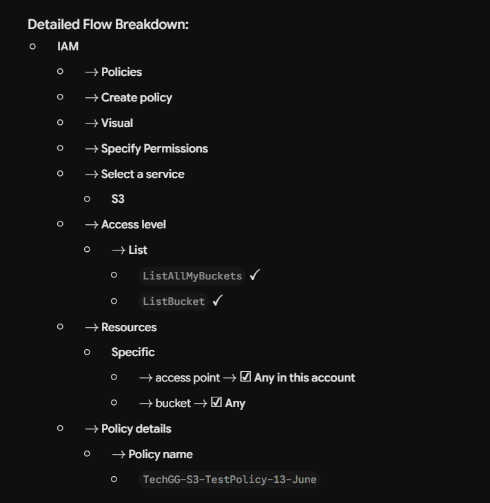


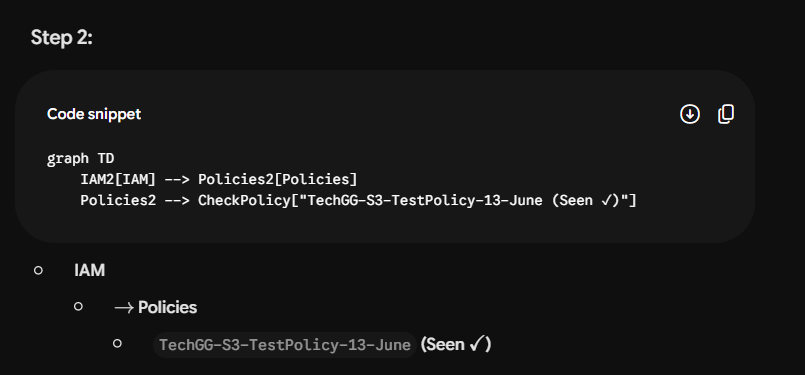


---

## **$\rightarrow$ LAB: Create a policy for User must list all S3 Buckets and objects of S3 Bucket**

> **Note:**
> * Listing $\checkmark$
> * Write $\mathbf{\times}$
> 
> 

---

### **Step 1: For Visual Method**

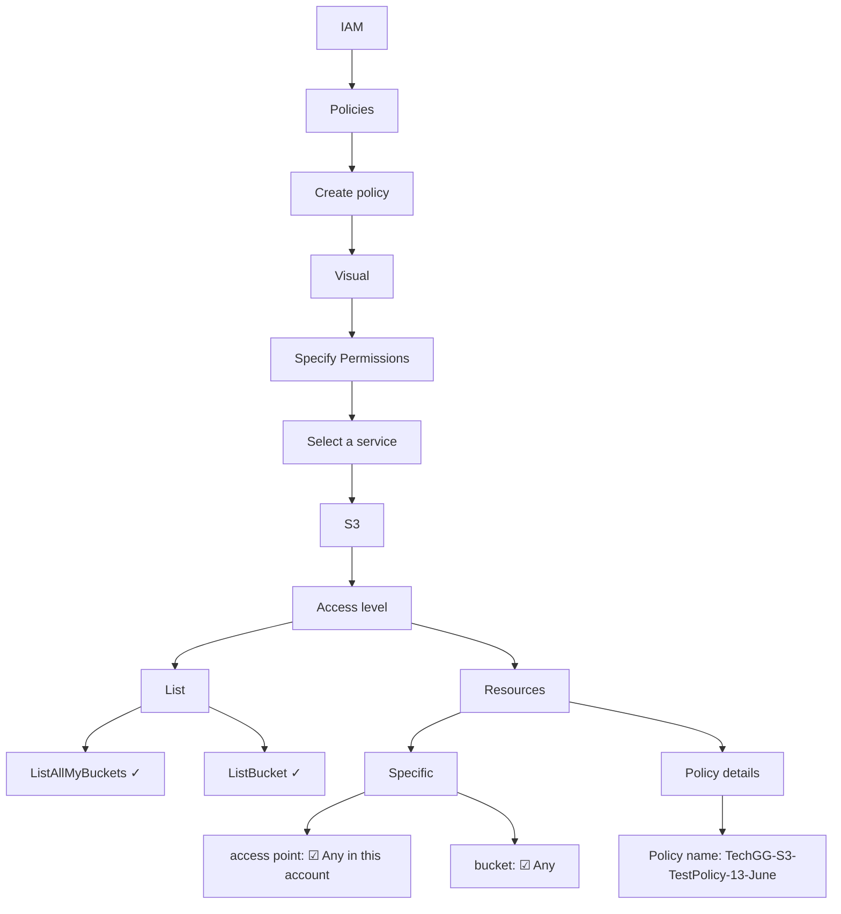
```mermaid
graph TD
    IAM[IAM] --> Policies[Policies]
    Policies --> CreatePolicy[Create policy]
    CreatePolicy --> Visual[Visual]
    Visual --> SpecifyPermissions[Specify Permissions]
    SpecifyPermissions --> SelectService[Select a service]
    SelectService --> S3[S3]
    S3 --> AccessLevel[Access level]
    AccessLevel --> List[List]
    List --> ListAllMyBuckets[ListAllMyBuckets ✓]
    List --> ListBucket[ListBucket ✓]
    AccessLevel --> Resources[Resources]
    Resources --> Specific[Specific]
    Specific --> AccessPoint[access point: ☑ Any in this account]
    Specific --> Bucket[bucket: ☑ Any]
    Resources --> PolicyDetails[Policy details]
    PolicyDetails --> PolicyName["Policy name: TechGG-S3-TestPolicy-13-June"]

```

#### **Detailed Flow Breakdown:**

* **IAM**
* $\rightarrow$ **Policies**
* $\rightarrow$ **Create policy**
* $\rightarrow$ **Visual**
* $\rightarrow$ **Specify Permissions**
* $\rightarrow$ **Select a service**
* **S3**


* $\rightarrow$ **Access level**
* $\rightarrow$ **List**
* `ListAllMyBuckets` $\checkmark$
* `ListBucket` $\checkmark$


* $\rightarrow$ **Resources**
* **Specific**
* $\rightarrow$ access point $\rightarrow$ $\mathbf{\text{☑}}$ **Any in this account**
* $\rightarrow$ bucket $\rightarrow$ $\mathbf{\text{☑}}$ **Any**


* $\rightarrow$ **Policy details**
* $\rightarrow$ **Policy name**
* `TechGG-S3-TestPolicy-13-June`


---

### **Step 2:**

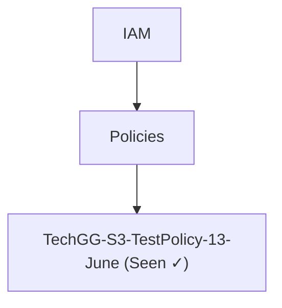
```mermaid
graph TD
    IAM2[IAM] --> Policies2[Policies]
    Policies2 --> CheckPolicy["TechGG-S3-TestPolicy-13-June (Seen ✓)"]

```

* **IAM**
* $\rightarrow$ **Policies**
* `TechGG-S3-TestPolicy-13-June` **(Seen $\checkmark$)**


------------xxxxxxxxxxx---------


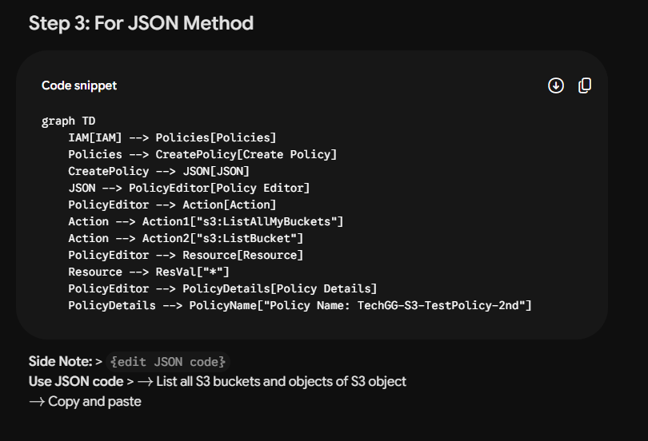


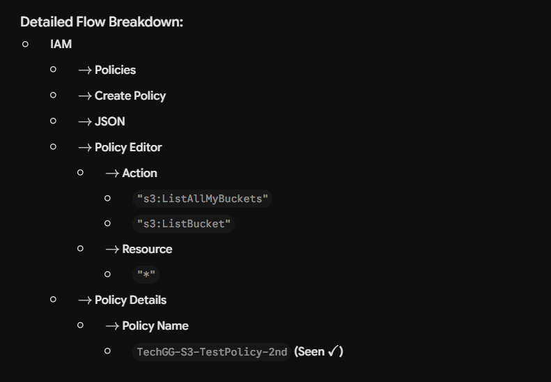


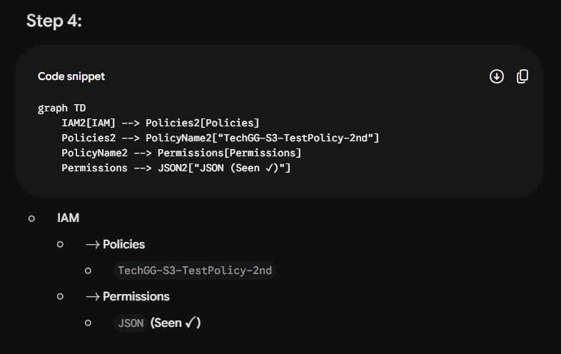


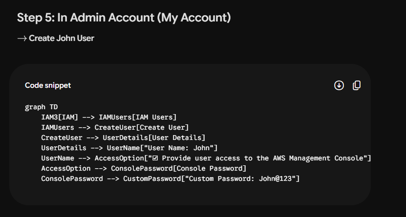


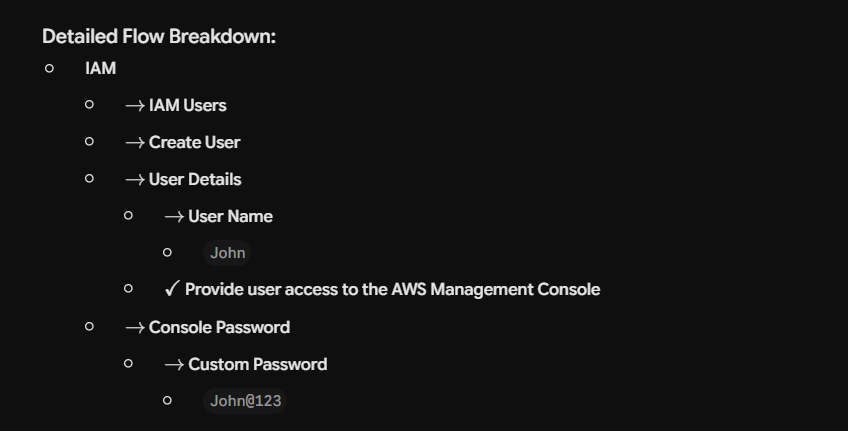


---

## **Step 3: For JSON Method**

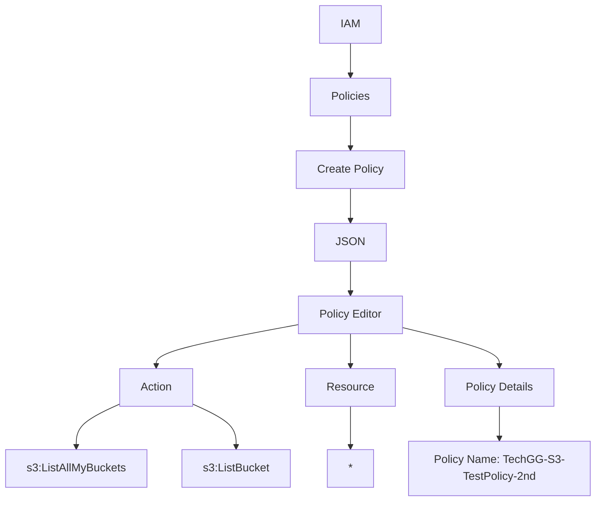
```mermaid
graph TD
    IAM[IAM] --> Policies[Policies]
    Policies --> CreatePolicy[Create Policy]
    CreatePolicy --> JSON[JSON]
    JSON --> PolicyEditor[Policy Editor]
    PolicyEditor --> Action[Action]
    Action --> Action1["s3:ListAllMyBuckets"]
    Action --> Action2["s3:ListBucket"]
    PolicyEditor --> Resource[Resource]
    Resource --> ResVal["*"]
    PolicyEditor --> PolicyDetails[Policy Details]
    PolicyDetails --> PolicyName["Policy Name: TechGG-S3-TestPolicy-2nd"]

```

> **Side Note:** > `{edit JSON code}`
> **Use JSON code** > $\rightarrow$ List all S3 buckets and objects of S3 object
> $\rightarrow$ Copy and paste

#### **Detailed Flow Breakdown:**

* **IAM**
* $\rightarrow$ **Policies**
* $\rightarrow$ **Create Policy**
* $\rightarrow$ **JSON**
* $\rightarrow$ **Policy Editor**
* $\rightarrow$ **Action**
* `"s3:ListAllMyBuckets"`
* `"s3:ListBucket"`


* $\rightarrow$ **Resource**
* `"*"`


* $\rightarrow$ **Policy Details**
* $\rightarrow$ **Policy Name**
* `TechGG-S3-TestPolicy-2nd` **(Seen $\checkmark$)**


---

## **Step 4:**

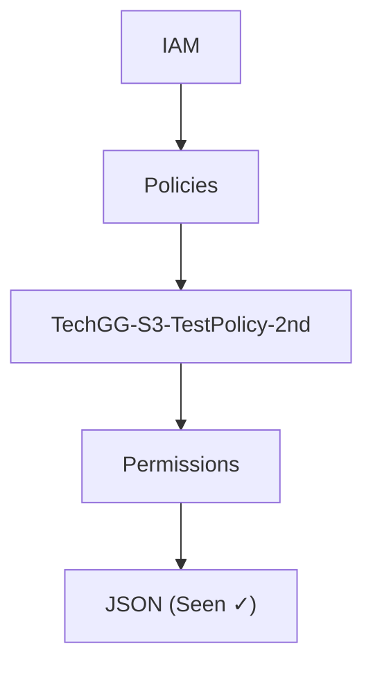
```mermaid
graph TD
    IAM2[IAM] --> Policies2[Policies]
    Policies2 --> PolicyName2["TechGG-S3-TestPolicy-2nd"]
    PolicyName2 --> Permissions[Permissions]
    Permissions --> JSON2["JSON (Seen ✓)"]

```

* **IAM**
* $\rightarrow$ **Policies**
* `TechGG-S3-TestPolicy-2nd`


* $\rightarrow$ **Permissions**
* `JSON` **(Seen $\checkmark$)**


---

## **Step 5: In Admin Account (My Account)**

$\rightarrow$ **Create John User**

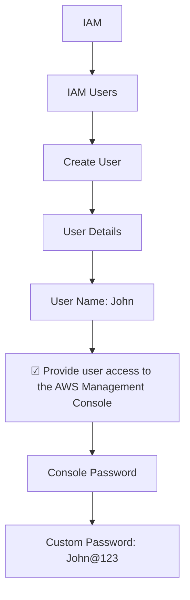
```mermaid
graph TD
    IAM3[IAM] --> IAMUsers[IAM Users]
    IAMUsers --> CreateUser[Create User]
    CreateUser --> UserDetails[User Details]
    UserDetails --> UserName["User Name: John"]
    UserName --> AccessOption["☑ Provide user access to the AWS Management Console"]
    AccessOption --> ConsolePassword[Console Password]
    ConsolePassword --> CustomPassword["Custom Password: John@123"]

```

#### **Detailed Flow Breakdown:**

* **IAM**
* $\rightarrow$ **IAM Users**
* $\rightarrow$ **Create User**
* $\rightarrow$ **User Details**
* $\rightarrow$ **User Name**
* `John`


* $\checkmark$ **Provide user access to the AWS Management Console**


* $\rightarrow$ **Console Password**
* $\rightarrow$ **Custom Password**
* `John@123`

--------xxxxxxxxxx------------


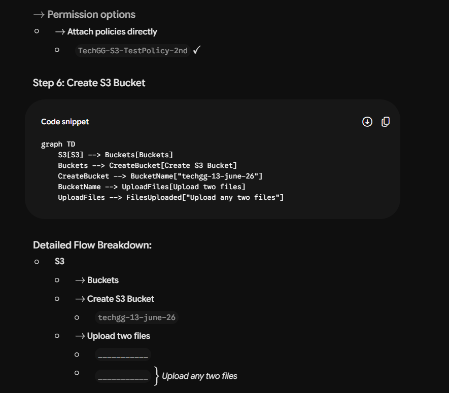


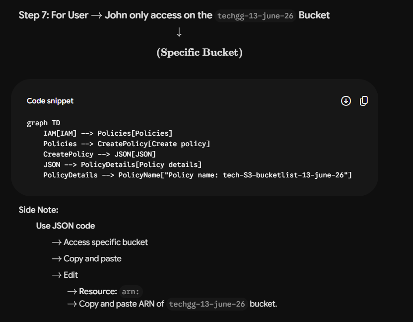


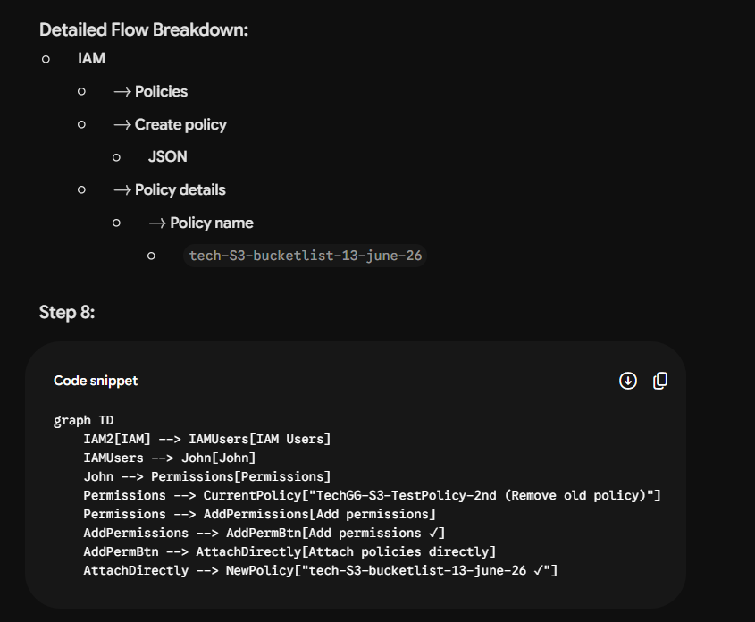


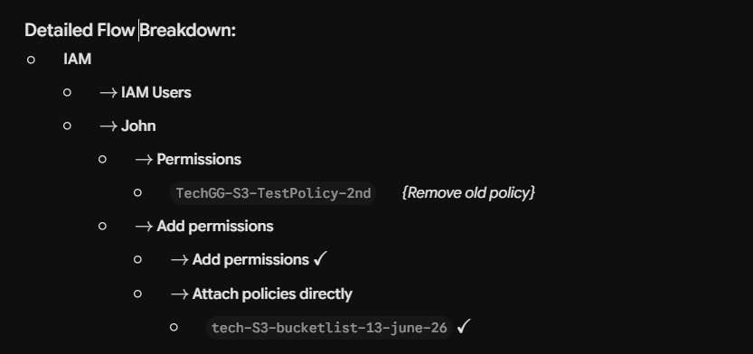


---

### **$\rightarrow$ Permission options**

* $\rightarrow$ **Attach policies directly**
* `TechGG-S3-TestPolicy-2nd` $\checkmark$


---

### **Step 6: Create S3 Bucket**

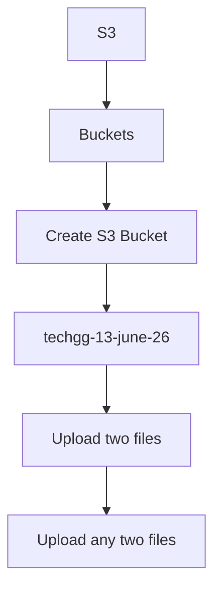
```mermaid
graph TD
    S3[S3] --> Buckets[Buckets]
    Buckets --> CreateBucket[Create S3 Bucket]
    CreateBucket --> BucketName["techgg-13-june-26"]
    BucketName --> UploadFiles[Upload two files]
    UploadFiles --> FilesUploaded["Upload any two files"]

```

#### **Detailed Flow Breakdown:**

* **S3**
* $\rightarrow$ **Buckets**
* $\rightarrow$ **Create S3 Bucket**
* `techgg-13-june-26`


* $\rightarrow$ **Upload two files**
* `___________`
* `___________` $\Big\}$ *Upload any two files*


---

### **Step 7: For User $\rightarrow$ John only access on the `techgg-13-june-26` Bucket**

$\qquad\qquad\qquad\qquad\qquad\qquad\qquad\quad\:\:\mathbf{\downarrow}$

$\qquad\qquad\qquad\qquad\qquad\qquad\quad\:\:\text{\textbf{(Specific Bucket)}}$

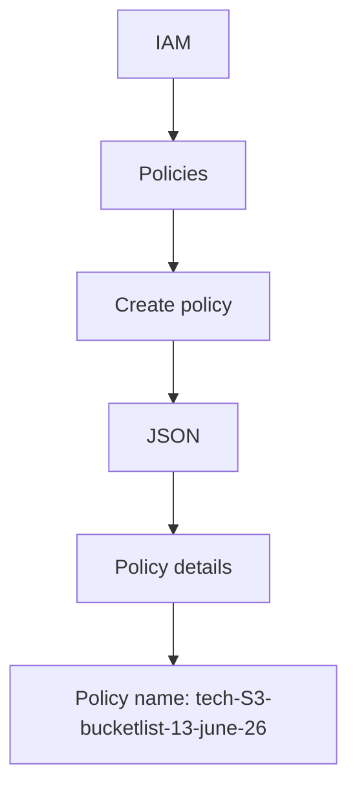
```mermaid
graph TD
    IAM[IAM] --> Policies[Policies]
    Policies --> CreatePolicy[Create policy]
    CreatePolicy --> JSON[JSON]
    JSON --> PolicyDetails[Policy details]
    PolicyDetails --> PolicyName["Policy name: tech-S3-bucketlist-13-june-26"]

```

> **Side Note:**
> * **Use JSON code**
> * $\rightarrow$ Access specific bucket
> * $\rightarrow$ Copy and paste
> * $\rightarrow$ Edit
> * $\rightarrow$ **Resource:** `arn:`
> $\rightarrow$ Copy and paste ARN of `techgg-13-june-26` bucket.
> 
> 
> 
> 
> 
> 

#### **Detailed Flow Breakdown:**

* **IAM**
* $\rightarrow$ **Policies**
* $\rightarrow$ **Create policy**
* **JSON**


* $\rightarrow$ **Policy details**
* $\rightarrow$ **Policy name**
* `tech-S3-bucketlist-13-june-26`


---

### **Step 8:**

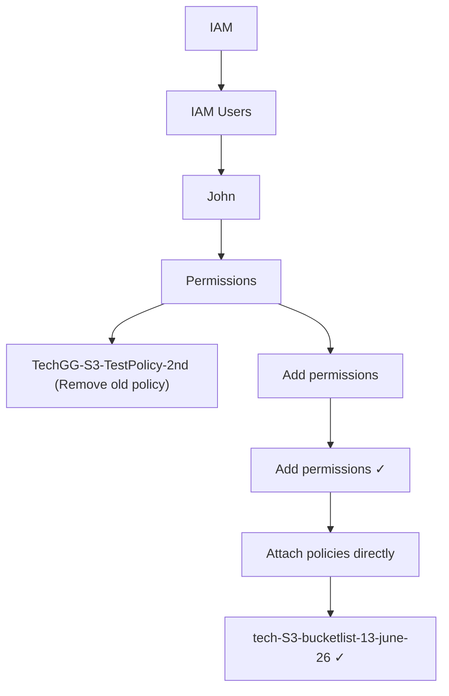
```mermaid
graph TD
    IAM2[IAM] --> IAMUsers[IAM Users]
    IAMUsers --> John[John]
    John --> Permissions[Permissions]
    Permissions --> CurrentPolicy["TechGG-S3-TestPolicy-2nd (Remove old policy)"]
    Permissions --> AddPermissions[Add permissions]
    AddPermissions --> AddPermBtn[Add permissions ✓]
    AddPermBtn --> AttachDirectly[Attach policies directly]
    AttachDirectly --> NewPolicy["tech-S3-bucketlist-13-june-26 ✓"]

```

#### **Detailed Flow Breakdown:**

* **IAM**
* $\rightarrow$ **IAM Users**
* $\rightarrow$ **John**
* $\rightarrow$ **Permissions**
* `TechGG-S3-TestPolicy-2nd` $\quad$ *{Remove old policy}*


* $\rightarrow$ **Add permissions**
* $\rightarrow$ **Add permissions** $\checkmark$
* $\rightarrow$ **Attach policies directly**
* `tech-S3-bucketlist-13-june-26` $\checkmark$

-----------xxxxxxxxxxxxx-----------


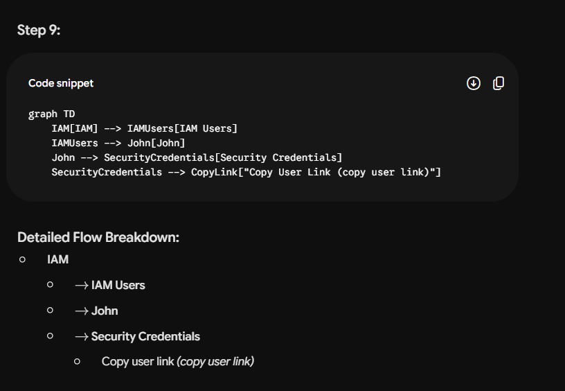


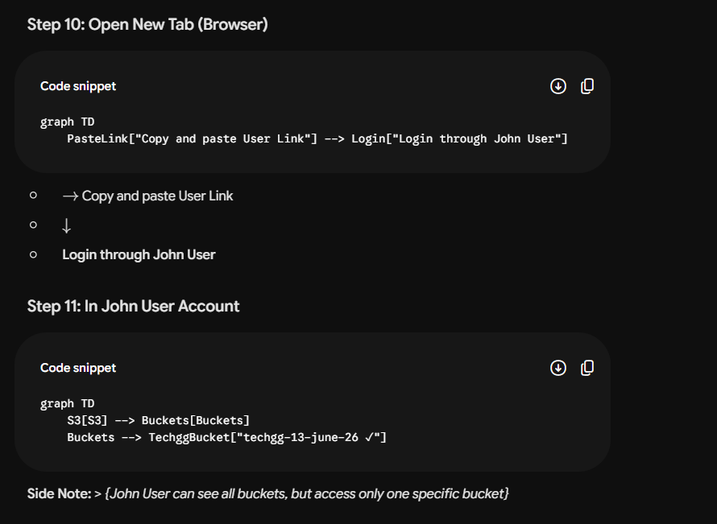


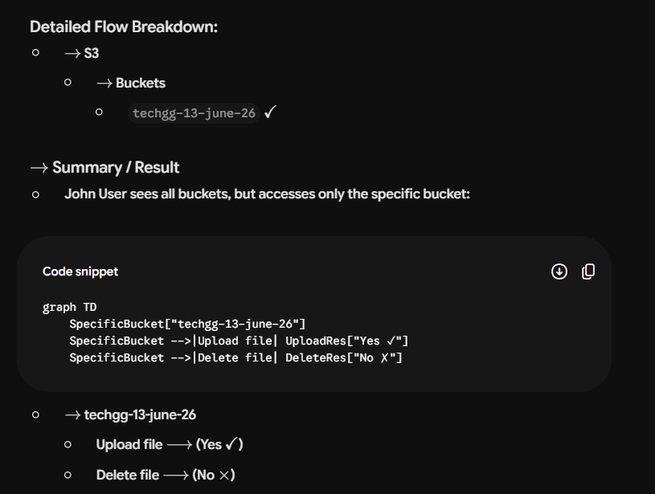


---

### **Step 9:**

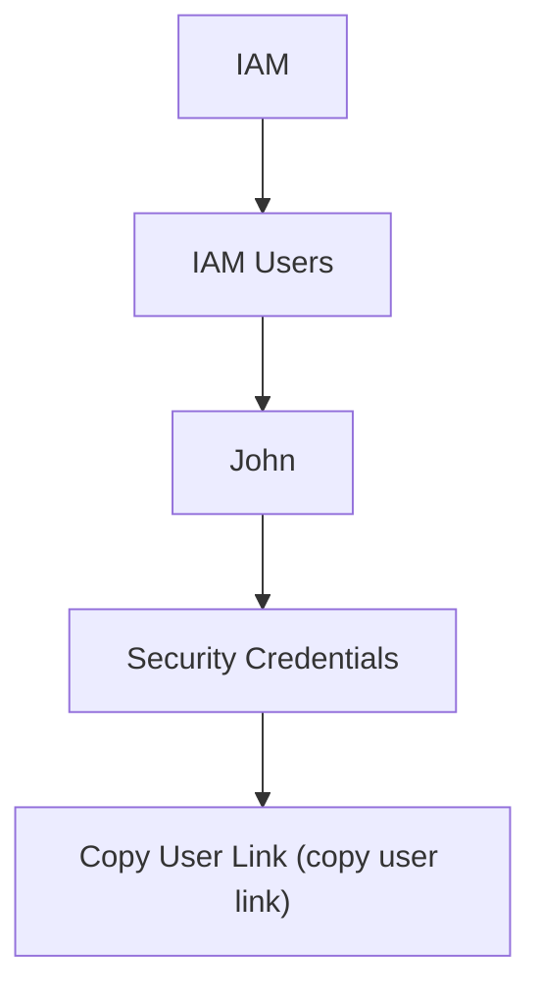
```mermaid
graph TD
    IAM[IAM] --> IAMUsers[IAM Users]
    IAMUsers --> John[John]
    John --> SecurityCredentials[Security Credentials]
    SecurityCredentials --> CopyLink["Copy User Link (copy user link)"]

```

#### **Detailed Flow Breakdown:**

* **IAM**
* $\rightarrow$ **IAM Users**
* $\rightarrow$ **John**
* $\rightarrow$ **Security Credentials**
* Copy user link *(copy user link)*


---

### **Step 10: Open New Tab (Browser)**

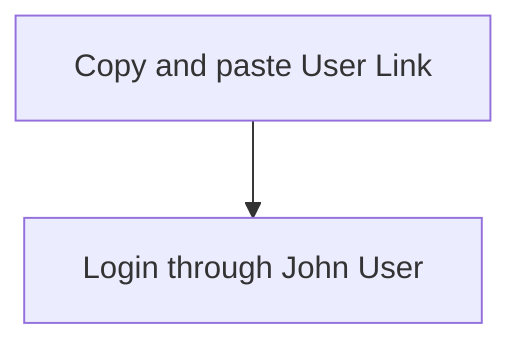
```mermaid
graph TD
    PasteLink["Copy and paste User Link"] --> Login["Login through John User"]

```

* $\rightarrow$ Copy and paste User Link
* $\downarrow$
* **Login through John User**

---

### **Step 11: In John User Account**

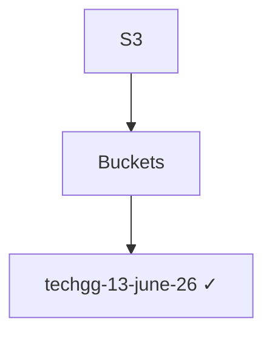
```mermaid
graph TD
    S3[S3] --> Buckets[Buckets]
    Buckets --> TechggBucket["techgg-13-june-26 ✓"]

```

> **Side Note:** > *{John User can see all buckets, but access only one specific bucket}*

#### **Detailed Flow Breakdown:**

* $\rightarrow$ **S3**
* $\rightarrow$ **Buckets**
* `techgg-13-june-26` $\checkmark$


---

### **$\rightarrow$ Summary / Result**

* **John User sees all buckets, but accesses only the specific bucket:**

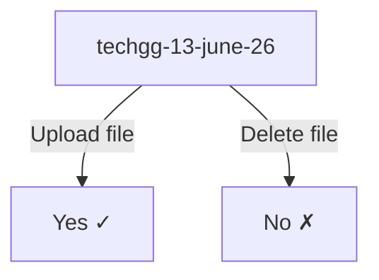
```mermaid
graph TD
    SpecificBucket["techgg-13-june-26"]
    SpecificBucket -->|Upload file| UploadRes["Yes ✓"]
    SpecificBucket -->|Delete file| DeleteRes["No ✗"]

```

* $\rightarrow$ **techgg-13-june-26**
* **Upload file** $\longrightarrow$ **(Yes $\checkmark$)**
* **Delete file** $\longrightarrow$ **(No $\mathbf{\times}$)**


That's a good way to learn AWS IAM. Instead of trying to memorize everything, complete each lab one at a time and verify the result before moving to the next.


# Lab 1 – IAM Policy for S3 (Beginner)

## Goal

Create an IAM user that:

* Can see all S3 buckets.
* Can access only one specific bucket.
* Cannot delete objects.

---

## Part 1 – Create an IAM User

1. Sign in as the AWS account root user or administrator.
2. Open **IAM**.
3. Click **Users**.
4. Click **Create user**.
5. Name the user:

```
John
```

6. Enable **Provide user access to the AWS Management Console**.
7. Create a password.
8. Finish creating the user.

---

## Part 2 – Create an S3 Bucket

1. Open **S3**.
2. Click **Create bucket**.
3. Bucket name:

```
techgg-13-june-26
```

4. Keep default settings.
5. Click **Create bucket**.
6. Upload two small files.

Example:

```
notes.txt
image.jpg
```

---

## Part 3 – Create a Policy (Visual Editor)

1. Open **IAM**
2. Click **Policies**
3. Click **Create Policy**
4. Choose **Visual**

Choose:

**Service**

```
S3
```

Access Level

```
List
```

Select

```
✔ ListAllMyBuckets
✔ ListBucket
```

Resources

```
Bucket → Any
Access Point → Any
```

Click **Next**

Policy Name

```
TechGG-S3-TestPolicy
```

Create Policy.

---

## Part 4 – Attach the Policy

Go to

```
IAM
→ Users
→ John
→ Add Permissions
→ Attach Policies
```

Select

```
TechGG-S3-TestPolicy
```

Click **Add permissions**.

---

## Test

Login as **John**.

Open **S3**.

Expected:

✅ Can see bucket names.

---

## Part 5 – Restrict to One Bucket

Create another policy using JSON.

Replace the bucket ARN with your bucket.

Attach this policy to **John**.

Remove the old policy first.

Test again.

Expected:

* Can open only your bucket.
* Cannot access other buckets.
* Can upload files (if allowed).
* Cannot delete files.

---

## Post Lab Cleanup

Resources removed after testing:

- Deleted IAM user John
- Removed attached S3 permissions
- Deleted custom IAM policies
- Removed S3 bucket objects
- Deleted S3 bucket

Purpose:
Prevent unnecessary AWS resource usage and maintain account security.


-------------xxxxxxxxxxxxx---------------
---


# Lab 2 – ABAC (Attribute-Based Access Control)

## Goal

Allow a user to manage an EC2 instance only when the user's tag matches the EC2 tag.

---

## Part 1 – Create an EC2 Instance

Open

```
EC2
→ Launch Instance
```

Instance Name

```
WebServer
```

Add Tag

| Key     | Value   |
| ------- | ------- |
| Project | Website |

Security Group

Allow

* SSH
* HTTP

Launch the instance.

---

## Part 2 – Tag the IAM User

Open

```
IAM
→ Users
→ John
```

Go to

```
Tags
```

Add

| Key     | Value   |
| ------- | ------- |
| Project | Website |

Save.

---

## Part 3 – Create ABAC Policy

Open

```
IAM
→ Policies
→ Create Policy
```

Choose

```
JSON
```

Paste the ABAC policy from your lab.

Create policy

```
ABAC-EC2-Project-Policy
```

---

## Part 4 – Attach Policy

Open

```
IAM
→ Users
→ John
```

Attach

```
ABAC-EC2-Project-Policy
```

---

## Test

Login as **John**.

Go to

```
EC2
```

Try

* Start instance
* Stop instance

Expected:

✅ Allowed because both have

```
Project = Website
```

---

## Part 5 – Test Mismatch

Create another EC2 instance.

Name

```
WebApp
```

Tag

| Key     | Value |
| ------- | ----- |
| Project | XXX   |

Login again as **John**.

Try stopping it.

Expected:

❌ Access Denied

Reason:

```
User Tag = Website
Instance Tag = XXX
```

The tags do not match.

---


## post lab cleanup


1. Remove IAM User Permissions
          ↓
2. Delete IAM User (John)
          ↓
3. Delete IAM Policies
          ↓
4. Delete S3 Bucket Objects
          ↓
5. Delete S3 Bucket


-----------xxxxxxxxxx----------


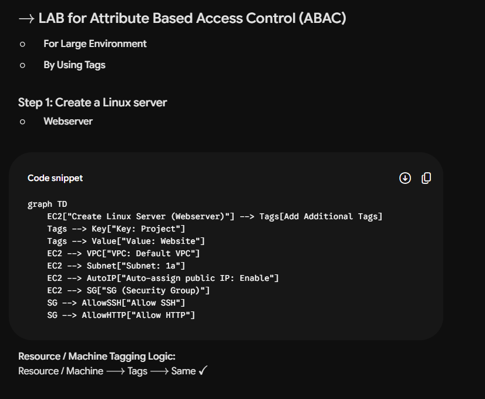


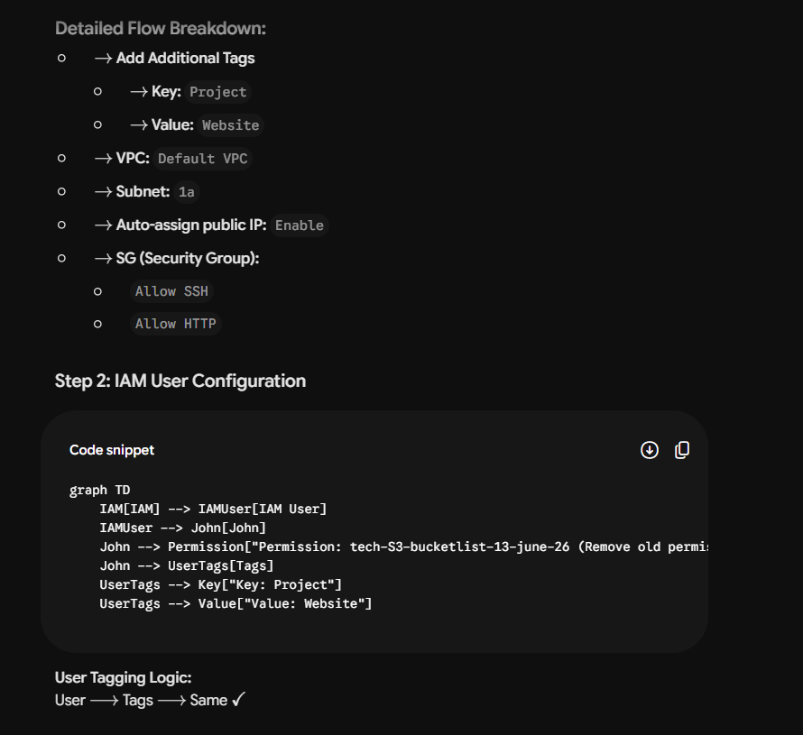


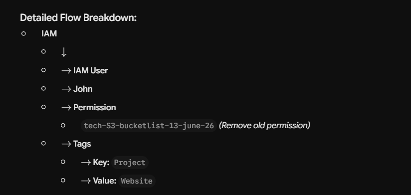


---

## **$\rightarrow$ LAB for Attribute Based Access Control (ABAC)**

* **For Large Environment**
* **By Using Tags**

---

### **Step 1: Create a Linux server**

* **Webserver**

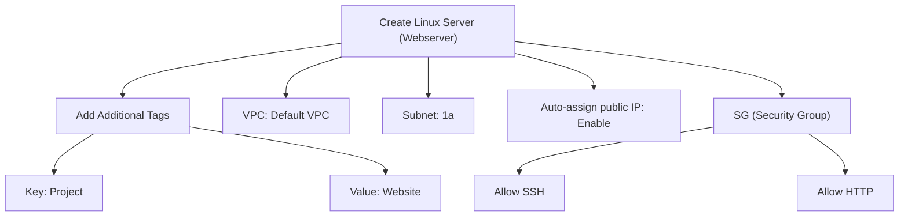
```mermaid
graph TD
    EC2["Create Linux Server (Webserver)"] --> Tags[Add Additional Tags]
    Tags --> Key["Key: Project"]
    Tags --> Value["Value: Website"]
    EC2 --> VPC["VPC: Default VPC"]
    EC2 --> Subnet["Subnet: 1a"]
    EC2 --> AutoIP["Auto-assign public IP: Enable"]
    EC2 --> SG["SG (Security Group)"]
    SG --> AllowSSH["Allow SSH"]
    SG --> AllowHTTP["Allow HTTP"]

```

> **Resource / Machine Tagging Logic:**
> Resource / Machine $\longrightarrow$ Tags $\longrightarrow$ Same $\checkmark$

#### **Detailed Flow Breakdown:**

* $\rightarrow$ **Add Additional Tags**
* $\rightarrow$ **Key:** `Project`
* $\rightarrow$ **Value:** `Website`


* $\rightarrow$ **VPC:** `Default VPC`
* $\rightarrow$ **Subnet:** `1a`
* $\rightarrow$ **Auto-assign public IP:** `Enable`
* $\rightarrow$ **SG (Security Group):**
* `Allow SSH`
* `Allow HTTP`


---

### **Step 2: IAM User Configuration**

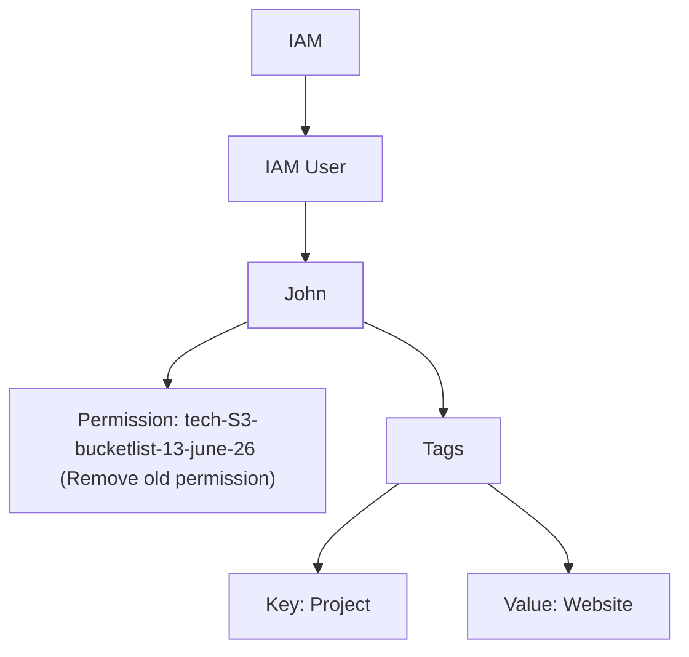
```mermaid
graph TD
    IAM[IAM] --> IAMUser[IAM User]
    IAMUser --> John[John]
    John --> Permission["Permission: tech-S3-bucketlist-13-june-26 (Remove old permission)"]
    John --> UserTags[Tags]
    UserTags --> Key["Key: Project"]
    UserTags --> Value["Value: Website"]

```

> **User Tagging Logic:**
> User $\longrightarrow$ Tags $\longrightarrow$ Same $\checkmark$

#### **Detailed Flow Breakdown:**

* **IAM**
* $\downarrow$
* $\rightarrow$ **IAM User**
* $\rightarrow$ **John**
* $\rightarrow$ **Permission**
* `tech-S3-bucketlist-13-june-26` *(Remove old permission)*


* $\rightarrow$ **Tags**
* $\rightarrow$ **Key:** `Project`
* $\rightarrow$ **Value:** `Website`


----------xxxxxxxxxx---------


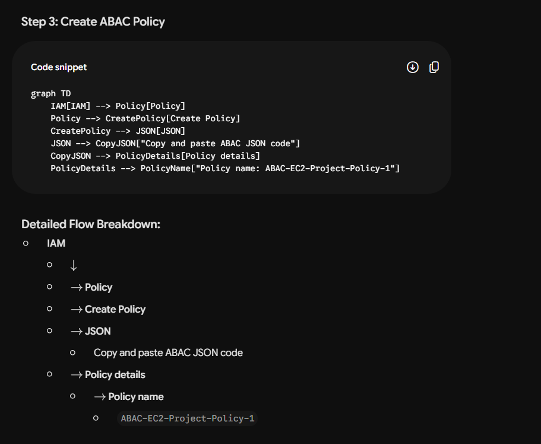


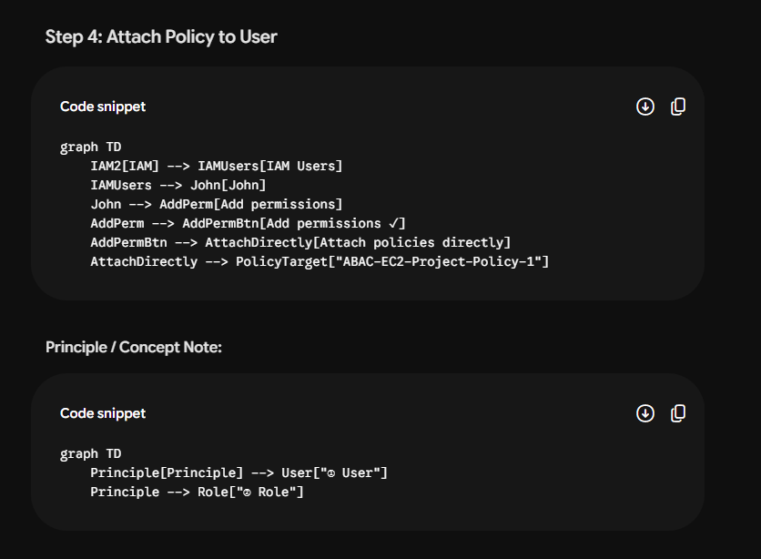


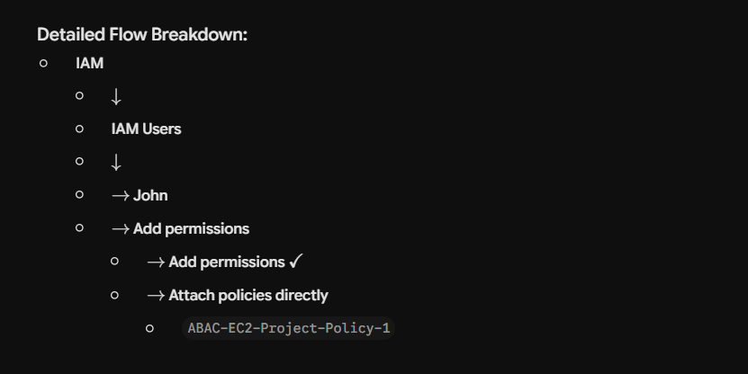


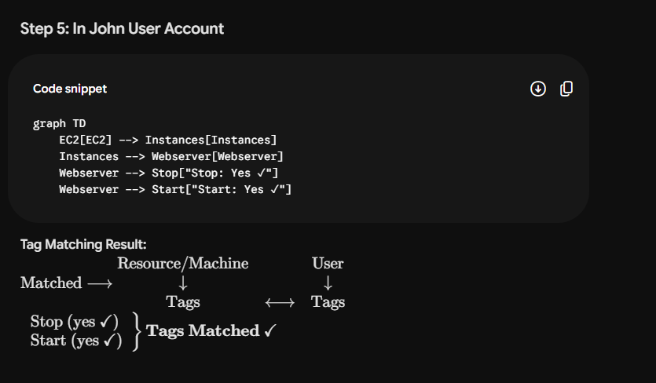


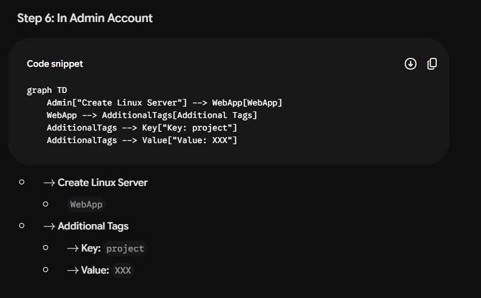


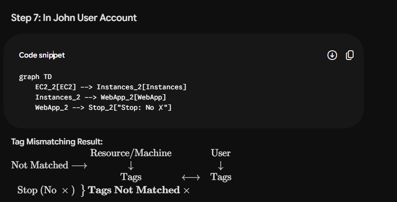


---

### **Step 3: Create ABAC Policy**

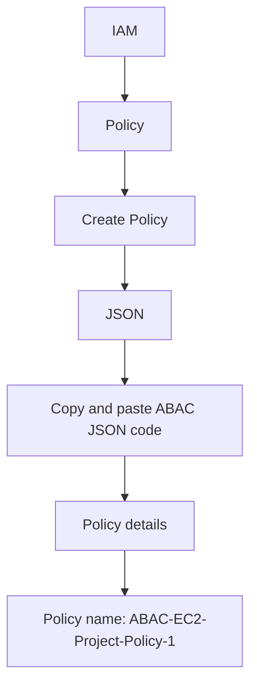
```mermaid
graph TD
    IAM[IAM] --> Policy[Policy]
    Policy --> CreatePolicy[Create Policy]
    CreatePolicy --> JSON[JSON]
    JSON --> CopyJSON["Copy and paste ABAC JSON code"]
    CopyJSON --> PolicyDetails[Policy details]
    PolicyDetails --> PolicyName["Policy name: ABAC-EC2-Project-Policy-1"]

```

#### **Detailed Flow Breakdown:**

* **IAM**
* $\downarrow$
* $\rightarrow$ **Policy**
* $\rightarrow$ **Create Policy**
* $\rightarrow$ **JSON**
* Copy and paste ABAC JSON code


* $\rightarrow$ **Policy details**
* $\rightarrow$ **Policy name**
* `ABAC-EC2-Project-Policy-1`


---

### **Step 4: Attach Policy to User**

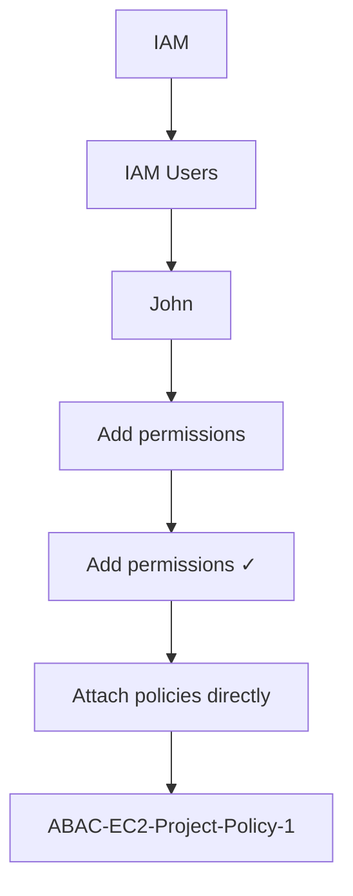
```mermaid
graph TD
    IAM2[IAM] --> IAMUsers[IAM Users]
    IAMUsers --> John[John]
    John --> AddPerm[Add permissions]
    AddPerm --> AddPermBtn[Add permissions ✓]
    AddPermBtn --> AttachDirectly[Attach policies directly]
    AttachDirectly --> PolicyTarget["ABAC-EC2-Project-Policy-1"]

```

> **Principle / Concept Note:**
> ```mermaid
> graph TD
>     Principle[Principle] --> User["① User"]
>     Principle --> Role["② Role"]
> 
> ```
> 
> 

#### **Detailed Flow Breakdown:**

* **IAM**
* $\downarrow$
* **IAM Users**
* $\downarrow$
* $\rightarrow$ **John**
* $\rightarrow$ **Add permissions**
* $\rightarrow$ **Add permissions** $\checkmark$
* $\rightarrow$ **Attach policies directly**
* `ABAC-EC2-Project-Policy-1`


---

### **Step 5: In John User Account**

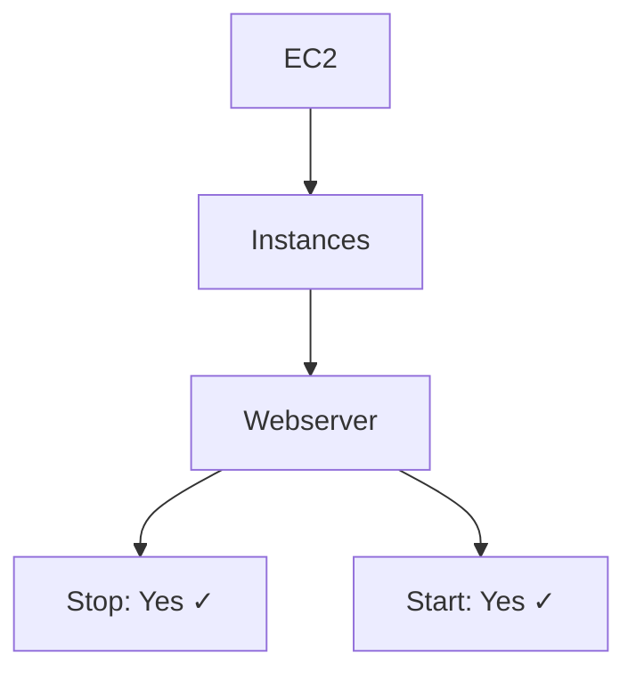
```mermaid
graph TD
    EC2[EC2] --> Instances[Instances]
    Instances --> Webserver[Webserver]
    Webserver --> Stop["Stop: Yes ✓"]
    Webserver --> Start["Start: Yes ✓"]

```

> **Tag Matching Result:**
> $\text{Matched} \longrightarrow \begin{matrix} \text{Resource/Machine} & & \text{User} \\ \downarrow & & \downarrow \\ \text{Tags} & \longleftrightarrow & \text{Tags} \end{matrix}$
> $\left. \begin{array}{l} \text{Stop (yes } \checkmark \text{)} \\ \text{Start (yes } \checkmark \text{)} \end{array} \right\} \text{\textbf{Tags Matched }} \checkmark$

---

### **Step 6: In Admin Account**

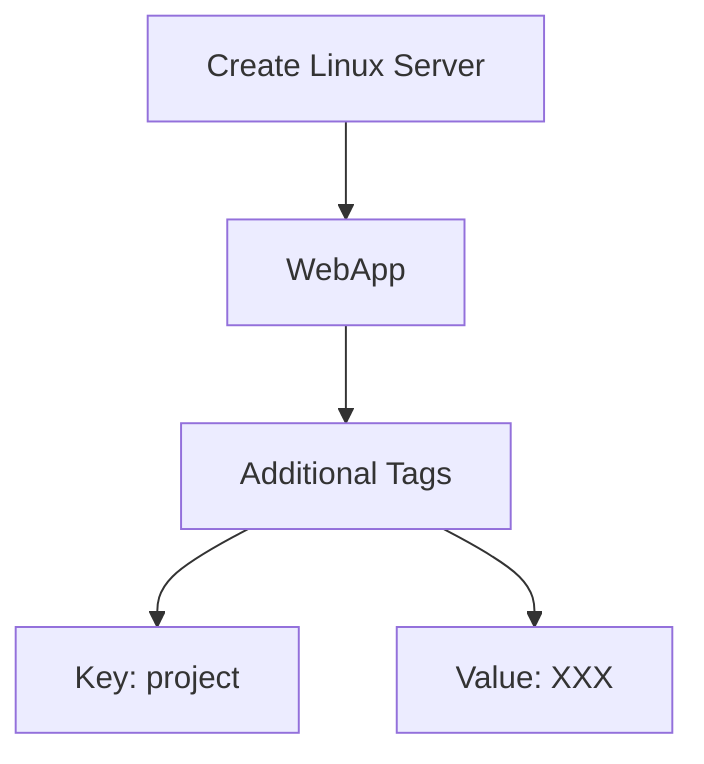
```mermaid
graph TD
    Admin["Create Linux Server"] --> WebApp[WebApp]
    WebApp --> AdditionalTags[Additional Tags]
    AdditionalTags --> Key["Key: project"]
    AdditionalTags --> Value["Value: XXX"]

```

* $\rightarrow$ **Create Linux Server**
* `WebApp`


* $\rightarrow$ **Additional Tags**
* $\rightarrow$ **Key:** `project`
* $\rightarrow$ **Value:** `XXX`


---

### **Step 7: In John User Account**

```mermaid
graph TD
    EC2_2[EC2] --> Instances_2[Instances]
    Instances_2 --> WebApp_2[WebApp]
    WebApp_2 --> Stop_2["Stop: No ✗"]

```

> **Tag Mismatching Result:**
> $\text{Not Matched} \longrightarrow \begin{matrix} \text{Resource/Machine} & & \text{User} \\ \downarrow & & \downarrow \\ \text{Tags} & \longleftrightarrow & \text{Tags} \end{matrix}$
> $\left. \begin{array}{l} \text{Stop (No } \mathbf{\times} \text{)} \end{array} \right\} \text{\textbf{Tags Not Matched }} \mathbf{\times}$


## Post Lab Cleanup

- Terminated all EC2 test instances.
- Removed Project tags from IAM user.
- Detached ABAC policy from IAM user.
- Deleted temporary IAM ABAC policy.
- Removed unused security group.
- Verified that no unnecessary AWS resources remained.


-----------xxxxxxxxxxx------------


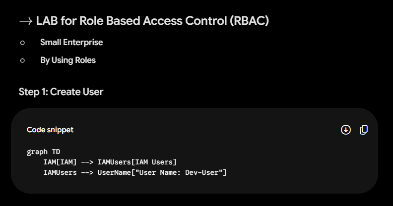


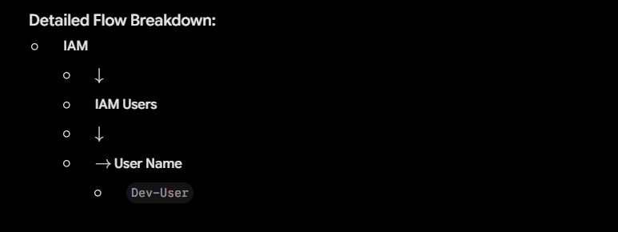


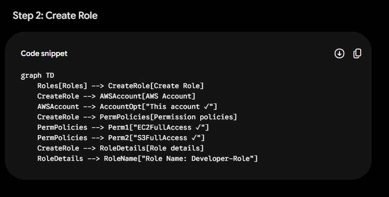


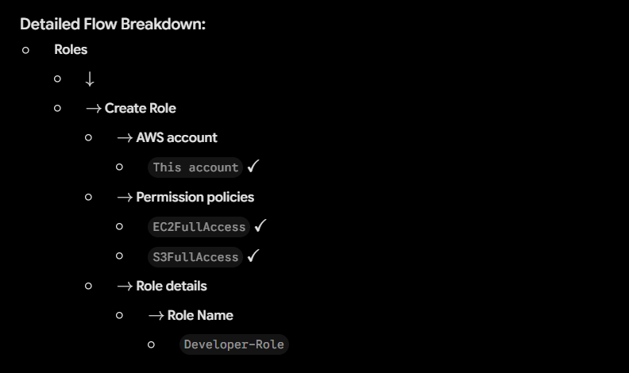


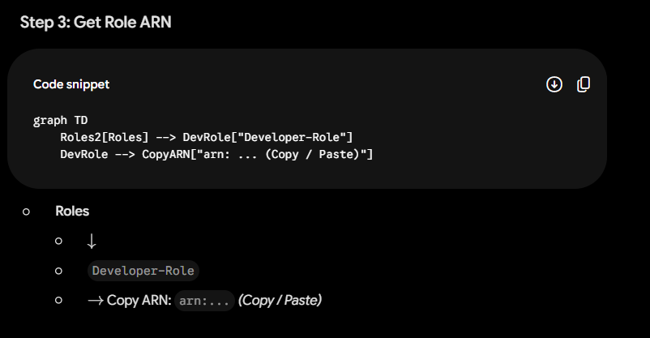


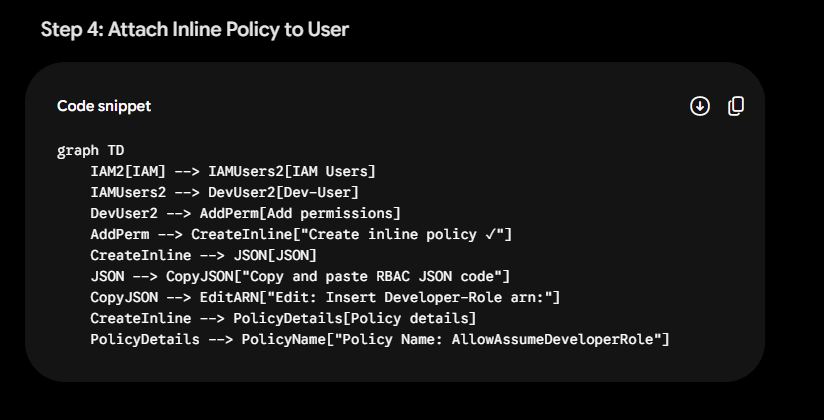


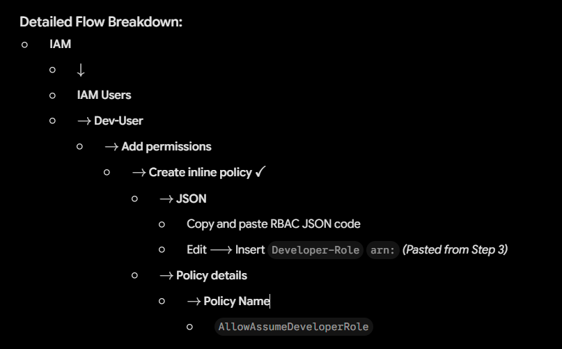

---

## **$\rightarrow$ LAB for Role Based Access Control (RBAC)**

* **Small Enterprise**
* **By Using Roles**

---

### **Step 1: Create User**

```mermaid
graph TD
    IAM[IAM] --> IAMUsers[IAM Users]
    IAMUsers --> UserName["User Name: Dev-User"]

```

#### **Detailed Flow Breakdown:**

* **IAM**
* $\downarrow$
* **IAM Users**
* $\downarrow$
* $\rightarrow$ **User Name**
* `Dev-User`


---

### **Step 2: Create Role**

```mermaid
graph TD
    Roles[Roles] --> CreateRole[Create Role]
    CreateRole --> AWSAccount[AWS Account]
    AWSAccount --> AccountOpt["This account ✓"]
    CreateRole --> PermPolicies[Permission policies]
    PermPolicies --> Perm1["EC2FullAccess ✓"]
    PermPolicies --> Perm2["S3FullAccess ✓"]
    CreateRole --> RoleDetails[Role details]
    RoleDetails --> RoleName["Role Name: Developer-Role"]

```

#### **Detailed Flow Breakdown:**

* **Roles**
* $\downarrow$
* $\rightarrow$ **Create Role**
* $\rightarrow$ **AWS account**
* `This account` $\checkmark$


* $\rightarrow$ **Permission policies**
* `EC2FullAccess` $\checkmark$
* `S3FullAccess` $\checkmark$


* $\rightarrow$ **Role details**
* $\rightarrow$ **Role Name**
* `Developer-Role`


---

### **Step 3: Get Role ARN**

```mermaid
graph TD
    Roles2[Roles] --> DevRole["Developer-Role"]
    DevRole --> CopyARN["arn: ... (Copy / Paste)"]

```

* **Roles**
* $\downarrow$
* `Developer-Role`
* $\rightarrow$ Copy ARN: `arn:...` *(Copy / Paste)*


---

### **Step 4: Attach Inline Policy to User**

```mermaid
graph TD
    IAM2[IAM] --> IAMUsers2[IAM Users]
    IAMUsers2 --> DevUser2[Dev-User]
    DevUser2 --> AddPerm[Add permissions]
    AddPerm --> CreateInline["Create inline policy ✓"]
    CreateInline --> JSON[JSON]
    JSON --> CopyJSON["Copy and paste RBAC JSON code"]
    CopyJSON --> EditARN["Edit: Insert Developer-Role arn:"]
    CreateInline --> PolicyDetails[Policy details]
    PolicyDetails --> PolicyName["Policy Name: AllowAssumeDeveloperRole"]

```

#### **Detailed Flow Breakdown:**

* **IAM**
* $\downarrow$
* **IAM Users**
* $\rightarrow$ **Dev-User**
* $\rightarrow$ **Add permissions**
* $\rightarrow$ **Create inline policy** $\checkmark$
* $\rightarrow$ **JSON**
* Copy and paste RBAC JSON code
* Edit $\longrightarrow$ Insert `Developer-Role` `arn:` *(Pasted from Step 3)*


* $\rightarrow$ **Policy details**
* $\rightarrow$ **Policy Name**
* `AllowAssumeDeveloperRole`


-----------xxxxxxxxx---------


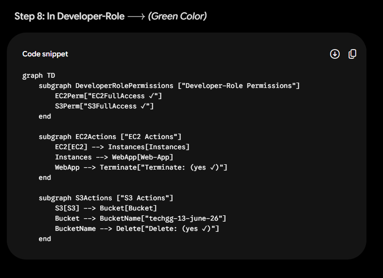


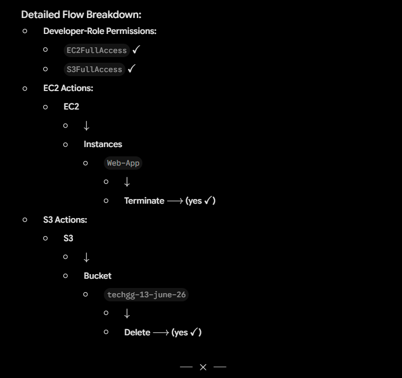


---

### **Step 8: In Developer-Role** $\longrightarrow$ *(Green Color)*

```mermaid
graph TD
    subgraph DeveloperRolePermissions ["Developer-Role Permissions"]
        EC2Perm["EC2FullAccess ✓"]
        S3Perm["S3FullAccess ✓"]
    end

    subgraph EC2Actions ["EC2 Actions"]
        EC2[EC2] --> Instances[Instances]
        Instances --> WebApp[Web-App]
        WebApp --> Terminate["Terminate: (yes ✓)"]
    end

    subgraph S3Actions ["S3 Actions"]
        S3[S3] --> Bucket[Bucket]
        Bucket --> BucketName["techgg-13-june-26"]
        BucketName --> Delete["Delete: (yes ✓)"]
    end

```

#### **Detailed Flow Breakdown:**

* **Developer-Role Permissions:**
* `EC2FullAccess` $\checkmark$
* `S3FullAccess` $\checkmark$


* **EC2 Actions:**
* **EC2**
* $\downarrow$
* **Instances**
* `Web-App`
* $\downarrow$
* **Terminate** $\longrightarrow$ **(yes $\checkmark$)**


* **S3 Actions:**
* **S3**
* $\downarrow$
* **Bucket**
* `techgg-13-june-26`
* $\downarrow$
* **Delete** $\longrightarrow$ **(yes $\checkmark$)**


---

$$\text{--- } \mathbf{\times} \text{ ---}$$


----------xxxxxxxxxxx----------


---

## **1. Summary of Lab Objectives & Key Takeaways**

### **Lab 1: S3 Bucket & Object Access Policy (Visual & JSON Methods)**

* **Objective:** Create custom policies (using both Visual Editor and JSON) to allow an IAM User (`John`) to list all S3 buckets, but restrict read/write access to only a single specific bucket (`techgg-13-june-26`).
* **Key Takeaways:**
* **Principle of Least Privilege:** Users should only have access to resources necessary for their task. Granting `s3:ListAllMyBuckets` allows bucket discovery without giving access to the data inside other buckets.
* **Resource Level Scoping:** Specifying an Amazon Resource Name (ARN) in the `Resource` block limits actions (`s3:GetObject`, `s3:PutObject`) strictly to that specific resource.
* **Visual vs. JSON:** Visual Editor is beginner-friendly, while raw JSON allows precise, scriptable policy definitions.


---

### **Lab 2: Attribute-Based Access Control (ABAC)**

* **Objective:** Implement access control based on matching metadata (tags) assigned to both the IAM User and the EC2 instance.
* **Key Takeaways:**
* **Scalability:** ABAC simplifies access management in large environments. Instead of writing new policies for every resource or user, policies evaluate dynamic attributes like `aws:PrincipalTag/Project` == `ec2:ResourceTag/Project`.
* **Tag Alignment:** When user tags (`Project: Website`) match resource tags (`Project: Website`), actions like `StartInstances` or `StopInstances` are permitted. If tags differ (`Project: XXX`), actions are automatically denied.


---

## **2. Post-Lab Cleanup Guide**

To avoid unwanted AWS charges and keep your account secure, follow these steps to clean up all resources created across all three labs.

```mermaid
graph TD
    A[Post-Lab Cleanup] --> B[1. Delete EC2 Instances]
    A --> C[2. Empty & Delete S3 Buckets]
    A --> D[3. Delete IAM Users & Roles]
    A --> E[4. Delete Custom IAM Policies]

```

---

### **Step 1: Delete EC2 Instances (ABAC Lab)**

1. Open the **EC2 Console** $\rightarrow$ **Instances**.
2. Select the instances created during the lab (`Webserver` and `WebApp`).
3. Click **Instance State** $\rightarrow$ **Terminate Instance**.
4. Confirm termination.

---

### **Step 2: Empty and Delete S3 Buckets (S3 & RBAC Labs)**

1. Open the **S3 Console** $\rightarrow$ **Buckets**.
2. Select `techgg-13-june-26`.
3. Click **Empty** to remove all uploaded test files, then confirm deletion of objects.
4. Once empty, select `techgg-13-june-26` and click **Delete Bucket**.

---

### **Step 3: Delete IAM Users & Roles**

1. Open the **IAM Console**.
2. Navigate to **Roles**:
* Search for `Developer-Role`.
* Click **Delete** and confirm.


3. Navigate to **Users**:
* Select `John` and `Dev-User`.
* Click **Delete user** and confirm.


---

### **Step 4: Delete Custom IAM Policies**

1. In the **IAM Console**, navigate to **Policies**.
2. Search for and delete the following custom policies:
* `TechGG-S3-TestPolicy-13-June`
* `TechGG-S3-TestPolicy-2nd`
* `tech-S3-bucketlist-13-june-26`
* `ABAC-EC2-Project-Policy-1`
* `AllowAssumeDeveloperRole` *(if saved as a managed policy rather than inline)*


--------------xxxxxxxxxxxxx-----------


# Lab 3 – RBAC (Role-Based Access Control)

## Goal

Create a user that temporarily becomes an administrator by assuming a role.

---

## Part 1 – Create User

Open

```
IAM
→ Users
→ Create User
```

Name

```
Dev-User
```

Create the user.

---

## Part 2 – Create Role

Open

```
IAM
→ Roles
→ Create Role
```

Select

```
AWS Account
```

Choose

```
This Account
```

Attach policies

```
AmazonEC2FullAccess
AmazonS3FullAccess
```

Role Name

```
Developer-Role
```

Create Role.

---

## Part 3 – Copy the Role ARN

Open

```
IAM
→ Roles
→ Developer-Role
```

Copy

```
Role ARN
```

It looks similar to:

```
arn:aws:iam::123456789012:role/Developer-Role
```

---

## Part 4 – Allow the User to Assume the Role

Open

```
IAM
→ Users
→ Dev-User
→ Add Permissions
→ Create Inline Policy
```

Choose

```
JSON
```

Paste the AssumeRole policy.

Replace

```
Resource
```

with the copied Role ARN.

Save the policy.

---

## Part 5 – Update the Role Trust Policy

Open

```
IAM
→ Roles
→ Developer-Role
→ Trust Relationships
→ Edit Trust Policy
```

Allow

```
Dev-User
```

to perform

```
sts:AssumeRole
```

This creates the required two-way relationship:

* The user has permission to assume the role.
* The role trusts the user.

---

## Part 6 – Test

Login as

```
Dev-User
```

Initially, the user has very limited permissions.

Switch to the role:

```
Top Right
→ Username
→ Switch Role
```

Enter

* Account ID
* Role Name

```
Developer-Role
```

Click **Switch Role**.

---

## Part 7 – Verify

While using **Developer-Role**:

Go to **EC2**.

Try:

* Launch an instance
* Stop an instance
* Terminate an instance

Go to **S3**.

Try:

* Create a bucket
* Upload files
* Delete a bucket

Expected:

✅ All actions succeed because the role has `AmazonEC2FullAccess` and `AmazonS3FullAccess`.

When you switch back to **Dev-User**, those elevated permissions disappear because role access is temporary.

---


## Post Lab Cleanup

* Delete the **Dev-User** IAM user created for the lab.
* Delete the **Developer-Role** IAM role.
* Remove any **inline policies** attached to **Dev-User**.
* Delete any **customer-managed IAM policies** created specifically for this lab (if any).
* Terminate all **EC2 instances** launched during testing.
* Delete all **S3 buckets** and objects created for testing.
* Remove any temporary **access keys** created for **Dev-User** (if created).
* Sign out of the **Developer-Role** session and switch back to your original IAM user.
* Verify that no unused IAM users, roles, policies, EC2 instances, or S3 buckets remain in the AWS account.
* Confirm that all temporary resources have been deleted to avoid unnecessary AWS charges and maintain a secure environment.


# Practice Order

I recommend practicing in this sequence:

1. **Lab 1 (S3 IAM Policies)** – Learn IAM users, managed/custom policies, and least privilege.
2. **Lab 2 (ABAC)** – Learn how tags control access to resources.
3. **Lab 3 (RBAC)** – Learn roles, trust policies, STS, and temporary privilege escalation.

This progression builds from basic IAM permissions to more advanced access-control models.

