---
### Class 4
## Lab 1: Granular S3 Access Control Using IAM & Bucket Policies

### **Primary Objective**

To configure fine-grained, read-only access for a specific IAM user (**John**) to a target S3 bucket (`techgg-19-june-26`) while enforcing proper access restrictions across other buckets and write operations.

### **Key Learning Outcomes**

* **Identity & Access Management (IAM):** Create custom IAM policies using JSON and attach them directly to specific users.
* **S3 Bucket Policies:** Write and apply resource-based bucket policies specifying `Principal` (User ARN) and `Resource` (Bucket ARN).
* **Least Privilege Enforcement:** Verify that the user can list buckets and download (`Get`) objects from the designated bucket, but is restricted from uploading (`Put`) files or accessing contents in other buckets.
* **Access Points:** Understand how S3 Access Points and Multi-Region Access Points (MRAP) route department-level and region-based traffic efficiently with minimal latency.

---


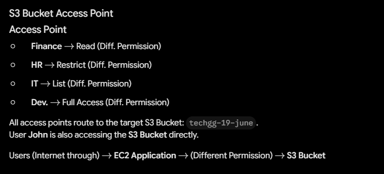


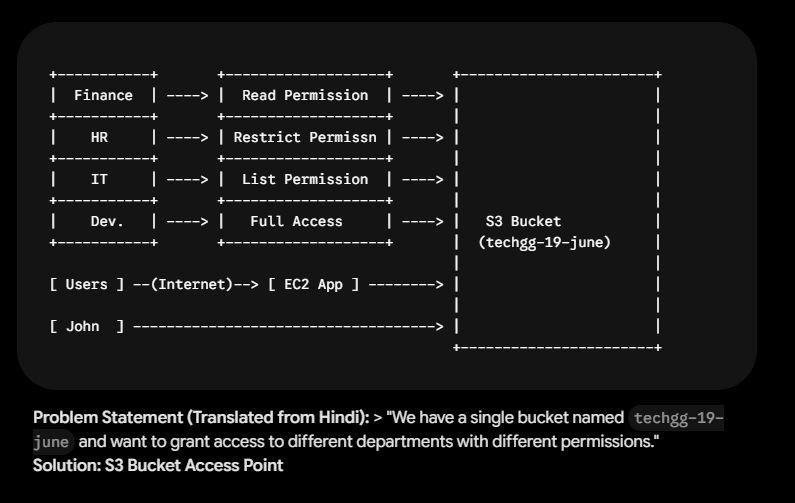


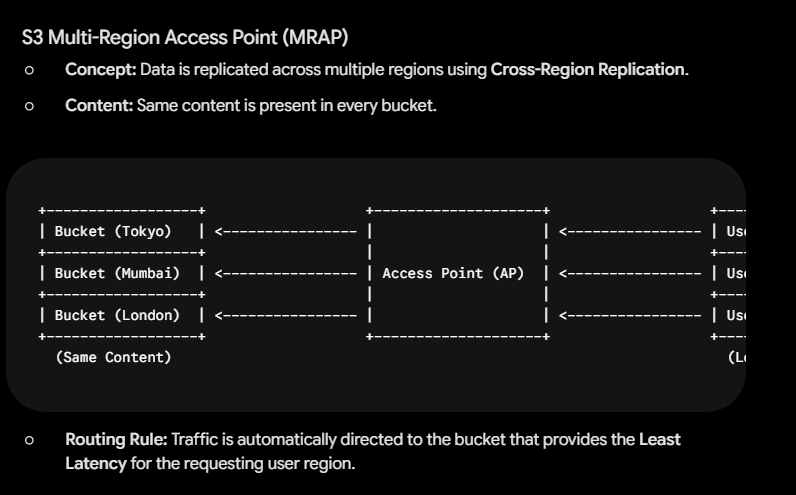


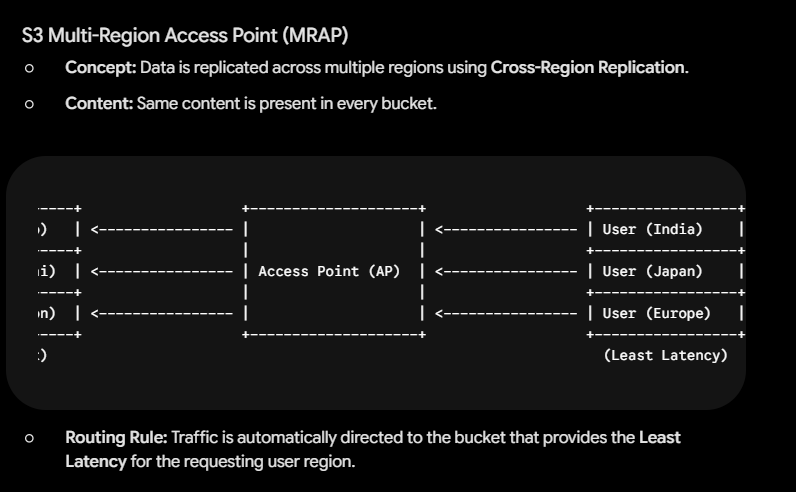


---

## Class - 04 | 14/06/26

---

### S3 Bucket Access Point

#### Access Point

* **Finance** $\rightarrow$ Read (Diff. Permission)
* **HR** $\rightarrow$ Restrict (Diff. Permission)
* **IT** $\rightarrow$ List (Diff. Permission)
* **Dev.** $\rightarrow$ Full Access (Diff. Permission)

All access points route to the target S3 Bucket: `techgg-19-june`.
User **John** is also accessing the **S3 Bucket** directly.

Users (Internet through) $\rightarrow$ **EC2 Application** $\rightarrow$ (Different Permission) $\rightarrow$ **S3 Bucket**

```
+-----------+       +-------------------+       +-----------------------+
|  Finance  | ----> |  Read Permission  | ----> |                       |
+-----------+       +-------------------+       |                       |
|    HR     | ----> | Restrict Permissn | ----> |                       |
+-----------+       +-------------------+       |                       |
|    IT     | ----> |  List Permission  | ----> |                       |
+-----------+       +-------------------+       |                       |
|    Dev.   | ----> |   Full Access     | ----> |   S3 Bucket           |
+-----------+       +-------------------+       |  (techgg-19-june)     |
                                                |                       |
[ Users ] --(Internet)--> [ EC2 App ] --------> |                       |
                                                |                       |
[ John  ] ------------------------------------> |                       |
                                                +-----------------------+

```

> **Problem Statement (Translated from Hindi):** > "We have a single bucket named `techgg-19-june` and want to grant access to different departments with different permissions."
> **Solution:** **S3 Bucket Access Point**

---

### S3 Multi-Region Access Point (MRAP)

* **Concept:** Data is replicated across multiple regions using **Cross-Region Replication**.
* **Content:** Same content is present in every bucket.

```
+------------------+                   +--------------------+                   +-----------------+
| Bucket (Tokyo)   | <---------------- |                    | <---------------- | User (India)    |
+------------------+                   |                    |                   +-----------------+
| Bucket (Mumbai)  | <---------------- | Access Point (AP)  | <---------------- | User (Japan)    |
+------------------+                   |                    |                   +-----------------+
| Bucket (London)  | <---------------- |                    | <---------------- | User (Europe)   |
+------------------+                   +--------------------+                   +-----------------+
  (Same Content)                                                                  (Least Latency)

```

* **Routing Rule:** Traffic is automatically directed to the bucket that provides the **Least Latency** for the requesting user region.


------xxxxxxxxxxx-------------


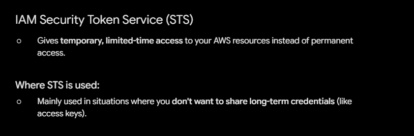


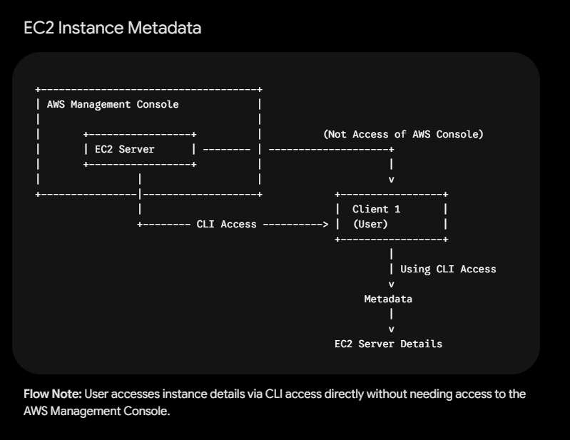


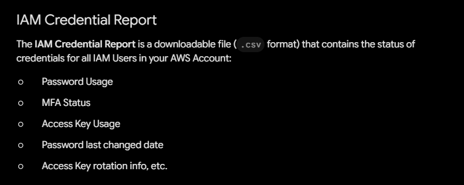


---

## IAM Security Token Service (STS)

* Gives **temporary, limited-time access** to your AWS resources instead of permanent access.

### Where STS is used:

* Mainly used in situations where you **don't want to share long-term credentials** (like access keys).

---

## EC2 Instance Metadata

```
+------------------------------------+
| AWS Management Console             |
|                                    |
|       +-----------------+          |          (Not Access of AWS Console)
|       | EC2 Server      | -------- | --------------------+
|       +-----------------+          |                     |
|                |                   |                     v
+----------------|-------------------+            +-----------------+
                 |                                |  Client 1       |
                 +-------- CLI Access ----------> |  (User)         |
                                                  +-----------------+
                                                           |
                                                           | Using CLI Access
                                                           v
                                                       Metadata
                                                           |
                                                           v
                                                  EC2 Server Details

```

> **Flow Note:** User accesses instance details via CLI access directly without needing access to the AWS Management Console.

---

## IAM Credential Report

The **IAM Credential Report** is a downloadable file (`.csv` format) that contains the status of credentials for all IAM Users in your AWS Account:

* Password Usage
* MFA Status
* Access Key Usage
* Password last changed date
* Access Key rotation info, etc.


-------xxxxxxxxxxxxx------------


---

## AWS Cognito

* **AWS Cognito** is a user authentication and identity management service.

```
+--------------------------+
| Server                   |
|   +------------------+   |                   +------------------+
|   | App              | <---- Access ---------| User             |
|   | (Application)    |   |                   +------------------+
|   +------------------+   |                            |
+--------------------------+                            | (Cognito Access)
                                                        v
                                           +--------------------------+
                                           | Cognito                  |
                                           |                          |
                                           |   Name :-                |
                                           |   emailId :-             |
                                           |   otp :-                 |
                                           |   Password               |
                                           +--------------------------+

```

---

### Workflow Flowchart

**Cognito** $\rightarrow$ **API GW** $\rightarrow$ **Lambda** *(Web Application)*


----------xxxxxxxxxxxx------------


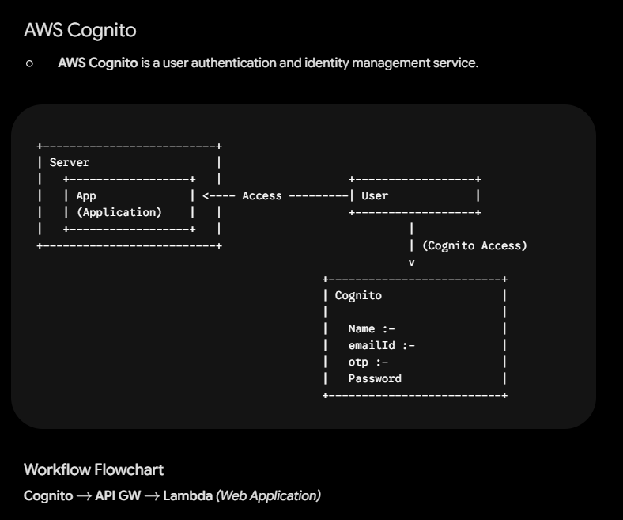


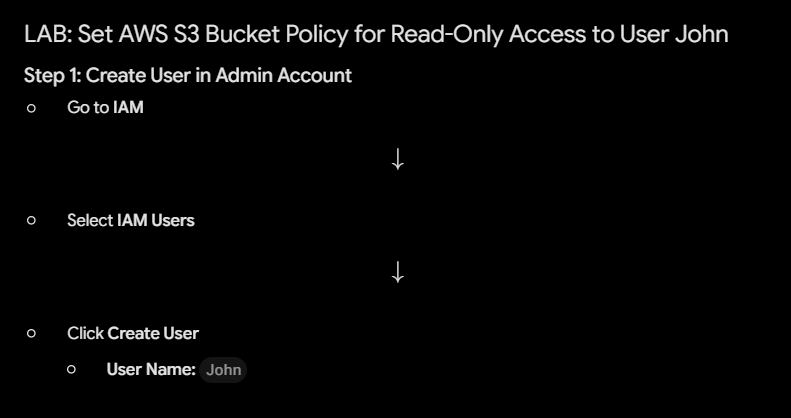


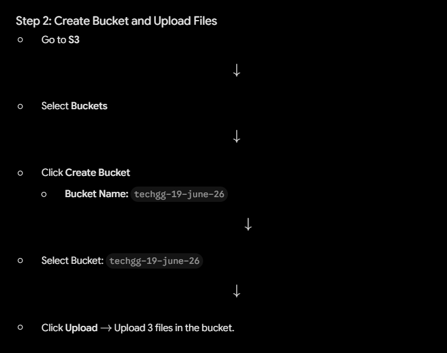


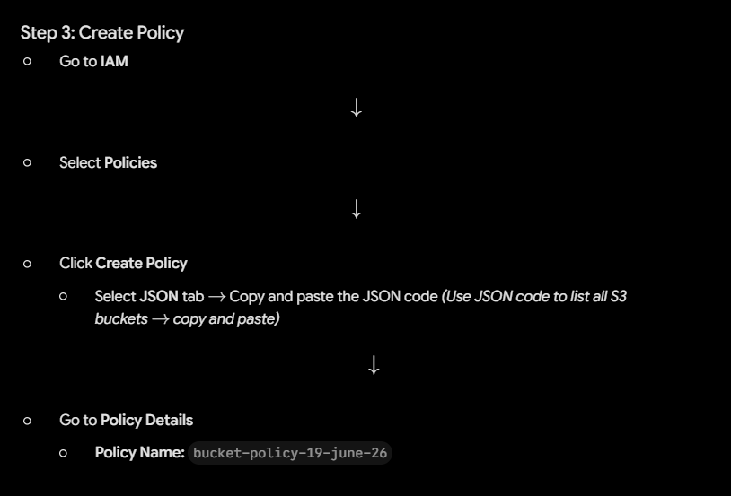


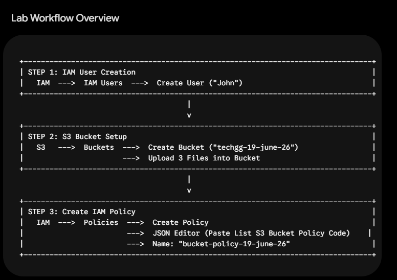


---

## LAB: Set AWS S3 Bucket Policy for Read-Only Access to User John

---

### Step 1: Create User in Admin Account

* Go to **IAM**

$$\downarrow$$


* Select **IAM Users**

$$\downarrow$$


* Click **Create User**
* **User Name:** `John`


---

### Step 2: Create Bucket and Upload Files

* Go to **S3**

$$\downarrow$$


* Select **Buckets**

$$\downarrow$$


* Click **Create Bucket**
* **Bucket Name:** `techgg-19-june-26`

$$\downarrow$$


* Select Bucket: `techgg-19-june-26`

$$\downarrow$$


* Click **Upload** $\rightarrow$ Upload 3 files in the bucket.

---

### Step 3: Create Policy

* Go to **IAM**

$$\downarrow$$


* Select **Policies**

$$\downarrow$$


* Click **Create Policy**
* Select **JSON** tab $\rightarrow$ Copy and paste the JSON code *(Use JSON code to list all S3 buckets $\rightarrow$ copy and paste)*

$$\downarrow$$


* Go to **Policy Details**
* **Policy Name:** `bucket-policy-19-june-26`


---

### Lab Workflow Overview

```
+---------------------------------------------------------------------------------+
| STEP 1: IAM User Creation                                                       |
|   IAM  --->  IAM Users  --->  Create User ("John")                              |
+---------------------------------------------------------------------------------+
                                       |
                                       v
+---------------------------------------------------------------------------------+
| STEP 2: S3 Bucket Setup                                                         |
|   S3   --->  Buckets  --->  Create Bucket ("techgg-19-june-26")                 |
|                       --->  Upload 3 Files into Bucket                          |
+---------------------------------------------------------------------------------+
                                       |
                                       v
+---------------------------------------------------------------------------------+
| STEP 3: Create IAM Policy                                                       |
|   IAM  --->  Policies  --->  Create Policy                                      |
|                        --->  JSON Editor (Paste List S3 Bucket Policy Code)    |
|                        --->  Name: "bucket-policy-19-june-26"                   |
+---------------------------------------------------------------------------------+

```


-------------xxxxxxxxxxxxxx---------


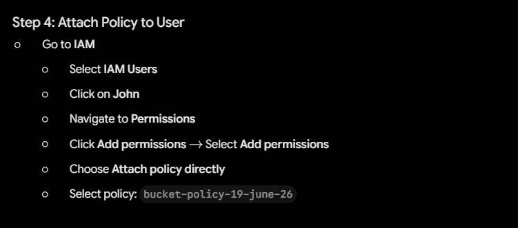


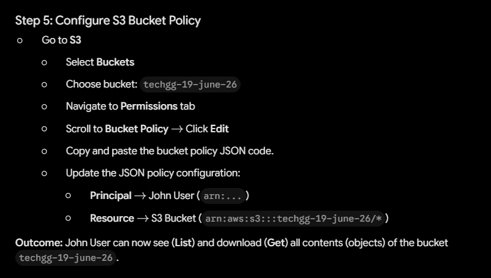


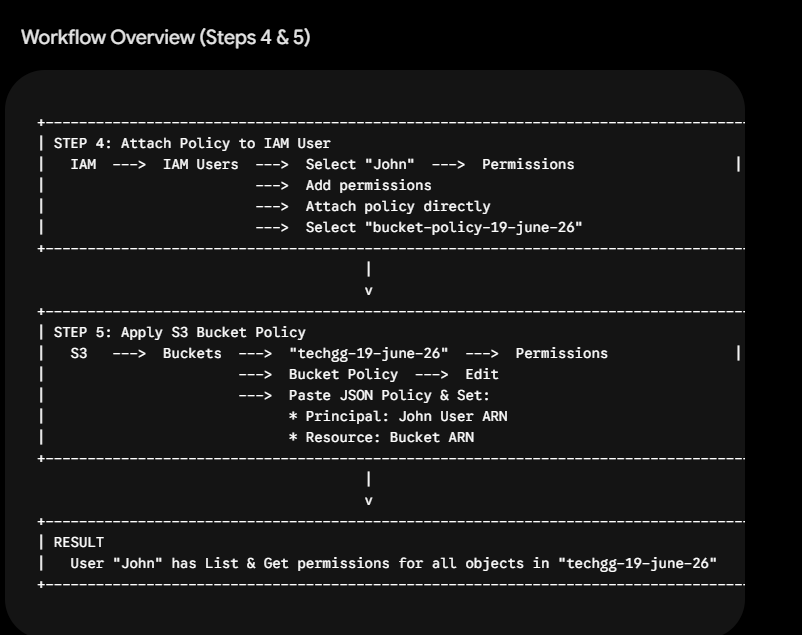


---

### Step 4: Attach Policy to User

* Go to **IAM**
* Select **IAM Users**
* Click on **John**
* Navigate to **Permissions**
* Click **Add permissions** $\rightarrow$ Select **Add permissions**
* Choose **Attach policy directly**
* Select policy: `bucket-policy-19-june-26`


---

### Step 5: Configure S3 Bucket Policy

* Go to **S3**
* Select **Buckets**
* Choose bucket: `techgg-19-june-26`
* Navigate to **Permissions** tab
* Scroll to **Bucket Policy** $\rightarrow$ Click **Edit**
* Copy and paste the bucket policy JSON code.
* Update the JSON policy configuration:
* **Principal** $\rightarrow$ John User (`arn:...`)
* **Resource** $\rightarrow$ S3 Bucket (`arn:aws:s3:::techgg-19-june-26/*`)


> **Outcome:** John User can now see (**List**) and download (**Get**) all contents (objects) of the bucket `techgg-19-june-26`.

---

### Workflow Overview (Steps 4 & 5)

```
+-----------------------------------------------------------------------------------+
| STEP 4: Attach Policy to IAM User                                                 |
|   IAM  --->  IAM Users  --->  Select "John"  --->  Permissions                   |
|                         --->  Add permissions                                     |
|                         --->  Attach policy directly                              |
|                         --->  Select "bucket-policy-19-june-26"                   |
+-----------------------------------------------------------------------------------+
                                       |
                                       v
+-----------------------------------------------------------------------------------+
| STEP 5: Apply S3 Bucket Policy                                                    |
|   S3   --->  Buckets  --->  "techgg-19-june-26"  --->  Permissions               |
|                       --->  Bucket Policy  --->  Edit                             |
|                       --->  Paste JSON Policy & Set:                              |
|                             * Principal: John User ARN                            |
|                             * Resource: Bucket ARN                                |
+-----------------------------------------------------------------------------------+
                                       |
                                       v
+-----------------------------------------------------------------------------------+
| RESULT                                                                            |
|   User "John" has List & Get permissions for all objects in "techgg-19-june-26"    |
+-----------------------------------------------------------------------------------+

```


--------------xxxxxxxxxxx-------------


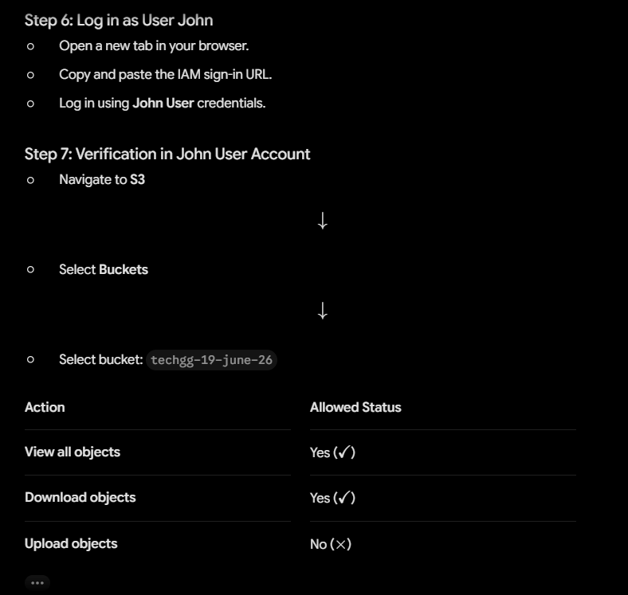


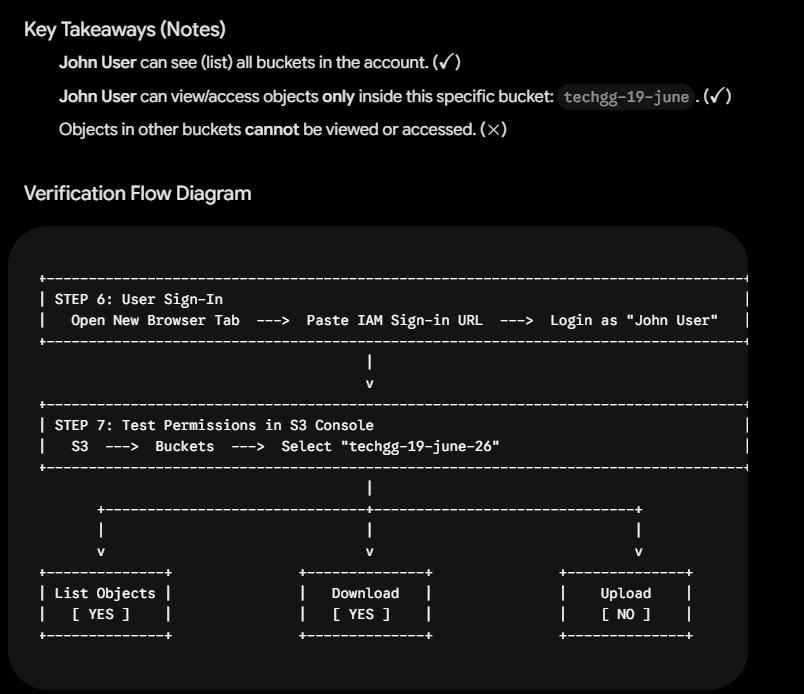


---

### Step 6: Log in as User John

* Open a new tab in your browser.
* Copy and paste the IAM sign-in URL.
* Log in using **John User** credentials.

---

### Step 7: Verification in John User Account

* Navigate to **S3**

$$\downarrow$$


* Select **Buckets**

$$\downarrow$$


* Select bucket: `techgg-19-june-26`

| Action | Allowed Status |
| --- | --- |
| **View all objects** | Yes ($\checkmark$) |
| **Download objects** | Yes ($\checkmark$) |
| **Upload objects** | No ($\times$) |

---

### Key Takeaways (Notes)

> * **John User** can see (list) all buckets in the account. ($\checkmark$)
> * **John User** can view/access objects **only** inside this specific bucket: `techgg-19-june`. ($\checkmark$)
> * Objects in other buckets **cannot** be viewed or accessed. ($\times$)
> 
> 

---

### Verification Flow Diagram

```
+-----------------------------------------------------------------------------------+
| STEP 6: User Sign-In                                                              |
|   Open New Browser Tab  --->  Paste IAM Sign-in URL  --->  Login as "John User"   |
+-----------------------------------------------------------------------------------+
                                       |
                                       v
+-----------------------------------------------------------------------------------+
| STEP 7: Test Permissions in S3 Console                                            |
|   S3  --->  Buckets  --->  Select "techgg-19-june-26"                             |
+-----------------------------------------------------------------------------------+
                                       |
       +-------------------------------+-------------------------------+
       |                               |                               |
       v                               v                               v
+--------------+               +--------------+               +--------------+
| List Objects |               |   Download   |               |    Upload    |
|   [ YES ]    |               |   [ YES ]    |               |    [ NO ]    |
+--------------+               +--------------+               +--------------+

```


-------------xxxxxxxxxxxxx------------

```

## Lab 2: Deploying a Serverless Web Application with API Gateway & AWS Cognito

### **Primary Objective**

To build, expose, and secure a serverless web application backend using **AWS Lambda**, **Amazon API Gateway**, and **AWS Cognito User Pools**.

### **Key Learning Outcomes**

* **Serverless Execution (AWS Lambda):** Create and configure a Python-based Lambda function (`TechGG-Web-Function`), set custom execution limits (128 MB memory, 5-second timeout), and test code deployment.
* **API Integration (API Gateway):** Create an HTTP API trigger to expose the Lambda function to the public internet via a dedicated API endpoint URL.
* **User Authentication & Identity (AWS Cognito):**
* Set up a **Cognito User Pool** for a Single Page Application (SPA).
* Enable user self-registration with required attributes (email, name).
* Configure redirection via the API Gateway return URL.
* Test the user registration and sign-in flow (`View login page` $\rightarrow$ `Create account` $\rightarrow$ `User pool entry`).


```

---

## Lab 1: Granular S3 Access Control

* **Identity vs. Resource Policies:** To grant targeted access, you often combine **IAM Identity Policies** (attached to the user) and **S3 Bucket Policies** (attached to the resource).
* **Principle of Least Privilege:**
* User `John` was restricted to **Read-Only access** (`List` and `Get` permissions).
* `John` can see the list of all buckets in the account, but can **only view/download objects** inside the specific allowed bucket (`techgg-19-june-26`).
* `John` cannot upload (`Put`) new objects or access contents of any other bucket in the account.


* **S3 Access Points & MRAP:**
* **Access Points:** Allow creating unique access paths with distinct permission sets for different departments (Finance, HR, IT, Dev) accessing the same bucket.
* **Multi-Region Access Points (MRAP):** Direct client traffic automatically to the closest AWS region using **Cross-Region Replication (CRR)** to ensure the **lowest latency**.


```
```

## Lab 1 Cleanup: S3 Access Control & IAM

### 1. Delete S3 Bucket Objects & Bucket

* Navigate to **Amazon S3** $\rightarrow$ **Buckets**.
* Select `techgg-19-june-26`.
* Click **Empty** to delete all uploaded files/objects first.
* Confirm deletion, then click **Delete** to delete the bucket itself.

### 2. Remove IAM Policy & User

* Navigate to **IAM** $\rightarrow$ **Users**.
* Select user `John` $\rightarrow$ Go to the **Permissions** tab $\rightarrow$ Detach `bucket-policy-19-june-26`.
* Delete user `John`.
* Navigate to **IAM** $\rightarrow$ **Policies** $\rightarrow$ Search `bucket-policy-19-june-26` $\rightarrow$ Click **Delete policy**.

### 3. Remove Access Points (If Created)

* Go to **S3** $\rightarrow$ **Access Points** / **Multi-Region Access Points**.
* Select and delete any created access points to avoid lingering routing configurations.


```


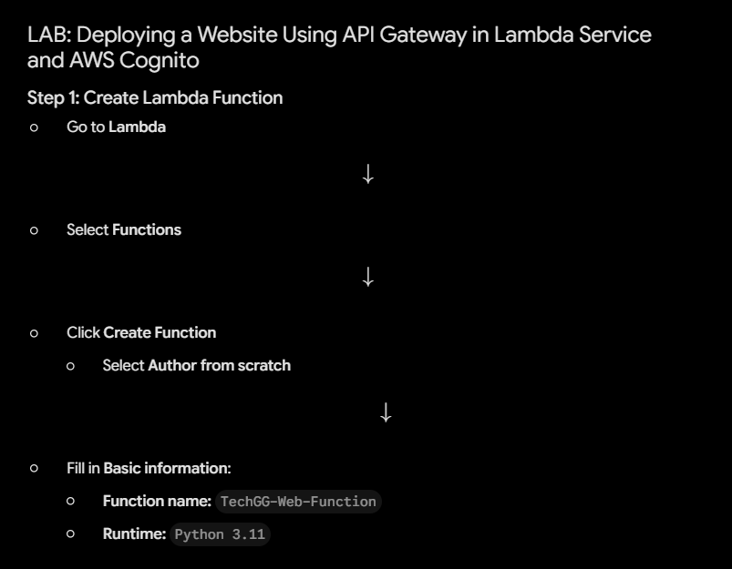


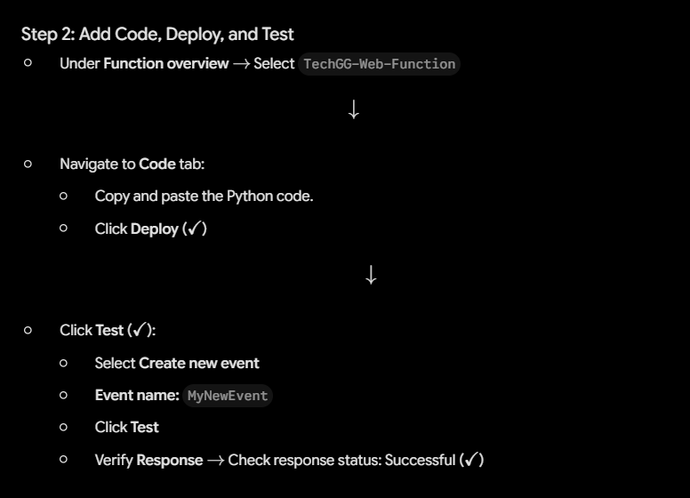


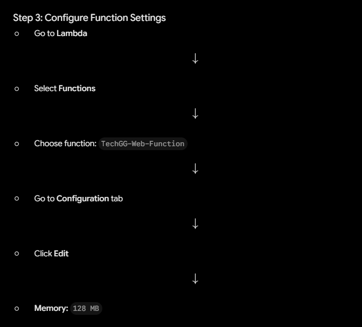


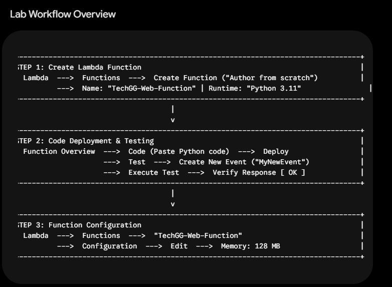


---

## LAB2: Deploying a Website Using API Gateway in Lambda Service and AWS Cognito

---

### Step 1: Create Lambda Function

* Go to **Lambda**

$$\downarrow$$


* Select **Functions**

$$\downarrow$$


* Click **Create Function**
* Select **Author from scratch**

$$\downarrow$$


* Fill in **Basic information**:
* **Function name:** `TechGG-Web-Function`
* **Runtime:** `Python 3.11`


---

### Step 2: Add Code, Deploy, and Test

* Under **Function overview** $\rightarrow$ Select `TechGG-Web-Function`

$$\downarrow$$


* Navigate to **Code** tab:
* Copy and paste the Python code.
* Click **Deploy** ($\checkmark$)

$$\downarrow$$


* Click **Test** ($\checkmark$):
* Select **Create new event**
* **Event name:** `MyNewEvent`
* Click **Test**
* Verify **Response** $\rightarrow$ Check response status: Successful ($\checkmark$)


```
---

### Step 3: Configure Function Settings

* Go to **Lambda**

$$\downarrow$$


* Select **Functions**

$$\downarrow$$


* Choose function: `TechGG-Web-Function`

$$\downarrow$$


* Go to **Configuration** tab

$$\downarrow$$


* Click **Edit**

$$\downarrow$$


* **Memory:** `128 MB`

---

### Lab Workflow Overview

```
+-----------------------------------------------------------------------------------+
| STEP 1: Create Lambda Function                                                    |
|   Lambda  --->  Functions  --->  Create Function ("Author from scratch")          |
|           --->  Name: "TechGG-Web-Function" | Runtime: "Python 3.11"                |
+-----------------------------------------------------------------------------------+
                                       |
                                       v
+-----------------------------------------------------------------------------------+
| STEP 2: Code Deployment & Testing                                                 |
|   Function Overview  --->  Code (Paste Python code)  --->  Deploy                 |
|                      --->  Test  --->  Create New Event ("MyNewEvent")            |
|                      --->  Execute Test  --->  Verify Response [ OK ]             |
+-----------------------------------------------------------------------------------+
                                       |
                                       v
+-----------------------------------------------------------------------------------+
| STEP 3: Function Configuration                                                    |
|   Lambda  --->  Functions  --->  "TechGG-Web-Function"                            |
|           --->  Configuration  --->  Edit  --->  Memory: 128 MB                   |
+-----------------------------------------------------------------------------------+

```


-----------xxxxxxxxxxx----------


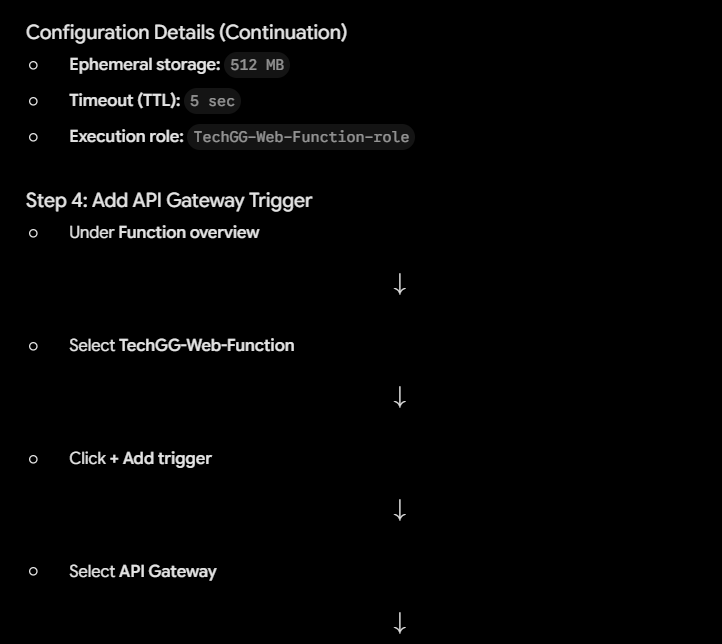


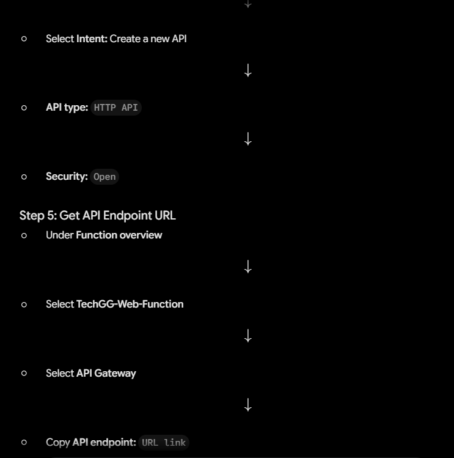


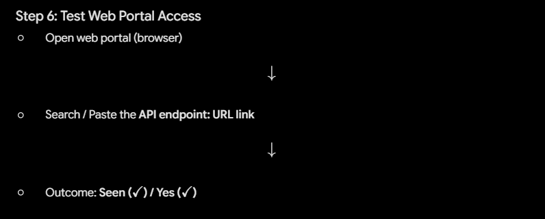


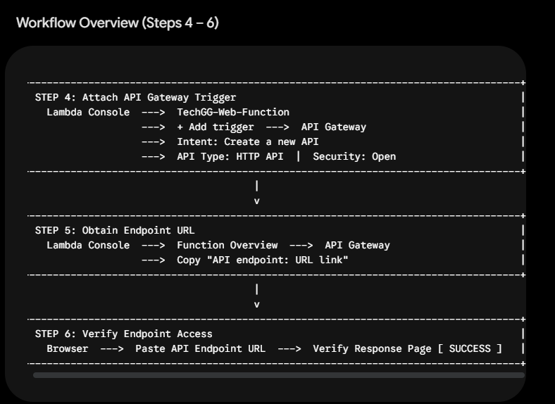


---

### Configuration Details (Continuation)

* **Ephemeral storage:** `512 MB`
* **Timeout (TTL):** `5 sec`
* **Execution role:** `TechGG-Web-Function-role`

---

### Step 4: Add API Gateway Trigger

* Under **Function overview**

$$\downarrow$$


* Select **TechGG-Web-Function**

$$\downarrow$$


* Click **+ Add trigger**

$$\downarrow$$


* Select **API Gateway**

$$\downarrow$$


* Select **Intent:** Create a new API

$$\downarrow$$


* **API type:** `HTTP API`

$$\downarrow$$


* **Security:** `Open`

---

### Step 5: Get API Endpoint URL

* Under **Function overview**

$$\downarrow$$


* Select **TechGG-Web-Function**

$$\downarrow$$


* Select **API Gateway**

$$\downarrow$$


* Copy **API endpoint:** `URL link`

---

### Step 6: Test Web Portal Access

* Open web portal (browser)

$$\downarrow$$


* Search / Paste the **API endpoint: URL link**

$$\downarrow$$


* Outcome: **Seen ($\checkmark$) / Yes ($\checkmark$)**

---

### Workflow Overview (Steps 4 – 6)

```
+-----------------------------------------------------------------------------------+
| STEP 4: Attach API Gateway Trigger                                                |
|   Lambda Console  --->  TechGG-Web-Function                                       |
|                   --->  + Add trigger  --->  API Gateway                          |
|                   --->  Intent: Create a new API                                  |
|                   --->  API Type: HTTP API  |  Security: Open                     |
+-----------------------------------------------------------------------------------+
                                       |
                                       v
+-----------------------------------------------------------------------------------+
| STEP 5: Obtain Endpoint URL                                                       |
|   Lambda Console  --->  Function Overview  --->  API Gateway                      |
|                   --->  Copy "API endpoint: URL link"                             |
+-----------------------------------------------------------------------------------+
                                       |
                                       v
+-----------------------------------------------------------------------------------+
| STEP 6: Verify Endpoint Access                                                    |
|   Browser  --->  Paste API Endpoint URL  --->  Verify Response Page [ SUCCESS ]   |
+-----------------------------------------------------------------------------------+

```


--------xxxxxxxxxx------------


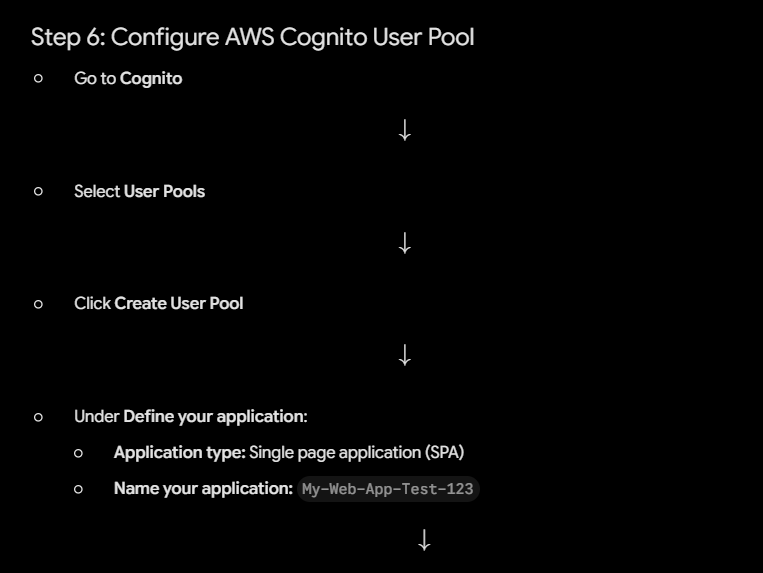


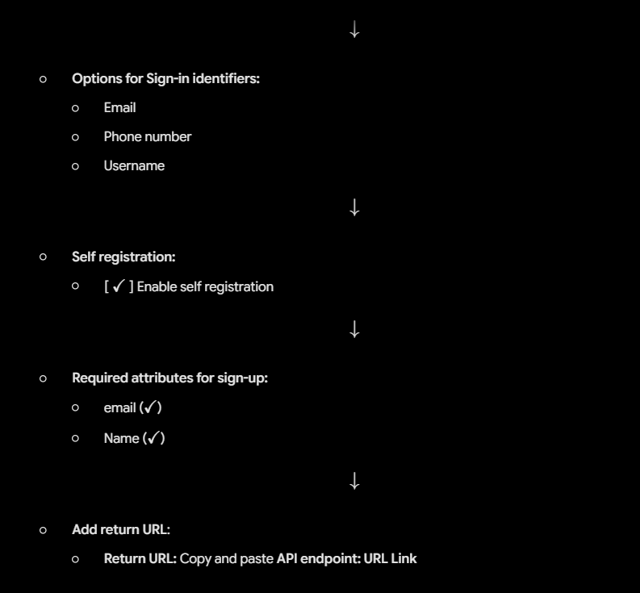


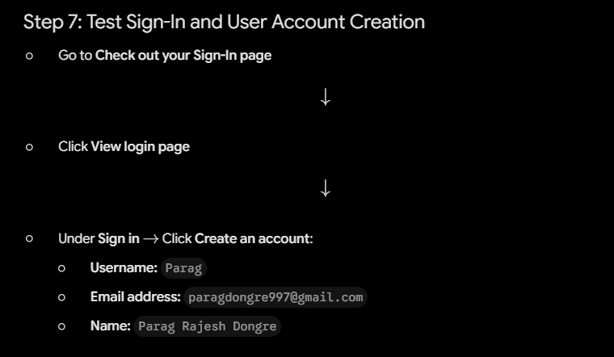


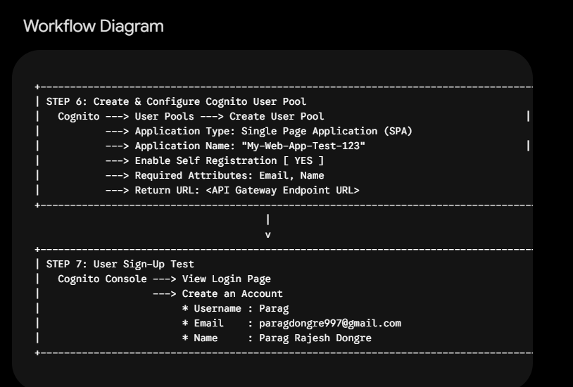


---

## Step 6: Configure AWS Cognito User Pool

* Go to **Cognito**

$$\downarrow$$


* Select **User Pools**

$$\downarrow$$


* Click **Create User Pool**

$$\downarrow$$


* Under **Define your application**:
* **Application type:** Single page application (SPA)
* **Name your application:** `My-Web-App-Test-123`

$$\downarrow$$


* **Options for Sign-in identifiers:**
* Email
* Phone number
* Username

$$\downarrow$$


* **Self registration:**
* [ $\checkmark$ ] Enable self registration

$$\downarrow$$


* **Required attributes for sign-up:**
* email ($\checkmark$)
* Name ($\checkmark$)

$$\downarrow$$


* **Add return URL**:
* **Return URL:** Copy and paste **API endpoint: URL Link**


---

## Step 7: Test Sign-In and User Account Creation

* Go to **Check out your Sign-In page**

$$\downarrow$$


* Click **View login page**

$$\downarrow$$


* Under **Sign in** $\rightarrow$ Click **Create an account**:
* **Username:** `Parag`
* **Email address:** `paragdongre997@gmail.com`
* **Name:** `Parag Rajesh Dongre`


---

## Workflow Diagram

```
+-----------------------------------------------------------------------------------+
| STEP 6: Create & Configure Cognito User Pool                                      |
|   Cognito ---> User Pools ---> Create User Pool                                  |
|           ---> Application Type: Single Page Application (SPA)                     |
|           ---> Application Name: "My-Web-App-Test-123"                           |
|           ---> Enable Self Registration [ YES ]                                   |
|           ---> Required Attributes: Email, Name                                   |
|           ---> Return URL: <API Gateway Endpoint URL>                             |
+-----------------------------------------------------------------------------------+
                                       |
                                       v
+-----------------------------------------------------------------------------------+
| STEP 7: User Sign-Up Test                                                         |
|   Cognito Console ---> View Login Page                                            |
|                   ---> Create an Account                                          |
|                        * Username : Parag                                         |
|                        * Email    : paragdongre997@gmail.com                      |
|                        * Name     : Parag Rajesh Dongre                           |
+-----------------------------------------------------------------------------------+

```


-----------xxxxxxxxx--------------


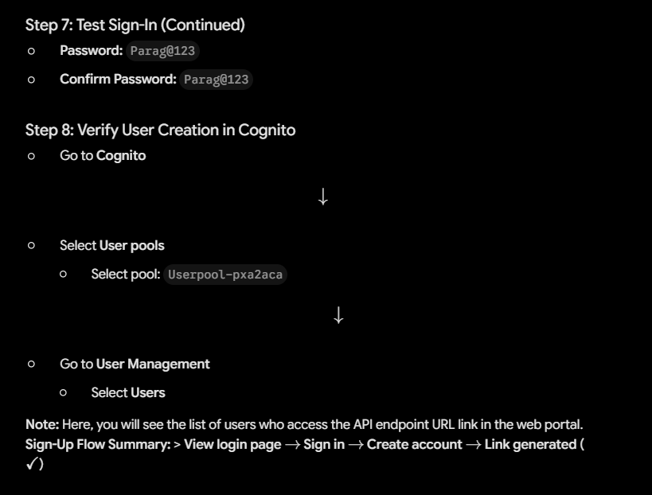


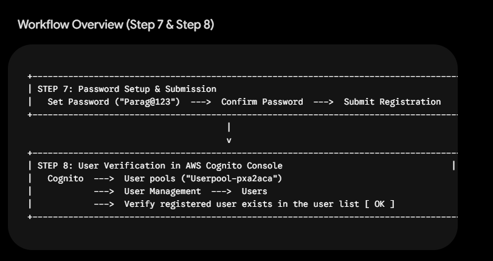


---

### Step 7: Test Sign-In (Continued)

* **Password:** `Parag@123`
* **Confirm Password:** `Parag@123`

---

### Step 8: Verify User Creation in Cognito

* Go to **Cognito**

$$\downarrow$$


* Select **User pools**
* Select pool: `Userpool-pxa2aca`

$$\downarrow$$


* Go to **User Management**
* Select **Users**


> **Note:** Here, you will see the list of users who access the API endpoint URL link in the web portal.
> **Sign-Up Flow Summary:** > **View login page** $\rightarrow$ **Sign in** $\rightarrow$ **Create account** $\rightarrow$ **Link generated** ($\checkmark$)

---

### Workflow Overview (Step 7 & Step 8)

```
+-----------------------------------------------------------------------------------+
| STEP 7: Password Setup & Submission                                               |
|   Set Password ("Parag@123")  --->  Confirm Password  --->  Submit Registration   |
+-----------------------------------------------------------------------------------+
                                       |
                                       v
+-----------------------------------------------------------------------------------+
| STEP 8: User Verification in AWS Cognito Console                                 |
|   Cognito  --->  User pools ("Userpool-pxa2aca")                                  |
|            --->  User Management  --->  Users                                     |
|            --->  Verify registered user exists in the user list [ OK ]            |
+-----------------------------------------------------------------------------------+

```


-------------xxxxxxxxxxxx----------


```
```

## Lab 2: Serverless Web App with API Gateway & AWS Cognito

* **Serverless Architecture:** You can run backend logic using **AWS Lambda** without provisioning servers, relying on trigger mechanisms like **API Gateway** to expose execution logic to web clients via HTTP/HTTPS endpoints.
* **API Gateway Exposure:**
Setting up an HTTP API trigger on a Lambda function instantly provides a public `API Endpoint URL` to invoke backend code.
* **AWS Cognito Authentication:**
* **User Pools** act as a complete user directory for web applications, handling user sign-up, sign-in, and attribute storage (email, name, username).
* Enabling **Self-Registration** allows external users to create accounts directly through a pre-built hosted UI (`View login page`).


* **End-to-End User Flow:**

$$\text{User Sign-Up / Sign-In (Cognito)} \longrightarrow \text{API Gateway Endpoint} \longrightarrow \text{Lambda Function Execution}$$

```

```


```

## Lab 2 Cleanup: Serverless Web App (Cognito, API Gateway, Lambda)

### 1. Delete Cognito User Pool

* Navigate to **AWS Cognito** $\rightarrow$ **User pools**.
* Select `Userpool-pxa2aca` (or your created pool).
* Click **Delete** and type the pool name to confirm.

### 2. Delete API Gateway HTTP API

* Navigate to **API Gateway** $\rightarrow$ **APIs**.
* Select the HTTP API created for the Lambda trigger.
* Click **Delete**.

### 3. Delete Lambda Function & IAM Execution Role

* Navigate to **AWS Lambda** $\rightarrow$ **Functions**.
* Select `TechGG-Web-Function` $\rightarrow$ Click **Actions** $\rightarrow$ **Delete**.
* Navigate to **IAM** $\rightarrow$ **Roles**.
* Search for `TechGG-Web-Function-role` (or the auto-generated execution role) and click **Delete**.

```

## Verification Flowchart

```
[ Clean S3 Objects & Bucket ] ──> [ Delete IAM User & Policy ] 
                                          │
                                          ▼
[ Delete Cognito User Pool ]  ──> [ Delete API Gateway HTTP API ] ──> [ Delete Lambda & Execution Role ]

```

> **Tip:** Always check **AWS Cost Explorer** or **AWS CloudWatch Billing Alarms** a few hours after completing labs to confirm active resource usage drops to zero.


=========xxxxxxxxxxx===========