---

## **1. Lab Objective**

The primary goal of this lab was to demonstrate **Data Protection at Rest** and enforce **Least Privilege Access Control** using **AWS KMS (Key Management Service)** integrated with **Amazon S3**.

* **Access Control via KMS:** Prove that having S3 permissions (`s3:GetObject`) alone is **not enough** to access encrypted data if the user lacks permissions on the associated KMS Customer Managed Key (CMK).
* **Identity & Access Segregation:** Test and verify access behavior between two users:
* **John:** Granted both S3 Read Access and KMS Key Decrypt permissions $\rightarrow$ **Successfully reads data**.
* **Bob:** Granted S3 Read Access but denied KMS Key Decrypt permissions $\rightarrow$ **Blocked by `Access Denied**`.


---


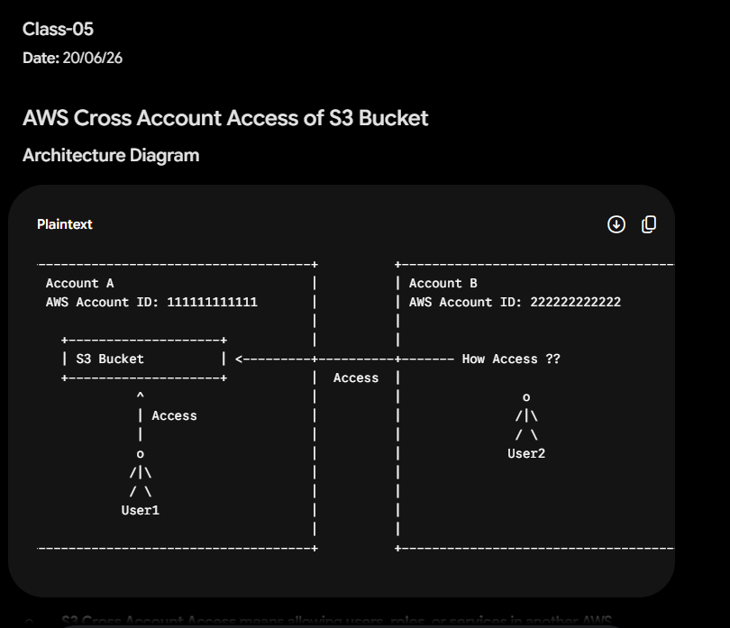


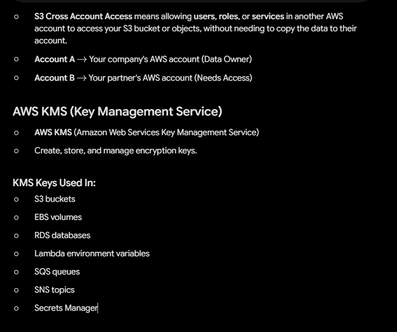


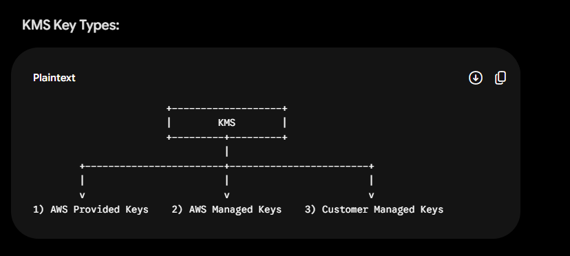

---

### **Class-05**

**Date:** 20/06/26

---

## **AWS Cross Account Access of S3 Bucket**

### **Architecture Diagram**

```text
+------------------------------------+          +------------------------------------+
| Account A                          |          | Account B                          |
| AWS Account ID: 111111111111       |          | AWS Account ID: 222222222222       |
|                                    |          |                                    |
|   +--------------------+           |          |                                    |
|   | S3 Bucket          | <---------+----------+------- How Access ??               |
|   +--------------------+           |  Access  |                                    |
|             ^                      |          |                o                   |
|             | Access               |          |               /|\                  |
|             |                      |          |               / \                  |
|             o                      |          |              User2                 |
|            /|\                     |          |                                    |
|            / \                     |          |                                    |
|           User1                    |          |                                    |
|                                    |          |                                    |
+------------------------------------+          +------------------------------------+

```

---

* **S3 Cross Account Access** means allowing **users**, **roles**, or **services** in another AWS account to access your S3 bucket or objects, without needing to copy the data to their account.
* **Account A** $\rightarrow$ Your company's AWS account (Data Owner)
* **Account B** $\rightarrow$ Your partner's AWS account (Needs Access)

---

## **AWS KMS (Key Management Service)**

* **AWS KMS** (Amazon Web Services Key Management Service)
* Create, store, and manage encryption keys.

### **KMS Keys Used In:**

* S3 buckets
* EBS volumes
* RDS databases
* Lambda environment variables
* SQS queues
* SNS topics
* Secrets Manager

---

### **KMS Key Types:**

```text
                       +-------------------+
                       |        KMS        |
                       +---------+---------+
                                 |
        +------------------------+------------------------+
        |                        |                        |
        v                        v                        v
1) AWS Provided Keys    2) AWS Managed Keys    3) Customer Managed Keys

```

----------xxxxxxxxxx-------------


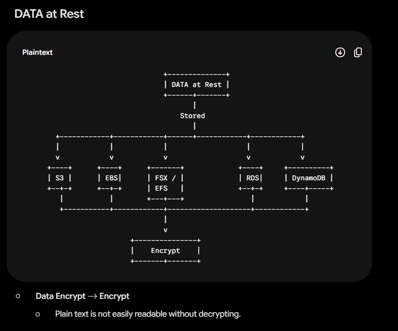


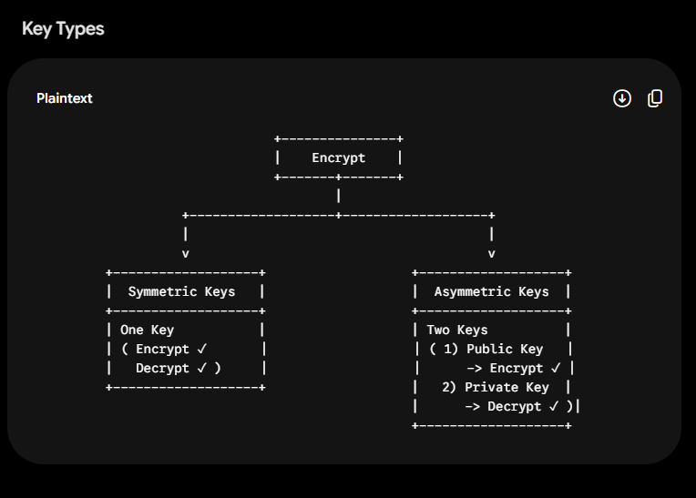


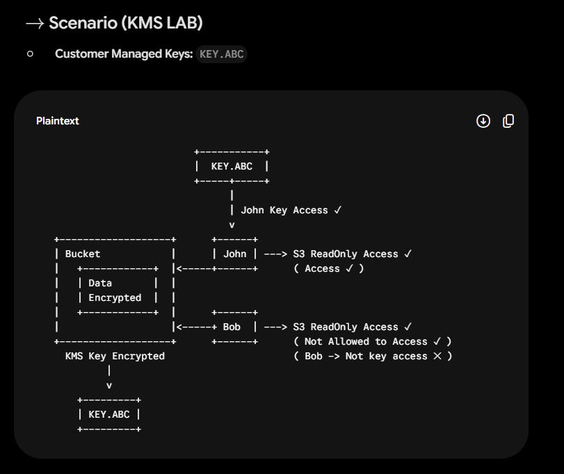


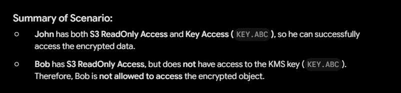


---

### **Page 2**

## **DATA at Rest**

```text
                                  +--------------+
                                  | DATA at Rest |
                                  +------+-------+
                                         |
                                      Stored
                                         |
        +------------+------------+------+------------+------------+
        |            |            |                   |            |
        v            v            v                   v            v
      +----+      +----+      +-------+             +----+     +----------+
      | S3 |      | EBS|      | FSX / |             | RDS|     | DynamoDB |
      +--+-+      +--+-+      | EFS   |             +--+-+     +----+-----+
         |           |        +---+---+                |            |
         +-----------+------------+--------------------+------------+
                                  |
                                  v
                          +---------------+
                          |    Encrypt    |
                          +-------+-------+

```

* **Data Encrypt** $\rightarrow$ **Encrypt**
* Plain text is not easily readable without decrypting.


---

### **Key Types**

```text
                               +---------------+
                               |    Encrypt    |
                               +-------+-------+
                                       |
                   +-------------------+-------------------+
                   |                                       |
                   v                                       v
         +-------------------+                   +-------------------+
         |  Symmetric Keys   |                   |  Asymmetric Keys  |
         +-------------------+                   +-------------------+
         | One Key           |                   | Two Keys          |
         | ( Encrypt ✓       |                   | ( 1) Public Key   |
         |   Decrypt ✓ )     |                   |      -> Encrypt ✓ |
         +-------------------+                   |   2) Private Key  |
                                                 |      -> Decrypt ✓ )|
                                                 +-------------------+

```

---

## $\rightarrow$ **Scenario (KMS LAB)**

* **Customer Managed Keys:** `KEY.ABC`

```text
                           +-----------+
                           |  KEY.ABC  |
                           +-----+-----+
                                 |
                                 | John Key Access ✓
                                 v
   +-------------------+      +------+
   | Bucket            |      | John | ---> S3 ReadOnly Access ✓
   |   +------------+  |<-----+------+      ( Access ✓ )
   |   | Data       |  |
   |   | Encrypted  |  |
   |   +------------+  |      +------+
   |                   |<-----+ Bob  | ---> S3 ReadOnly Access ✓
   +-------------------+      +------+      ( Not Allowed to Access ✓ )
     KMS Key Encrypted                      ( Bob -> Not key access ✕ )
            |
            v
       +---------+
       | KEY.ABC |
       +---------+

```

---

### **Summary of Scenario:**

* **John** has both **S3 ReadOnly Access** and **Key Access (`KEY.ABC`)**, so he can successfully access the encrypted data.
* **Bob** has **S3 ReadOnly Access**, but does **not** have access to the KMS key (`KEY.ABC`). Therefore, Bob is **not allowed to access** the encrypted object.


--------xxxxxxxxxxx--------------


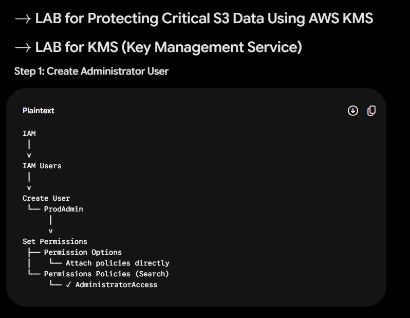


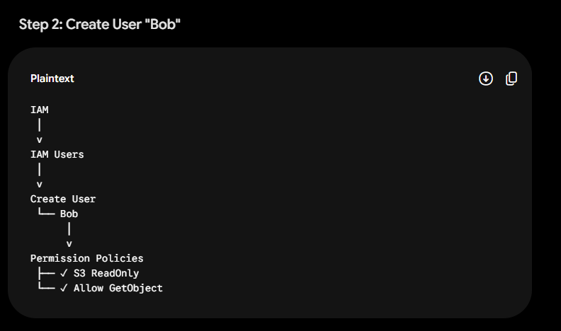


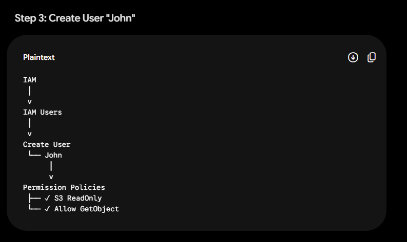


---

### **Page 3**

# $\rightarrow$ **LAB for Protecting Critical S3 Data Using AWS KMS**

# $\rightarrow$ **LAB for KMS (Key Management Service)**

---

### **Step 1: Create Administrator User**

```text
IAM
 │
 v
IAM Users
 │
 v
Create User
 └── ProdAdmin
      │
      v
Set Permissions
 ├── Permission Options
 │    └── Attach policies directly
 └── Permissions Policies (Search)
      └── ✓ AdministratorAccess

```

---

### **Step 2: Create User "Bob"**

```text
IAM
 │
 v
IAM Users
 │
 v
Create User
 └── Bob
      │
      v
Permission Policies
 ├── ✓ S3 ReadOnly
 └── ✓ Allow GetObject

```

---

### **Step 3: Create User "John"**

```text
IAM
 │
 v
IAM Users
 │
 v
Create User
 └── John
      │
      v
Permission Policies
 ├── ✓ S3 ReadOnly
 └── ✓ Allow GetObject

```


-----------xxxxxxxxxxxx-------------


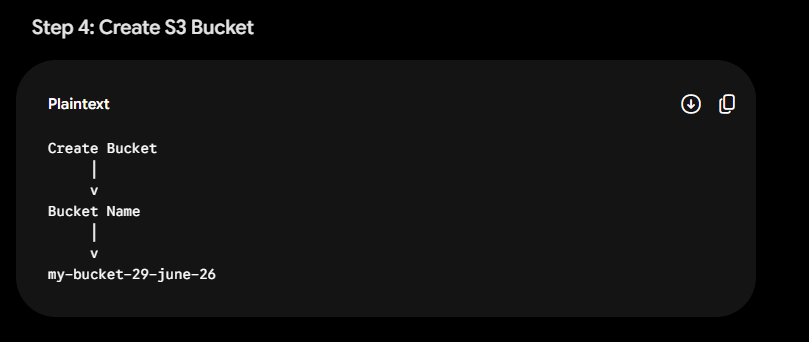


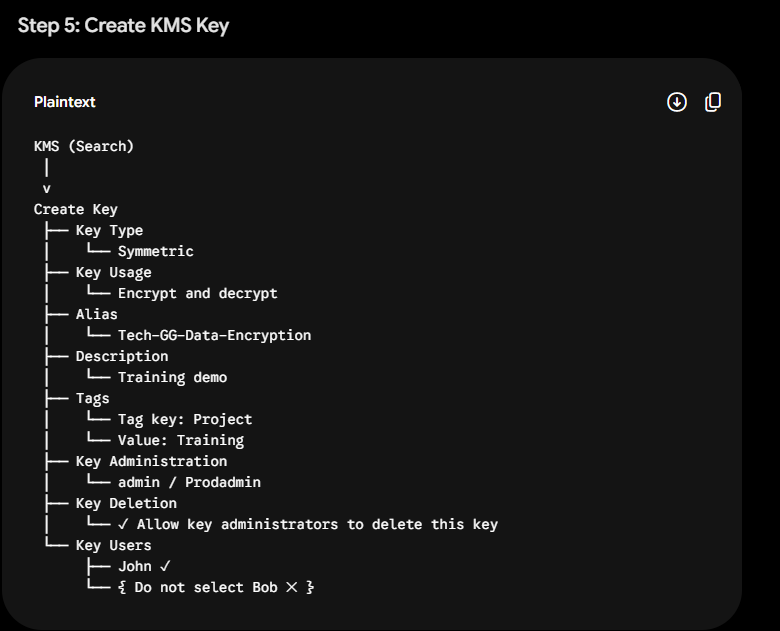


---

### **Page 4**

### **Step 4: Create S3 Bucket**

```text
Create Bucket
     │
     v
Bucket Name
     │
     v
my-bucket-29-june-26

```

---

### **Step 5: Create KMS Key**

```text
KMS (Search)
 │
 v
Create Key
 ├── Key Type
 │    └── Symmetric
 ├── Key Usage
 │    └── Encrypt and decrypt
 ├── Alias
 │    └── Tech-GG-Data-Encryption
 ├── Description
 │    └── Training demo
 ├── Tags
 │    └── Tag key: Project
 │    └── Value: Training
 ├── Key Administration
 │    └── admin / Prodadmin
 ├── Key Deletion
 │    └── ✓ Allow key administrators to delete this key
 └── Key Users
      ├── John ✓
      └── { Do not select Bob ✕ }

```


-----------xxxxxxxxx-------------


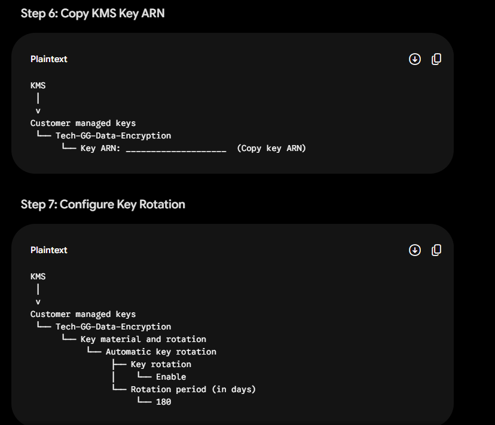


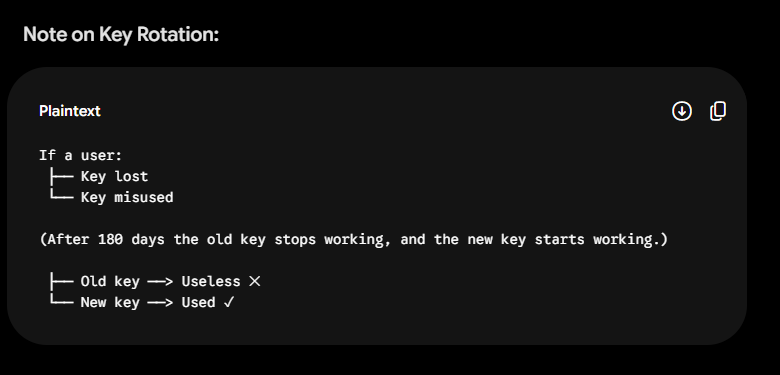


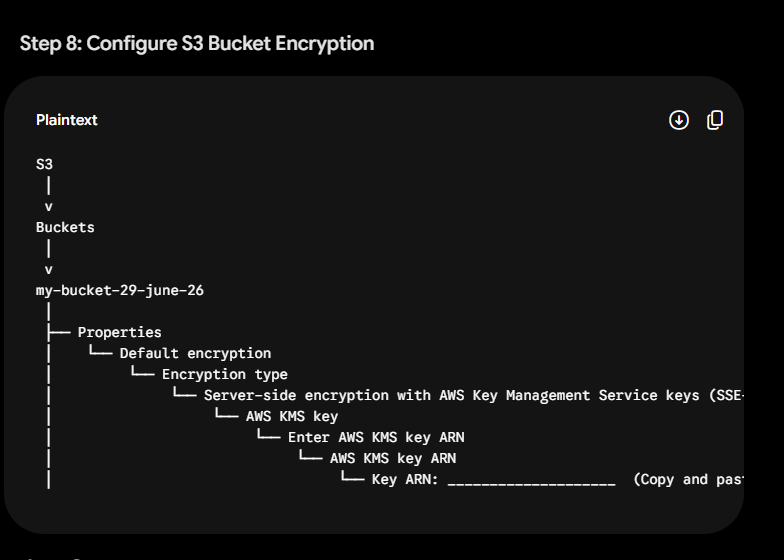


---

### **Page 5**

### **Step 6: Copy KMS Key ARN**

```text
KMS
 │
 v
Customer managed keys
 └── Tech-GG-Data-Encryption
      └── Key ARN: ____________________  (Copy key ARN)

```

---

### **Step 7: Configure Key Rotation**

```text
KMS
 │
 v
Customer managed keys
 └── Tech-GG-Data-Encryption
      └── Key material and rotation
           └── Automatic key rotation
                ├── Key rotation
                │    └── Enable
                └── Rotation period (in days)
                     └── 180

```

#### **Note on Key Rotation:**

```text
If a user:
 ├── Key lost
 └── Key misused

(After 180 days the old key stops working, and the new key starts working.)

 ├── Old key ──> Useless ✕
 └── New key ──> Used ✓

```

---

### **Step 8: Configure S3 Bucket Encryption**

```text
S3
 │
 v
Buckets
 │
 v
my-bucket-29-june-26
 │
 ├── Properties
 │    └── Default encryption
 │         └── Encryption type
 │              └── Server-side encryption with AWS Key Management Service keys (SSE-KMS)
 │                   └── AWS KMS key
 │                        └── Enter AWS KMS key ARN
 │                             └── AWS KMS key ARN
 │                                  └── Key ARN: ____________________  (Copy and paste key ARN)

```


---------xxxxxxxxxxxx-----------


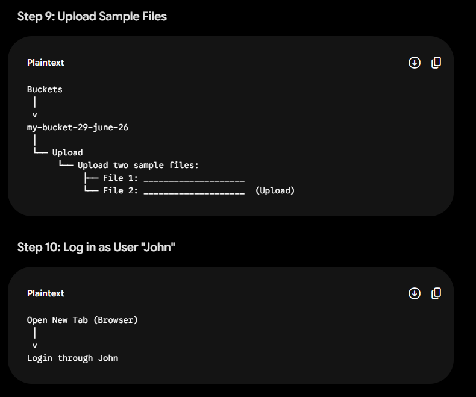


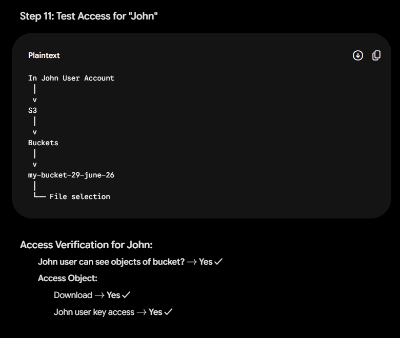


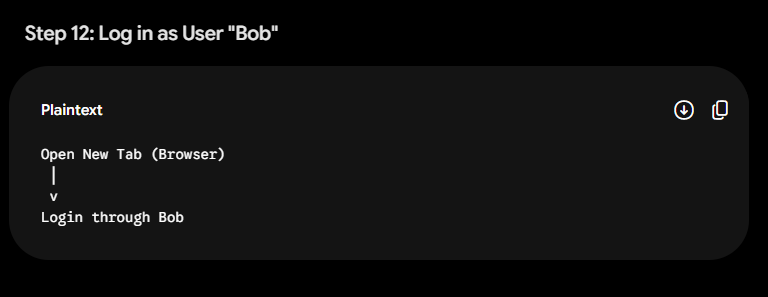


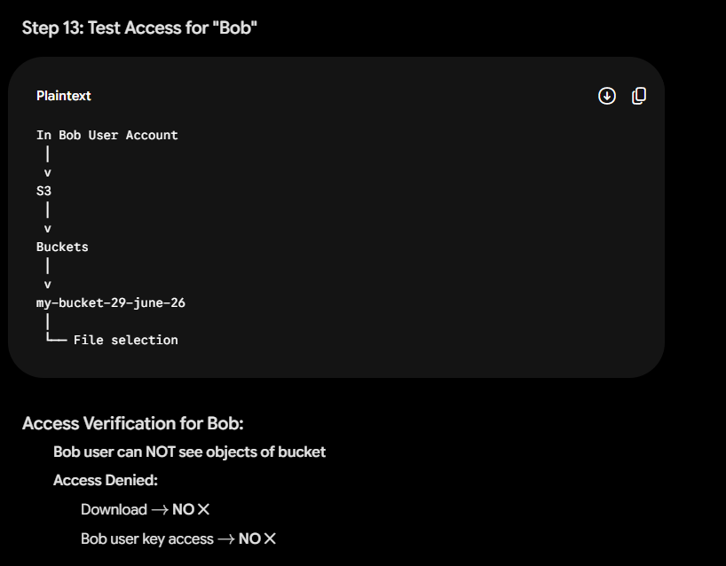


---

### **Page 6**

### **Step 9: Upload Sample Files**

```text
Buckets
 │
 v
my-bucket-29-june-26
 │
 └── Upload
      └── Upload two sample files:
           ├── File 1: ____________________
           └── File 2: ____________________  (Upload)

```

---

### **Step 10: Log in as User "John"**

```text
Open New Tab (Browser)
 │
 v
Login through John

```

---

### **Step 11: Test Access for "John"**

```text
In John User Account
 │
 v
S3
 │
 v
Buckets
 │
 v
my-bucket-29-june-26
 │
 └── File selection

```

#### **Access Verification for John:**

> * **John user can see objects of bucket?** $\rightarrow$ **Yes ✓**
> * **Access Object:**
> * Download $\rightarrow$ **Yes ✓**
> * John user key access $\rightarrow$ **Yes ✓**
> 
> 
> 
> 

---

### **Step 12: Log in as User "Bob"**

```text
Open New Tab (Browser)
 │
 v
Login through Bob

```

---

### **Step 13: Test Access for "Bob"**

```text
In Bob User Account
 │
 v
S3
 │
 v
Buckets
 │
 v
my-bucket-29-june-26
 │
 └── File selection

```

#### **Access Verification for Bob:**

> * **Bob user can NOT see objects of bucket**
> * **Access Denied:**
> * Download $\rightarrow$ **NO ✕**
> * Bob user key access $\rightarrow$ **NO ✕**
> 
> 
> 
>

-------------xxxxxxxxxx-----------


---
## **2. Key Takeaways**

* **Envelope Encryption & KMS Enforcement:** When an object is encrypted with **SSE-KMS**, AWS requires two distinct authorizations to access the object:
1. Permission on the **S3 Bucket/Object** (`s3:GetObject`).
2. Permission on the **KMS Key** (`kms:Decrypt`).


* **Explicit Key User Policy:**
In AWS KMS, defining who can use the key (Key Users) is critical. Adding **John** as a Key User while omitting **Bob** effectively isolates sensitive data even if both share the same broad S3 bucket policies.
* **Automatic Key Rotation:**
Enabling KMS automatic key rotation (e.g., every 180 days) automatically generates new cryptographic material without requiring manual re-encryption of existing data or changing the Key ARN.

---

## **3. Post-Lab Cleanup Steps**

To avoid ongoing AWS charges or clutter in your AWS account, complete these cleanup steps in order:

```text
Step 1: Empty & Delete S3 Bucket
  └── S3 Console ──> Buckets ──> Select 'my-bucket-29-june-26' ──> Empty ──> Delete

Step 2: Schedule KMS Key Deletion
  └── KMS Console ──> Customer Managed Keys ──> Select 'Tech-GG-Data-Encryption'
       ──> Key actions ──> Schedule key deletion (7–30 days waiting period required)

Step 3: Delete IAM Users
  └── IAM Console ──> Users ──> Select 'John', 'Bob', and 'ProdAdmin' ──> Delete

```

> [!NOTE]
> AWS KMS keys cannot be deleted immediately. When you schedule deletion, AWS enforces a mandatory waiting period (default is 30 days, minimum is 7 days) to prevent accidental data loss. During this period, the key status changes to **Pending Deletion** and cannot be used for cryptographic operations.


---


==========xxxxxxxxxxxx==============