### Class 6


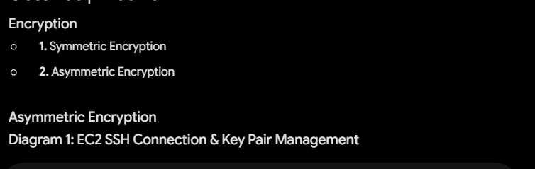


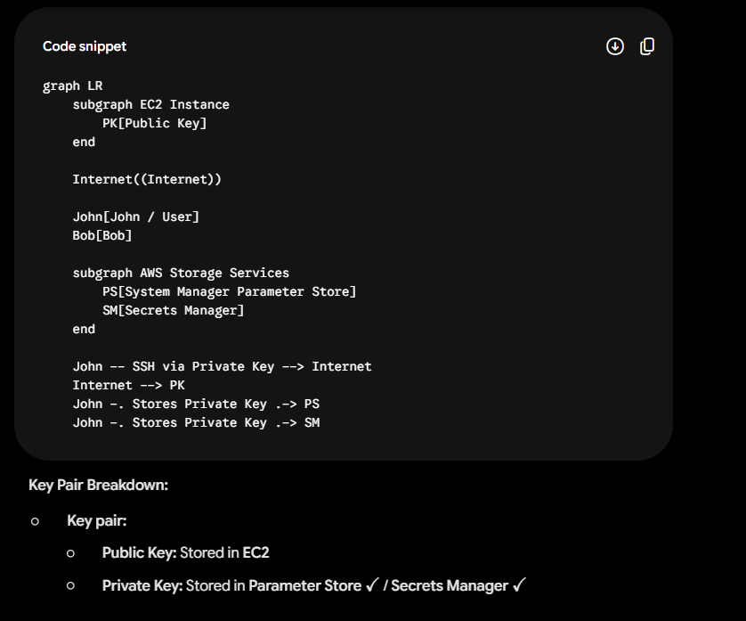


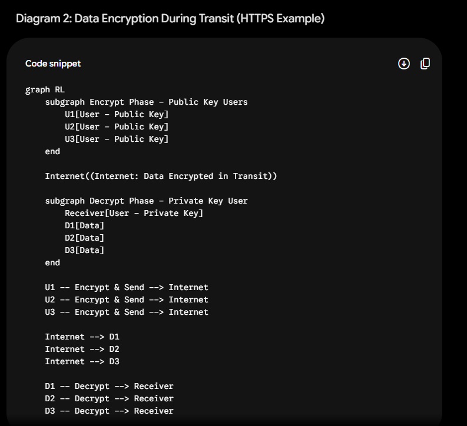


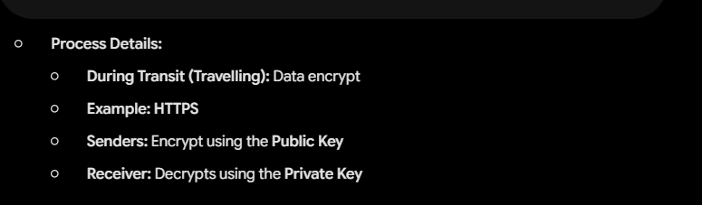


---

## Class - 06 | 21/06/26

### Encryption

* **1.** Symmetric Encryption
* **2.** Asymmetric Encryption

---

### Asymmetric Encryption

#### Diagram 1: EC2 SSH Connection & Key Pair Management

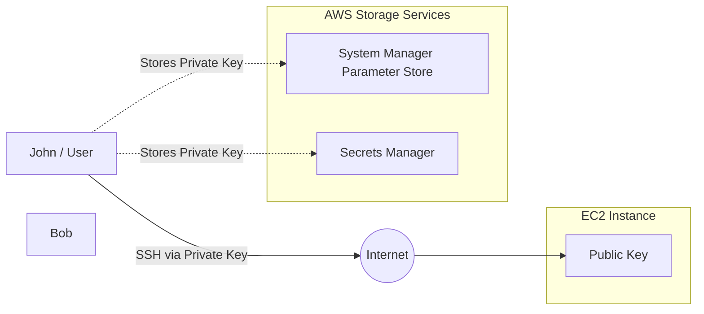
```mermaid
graph LR
    subgraph EC2 Instance
        PK[Public Key]
    end

    Internet((Internet))

    John[John / User]
    Bob[Bob]

    subgraph AWS Storage Services
        PS[System Manager Parameter Store]
        SM[Secrets Manager]
    end

    John -- SSH via Private Key --> Internet
    Internet --> PK
    John -. Stores Private Key .-> PS
    John -. Stores Private Key .-> SM

```

**Key Pair Breakdown:**

* **Key pair:**
* **Public Key:** Stored in **EC2**
* **Private Key:** Stored in **Parameter Store** $\checkmark$ / **Secrets Manager** $\checkmark$


---

#### Diagram 2: Data Encryption During Transit (HTTPS Example)

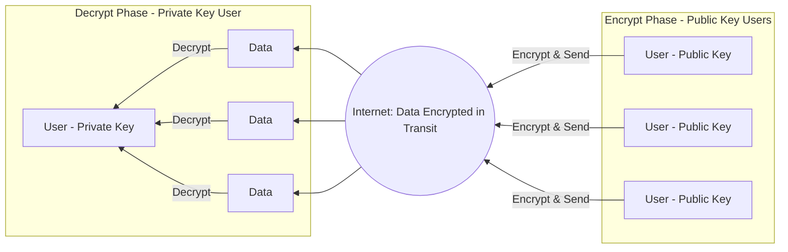
```mermaid
graph RL
    subgraph Encrypt Phase - Public Key Users
        U1[User - Public Key]
        U2[User - Public Key]
        U3[User - Public Key]
    end

    Internet((Internet: Data Encrypted in Transit))

    subgraph Decrypt Phase - Private Key User
        Receiver[User - Private Key]
        D1[Data]
        D2[Data]
        D3[Data]
    end

    U1 -- Encrypt & Send --> Internet
    U2 -- Encrypt & Send --> Internet
    U3 -- Encrypt & Send --> Internet

    Internet --> D1
    Internet --> D2
    Internet --> D3

    D1 -- Decrypt --> Receiver
    D2 -- Decrypt --> Receiver
    D3 -- Decrypt --> Receiver

```

* **Process Details:**
* **During Transit (Travelling):** Data encrypt
* **Example:** **HTTPS**
* **Senders:** Encrypt using the **Public Key**
* **Receiver:** Decrypts using the **Private Key**


---------xxxxxxxxxxxx-------------


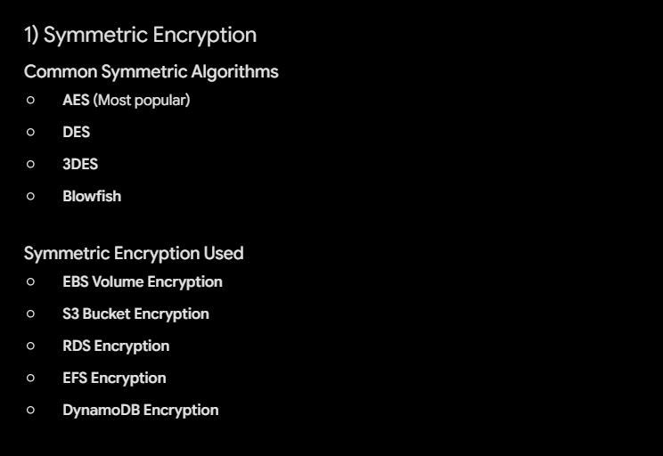


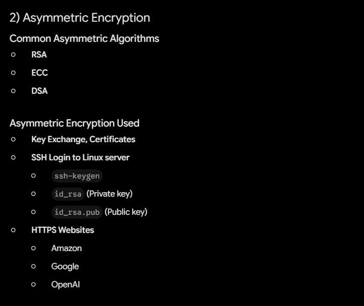


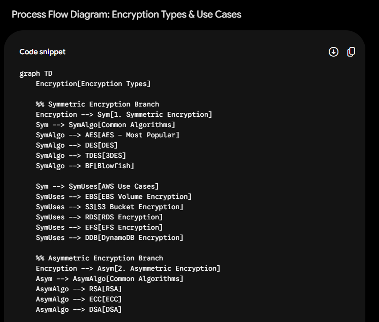


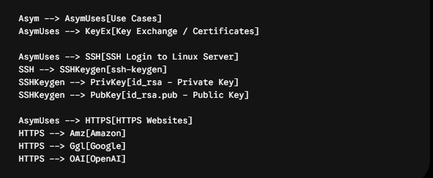


---

## 1) Symmetric Encryption

### Common Symmetric Algorithms

* **AES** (Most popular)
* **DES**
* **3DES**
* **Blowfish**

### Symmetric Encryption Used

* **EBS Volume Encryption**
* **S3 Bucket Encryption**
* **RDS Encryption**
* **EFS Encryption**
* **DynamoDB Encryption**

---

## 2) Asymmetric Encryption

### Common Asymmetric Algorithms

* **RSA**
* **ECC**
* **DSA**

### Asymmetric Encryption Used

* **Key Exchange, Certificates**
* **SSH Login to Linux server**
* `ssh-keygen`
* `id_rsa` (Private key)
* `id_rsa.pub` (Public key)


* **HTTPS Websites**
* Amazon
* Google
* OpenAI


---

### Process Flow Diagram: Encryption Types & Use Cases

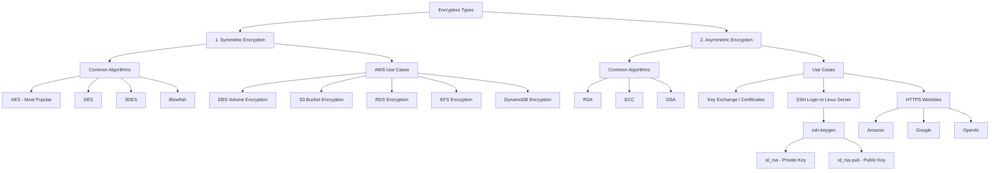
```mermaid
graph TD
    Encryption[Encryption Types]

    %% Symmetric Encryption Branch
    Encryption --> Sym[1. Symmetric Encryption]
    Sym --> SymAlgo[Common Algorithms]
    SymAlgo --> AES[AES - Most Popular]
    SymAlgo --> DES[DES]
    SymAlgo --> TDES[3DES]
    SymAlgo --> BF[Blowfish]

    Sym --> SymUses[AWS Use Cases]
    SymUses --> EBS[EBS Volume Encryption]
    SymUses --> S3[S3 Bucket Encryption]
    SymUses --> RDS[RDS Encryption]
    SymUses --> EFS[EFS Encryption]
    SymUses --> DDB[DynamoDB Encryption]

    %% Asymmetric Encryption Branch
    Encryption --> Asym[2. Asymmetric Encryption]
    Asym --> AsymAlgo[Common Algorithms]
    AsymAlgo --> RSA[RSA]
    AsymAlgo --> ECC[ECC]
    AsymAlgo --> DSA[DSA]

    Asym --> AsymUses[Use Cases]
    AsymUses --> KeyEx[Key Exchange / Certificates]
    
    AsymUses --> SSH[SSH Login to Linux Server]
    SSH --> SSHKeygen[ssh-keygen]
    SSHKeygen --> PrivKey[id_rsa - Private Key]
    SSHKeygen --> PubKey[id_rsa.pub - Public Key]

    AsymUses --> HTTPS[HTTPS Websites]
    HTTPS --> Amz[Amazon]
    HTTPS --> Ggl[Google]
    HTTPS --> OAI[OpenAI]

```


-----------xxxxxxxxxxxx---------------

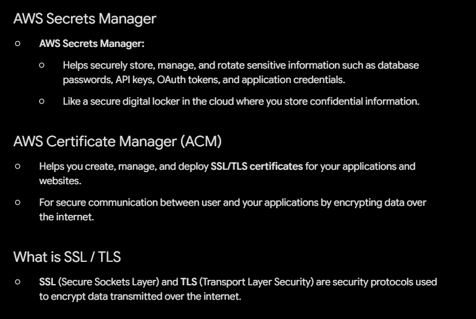


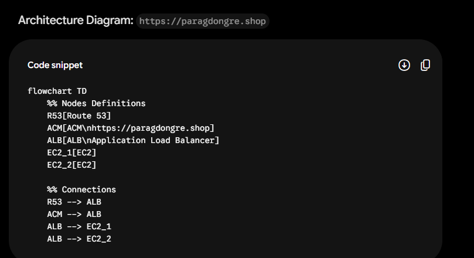


---

## AWS Secrets Manager

* **AWS Secrets Manager:**
* Helps securely store, manage, and rotate sensitive information such as database passwords, API keys, OAuth tokens, and application credentials.
* Like a secure digital locker in the cloud where you store confidential information.


---

## AWS Certificate Manager (ACM)

* Helps you create, manage, and deploy **SSL/TLS certificates** for your applications and websites.
* For secure communication between user and your applications by encrypting data over the internet.

---

## What is SSL / TLS

* **SSL** (Secure Sockets Layer) and **TLS** (Transport Layer Security) are security protocols used to encrypt data transmitted over the internet.

---

### Architecture Diagram: `https://paragdongre.shop`

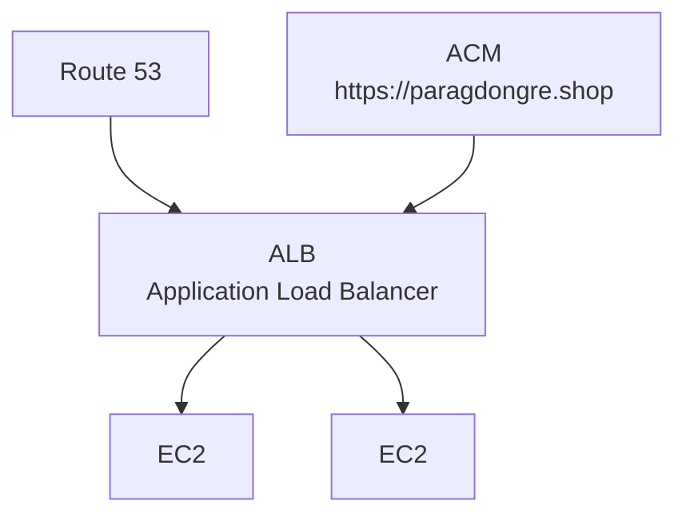
```mermaid
flowchart TD
    %% Nodes Definitions
    R53[Route 53]
    ACM[ACM\nhttps://paragdongre.shop]
    ALB[ALB\nApplication Load Balancer]
    EC2_1[EC2]
    EC2_2[EC2]

    %% Connections
    R53 --> ALB
    ACM --> ALB
    ALB --> EC2_1
    ALB --> EC2_2

```


-------------xxxxxxxxxxxx-----------------


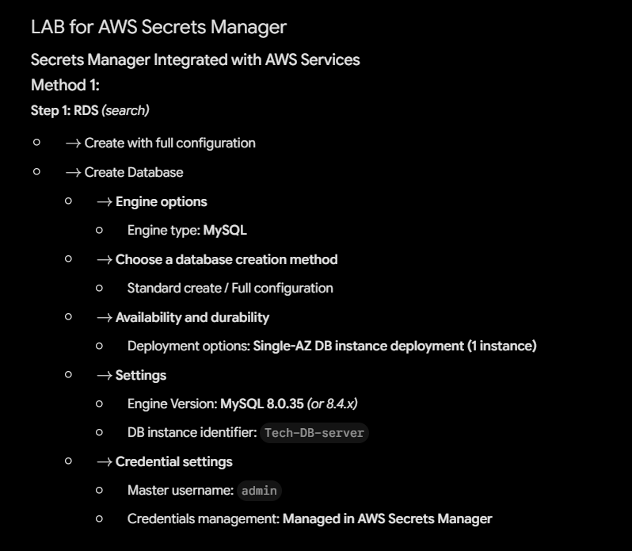


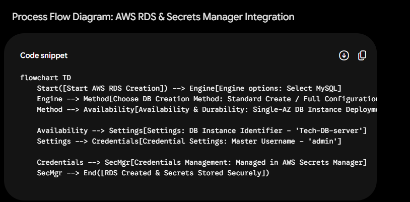


---

## LAB for AWS Secrets Manager

### Secrets Manager Integrated with AWS Services

#### Method 1:

**Step 1:** **RDS** *(search)*

* $\rightarrow$ Create with full configuration
* $\rightarrow$ Create Database
* $\rightarrow$ **Engine options**
* Engine type: **MySQL**


* $\rightarrow$ **Choose a database creation method**
* Standard create / Full configuration


* $\rightarrow$ **Availability and durability**
* Deployment options: **Single-AZ DB instance deployment (1 instance)**


* $\rightarrow$ **Settings**
* Engine Version: **MySQL 8.0.35** *(or 8.4.x)*
* DB instance identifier: `Tech-DB-server`


* $\rightarrow$ **Credential settings**
* Master username: `admin`
* Credentials management: **Managed in AWS Secrets Manager**


---

### Process Flow Diagram: AWS RDS & Secrets Manager Integration

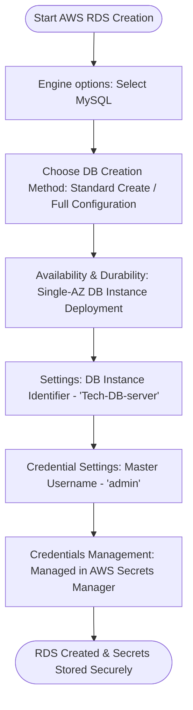
```mermaid
flowchart TD
    Start([Start AWS RDS Creation]) --> Engine[Engine options: Select MySQL]
    Engine --> Method[Choose DB Creation Method: Standard Create / Full Configuration]
    Method --> Availability[Availability & Durability: Single-AZ DB Instance Deployment]
    
    Availability --> Settings[Settings: DB Instance Identifier - 'Tech-DB-server']
    Settings --> Credentials[Credential Settings: Master Username - 'admin']
    
    Credentials --> SecMgr[Credentials Management: Managed in AWS Secrets Manager]
    SecMgr --> End([RDS Created & Secrets Stored Securely])

```


------------xxxxxxxxxxxxx-------------------


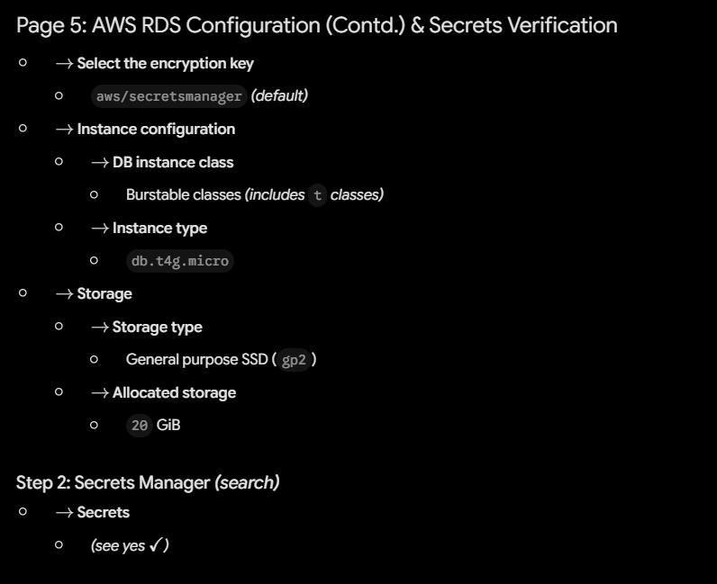


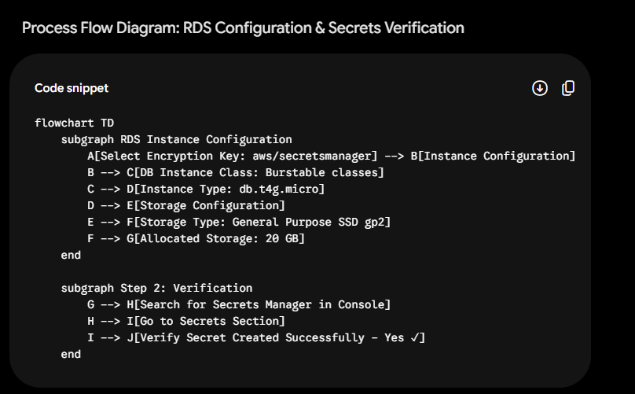


---

## Page 5: AWS RDS Configuration (Contd.) & Secrets Verification

* $\rightarrow$ **Select the encryption key**
* `aws/secretsmanager` *(default)*


* $\rightarrow$ **Instance configuration**
* $\rightarrow$ **DB instance class**
* Burstable classes *(includes `t` classes)*


* $\rightarrow$ **Instance type**
* `db.t4g.micro`


* $\rightarrow$ **Storage**
* $\rightarrow$ **Storage type**
* General purpose SSD (`gp2`)


* $\rightarrow$ **Allocated storage**
* `20` GiB


---

### Step 2: Secrets Manager *(search)*

* $\rightarrow$ **Secrets**
* *(see yes $\checkmark$)*


---

### Process Flow Diagram: RDS Configuration & Secrets Verification

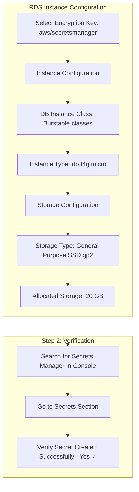
```mermaid
flowchart TD
    subgraph RDS Instance Configuration
        A[Select Encryption Key: aws/secretsmanager] --> B[Instance Configuration]
        B --> C[DB Instance Class: Burstable classes]
        C --> D[Instance Type: db.t4g.micro]
        D --> E[Storage Configuration]
        E --> F[Storage Type: General Purpose SSD gp2]
        F --> G[Allocated Storage: 20 GB]
    end

    subgraph Step 2: Verification
        G --> H[Search for Secrets Manager in Console]
        H --> I[Go to Secrets Section]
        I --> J[Verify Secret Created Successfully - Yes ✓]
    end

```


----------xxxxxxxxxx----------------


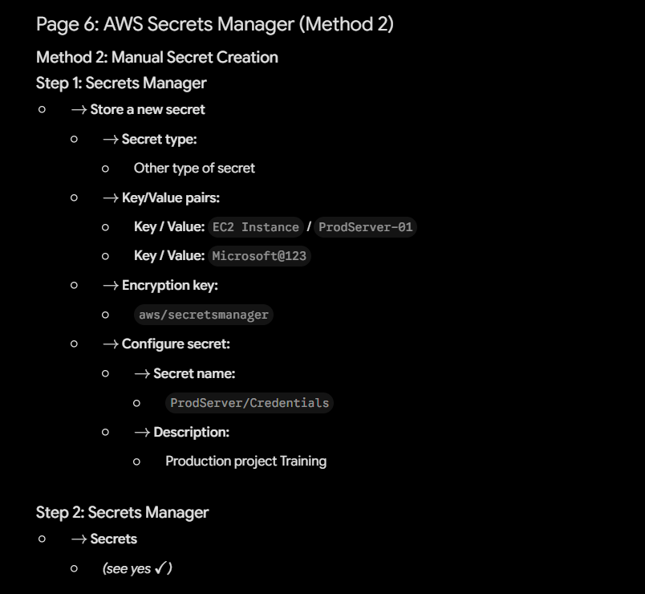


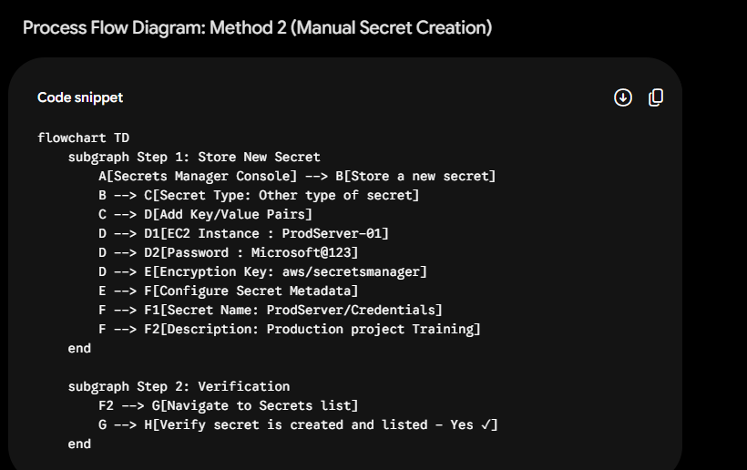

---

## Page 6: AWS Secrets Manager (Method 2)

### Method 2: Manual Secret Creation

#### Step 1: Secrets Manager

* $\rightarrow$ **Store a new secret**
* $\rightarrow$ **Secret type:**
* Other type of secret


* $\rightarrow$ **Key/Value pairs:**
* **Key / Value:** `EC2 Instance` / `ProdServer-01`
* **Key / Value:** `Microsoft@123`


* $\rightarrow$ **Encryption key:**
* `aws/secretsmanager`


* $\rightarrow$ **Configure secret:**
* $\rightarrow$ **Secret name:**
* `ProdServer/Credentials`


* $\rightarrow$ **Description:**
* Production project Training


---

#### Step 2: Secrets Manager

* $\rightarrow$ **Secrets**
* *(see yes $\checkmark$)*


---

### Process Flow Diagram: Method 2 (Manual Secret Creation)

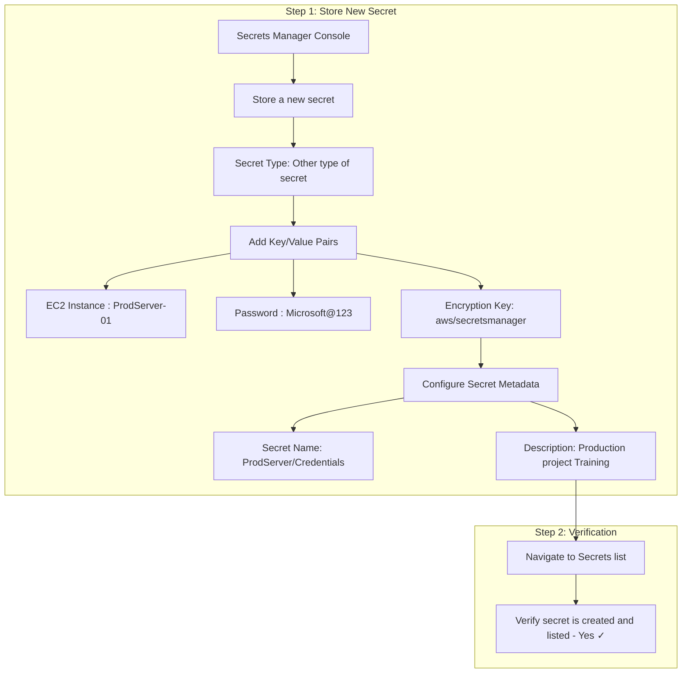
```mermaid
flowchart TD
    subgraph Step 1: Store New Secret
        A[Secrets Manager Console] --> B[Store a new secret]
        B --> C[Secret Type: Other type of secret]
        C --> D[Add Key/Value Pairs]
        D --> D1[EC2 Instance : ProdServer-01]
        D --> D2[Password : Microsoft@123]
        D --> E[Encryption Key: aws/secretsmanager]
        E --> F[Configure Secret Metadata]
        F --> F1[Secret Name: ProdServer/Credentials]
        F --> F2[Description: Production project Training]
    end

    subgraph Step 2: Verification
        F2 --> G[Navigate to Secrets list]
        G --> H[Verify secret is created and listed - Yes ✓]
    end

```

---

## 1. AWS Secrets Manager Labs

### Objectives

* Learn how to store, manage, and retrieve sensitive credentials securely without hardcoding them into applications or configurations.
* Understand the two methods of managing secrets:
* **Integrated Method:** Storing credentials automatically when creating supported AWS resources (like RDS).
* **Manual Method:** Creating standalone secrets (key-value pairs) for custom applications or servers.


### Key Takeaways

* **Automatic Integration:** RDS allows credentials to be automatically generated and managed directly inside Secrets Manager during database creation.
* **Encryption:** Secrets Manager uses AWS KMS keys (default `aws/secretsmanager`) to encrypt sensitive data at rest.
* **Use Cases:** Ideal for database passwords, API keys, OAuth tokens, and server login credentials.


```


------------xxxxxxxxxxxx----------------


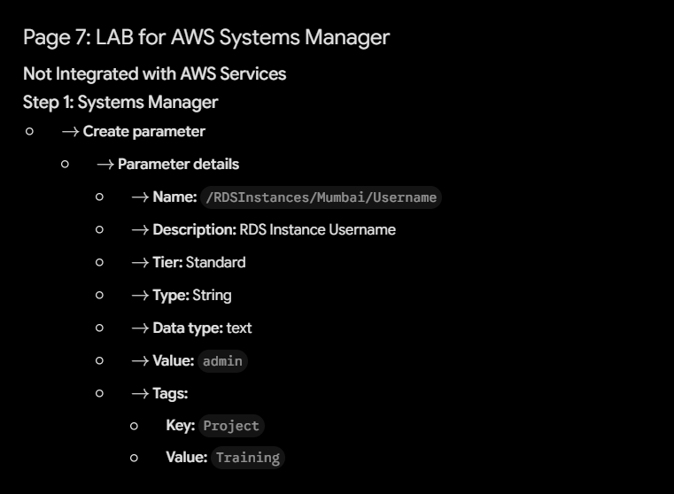


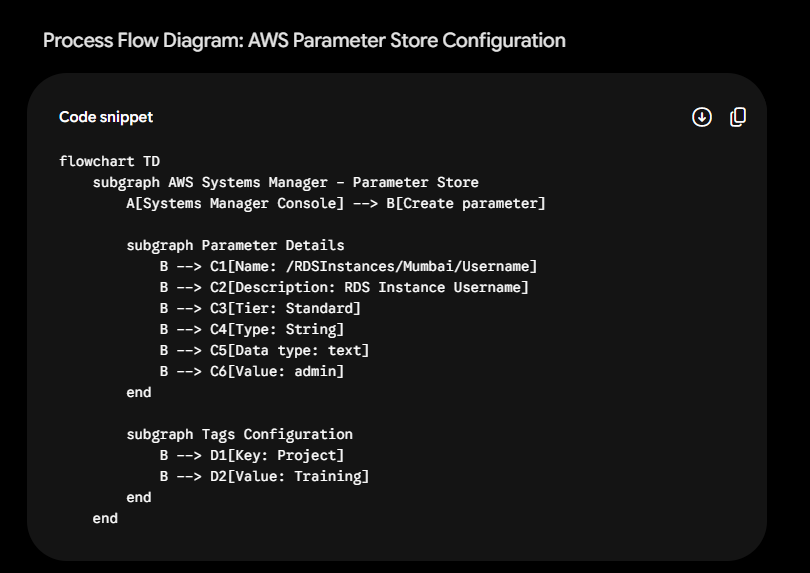


---

## Page 7: LAB for AWS Systems Manager

### Not Integrated with AWS Services

#### Step 1: Systems Manager

* $\rightarrow$ **Create parameter**
* $\rightarrow$ **Parameter details**
* $\rightarrow$ **Name:** `/RDSInstances/Mumbai/Username`
* $\rightarrow$ **Description:** RDS Instance Username
* $\rightarrow$ **Tier:** Standard
* $\rightarrow$ **Type:** String
* $\rightarrow$ **Data type:** text
* $\rightarrow$ **Value:** `admin`
* $\rightarrow$ **Tags:**
* **Key:** `Project`
* **Value:** `Training`


---

### Process Flow Diagram: AWS Parameter Store Configuration

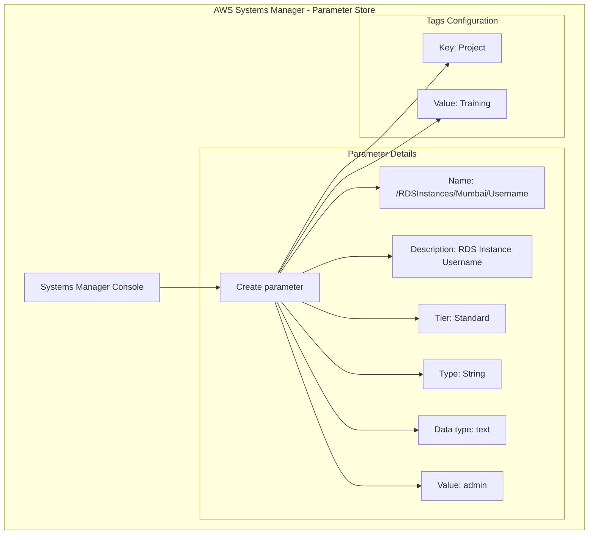
```mermaid
flowchart TD
    subgraph AWS Systems Manager - Parameter Store
        A[Systems Manager Console] --> B[Create parameter]
        
        subgraph Parameter Details
            B --> C1[Name: /RDSInstances/Mumbai/Username]
            B --> C2[Description: RDS Instance Username]
            B --> C3[Tier: Standard]
            B --> C4[Type: String]
            B --> C5[Data type: text]
            B --> C6[Value: admin]
        end
        
        subgraph Tags Configuration
            B --> D1[Key: Project]
            B --> D2[Value: Training]
        end
    end

```

---------xxxxxxxxxxxxxx----------------


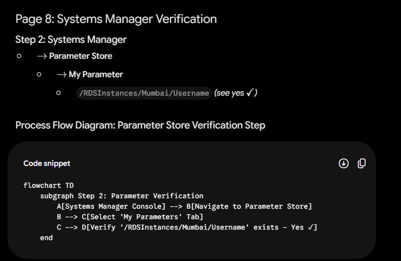


---

## Page 8: Systems Manager Verification

### Step 2: Systems Manager

* $\rightarrow$ **Parameter Store**
* $\rightarrow$ **My Parameter**
* `/RDSInstances/Mumbai/Username` *(see yes $\checkmark$)*


---

### Process Flow Diagram: Parameter Store Verification Step

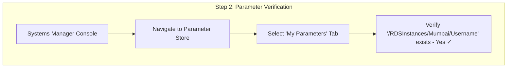
```mermaid
flowchart TD
    subgraph Step 2: Parameter Verification
        A[Systems Manager Console] --> B[Navigate to Parameter Store]
        B --> C[Select 'My Parameters' Tab]
        C --> D[Verify '/RDSInstances/Mumbai/Username' exists - Yes ✓]
    end

```


---

## 2. AWS Systems Manager (Parameter Store) Lab

### Objectives

* Store non-sensitive or plain-text configuration data (such as database usernames, environment parameters, and project tags) outside application code.
* Organize parameters logically using hierarchical naming structures (e.g., `/RDSInstances/Mumbai/Username`).

### Key Takeaways

* **Hierarchical Naming:** Organizing parameters with forward slashes (`/`) makes path-based access control and retrieval straightforward.
* **Difference from Secrets Manager:** Parameter Store is ideal for standard configuration settings and basic parameters, while Secrets Manager is designed for sensitive credentials that require automatic rotation and advanced security features.

---


----------xxxxxxxxxxx-----------


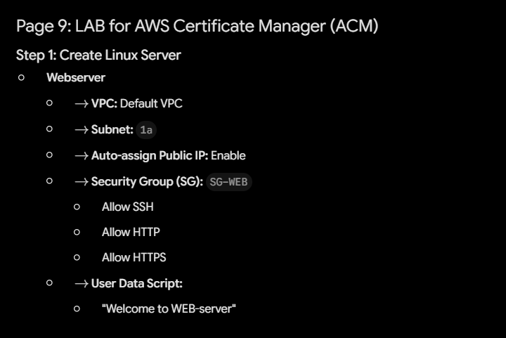


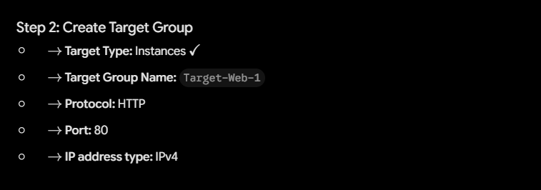


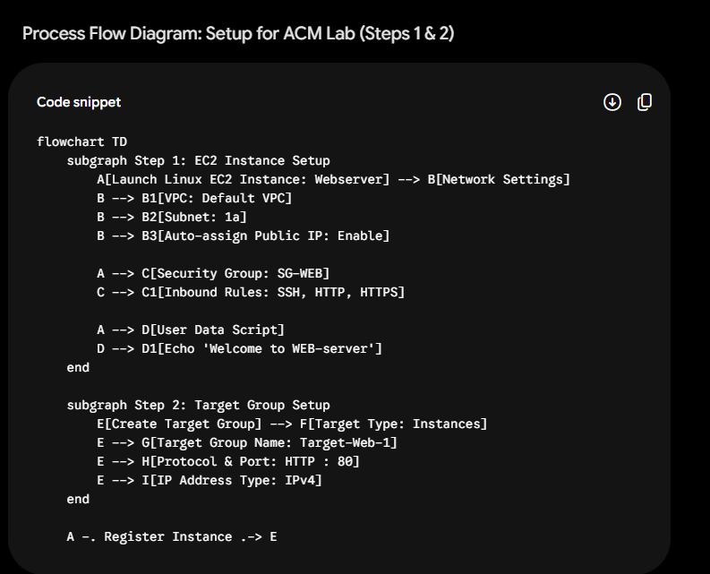

---

## Page 9: LAB for AWS Certificate Manager (ACM)

### Step 1: Create Linux Server

* **Webserver**
* $\rightarrow$ **VPC:** Default VPC
* $\rightarrow$ **Subnet:** `1a`
* $\rightarrow$ **Auto-assign Public IP:** Enable
* $\rightarrow$ **Security Group (SG):** `SG-WEB`
* Allow SSH
* Allow HTTP
* Allow HTTPS


* $\rightarrow$ **User Data Script:**
* "Welcome to WEB-server"


---

### Step 2: Create Target Group

* $\rightarrow$ **Target Type:** Instances $\checkmark$
* $\rightarrow$ **Target Group Name:** `Target-Web-1`
* $\rightarrow$ **Protocol:** HTTP
* $\rightarrow$ **Port:** 80
* $\rightarrow$ **IP address type:** IPv4

---

### Process Flow Diagram: Setup for ACM Lab (Steps 1 & 2)

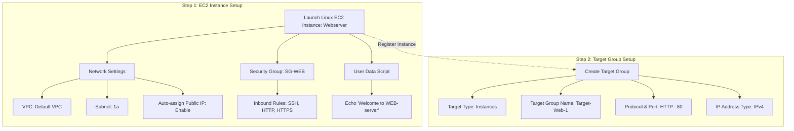
```mermaid
flowchart TD
    subgraph Step 1: EC2 Instance Setup
        A[Launch Linux EC2 Instance: Webserver] --> B[Network Settings]
        B --> B1[VPC: Default VPC]
        B --> B2[Subnet: 1a]
        B --> B3[Auto-assign Public IP: Enable]
        
        A --> C[Security Group: SG-WEB]
        C --> C1[Inbound Rules: SSH, HTTP, HTTPS]
        
        A --> D[User Data Script]
        D --> D1[Echo 'Welcome to WEB-server']
    end

    subgraph Step 2: Target Group Setup
        E[Create Target Group] --> F[Target Type: Instances]
        E --> G[Target Group Name: Target-Web-1]
        E --> H[Protocol & Port: HTTP : 80]
        E --> I[IP Address Type: IPv4]
    end

    A -. Register Instance .-> E

```


------------xxxxxxxxxx----------------


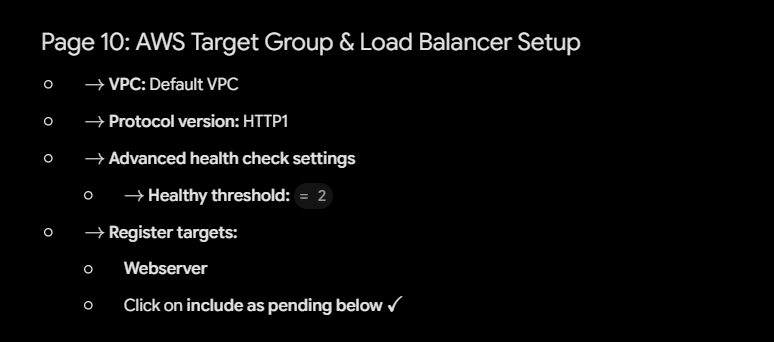


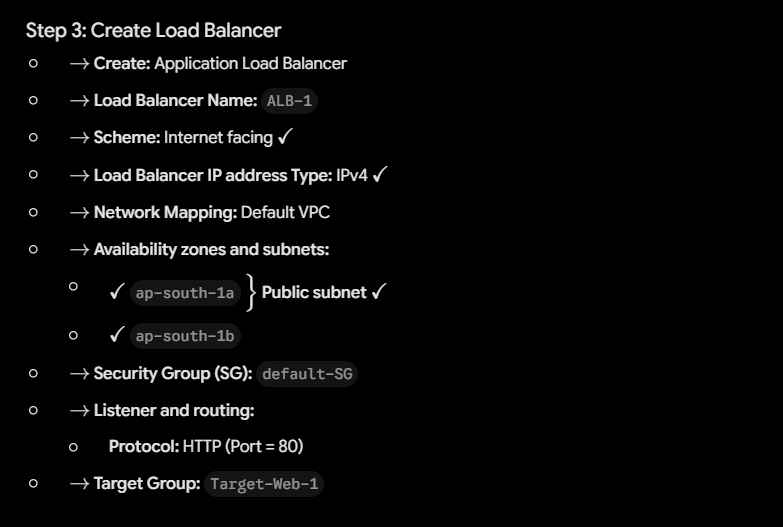


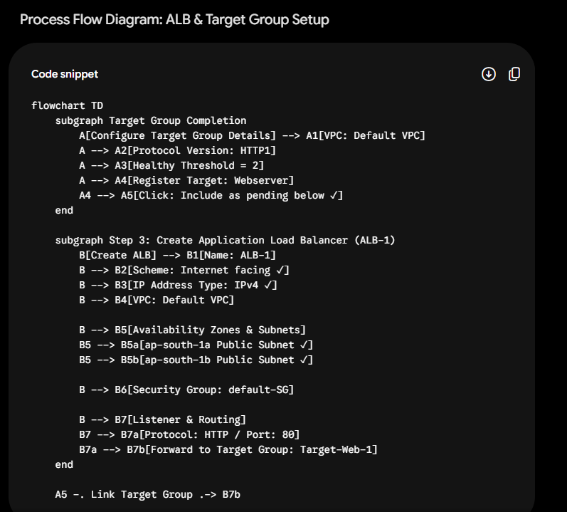


---

## Page 10: AWS Target Group & Load Balancer Setup

* $\rightarrow$ **VPC:** Default VPC
* $\rightarrow$ **Protocol version:** HTTP1
* $\rightarrow$ **Advanced health check settings**
* $\rightarrow$ **Healthy threshold:** `= 2`


* $\rightarrow$ **Register targets:**
* **Webserver**
* Click on **include as pending below** $\checkmark$


---

### Step 3: Create Load Balancer

* $\rightarrow$ **Create:** Application Load Balancer
* $\rightarrow$ **Load Balancer Name:** `ALB-1`
* $\rightarrow$ **Scheme:** Internet facing $\checkmark$
* $\rightarrow$ **Load Balancer IP address Type:** IPv4 $\checkmark$
* $\rightarrow$ **Network Mapping:** Default VPC
* $\rightarrow$ **Availability zones and subnets:**
* $\checkmark$ `ap-south-1a` $\Big\}$ **Public subnet** $\checkmark$
* $\checkmark$ `ap-south-1b`


* $\rightarrow$ **Security Group (SG):** `default-SG`
* $\rightarrow$ **Listener and routing:**
* **Protocol:** HTTP (Port = 80)


* $\rightarrow$ **Target Group:** `Target-Web-1`

---

### Process Flow Diagram: ALB & Target Group Setup

```mermaid
flowchart TD
    subgraph Target Group Completion
        A[Configure Target Group Details] --> A1[VPC: Default VPC]
        A --> A2[Protocol Version: HTTP1]
        A --> A3[Healthy Threshold = 2]
        A --> A4[Register Target: Webserver]
        A4 --> A5[Click: Include as pending below ✓]
    end

    subgraph Step 3: Create Application Load Balancer (ALB-1)
        B[Create ALB] --> B1[Name: ALB-1]
        B --> B2[Scheme: Internet facing ✓]
        B --> B3[IP Address Type: IPv4 ✓]
        B --> B4[VPC: Default VPC]
        
        B --> B5[Availability Zones & Subnets]
        B5 --> B5a[ap-south-1a Public Subnet ✓]
        B5 --> B5b[ap-south-1b Public Subnet ✓]
        
        B --> B6[Security Group: default-SG]
        
        B --> B7[Listener & Routing]
        B7 --> B7a[Protocol: HTTP / Port: 80]
        B7a --> B7b[Forward to Target Group: Target-Web-1]
    end

    A5 -. Link Target Group .-> B7b

```


-----------xxxxxxxxxxxxx---------------


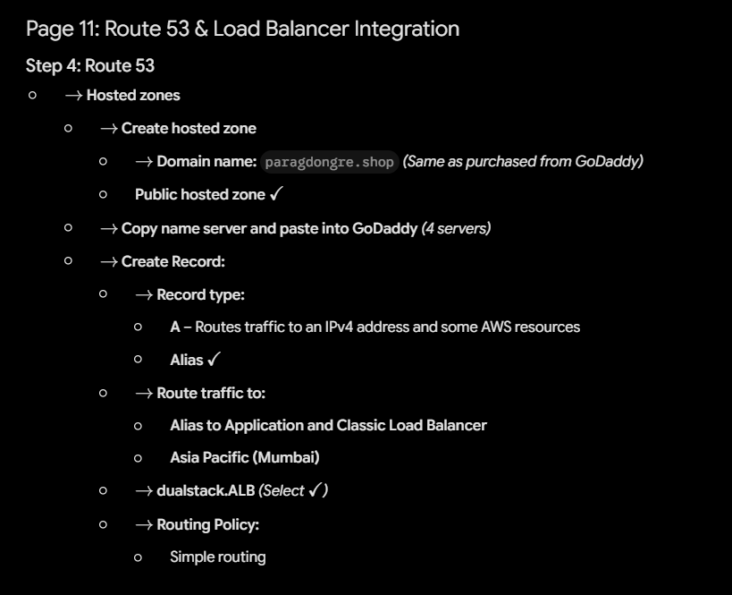


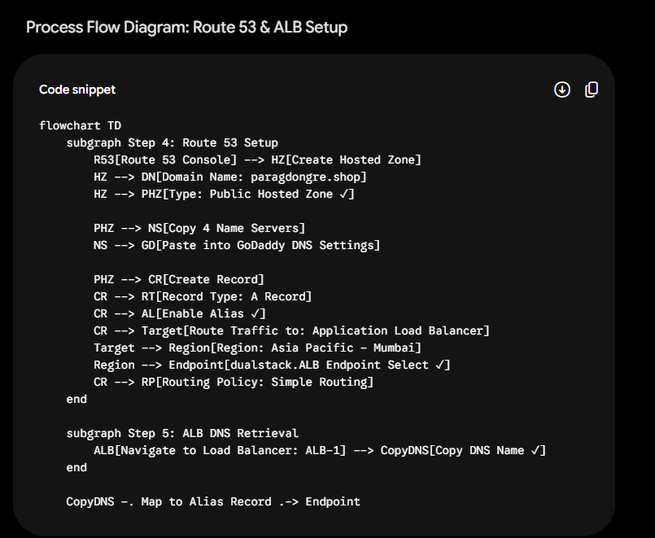


---

## Page 11: Route 53 & Load Balancer Integration

### Step 4: Route 53

* $\rightarrow$ **Hosted zones**
* $\rightarrow$ **Create hosted zone**
* $\rightarrow$ **Domain name:** `paragdongre.shop` *(Same as purchased from GoDaddy)*
* **Public hosted zone** $\checkmark$


* $\rightarrow$ **Copy name server and paste into GoDaddy** *(4 servers)*
* $\rightarrow$ **Create Record:**
* $\rightarrow$ **Record type:**
* **A** – Routes traffic to an IPv4 address and some AWS resources
* **Alias** $\checkmark$


* $\rightarrow$ **Route traffic to:**
* **Alias to Application and Classic Load Balancer**
* **Asia Pacific (Mumbai)**


* $\rightarrow$ **dualstack.ALB** *(Select $\checkmark$)*
* $\rightarrow$ **Routing Policy:**
* Simple routing


---

### Step 5: Load Balancer

* $\rightarrow$ **ALB-1**
* **DNS name:** *(Copy $\checkmark$)*


---

### Process Flow Diagram: Route 53 & ALB Setup

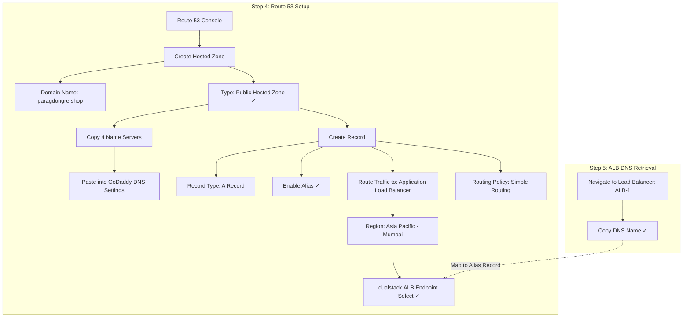
```mermaid
flowchart TD
    subgraph Step 4: Route 53 Setup
        R53[Route 53 Console] --> HZ[Create Hosted Zone]
        HZ --> DN[Domain Name: paragdongre.shop]
        HZ --> PHZ[Type: Public Hosted Zone ✓]
        
        PHZ --> NS[Copy 4 Name Servers]
        NS --> GD[Paste into GoDaddy DNS Settings]
        
        PHZ --> CR[Create Record]
        CR --> RT[Record Type: A Record]
        CR --> AL[Enable Alias ✓]
        CR --> Target[Route Traffic to: Application Load Balancer]
        Target --> Region[Region: Asia Pacific - Mumbai]
        Region --> Endpoint[dualstack.ALB Endpoint Select ✓]
        CR --> RP[Routing Policy: Simple Routing]
    end

    subgraph Step 5: ALB DNS Retrieval
        ALB[Navigate to Load Balancer: ALB-1] --> CopyDNS[Copy DNS Name ✓]
    end

    CopyDNS -. Map to Alias Record .-> Endpoint

```

--------xxxxxxxxxxx---------------


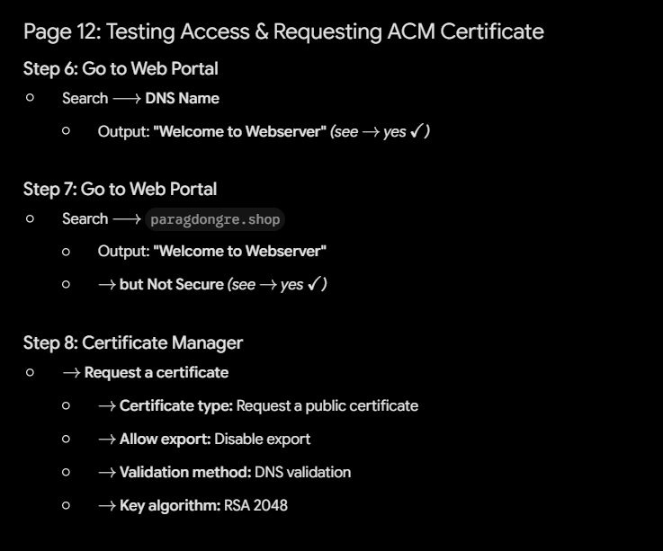


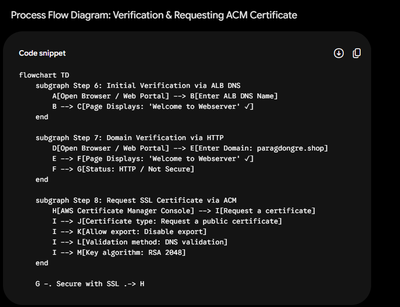

---

## Page 12: Testing Access & Requesting ACM Certificate

### Step 6: Go to Web Portal

* Search $\longrightarrow$ **DNS Name**
* Output: **"Welcome to Webserver"** *(see $\rightarrow$ yes $\checkmark$)*


---

### Step 7: Go to Web Portal

* Search $\longrightarrow$ `paragdongre.shop`
* Output: **"Welcome to Webserver"**
* $\rightarrow$ **but Not Secure** *(see $\rightarrow$ yes $\checkmark$)*


---

### Step 8: Certificate Manager

* $\rightarrow$ **Request a certificate**
* $\rightarrow$ **Certificate type:** Request a public certificate
* $\rightarrow$ **Allow export:** Disable export
* $\rightarrow$ **Validation method:** DNS validation
* $\rightarrow$ **Key algorithm:** RSA 2048


---

### Process Flow Diagram: Verification & Requesting ACM Certificate

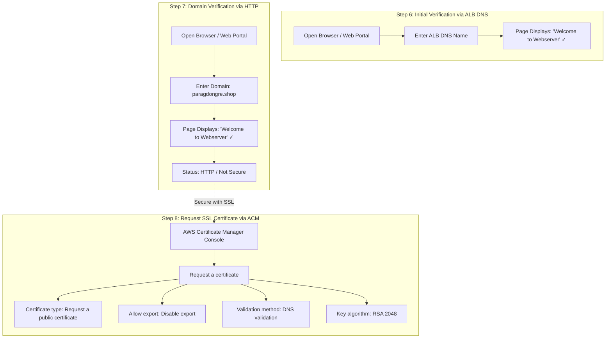
```mermaid
flowchart TD
    subgraph Step 6: Initial Verification via ALB DNS
        A[Open Browser / Web Portal] --> B[Enter ALB DNS Name]
        B --> C[Page Displays: 'Welcome to Webserver' ✓]
    end

    subgraph Step 7: Domain Verification via HTTP
        D[Open Browser / Web Portal] --> E[Enter Domain: paragdongre.shop]
        E --> F[Page Displays: 'Welcome to Webserver' ✓]
        F --> G[Status: HTTP / Not Secure]
    end

    subgraph Step 8: Request SSL Certificate via ACM
        H[AWS Certificate Manager Console] --> I[Request a certificate]
        I --> J[Certificate type: Request a public certificate]
        I --> K[Allow export: Disable export]
        I --> L[Validation method: DNS validation]
        I --> M[Key algorithm: RSA 2048]
    end

    G -. Secure with SSL .-> H

```

----------xxxxxxxxxxxxx--------------


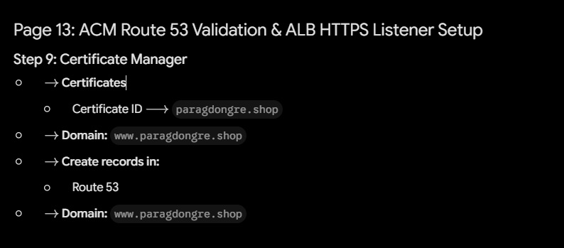


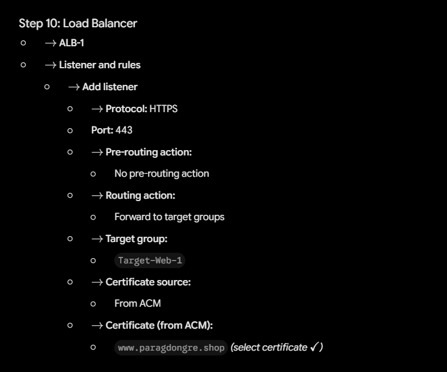


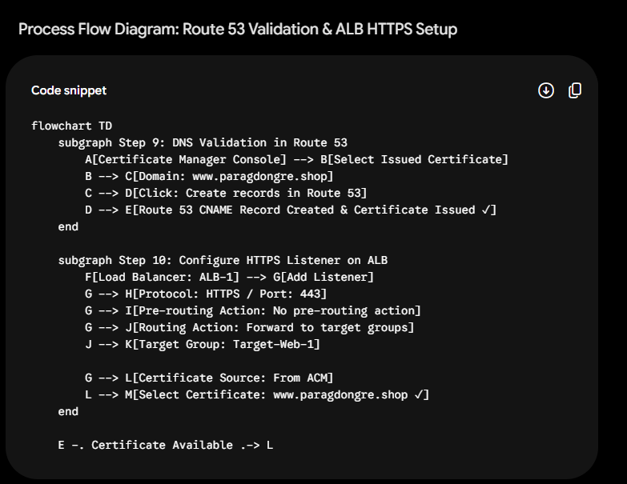


---

## Page 13: ACM Route 53 Validation & ALB HTTPS Listener Setup

### Step 9: Certificate Manager

* $\rightarrow$ **Certificates**
* Certificate ID $\longrightarrow$ `paragdongre.shop`


* $\rightarrow$ **Domain:** `www.paragdongre.shop`
* $\rightarrow$ **Create records in:**
* Route 53


* $\rightarrow$ **Domain:** `www.paragdongre.shop`

---

### Step 10: Load Balancer

* $\rightarrow$ **ALB-1**
* $\rightarrow$ **Listener and rules**
* $\rightarrow$ **Add listener**
* $\rightarrow$ **Protocol:** HTTPS
* **Port:** 443
* $\rightarrow$ **Pre-routing action:**
* No pre-routing action


* $\rightarrow$ **Routing action:**
* Forward to target groups


* $\rightarrow$ **Target group:**
* `Target-Web-1`


* $\rightarrow$ **Certificate source:**
* From ACM


* $\rightarrow$ **Certificate (from ACM):**
* `www.paragdongre.shop` *(select certificate $\checkmark$)*


---

### Process Flow Diagram: Route 53 Validation & ALB HTTPS Setup

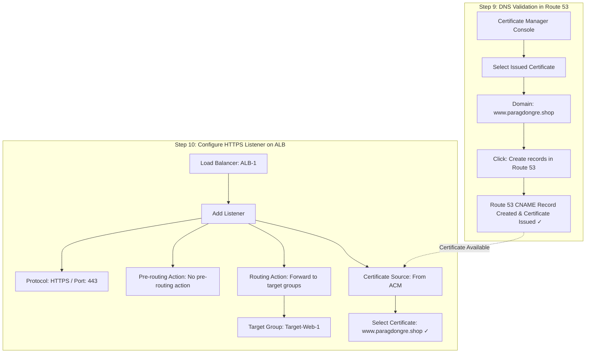
```mermaid
flowchart TD
    subgraph Step 9: DNS Validation in Route 53
        A[Certificate Manager Console] --> B[Select Issued Certificate]
        B --> C[Domain: www.paragdongre.shop]
        C --> D[Click: Create records in Route 53]
        D --> E[Route 53 CNAME Record Created & Certificate 
        Issued ✓]
    end

    subgraph Step 10: Configure HTTPS Listener on ALB
        F[Load Balancer: ALB-1] --> G[Add Listener]
        G --> H[Protocol: HTTPS / Port: 443]
        G --> I[Pre-routing Action: No pre-routing action]
        G --> J[Routing Action: Forward to target groups]
        J --> K[Target Group: Target-Web-1]
        
        G --> L[Certificate Source: From ACM]
        L --> M[Select Certificate: www.paragdongre.shop ✓]
    end

    E -. Certificate Available .-> L

```


---------xxxxxxxxxxxxxx----------------


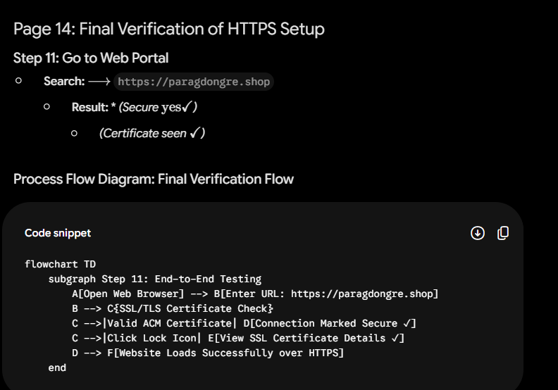


---

## Page 14: Final Verification of HTTPS Setup

### Step 11: Go to Web Portal

* **Search:** $\longrightarrow$ `https://paragdongre.shop`
* **Result:** * *(Secure $\text{yes}\checkmark$)*
* *(Certificate seen $\checkmark$)*


---

### Process Flow Diagram: Final Verification Flow

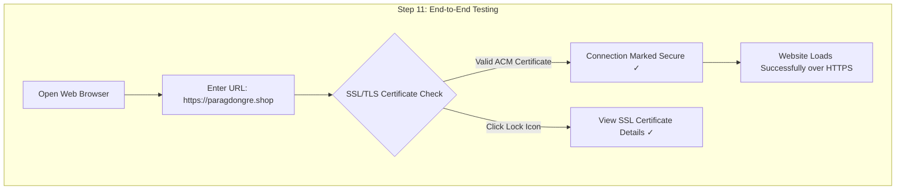
```mermaid
flowchart TD
    subgraph Step 11: End-to-End Testing
        A[Open Web Browser] --> B[Enter URL: https://paragdongre.shop]
        B --> C{SSL/TLS Certificate Check}
        C -->|Valid ACM Certificate| D[Connection Marked Secure ✓]
        C -->|Click Lock Icon| E[View SSL Certificate Details ✓]
        D --> F[Website Loads Successfully over HTTPS]
    end

```

---
```

## 3. AWS Certificate Manager (ACM) & Route 53 SSL/TLS Lab

### Objectives

* Secure web traffic by transitioning a website from unencrypted HTTP to encrypted HTTPS.
* Provision a free public SSL/TLS certificate using AWS Certificate Manager (ACM).
* Validate domain ownership via Route 53 DNS records.
* Bind the SSL certificate to an Application Load Balancer (ALB) on HTTPS port 443.

### Key Takeaways

* **Domain Validation:** ACM validates domain control automatically by inserting a CNAME record into Route 53 Hosted Zones.
* **ALB Listeners:** Traffic coming via port 80 (HTTP) can be secured by attaching an HTTPS (port 443) listener configured with the ACM certificate.
* **End-to-End Traffic Flow:**

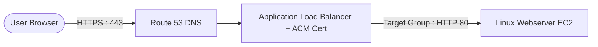
```mermaid
flowchart LR
    User([User Browser]) -- HTTPS : 443 --> R53[Route 53 DNS]
    R53 --> ALB[Application Load Balancer + ACM Cert]
    ALB -- Target Group : HTTP 80 --> EC2[Linux Webserver EC2]


```
---
-----------xxxxxxxxxxx---------------


---

## 🧹 Post-Lab Cleanup Guide

To prevent unnecessary charges on your AWS account, follow these steps in order to delete all created resources:

### Step 1: Route 53 & Domain Records

1. Go to **Route 53** $\rightarrow$ **Hosted Zones** $\rightarrow$ Select `paragdongre.shop`.
2. Delete the **A Record** (Alias pointing to ALB) and the **CNAME Record** (created for ACM validation).
3. *(Optional)* Delete the Hosted Zone if you no longer need DNS management for this domain.

### Step 2: AWS Certificate Manager (ACM)

1. Go to **ACM** $\rightarrow$ **Certificates**.
2. Select the certificate for `www.paragdongre.shop`.
3. Click **Actions** $\rightarrow$ **Delete**.

### Step 3: Application Load Balancer & Target Group

1. Go to **EC2** $\rightarrow$ **Load Balancers**.
2. Select `ALB-1` $\rightarrow$ Click **Actions** $\rightarrow$ **Delete**.
3. Go to **Target Groups**.
4. Select `Target-Web-1` $\rightarrow$ Click **Actions** $\rightarrow$ **Delete**.

### Step 4: EC2 Instance

1. Go to **EC2** $\rightarrow$ **Instances**.
2. Select the `Webserver` instance.
3. Click **Instance State** $\rightarrow$ **Terminate instance**.

### Step 5: Amazon RDS Instance

1. Go to **RDS** $\rightarrow$ **Databases**.
2. Select `Tech-DB-server`.
3. Click **Actions** $\rightarrow$ **Delete**.
4. Uncheck *"Create final snapshot"* and check *"I acknowledge..."*, then confirm deletion.

### Step 6: Secrets Manager & Systems Manager Parameter Store

1. Go to **Secrets Manager** $\rightarrow$ **Secrets**.
2. Select `ProdServer/Credentials` (and any RDS-managed secrets) $\rightarrow$ **Actions** $\rightarrow$ **Delete secret** (set retention period to 7 days or force delete if enabled).
3. Go to **Systems Manager** $\rightarrow$ **Parameter Store**.
4. Select `/RDSInstances/Mumbai/Username` $\rightarrow$ Click **Delete**.

---

-------xxxxxxxx-----------


---

# Lab Objective

By completing this lab, you will learn how to:

* Understand Symmetric and Asymmetric Encryption.
* Secure sensitive information using AWS Secrets Manager.
* Store configuration values using AWS Systems Manager Parameter Store.
* Create and manage SSL/TLS certificates using AWS Certificate Manager (ACM).
* Configure Route 53 DNS records.
* Secure a website using HTTPS through an Application Load Balancer (ALB).
* Verify encrypted communication between users and AWS-hosted applications.  

---

# Beginner-Level Lab Steps

## Part 1 – Understand Encryption

### Step 1: Learn Encryption Types

* Study Symmetric Encryption.
* Study Asymmetric Encryption.
* Understand Public Key and Private Key concepts.
* Understand how HTTPS secures data during transit.  

---

## Part 2 – AWS Secrets Manager Lab

### Step 2: Create an RDS Database

* Open RDS Console.
* Create MySQL database.
* Choose Standard Create.
* Set Master Username: `admin`.
* Select **Managed in AWS Secrets Manager**.
* Create database. 

### Step 3: Verify Secret Creation

* Open Secrets Manager.
* Open Secrets.
* Confirm secret was automatically created. 

### Step 4: Create Manual Secret

* Open Secrets Manager.
* Store a new secret.
* Select Other Type of Secret.
* Add Key-Value pairs.
* Create secret named:
  `ProdServer/Credentials`
* Save secret. 

### Step 5: Verify Secret

* Open Secrets Manager.
* Confirm secret exists. 

---

## Part 3 – Systems Manager Parameter Store

### Step 6: Create Parameter

* Open Systems Manager.
* Open Parameter Store.
* Create Parameter.
* Name:
  `/RDSInstances/Mumbai/Username`
* Type:
  `String`
* Value:
  `admin`
* Save parameter. 

### Step 7: Verify Parameter

* Open Parameter Store.
* Select My Parameters.
* Confirm parameter exists. 

---

## Part 4 – AWS Certificate Manager (ACM) Lab

### Step 8: Create Web Server

* Launch Linux EC2 Instance.
* Enable Public IP.
* Allow:

  * SSH (22)
  * HTTP (80)
  * HTTPS (443)
* Deploy simple webpage. 

### Step 9: Create Target Group

* Target Type: Instances
* Name: Target-Web-1
* Protocol: HTTP
* Port: 80
* Register EC2 Instance.  

### Step 10: Create Application Load Balancer

* Create ALB.
* Internet Facing.
* Select Public Subnets.
* Attach Target Group.
* Create Load Balancer. 

### Step 11: Configure Route 53

* Create Hosted Zone.
* Add Domain Name.
* Create Alias A Record.
* Point record to ALB. 

### Step 12: Test Website

* Open ALB DNS Name.
* Verify webpage loads successfully.
* Open domain name.
* Observe site is accessible but not secure yet. 

### Step 13: Request ACM Certificate

* Open Certificate Manager.
* Request Public Certificate.
* Choose DNS Validation.
* Use RSA 2048.
* Submit request. 

### Step 14: Validate Certificate

* Open ACM.
* Create Route 53 validation records.
* Wait until certificate status becomes Issued. 

### Step 15: Configure HTTPS Listener

* Open ALB.
* Add Listener.
* Protocol: HTTPS
* Port: 443
* Select ACM Certificate.
* Forward traffic to Target-Web-1. 

### Step 16: Final Verification

* Open:
  `https://your-domain-name`
* Verify secure padlock appears.
* Verify SSL certificate is attached successfully. 

---

# Real-World Scenario

### Problem

A company hosts its website on AWS. Customers enter login credentials, personal details, and payment information. If traffic uses HTTP, attackers can intercept and read sensitive data.

### Solution Using This Lab

* ACM provides SSL/TLS certificates.
* Route 53 manages domain records.
* ALB handles HTTPS traffic.
* Secrets Manager securely stores passwords and API keys.
* Parameter Store stores application configuration values.
* Encryption protects data in transit and at rest.

Result:

✅ Secure website access
✅ Encrypted communication
✅ Secure credential storage
✅ Improved customer trust
✅ Compliance with security best practices

---

# Key Takeaways

* Symmetric encryption uses one key for encryption and decryption.
* Asymmetric encryption uses Public and Private Keys.
* HTTPS protects data while travelling over the internet.
* Secrets Manager securely stores sensitive credentials.
* Parameter Store stores configuration values.
* ACM provides free SSL/TLS certificates.
* Route 53 integrates with ACM for DNS validation.
* ALB can terminate HTTPS traffic using ACM certificates.
* Secure websites increase trust and improve security.  

---

# Post-Lab Cleanup

### 1. Route 53

* Delete Alias A Record.
* Delete ACM Validation CNAME Record.
* Delete Hosted Zone (if not required). 

### 2. ACM

* Delete SSL Certificate. 

### 3. Load Balancer Resources

* Delete ALB-1.
* Delete Target-Web-1. 

### 4. EC2

* Terminate Webserver Instance. 

### 5. RDS

* Delete Tech-DB-server.
* Remove final snapshot if not required. 

### 6. Secrets Manager

* Delete:

  * ProdServer/Credentials
  * RDS-managed secrets. 

### 7. Parameter Store

* Delete:

  * `/RDSInstances/Mumbai/Username` 

### Final Check

* Ensure no EC2, RDS, ALB, ACM, Route 53, Secrets Manager, or Parameter Store resources remain running to avoid AWS charges. 
