---
#### Class 7
## 🎯 Lab Objectives

1. **AWS S3 CORS (Cross-Origin Resource Sharing):**
* Understand how to enable secure client-side cross-origin access to S3 resources from authorized domains while blocking unauthorized origins.

2. **AWS S3 Object Lock & Compliance:**
* Configure Write-Once-Read-Many (WORM) models using S3 Object Lock in Governance and Compliance modes to prevent object deletion or overwriting during defined retention periods.

3. **AWS S3 Storage Classes & Lifecycle Rules:**
* Learn how to manually modify object storage tiers and automate data lifecycle management (moving objects from Standard to Standard-IA and One Zone-IA) based on access frequency to optimize storage costs.

---

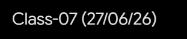

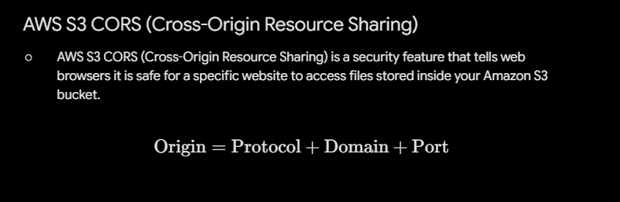

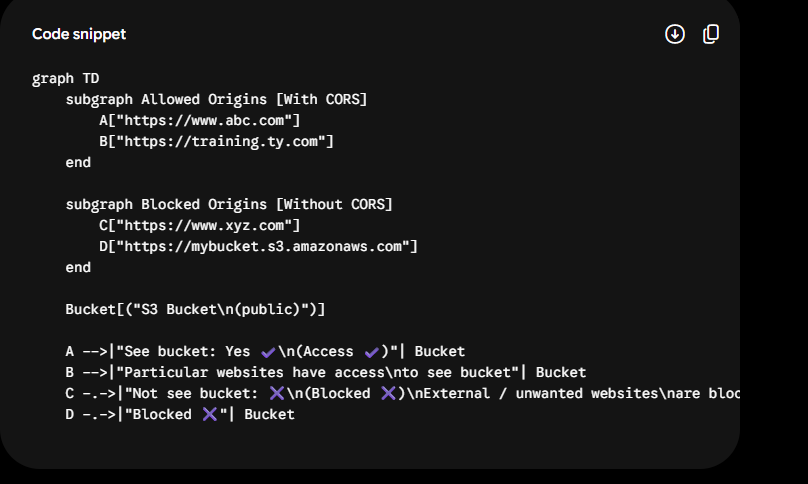

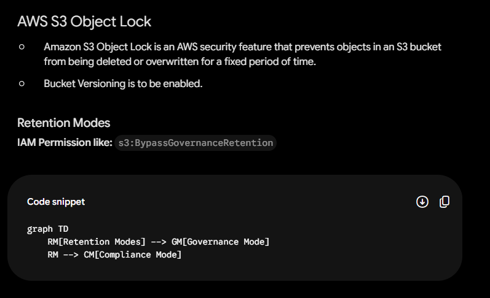

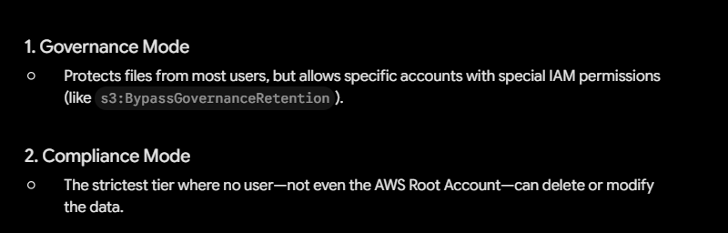

---

# Class-07 (27/06/26)

## AWS S3 CORS (Cross-Origin Resource Sharing)

* AWS S3 CORS (Cross-Origin Resource Sharing) is a security feature that tells web browsers it is safe for a specific website to access files stored inside your Amazon S3 bucket.

$$\text{Origin} = \text{Protocol} + \text{Domain} + \text{Port}$$

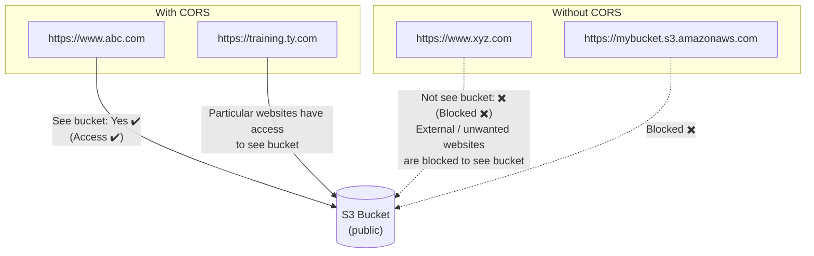
```mermaid
graph TD
    subgraph Allowed Origins [With CORS]
        A["https://www.abc.com"]
        B["https://training.ty.com"]
    end

    subgraph Blocked Origins [Without CORS]
        C["https://www.xyz.com"]
        D["https://mybucket.s3.amazonaws.com"]
    end

    Bucket[("S3 Bucket\n(public)")]

    A -->|"See bucket: Yes ✔️\n(Access ✔️)"| Bucket
    B -->|"Particular websites have access\nto see bucket"| Bucket
    C -.->|"Not see bucket: ✖️\n(Blocked ✖️)\nExternal / unwanted websites\nare blocked to see bucket"| Bucket
    D -.->|"Blocked ✖️"| Bucket

```

---

## AWS S3 Object Lock

* Amazon S3 Object Lock is an AWS security feature that prevents objects in an S3 bucket from being deleted or overwritten for a fixed period of time.
* Bucket Versioning is to be enabled.

### Retention Modes

> **IAM Permission like:** `s3:BypassGovernanceRetention`

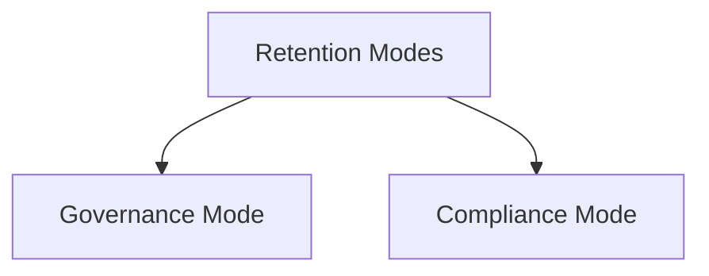
```mermaid
graph TD
    RM[Retention Modes] --> GM[Governance Mode]
    RM --> CM[Compliance Mode]

```

### 1. Governance Mode

* Protects files from most users, but allows specific accounts with special IAM permissions (like `s3:BypassGovernanceRetention`).

### 2. Compliance Mode

* The strictest tier where no user—not even the AWS Root Account—can delete or modify the data.

----------xxxxxxxxxxx-------------

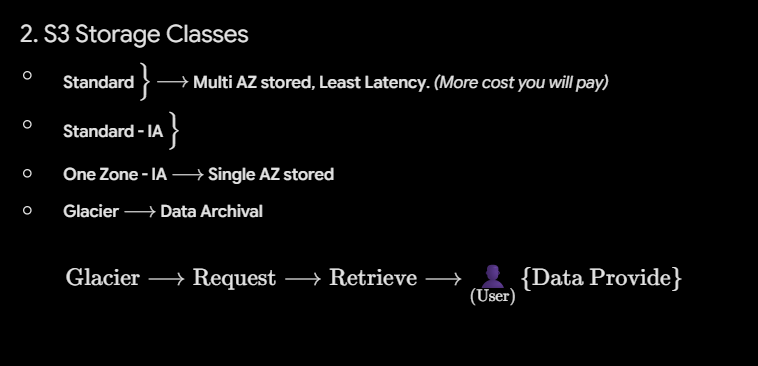

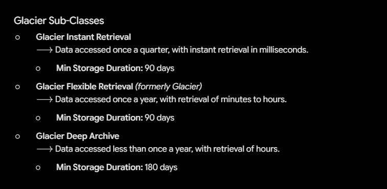

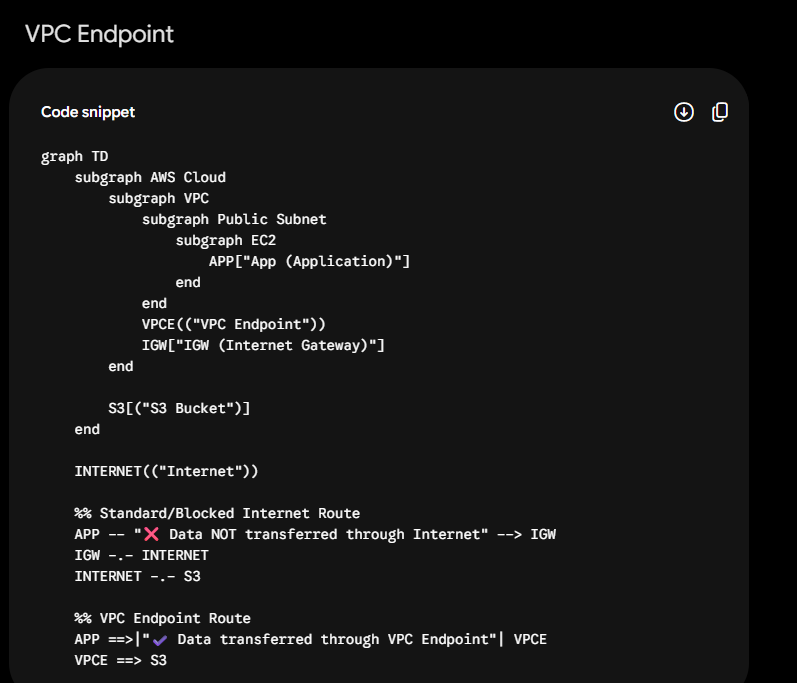

---

## 2. S3 Storage Classes

* **Standard** $\Big\}$ $\longrightarrow$ **Multi AZ stored**, **Least Latency**. *(More cost you will pay)*
* **Standard - IA** $\Big\}$
* **One Zone - IA** $\longrightarrow$ **Single AZ stored**
* **Glacier** $\longrightarrow$ **Data Archival**

$$\text{Glacier} \longrightarrow \text{Request} \longrightarrow \text{Retrieve} \longrightarrow \underset{\text{(User)}}{\text{👤}} \left\{ \text{Data Provide} \right\}$$

---

### Glacier Sub-Classes

* **Glacier Instant Retrieval**
$\longrightarrow$ Data accessed once a quarter, with instant retrieval in milliseconds.
* **Min Storage Duration:** 90 days

* **Glacier Flexible Retrieval** *(formerly Glacier)*
$\longrightarrow$ Data accessed once a year, with retrieval of minutes to hours.
* **Min Storage Duration:** 90 days

* **Glacier Deep Archive**
$\longrightarrow$ Data accessed less than once a year, with retrieval of hours.
* **Min Storage Duration:** 180 days

---

## VPC Endpoint

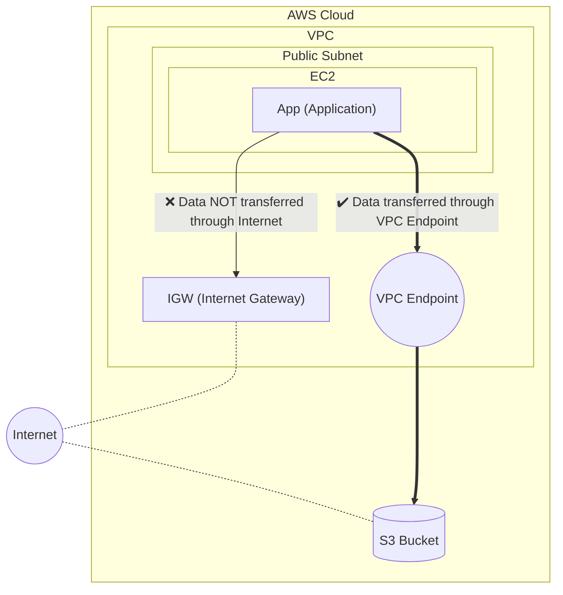
```mermaid
graph TD
    subgraph AWS Cloud
        subgraph VPC
            subgraph Public Subnet
                subgraph EC2
                    APP["App (Application)"]
                end
            end
            VPCE(("VPC Endpoint"))
            IGW["IGW (Internet Gateway)"]
        end

        S3[("S3 Bucket")]
    end

    INTERNET(("Internet"))

    %% Standard/Blocked Internet Route
    APP -- "❌ Data NOT transferred through Internet" --> IGW
    IGW -.- INTERNET
    INTERNET -.- S3

    %% VPC Endpoint Route
    APP ==>|"✔️ Data transferred through VPC Endpoint"| VPCE
    VPCE ==> S3

```

------------xxxxxxxxxxx-------------

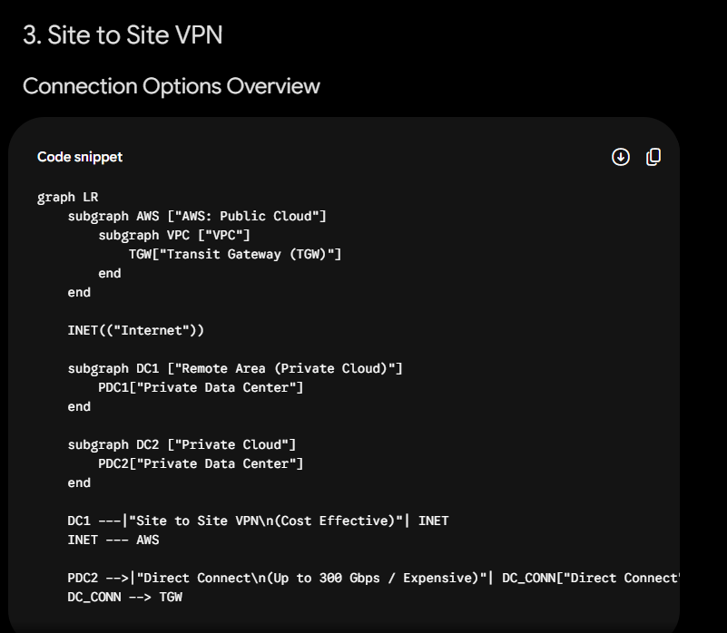

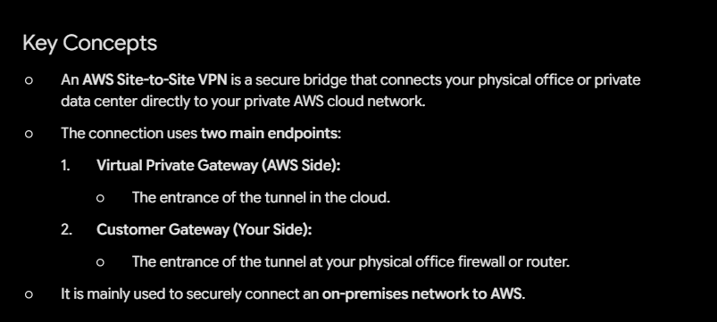

---

# 3. Site to Site VPN

## Connection Options Overview

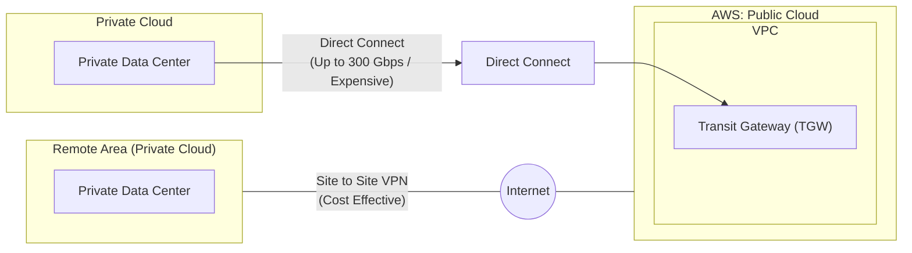
```mermaid
graph LR
    subgraph AWS ["AWS: Public Cloud"]
        subgraph VPC ["VPC"]
            TGW["Transit Gateway (TGW)"]
        end
    end

    INET(("Internet"))

    subgraph DC1 ["Remote Area (Private Cloud)"]
        PDC1["Private Data Center"]
    end

    subgraph DC2 ["Private Cloud"]
        PDC2["Private Data Center"]
    end

    DC1 ---|"Site to Site VPN\n(Cost Effective)"| INET
    INET --- AWS

    PDC2 -->|"Direct Connect\n(Up to 300 Gbps / Expensive)"| DC_CONN["Direct Connect"]
    DC_CONN --> TGW

```

---

## Key Concepts

* An **AWS Site-to-Site VPN** is a secure bridge that connects your physical office or private data center directly to your private AWS cloud network.
* The connection uses **two main endpoints**:
1. **Virtual Private Gateway (AWS Side):**
* The entrance of the tunnel in the cloud.

2. **Customer Gateway (Your Side):**
* The entrance of the tunnel at your physical office firewall or router.

* It is mainly used to securely connect an **on-premises network to AWS**.

-----------xxxxxxxxxxxxx-------------

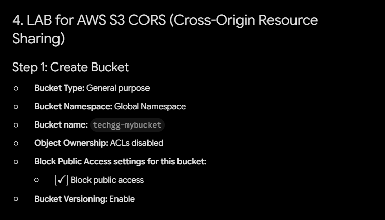

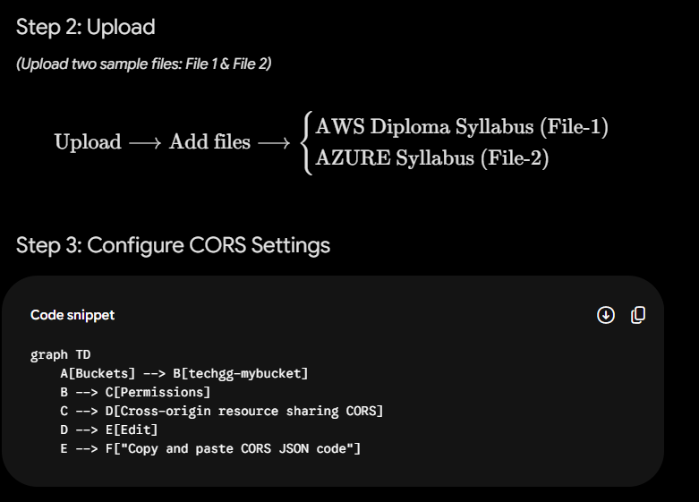

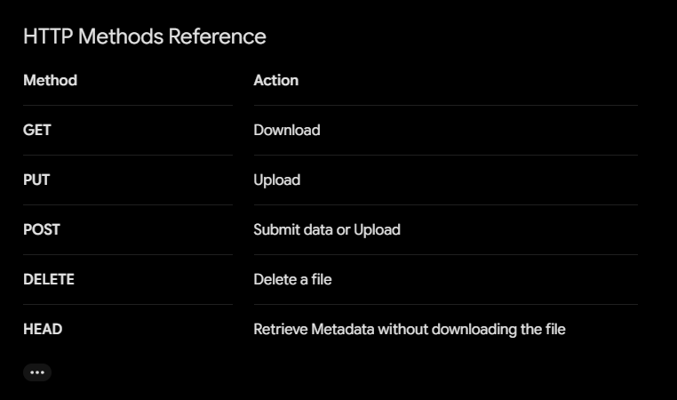

---

# 4. LAB for AWS S3 CORS (Cross-Origin Resource Sharing)

## Step 1: Create Bucket

* **Bucket Type:** General purpose
* **Bucket Namespace:** Global Namespace
* **Bucket name:** `techgg-mybucket`
* **Object Ownership:** ACLs disabled
* **Block Public Access settings for this bucket:**
* $[\checkmark]$ Block public access

* **Bucket Versioning:** Enable

---

## Step 2: Upload

*(Upload two sample files: File 1 & File 2)*

$$\text{Upload} \longrightarrow \text{Add files} \longrightarrow \begin{cases} \text{AWS Diploma Syllabus } (\text{File-1}) \\ \text{AZURE Syllabus } (\text{File-2}) \end{cases}$$

---

## Step 3: Configure CORS Settings

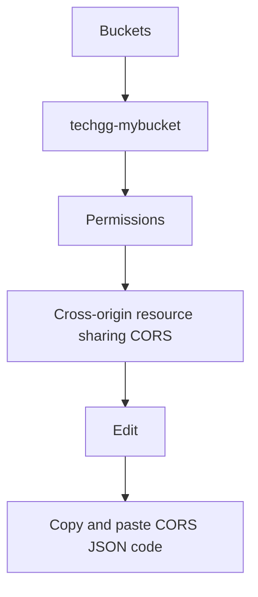
```mermaid
graph TD
    A[Buckets] --> B[techgg-mybucket]
    B --> C[Permissions]
    C --> D[Cross-origin resource sharing CORS]
    D --> E[Edit]
    E --> F["Copy and paste CORS JSON code"]

```

---

## HTTP Methods Reference

| Method | Action |
| --- | --- |
| **GET** | Download |
| **PUT** | Upload |
| **POST** | Submit data or Upload |
| **DELETE** | Delete a file |
| **HEAD** | Retrieve Metadata without downloading the file |

----------xxxxxxxxxxx-----------

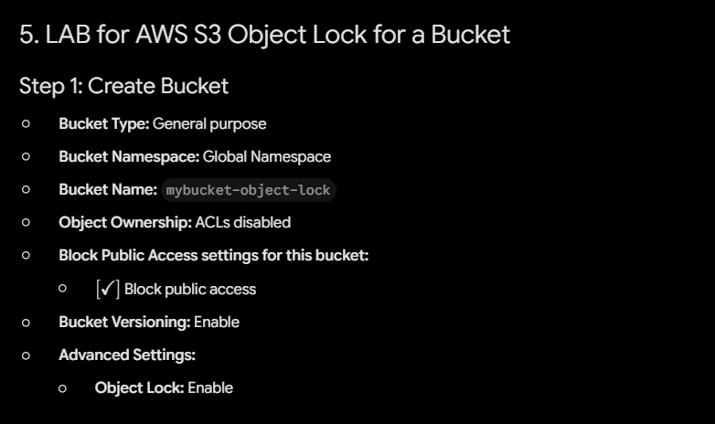

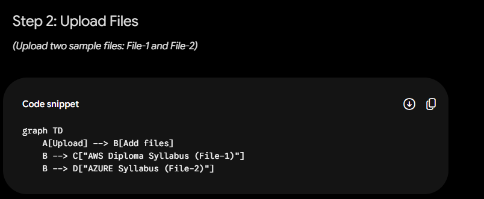

---

# 5. LAB for AWS S3 Object Lock for a Bucket

## Step 1: Create Bucket

* **Bucket Type:** General purpose
* **Bucket Namespace:** Global Namespace
* **Bucket Name:** `mybucket-object-lock`
* **Object Ownership:** ACLs disabled
* **Block Public Access settings for this bucket:**
* $[\checkmark]$ Block public access

* **Bucket Versioning:** Enable
* **Advanced Settings:**
* **Object Lock:** Enable

---

## Step 2: Upload Files

*(Upload two sample files: File-1 and File-2)*

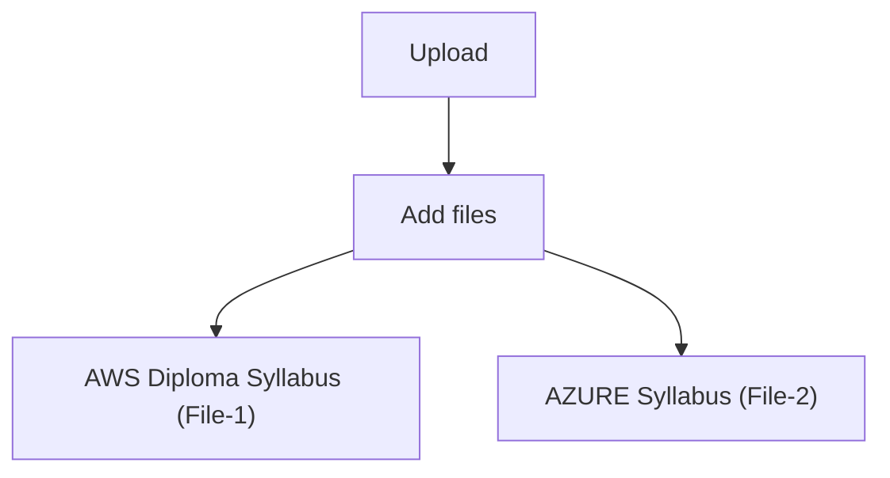
```mermaid
graph TD
    A[Upload] --> B[Add files]
    B --> C["AWS Diploma Syllabus (File-1)"]
    B --> D["AZURE Syllabus (File-2)"]

```

------------xxxxxxxxxxxx------------

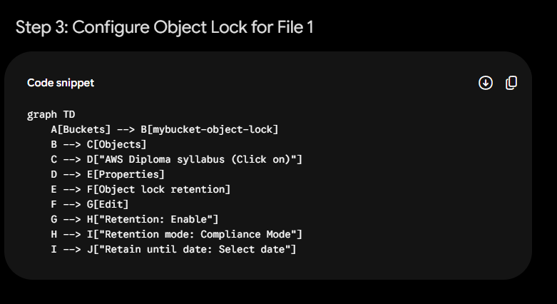

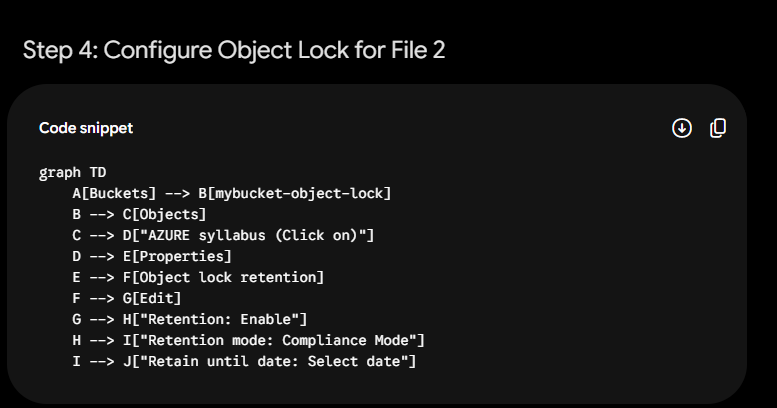

---

## Step 3: Configure Object Lock for File 1

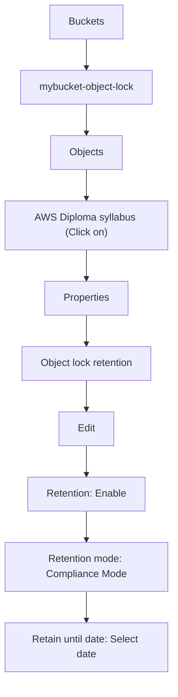
```mermaid
graph TD
    A[Buckets] --> B[mybucket-object-lock]
    B --> C[Objects]
    C --> D["AWS Diploma syllabus (Click on)"]
    D --> E[Properties]
    E --> F[Object lock retention]
    F --> G[Edit]
    G --> H["Retention: Enable"]
    H --> I["Retention mode: Compliance Mode"]
    I --> J["Retain until date: Select date"]

```

---

## Step 4: Configure Object Lock for File 2

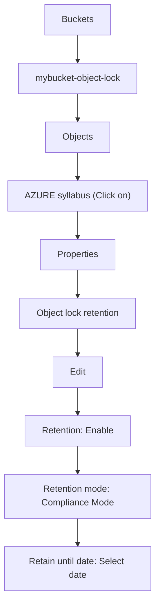
```mermaid
graph TD
    A[Buckets] --> B[mybucket-object-lock]
    B --> C[Objects]
    C --> D["AZURE syllabus (Click on)"]
    D --> E[Properties]
    E --> F[Object lock retention]
    F --> G[Edit]
    G --> H["Retention: Enable"]
    H --> I["Retention mode: Compliance Mode"]
    I --> J["Retain until date: Select date"]

```

--------xxxxxxxxxxx------------

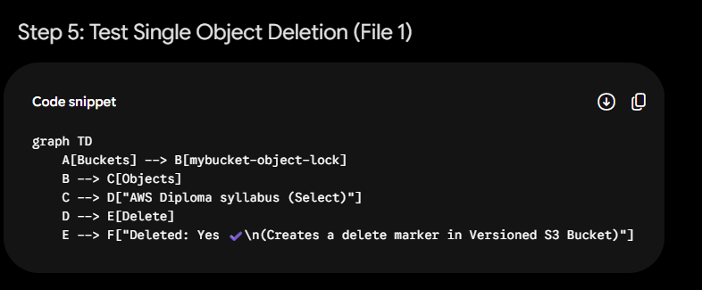

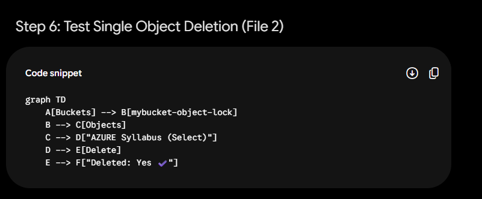

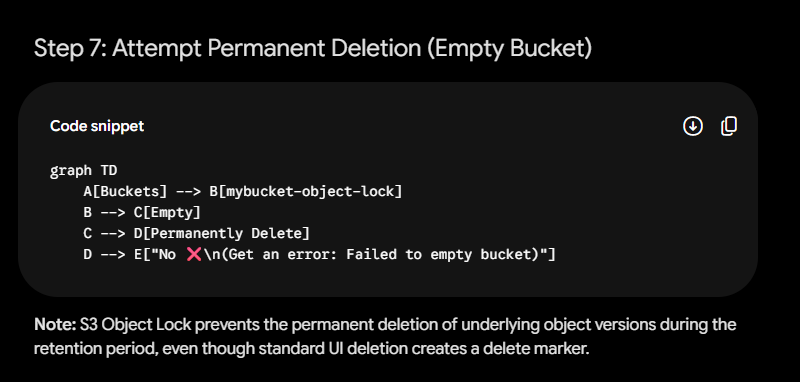

---

## Step 5: Test Single Object Deletion (File 1)

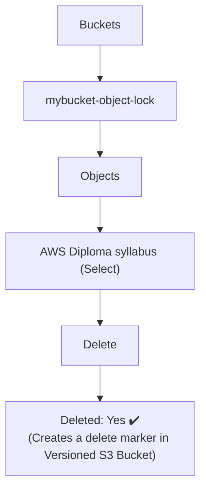
```mermaid
graph TD
    A[Buckets] --> B[mybucket-object-lock]
    B --> C[Objects]
    C --> D["AWS Diploma syllabus (Select)"]
    D --> E[Delete]
    E --> F["Deleted: Yes ✔️\n(Creates a delete marker in Versioned S3 Bucket)"]

```

---

## Step 6: Test Single Object Deletion (File 2)

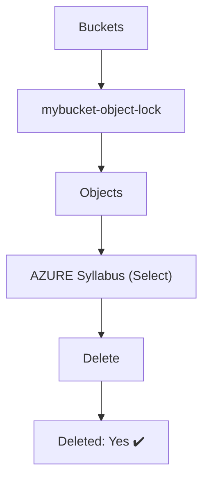
```mermaid
graph TD
    A[Buckets] --> B[mybucket-object-lock]
    B --> C[Objects]
    C --> D["AZURE Syllabus (Select)"]
    D --> E[Delete]
    E --> F["Deleted: Yes ✔️"]

```

---

## Step 7: Attempt Permanent Deletion (Empty Bucket)

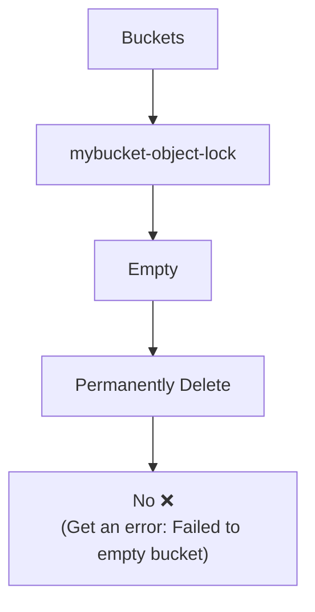
```mermaid
graph TD
    A[Buckets] --> B[mybucket-object-lock]
    B --> C[Empty]
    C --> D[Permanently Delete]
    D --> E["No ❌\n(Get an error: Failed to empty bucket)"]

```

> **Note:** S3 Object Lock prevents the permanent deletion of underlying object versions during the retention period, even though standard UI deletion creates a delete marker.

--------xxxxxxxxxxx-------------

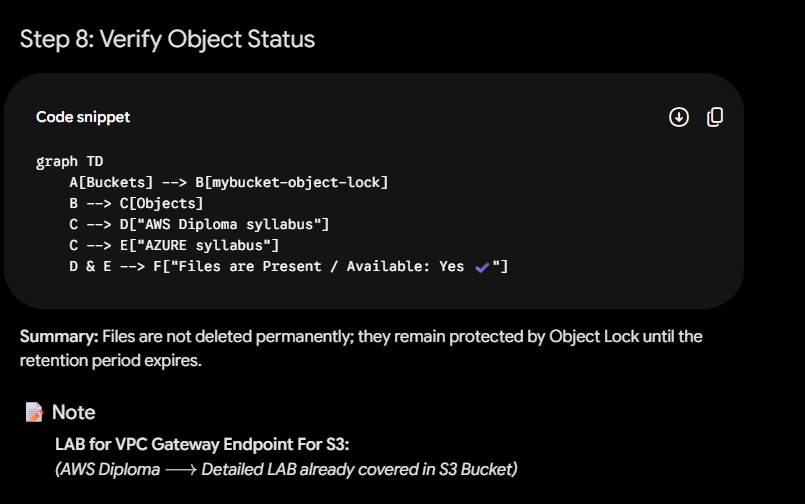

---

## Step 8: Verify Object Status

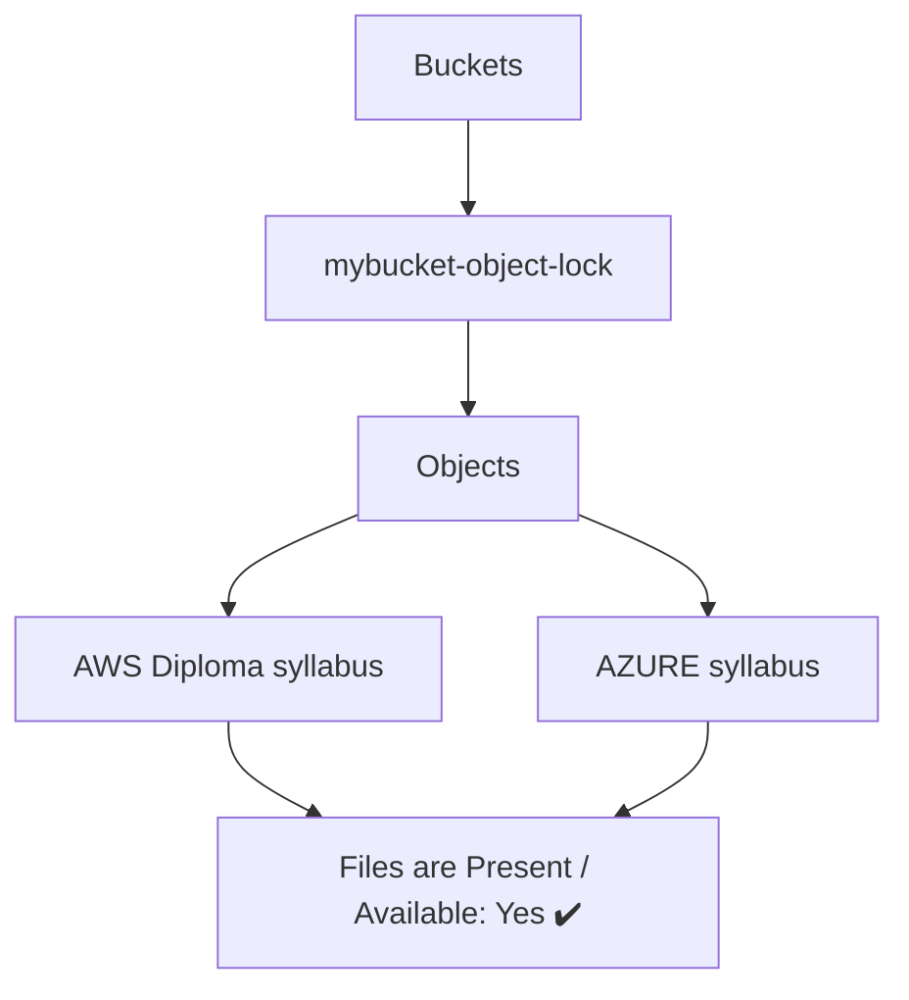
```mermaid
graph TD
    A[Buckets] --> B[mybucket-object-lock]
    B --> C[Objects]
    C --> D["AWS Diploma syllabus"]
    C --> E["AZURE syllabus"]
    D & E --> F["Files are Present / Available: Yes ✔️"]

```

> **Summary:** Files are not deleted permanently; they remain protected by Object Lock until the retention period expires.

---

> ### 📝 Note
> 
> 
> * **LAB for VPC Gateway Endpoint For S3:**
> *(AWS Diploma $\longrightarrow$ Detailed LAB already covered in S3 Bucket)*
> 
>

-----------xxxxxxxxxxxxxxxx---------------

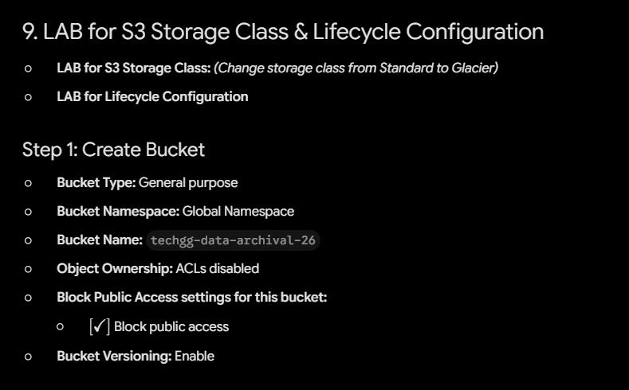

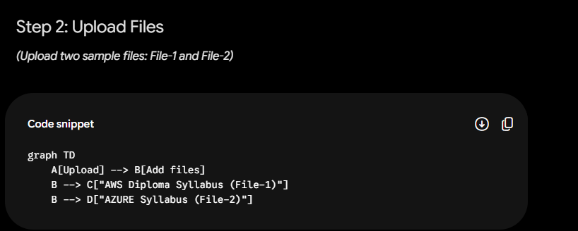

---

# 9. LAB for S3 Storage Class & Lifecycle Configuration

* **LAB for S3 Storage Class:** *(Change storage class from Standard to Glacier)*
* **LAB for Lifecycle Configuration**

---

## Step 1: Create Bucket

* **Bucket Type:** General purpose
* **Bucket Namespace:** Global Namespace
* **Bucket Name:** `techgg-data-archival-26`
* **Object Ownership:** ACLs disabled
* **Block Public Access settings for this bucket:**
* $[\checkmark]$ Block public access

* **Bucket Versioning:** Enable

---

## Step 2: Upload Files

*(Upload two sample files: File-1 and File-2)*

```mermaid
graph TD
    A[Upload] --> B[Add files]
    B --> C["AWS Diploma Syllabus (File-1)"]
    B --> D["AZURE Syllabus (File-2)"]

```

------------xxxxxxxxxxx--------------

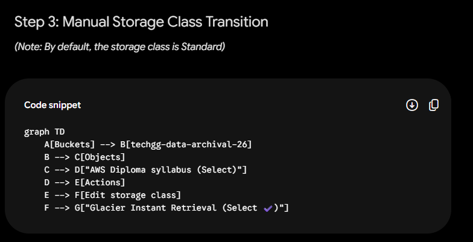

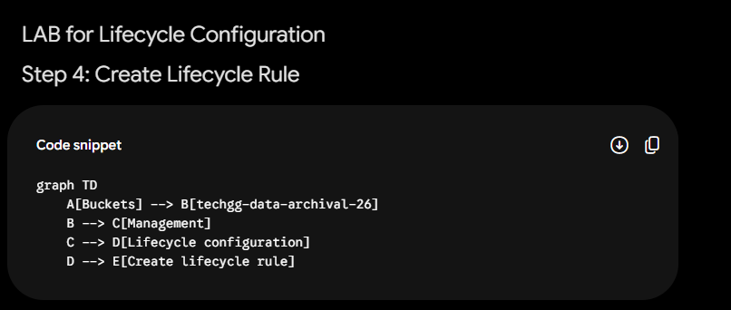

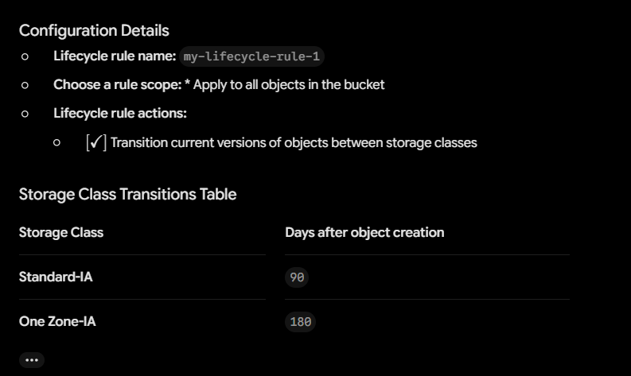

---

## Step 3: Manual Storage Class Transition

*(Note: By default, the storage class is Standard)*

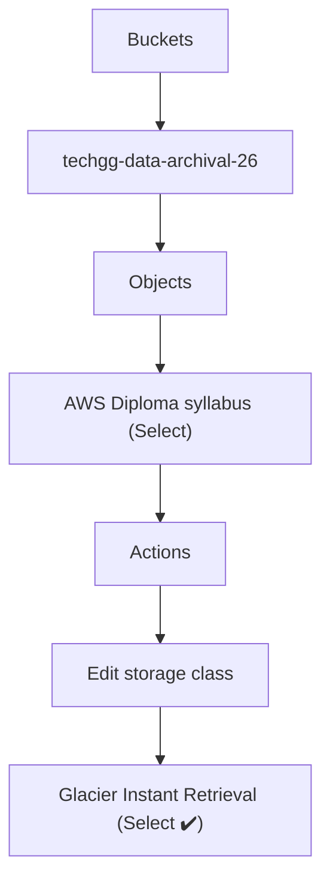
```mermaid
graph TD
    A[Buckets] --> B[techgg-data-archival-26]
    B --> C[Objects]
    C --> D["AWS Diploma syllabus (Select)"]
    D --> E[Actions]
    E --> F[Edit storage class]
    F --> G["Glacier Instant Retrieval (Select ✔️)"]

```

---

## LAB for Lifecycle Configuration

## Step 4: Create Lifecycle Rule

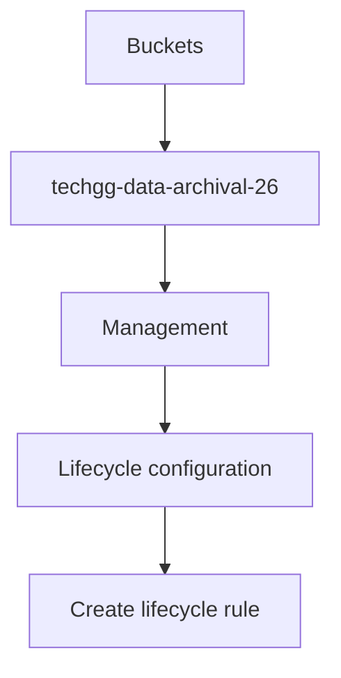
```mermaid
graph TD
    A[Buckets] --> B[techgg-data-archival-26]
    B --> C[Management]
    C --> D[Lifecycle configuration]
    D --> E[Create lifecycle rule]

```

### Configuration Details

* **Lifecycle rule name:** `my-lifecycle-rule-1`
* **Choose a rule scope:** * Apply to all objects in the bucket
* **Lifecycle rule actions:**
* $[\checkmark]$ Transition current versions of objects between storage classes

### Storage Class Transitions Table

| Storage Class | Days after object creation |
| --- | --- |
| **Standard-IA** | `90` |
| **One Zone-IA** | `180` |

----------xxxxxxxxxxxxx-----------

## 🔑 Key Takeaways

### 1. S3 CORS

* CORS allows browsers to request resources located in an S3 bucket from a different origin (Protocol + Domain + Port).
* Without explicit CORS configuration rules, web applications hosted on other domains are blocked by the browser's Same-Origin Policy.

### 2. S3 Object Lock

* **Prerequisites:** Requires **Bucket Versioning** to be enabled.
* **Governance Mode:** Users with the `s3:BypassGovernanceRetention` IAM permission can alter retention settings or delete objects before the retention date.
* **Compliance Mode:** No user—including the AWS account **root** user—can alter or delete the protected object version until the retention period expires.
* **Deletion Behavior:** Performing a standard `Delete` creates a delete marker (making the file look missing in the UI), but attempting to **permanently delete** or **empty the bucket** fails during the retention window.

### 3. S3 Lifecycle & Storage Classes

* **Storage Tiers:**
* **Standard / Standard-IA:** Multi-AZ storage with low latency.
* **One Zone-IA:** Single-AZ storage (cheaper, but lower availability).
* **Glacier Classes:** Designed for data archiving with varying retrieval times (instant, minutes, or hours).

* **Lifecycle Rules:** Automate transitions between storage tiers based on object age (e.g., transition to `Standard-IA` after 90 days and `One Zone-IA` after 180 days) to eliminate manual storage management.

---

## 🧹 Post-Lab Cleanup Guide

To prevent unnecessary AWS billing and clear out resources created during these labs, follow these steps in order:

### 1. S3 CORS Bucket Cleanup (`techgg-mybucket`)

1. Open the **Amazon S3 Console**.
2. Select `techgg-mybucket`.
3. Click **Empty** and confirm deletion by typing `permanently delete`.
4. Once empty, select `techgg-mybucket` and click **Delete**.
5. Type the bucket name to confirm final deletion.

---

### 2. S3 Object Lock Bucket Cleanup (`mybucket-object-lock`)

> ⚠️ **Important:** If objects were locked in **Compliance Mode** with an active retention date, AWS will **block permanent deletion** until the retain-until date has passed.

1. Select `mybucket-object-lock` in the S3 Console.
2. Toggle **Show versions** in the Objects tab.
3. If the retention date has expired:
* Select all objects and delete markers $\longrightarrow$ Click **Delete** $\longrightarrow$ Confirm permanent deletion.
* Click **Empty bucket** $\longrightarrow$ Click **Delete bucket**.

4. If the retention date is still active in **Compliance Mode**:
* You must wait until the specified `Retain until date` passes before AWS allows you to permanently delete the underlying versions and the bucket.

---

### 3. Lifecycle & Storage Class Bucket Cleanup (`techgg-data-archival-26`)

1. Go to `techgg-data-archival-26` $\longrightarrow$ **Management** tab.
2. Under **Lifecycle rules**, select `my-lifecycle-rule-1` and click **Delete**.
3. Go back to **Buckets**, select `techgg-data-archival-26`, and click **Empty**.
4. Confirm deletion of all uploaded test files (`AWS Diploma syllabus`, `AZURE syllabus`).
5. Click **Delete bucket** to permanently remove the bucket.

-----------xxxxxxxxxxxx-------------