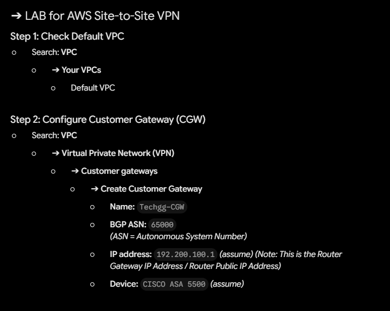


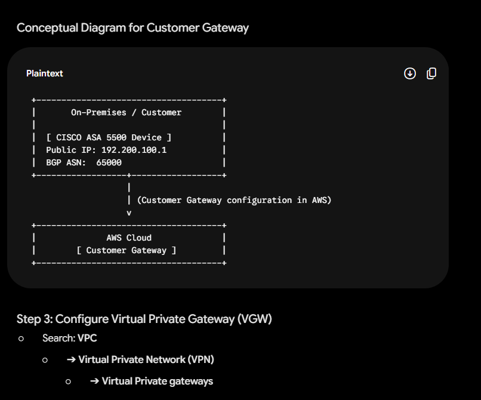


---

# Class - 08

**Date:** 28/06/26

## ➔ LAB for AWS Site-to-Site VPN

---

### Step 1: Check Default VPC

* Search: **VPC**
* ➔ **Your VPCs**
* Default VPC


---

### Step 2: Configure Customer Gateway (CGW)

* Search: **VPC**
* ➔ **Virtual Private Network (VPN)**
* ➔ **Customer gateways**
* ➔ **Create Customer Gateway**
* **Name:** `Techgg-CGW`
* **BGP ASN:** `65000`
*(ASN = Autonomous System Number)*
* **IP address:** `192.200.100.1` *(assume)* *(Note: This is the Router Gateway IP Address / Router Public IP Address)*
* **Device:** `CISCO ASA 5500` *(assume)*


#### Conceptual Diagram for Customer Gateway

```text
 +-------------------------------------+
 |       On-Premises / Customer        |
 |                                     |
 |  [ CISCO ASA 5500 Device ]          |
 |  Public IP: 192.200.100.1           |
 |  BGP ASN:  65000                    |
 +------------------+------------------+
                    |
                    | (Customer Gateway configuration in AWS)
                    v
 +-------------------------------------+
 |              AWS Cloud              |
 |        [ Customer Gateway ]         |
 +-------------------------------------+

```

---

### Step 3: Configure Virtual Private Gateway (VGW)

* Search: **VPC**
* ➔ **Virtual Private Network (VPN)**
* ➔ **Virtual Private gateways**

--------xxxxxxxxxx-----------


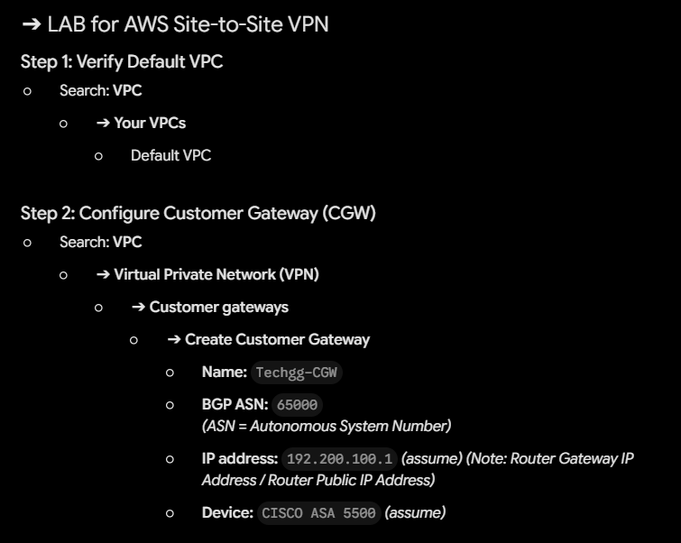


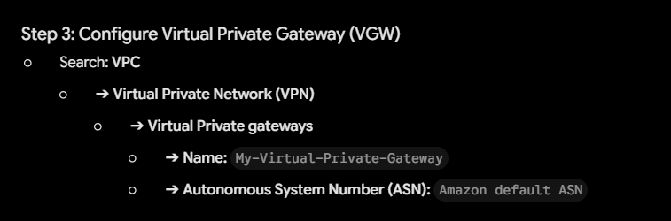


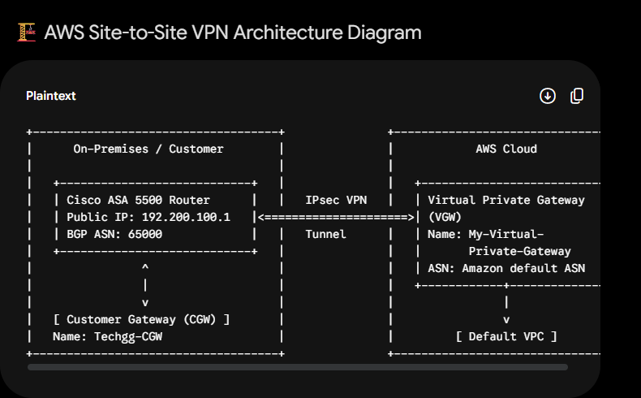


---

# Class - 08

**Date:** 28/06/26

## ➔ LAB for AWS Site-to-Site VPN

---

### Step 1: Verify Default VPC

* Search: **VPC**
* ➔ **Your VPCs**
* Default VPC


---

### Step 2: Configure Customer Gateway (CGW)

* Search: **VPC**
* ➔ **Virtual Private Network (VPN)**
* ➔ **Customer gateways**
* ➔ **Create Customer Gateway**
* **Name:** `Techgg-CGW`
* **BGP ASN:** `65000`
*(ASN = Autonomous System Number)*
* **IP address:** `192.200.100.1` *(assume)* *(Note: Router Gateway IP Address / Router Public IP Address)*
* **Device:** `CISCO ASA 5500` *(assume)*


---

### Step 3: Configure Virtual Private Gateway (VGW)

* Search: **VPC**
* ➔ **Virtual Private Network (VPN)**
* ➔ **Virtual Private gateways**
* ➔ **Name:** `My-Virtual-Private-Gateway`
* ➔ **Autonomous System Number (ASN):** `Amazon default ASN`


---

## 🏗️ AWS Site-to-Site VPN Architecture Diagram

```text
+------------------------------------+               +----------------------------------+
|      On-Premises / Customer        |               |            AWS Cloud             |
|                                    |               |                                  |
|   +----------------------------+   |               |   +--------------------------+   |
|   | Cisco ASA 5500 Router      |   |   IPsec VPN   |   | Virtual Private Gateway  |   |
|   | Public IP: 192.200.100.1   |<=====================>| (VGW)                    |   |
|   | BGP ASN: 65000             |   |   Tunnel      |   | Name: My-Virtual-        |   |
|   +----------------------------+   |               |   |       Private-Gateway    |   |
|                ^                   |               |   | ASN: Amazon default ASN  |   |
|                |                   |               |   +------------+-------------+   |
|                v                   |               |                |                 |
|   [ Customer Gateway (CGW) ]       |               |                v                 |
|   Name: Techgg-CGW                 |               |         [ Default VPC ]          |
+------------------------------------+               +----------------------------------+

```


--------xxxxxxxxxxx-----------------


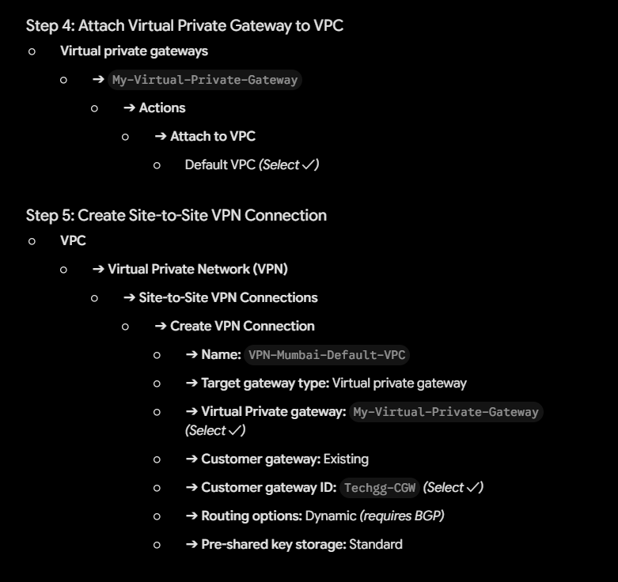


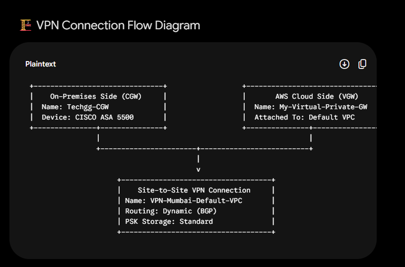


---

### Step 4: Attach Virtual Private Gateway to VPC

* **Virtual private gateways**
* ➔ `My-Virtual-Private-Gateway`
* ➔ **Actions**
* ➔ **Attach to VPC**
* Default VPC *(Select ✓)*


---

### Step 5: Create Site-to-Site VPN Connection

* **VPC**
* ➔ **Virtual Private Network (VPN)**
* ➔ **Site-to-Site VPN Connections**
* ➔ **Create VPN Connection**
* ➔ **Name:** `VPN-Mumbai-Default-VPC`
* ➔ **Target gateway type:** Virtual private gateway
* ➔ **Virtual Private gateway:** `My-Virtual-Private-Gateway` *(Select ✓)*
* ➔ **Customer gateway:** Existing
* ➔ **Customer gateway ID:** `Techgg-CGW` *(Select ✓)*
* ➔ **Routing options:** Dynamic *(requires BGP)*
* ➔ **Pre-shared key storage:** Standard


---

## 🏗️ VPN Connection Flow Diagram

```text
 +-------------------------------+                  +-------------------------------+
 |    On-Premises Side (CGW)     |                  |       AWS Cloud Side (VGW)    |
 |  Name: Techgg-CGW             |                  |  Name: My-Virtual-Private-GW  |
 |  Device: CISCO ASA 5500       |                  |  Attached To: Default VPC     |
 +---------------+---------------+                  +---------------+---------------+
                 |                                                  |
                 +-----------------------+--------------------------+
                                         |
                                         v
                      +------------------------------------+
                      |    Site-to-Site VPN Connection     |
                      | Name: VPN-Mumbai-Default-VPC       |
                      | Routing: Dynamic (BGP)             |
                      | PSK Storage: Standard              |
                      +------------------------------------+

```


-------------xxxxxxxxxx--------------


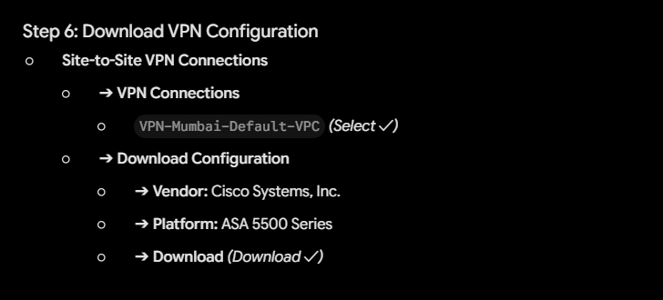


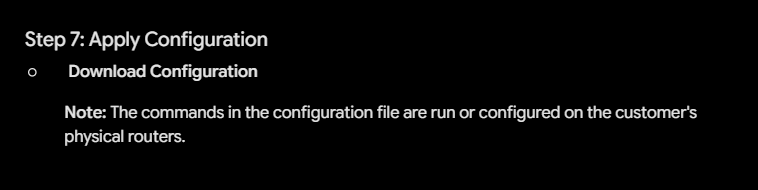


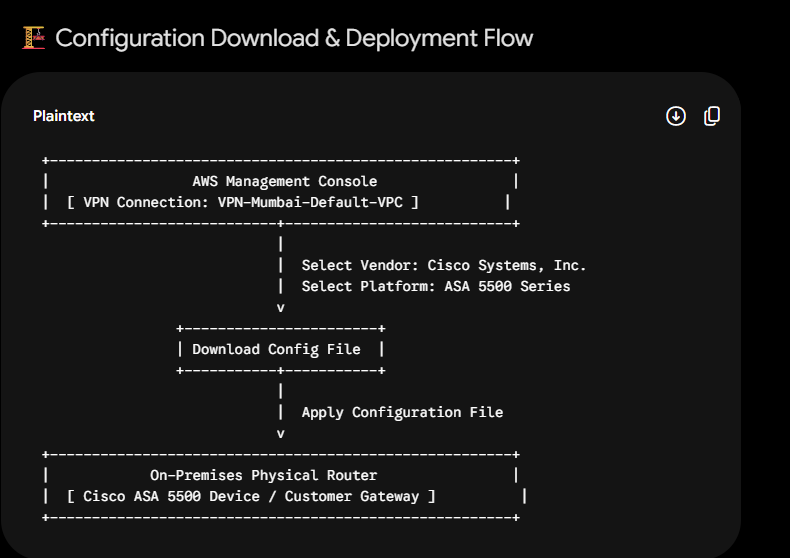

---

### Step 6: Download VPN Configuration

* **Site-to-Site VPN Connections**
* ➔ **VPN Connections**
* `VPN-Mumbai-Default-VPC` *(Select ✓)*


* ➔ **Download Configuration**
* ➔ **Vendor:** Cisco Systems, Inc.
* ➔ **Platform:** ASA 5500 Series
* ➔ **Download** *(Download ✓)*


---

### Step 7: Apply Configuration

* **Download Configuration**
> **Note:** The commands in the configuration file are run or configured on the customer's physical routers.


---

## 🏗️ Configuration Download & Deployment Flow

```text
 +-------------------------------------------------------+
 |                 AWS Management Console                |
 |  [ VPN Connection: VPN-Mumbai-Default-VPC ]          |
 +---------------------------+---------------------------+
                             |
                             |  Select Vendor: Cisco Systems, Inc.
                             |  Select Platform: ASA 5500 Series
                             v
                 +-----------------------+
                 | Download Config File  |
                 +-----------+-----------+
                             |
                             |  Apply Configuration File
                             v
 +-------------------------------------------------------+
 |            On-Premises Physical Router                |
 |  [ Cisco ASA 5500 Device / Customer Gateway ]          |
 +-------------------------------------------------------+

```


------------xxxxxxxxxxxxx------------


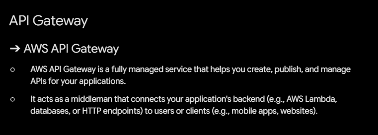


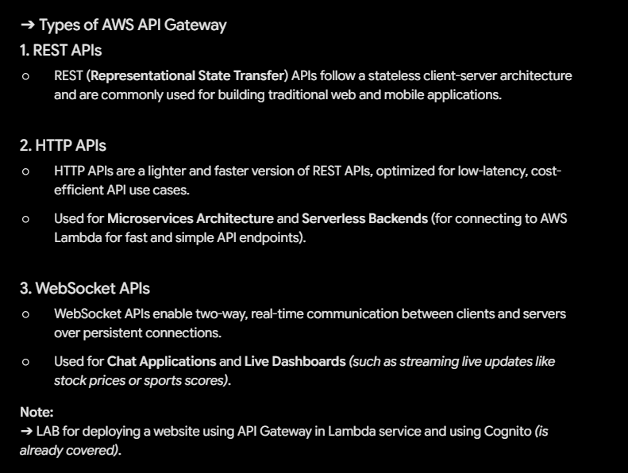


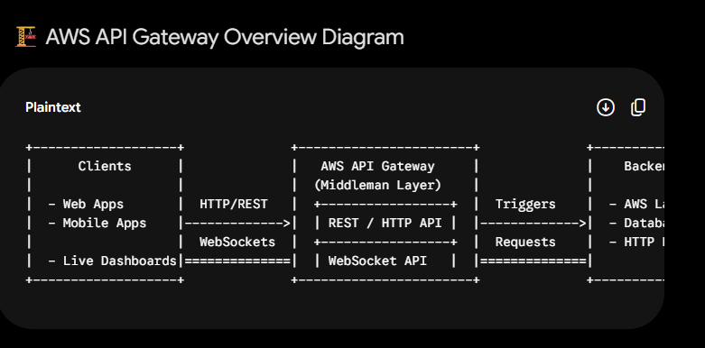


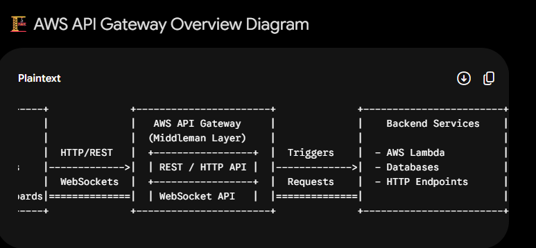


---

# API Gateway

## ➔ AWS API Gateway

* AWS API Gateway is a fully managed service that helps you create, publish, and manage APIs for your applications.
* It acts as a middleman that connects your application's backend (e.g., AWS Lambda, databases, or HTTP endpoints) to users or clients (e.g., mobile apps, websites).

---

### ➔ Types of AWS API Gateway

#### 1. REST APIs

* REST (**Representational State Transfer**) APIs follow a stateless client-server architecture and are commonly used for building traditional web and mobile applications.

#### 2. HTTP APIs

* HTTP APIs are a lighter and faster version of REST APIs, optimized for low-latency, cost-efficient API use cases.
* Used for **Microservices Architecture** and **Serverless Backends** (for connecting to AWS Lambda for fast and simple API endpoints).

#### 3. WebSocket APIs

* WebSocket APIs enable two-way, real-time communication between clients and servers over persistent connections.
* Used for **Chat Applications** and **Live Dashboards** *(such as streaming live updates like stock prices or sports scores)*.

---

> **Note:**
> ➔ LAB for deploying a website using API Gateway in Lambda service and using Cognito *(is already covered)*.

---

## 🏗️ AWS API Gateway Overview Diagram

```text
+-------------------+              +-----------------------+              +------------------------+
|      Clients      |              |   AWS API Gateway     |              |    Backend Services    |
|                   |              |  (Middleman Layer)    |              |                        |
|  - Web Apps       |  HTTP/REST   |  +-----------------+  |  Triggers    |  - AWS Lambda          |
|  - Mobile Apps    |------------->|  | REST / HTTP API |  |------------->|  - Databases           |
|                   |  WebSockets  |  +-----------------+  |  Requests    |  - HTTP Endpoints      |
|  - Live Dashboards|==============|  | WebSocket API   |  |==============|                        |
+-------------------+              +-----------------------+              +------------------------+

```


------------xxxxxxxxxxxxxxxxxx--------------


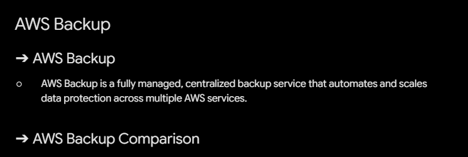


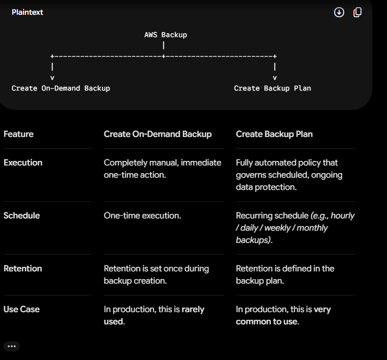


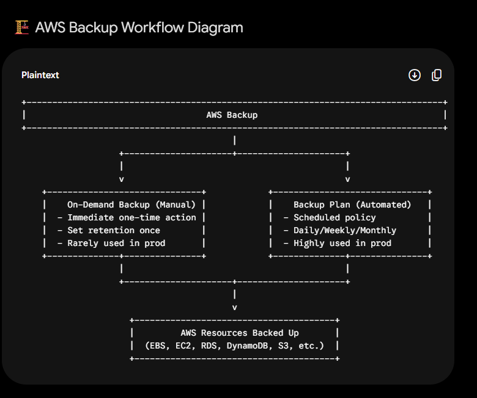

---

# AWS Backup

## ➔ AWS Backup

* AWS Backup is a fully managed, centralized backup service that automates and scales data protection across multiple AWS services.

---

## ➔ AWS Backup Comparison

```text
                               AWS Backup
                                   |
         +-------------------------+-------------------------+
         |                                                   |
         v                                                   v
Create On-Demand Backup                             Create Backup Plan

```

| Feature | Create On-Demand Backup | Create Backup Plan |
| --- | --- | --- |
| **Execution** | Completely manual, immediate one-time action. | Fully automated policy that governs scheduled, ongoing data protection. |
| **Schedule** | One-time execution. | Recurring schedule *(e.g., hourly / daily / weekly / monthly backups)*. |
| **Retention** | Retention is set once during backup creation. | Retention is defined in the backup plan. |
| **Use Case** | In production, this is **rarely used**. | In production, this is **very common to use**. |

---

## 🏗️ AWS Backup Workflow Diagram

```text
+---------------------------------------------------------------------------------+
|                                   AWS Backup                                    |
+---------------------------------------------------------------------------------+
                                         |
                   +---------------------+---------------------+
                   |                                           |
                   v                                           v
    +------------------------------+            +------------------------------+
    |    On-Demand Backup (Manual) |            |    Backup Plan (Automated)   |
    |  - Immediate one-time action |            |  - Scheduled policy          |
    |  - Set retention once        |            |  - Daily/Weekly/Monthly      |
    |  - Rarely used in prod       |            |  - Highly used in prod       |
    +--------------+---------------+            +--------------+---------------+
                   |                                           |
                   +---------------------+---------------------+
                                         |
                                         v
                     +---------------------------------------+
                     |         AWS Resources Backed Up       |
                     |  (EBS, EC2, RDS, DynamoDB, S3, etc.)  |
                     +---------------------------------------+

```


-------------xxxxxxxxxxxxx----------------


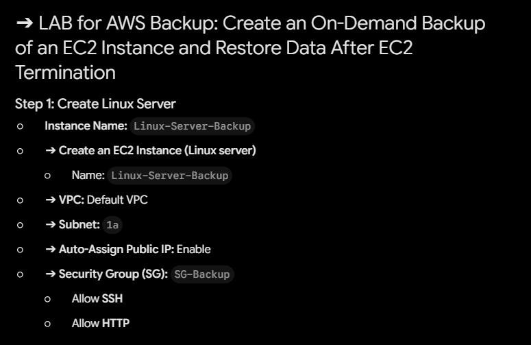


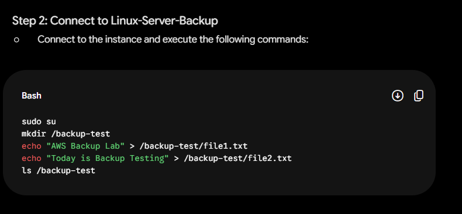


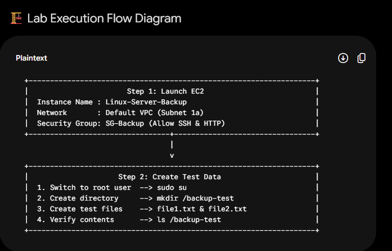

---

# ➔ LAB for AWS Backup: Create an On-Demand Backup of an EC2 Instance and Restore Data After EC2 Termination

---

### Step 1: Create Linux Server

* **Instance Name:** `Linux-Server-Backup`
* ➔ **Create an EC2 Instance (Linux server)**
* Name: `Linux-Server-Backup`


* ➔ **VPC:** Default VPC
* ➔ **Subnet:** `1a`
* ➔ **Auto-Assign Public IP:** Enable
* ➔ **Security Group (SG):** `SG-Backup`
* Allow **SSH**
* Allow **HTTP**


---

### Step 2: Connect to Linux-Server-Backup

* Connect to the instance and execute the following commands:

```bash
sudo su
mkdir /backup-test
echo "AWS Backup Lab" > /backup-test/file1.txt
echo "Today is Backup Testing" > /backup-test/file2.txt
ls /backup-test

```

---

## 🏗️ Lab Execution Flow Diagram

```text
  +-------------------------------------------------------------------+
  |                       Step 1: Launch EC2                          |
  |  Instance Name : Linux-Server-Backup                              |
  |  Network       : Default VPC (Subnet 1a)                          |
  |  Security Group: SG-Backup (Allow SSH & HTTP)                     |
  +---------------------------------+---------------------------------+
                                    |
                                    v
  +-------------------------------------------------------------------+
  |                     Step 2: Create Test Data                      |
  |  1. Switch to root user  --> sudo su                              |
  |  2. Create directory     --> mkdir /backup-test                   |
  |  3. Create test files    --> file1.txt & file2.txt                |
  |  4. Verify contents      --> ls /backup-test                      |
  +-------------------------------------------------------------------+

```


---------xxxxxxxx--------------


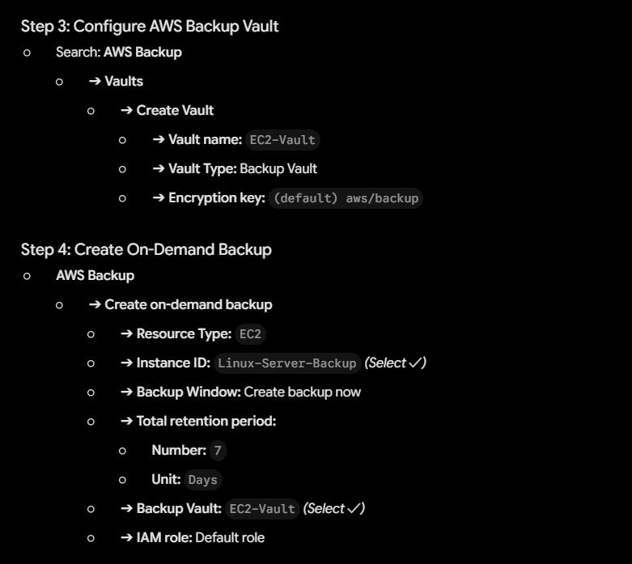


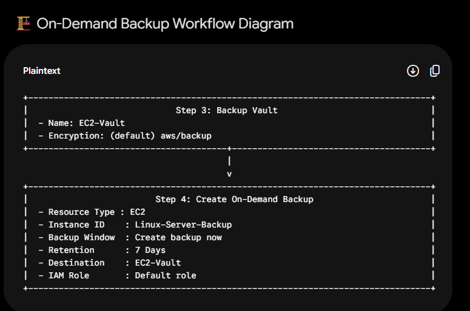


---

### Step 3: Configure AWS Backup Vault

* Search: **AWS Backup**
* ➔ **Vaults**
* ➔ **Create Vault**
* ➔ **Vault name:** `EC2-Vault`
* ➔ **Vault Type:** Backup Vault
* ➔ **Encryption key:** `(default) aws/backup`


---

### Step 4: Create On-Demand Backup

* **AWS Backup**
* ➔ **Create on-demand backup**
* ➔ **Resource Type:** `EC2`
* ➔ **Instance ID:** `Linux-Server-Backup` *(Select ✓)*
* ➔ **Backup Window:** Create backup now
* ➔ **Total retention period:**
* **Number:** `7`
* **Unit:** `Days`


* ➔ **Backup Vault:** `EC2-Vault` *(Select ✓)*
* ➔ **IAM role:** Default role


---

## 🏗️ On-Demand Backup Workflow Diagram

```text
+-------------------------------------------------------------------------------+
|                             Step 3: Backup Vault                              |
|  - Name: EC2-Vault                                                            |
|  - Encryption: (default) aws/backup                                           |
+---------------------------------------+---------------------------------------+
                                        |
                                        v
+-------------------------------------------------------------------------------+
|                         Step 4: Create On-Demand Backup                       |
|  - Resource Type : EC2                                                        |
|  - Instance ID    : Linux-Server-Backup                                       |
|  - Backup Window  : Create backup now                                         |
|  - Retention      : 7 Days                                                    |
|  - Destination    : EC2-Vault                                                 |
|  - IAM Role       : Default role                                              |
+-------------------------------------------------------------------------------+

```


-----------xxxxxxxxxx-----------------


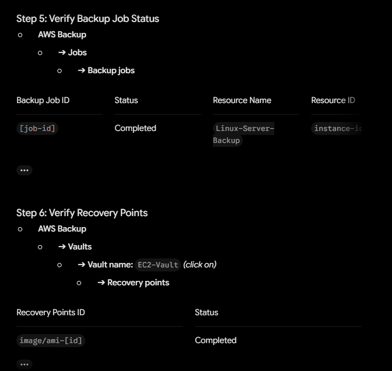


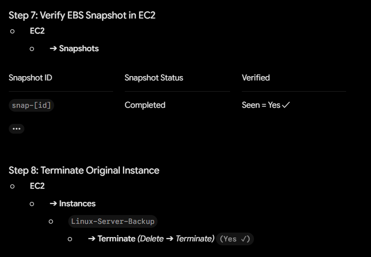


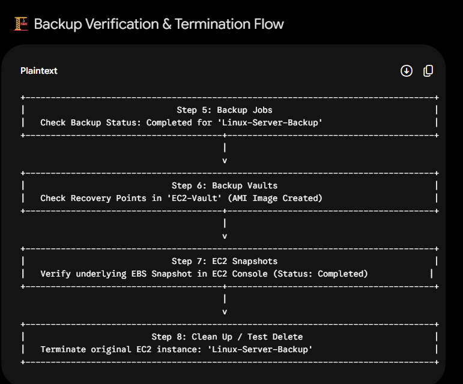


---

### Step 5: Verify Backup Job Status

* **AWS Backup**
* ➔ **Jobs**
* ➔ **Backup jobs**


| Backup Job ID | Status | Resource Name | Resource ID | Resource Type |
| --- | --- | --- | --- | --- |
| `[job-id]` | Completed | `Linux-Server-Backup` | `instance-id` | EC2 |

---

### Step 6: Verify Recovery Points

* **AWS Backup**
* ➔ **Vaults**
* ➔ **Vault name:** `EC2-Vault` *(click on)*
* ➔ **Recovery points**


| Recovery Points ID | Status |
| --- | --- |
| `image/ami-[id]` | Completed |

---

### Step 7: Verify EBS Snapshot in EC2

* **EC2**
* ➔ **Snapshots**


| Snapshot ID | Snapshot Status | Verified |
| --- | --- | --- |
| `snap-[id]` | Completed | Seen = Yes ✓ |

---

### Step 8: Terminate Original Instance

* **EC2**
* ➔ **Instances**
* `Linux-Server-Backup`
* ➔ **Terminate** *(Delete ➔ Terminate)* `(Yes ✓)`


---

## 🏗️ Backup Verification & Termination Flow

```text
+---------------------------------------------------------------------------------+
|                              Step 5: Backup Jobs                                |
|   Check Backup Status: Completed for 'Linux-Server-Backup'                      |
+---------------------------------------+-----------------------------------------+
                                        |
                                        v
+---------------------------------------------------------------------------------+
|                             Step 6: Backup Vaults                               |
|   Check Recovery Points in 'EC2-Vault' (AMI Image Created)                      |
+---------------------------------------+-----------------------------------------+
                                        |
                                        v
+---------------------------------------------------------------------------------+
|                             Step 7: EC2 Snapshots                               |
|   Verify underlying EBS Snapshot in EC2 Console (Status: Completed)            |
+---------------------------------------+-----------------------------------------+
                                        |
                                        v
+---------------------------------------------------------------------------------+
|                         Step 8: Clean Up / Test Delete                          |
|   Terminate original EC2 instance: 'Linux-Server-Backup'                        |
+---------------------------------------------------------------------------------+

```

-----------xxxxxxxxxxxxx------------


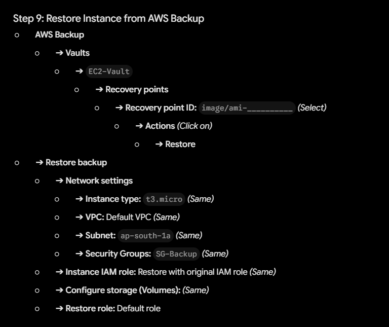


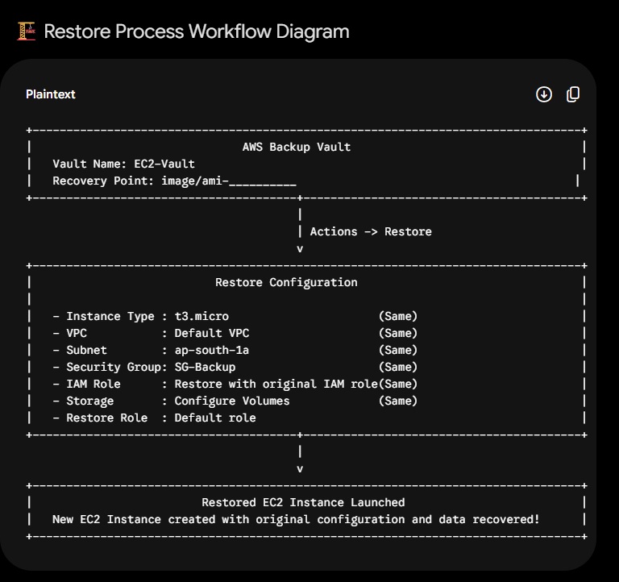


---

### Step 9: Restore Instance from AWS Backup

* **AWS Backup**
* ➔ **Vaults**
* ➔ `EC2-Vault`
* ➔ **Recovery points**
* ➔ **Recovery point ID:** `image/ami-__________` *(Select)*
* ➔ **Actions** *(Click on)*
* ➔ **Restore**


* ➔ **Restore backup**
* ➔ **Network settings**
* ➔ **Instance type:** `t3.micro` *(Same)*
* ➔ **VPC:** Default VPC *(Same)*
* ➔ **Subnet:** `ap-south-1a` *(Same)*
* ➔ **Security Groups:** `SG-Backup` *(Same)*


* ➔ **Instance IAM role:** Restore with original IAM role *(Same)*
* ➔ **Configure storage (Volumes):** *(Same)*
* ➔ **Restore role:** Default role


---

## 🏗️ Restore Process Workflow Diagram

```text
+---------------------------------------------------------------------------------+
|                               AWS Backup Vault                                  |
|   Vault Name: EC2-Vault                                                         |
|   Recovery Point: image/ami-__________                                         |
+---------------------------------------+-----------------------------------------+
                                        |
                                        | Actions -> Restore
                                        v
+---------------------------------------------------------------------------------+
|                           Restore Configuration                                 |
|                                                                                 |
|   - Instance Type : t3.micro                      (Same)                        |
|   - VPC           : Default VPC                   (Same)                        |
|   - Subnet        : ap-south-1a                   (Same)                        |
|   - Security Group: SG-Backup                     (Same)                        |
|   - IAM Role      : Restore with original IAM role(Same)                        |
|   - Storage       : Configure Volumes             (Same)                        |
|   - Restore Role  : Default role                                                |
+---------------------------------------+-----------------------------------------+
                                        |
                                        v
+---------------------------------------------------------------------------------+
|                         Restored EC2 Instance Launched                          |
|   New EC2 Instance created with original configuration and data recovered!      |
+---------------------------------------------------------------------------------+

```


----------xxxxxxxxxxxx-----------


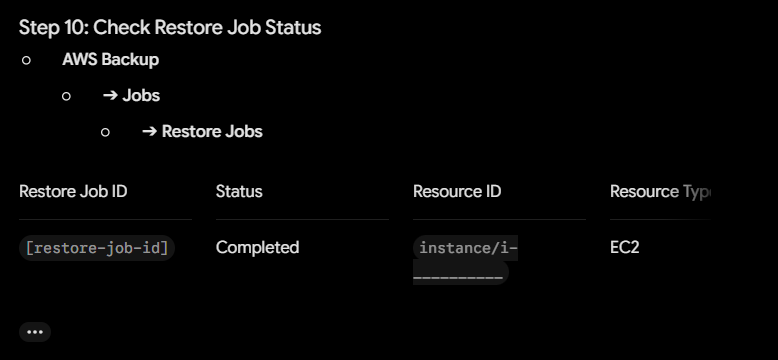


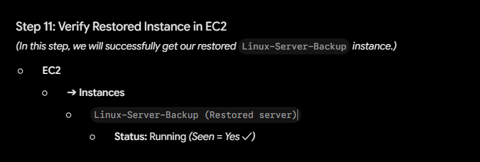


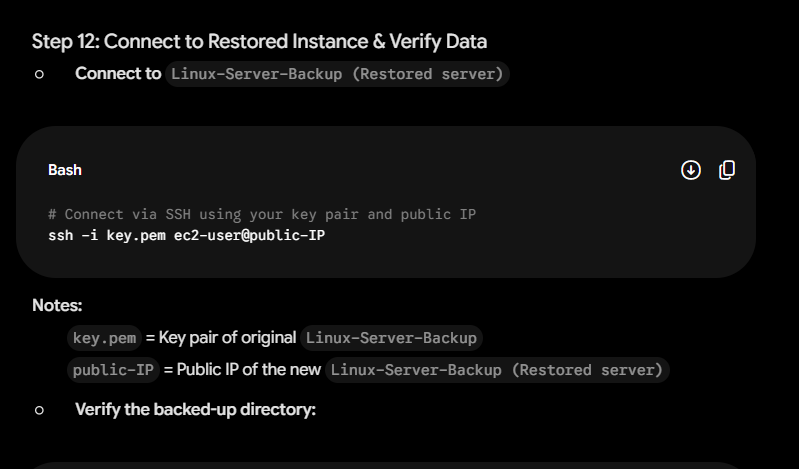


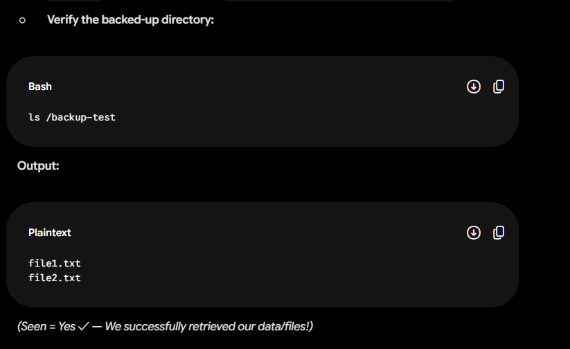


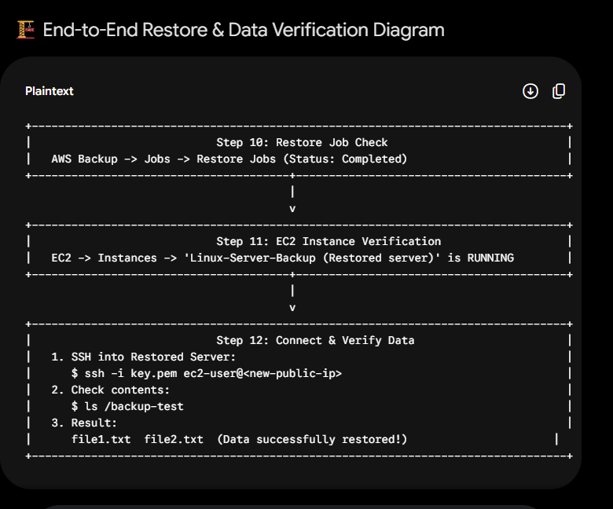


---

## AWS Backup Restoration Steps

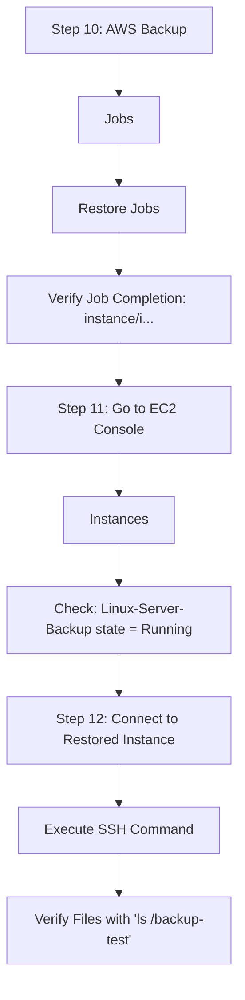
```mermaid
graph TD
    A[Step 10: AWS Backup] --> B[Jobs]
    B --> C[Restore Jobs]
    C --> D[Verify Job Completion: instance/i...]
    
    D --> E[Step 11: Go to EC2 Console]
    E --> F[Instances]
    F --> G[Check: Linux-Server-Backup state = Running]
    
    G --> H[Step 12: Connect to Restored Instance]
    H --> I[Execute SSH Command]
    I --> J[Verify Files with 'ls /backup-test']

```

---

### **Step 10: AWS Backup**

* **AWS Backup**
* $\rightarrow$ **Jobs**
* $\rightarrow$ **Restore Jobs**
* $\rightarrow$ **Restore Job ID** | **Status:** Completed | **Resource ID:** `instance/i-...` | **Resource type:** EC2


---

### **Step 11: Go to EC2 for check**

*(In this step, we will get our `Linux-Server-Backup` successfully. $\checkmark$)*

* **EC2**
* $\rightarrow$ **Instances**
* $\rightarrow$ `Linux-Server-Backup` *(Restored server)* $\rightarrow$ **Running** *(seen = yes $\checkmark$)*


---

### **Step 12: Connect to `Linux-Server-Backup` (Restored server)**

* $\downarrow$ **Connect**

#### **1. SSH Connection Command:**

```bash
ssh -i key.pem ec2-user@public-IP

```

* `key.pem`: **Key pair of `Linux-Server-Backup**`
* `public-IP`: **Public IP of `Linux-Server-Backup` (Restored server)**

#### **2. Verify Restored Data:**

```bash
ls /backup-test

```

**Output:**

* `file1.txt`
* `file2.txt`

> *(seen = yes $\checkmark$)* > *(We successfully retrieved our data/files.)*


------------xxxxxxxxxxxx------------