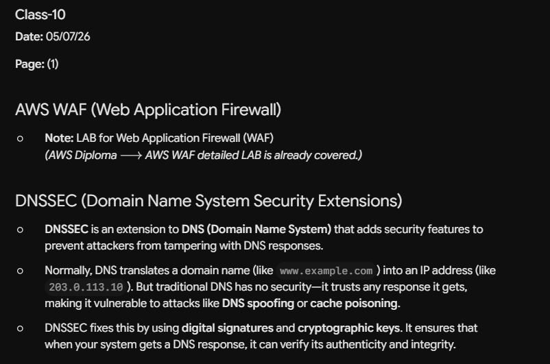

---

### Class-10

**Date:** 05/07/26

**Page:** (1)

---

## AWS WAF (Web Application Firewall)

* **Note:** LAB for Web Application Firewall (WAF)
*(AWS Diploma $\longrightarrow$ AWS WAF detailed LAB is already covered.)*

---

## DNSSEC (Domain Name System Security Extensions)

* **DNSSEC** is an extension to **DNS (Domain Name System)** that adds security features to prevent attackers from tampering with DNS responses.
* Normally, DNS translates a domain name (like `www.example.com`) into an IP address (like `203.0.113.10`). But traditional DNS has no security—it trusts any response it gets, making it vulnerable to attacks like **DNS spoofing** or **cache poisoning**.
* DNSSEC fixes this by using **digital signatures** and **cryptographic keys**. It ensures that when your system gets a DNS response, it can verify its authenticity and integrity.


-------------xxxxxxxxxxxxx--------------


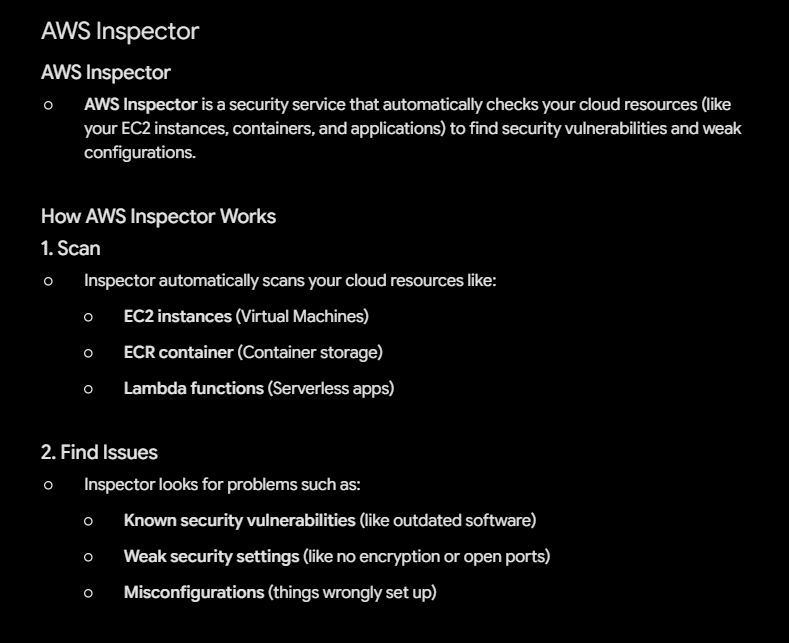


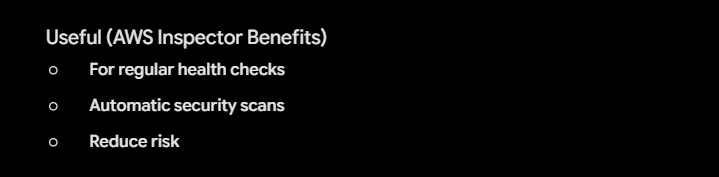

---

### Page (2)

## AWS Inspector

### AWS Inspector

* **AWS Inspector** is a security service that automatically checks your cloud resources (like your EC2 instances, containers, and applications) to find security vulnerabilities and weak configurations.

---

### How AWS Inspector Works

#### 1. Scan

* Inspector automatically scans your cloud resources like:
* **EC2 instances** (Virtual Machines)
* **ECR container** (Container storage)
* **Lambda functions** (Serverless apps)


#### 2. Find Issues

* Inspector looks for problems such as:
* **Known security vulnerabilities** (like outdated software)
* **Weak security settings** (like no encryption or open ports)
* **Misconfigurations** (things wrongly set up)


---

### Useful (AWS Inspector Benefits)

* **For regular health checks**
* **Automatic security scans**
* **Reduce risk**

-----------xxxxxxxxxxxxx----------------


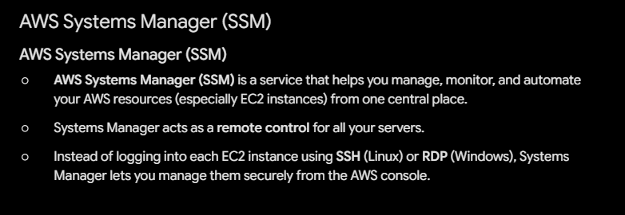


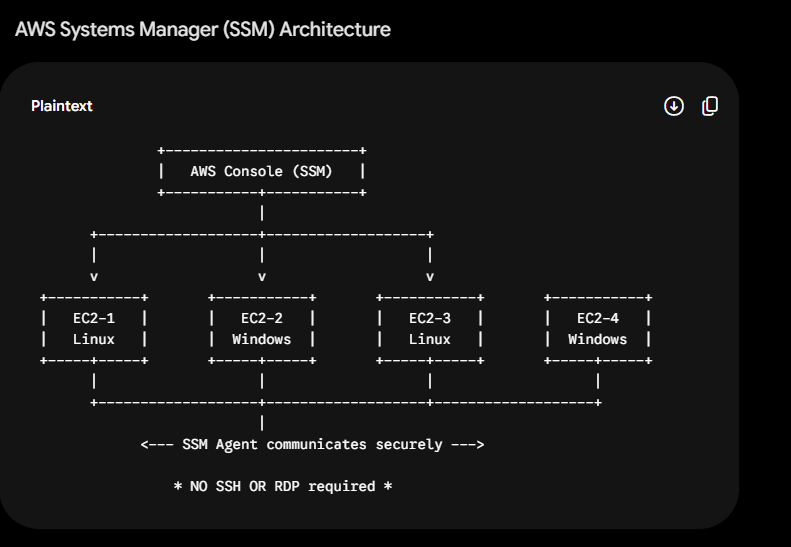


---

### Page (3)

## AWS Systems Manager (SSM)

### AWS Systems Manager (SSM)

* **AWS Systems Manager (SSM)** is a service that helps you manage, monitor, and automate your AWS resources (especially EC2 instances) from one central place.
* Systems Manager acts as a **remote control** for all your servers.
* Instead of logging into each EC2 instance using **SSH** (Linux) or **RDP** (Windows), Systems Manager lets you manage them securely from the AWS console.

---

### AWS Systems Manager (SSM) Architecture

```text
               +-----------------------+
               |   AWS Console (SSM)   |
               +-----------+-----------+
                           |
       +-------------------+-------------------+
       |                   |                   |
       v                   v                   v
 +-----------+       +-----------+       +-----------+       +-----------+
 |   EC2-1   |       |   EC2-2   |       |   EC2-3   |       |   EC2-4   |
 |   Linux   |       |  Windows  |       |   Linux   |       |  Windows  |
 +-----+-----+       +-----+-----+       +-----+-----+       +-----+-----+
       |                   |                   |                   |
       +-------------------+-------------------+-------------------+
                           |
             <--- SSM Agent communicates securely --->

                 * NO SSH OR RDP required *

```


-----------xxxxxxxxx------------


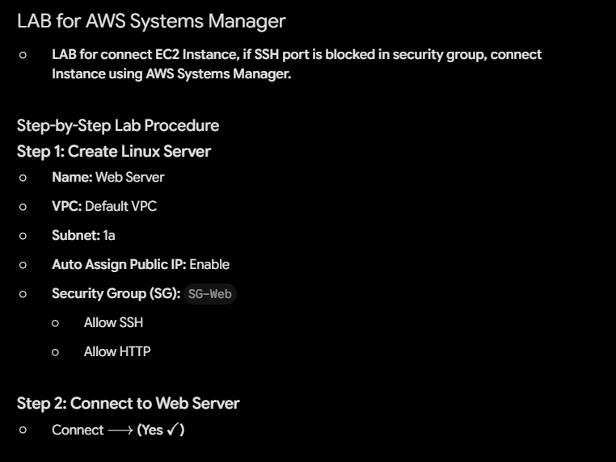


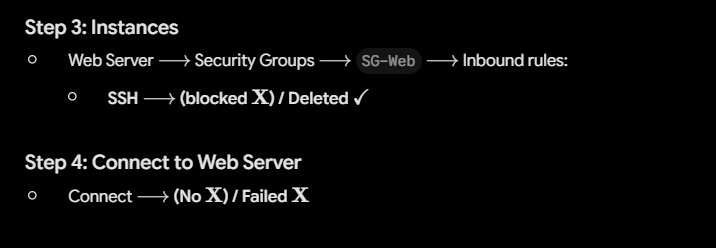


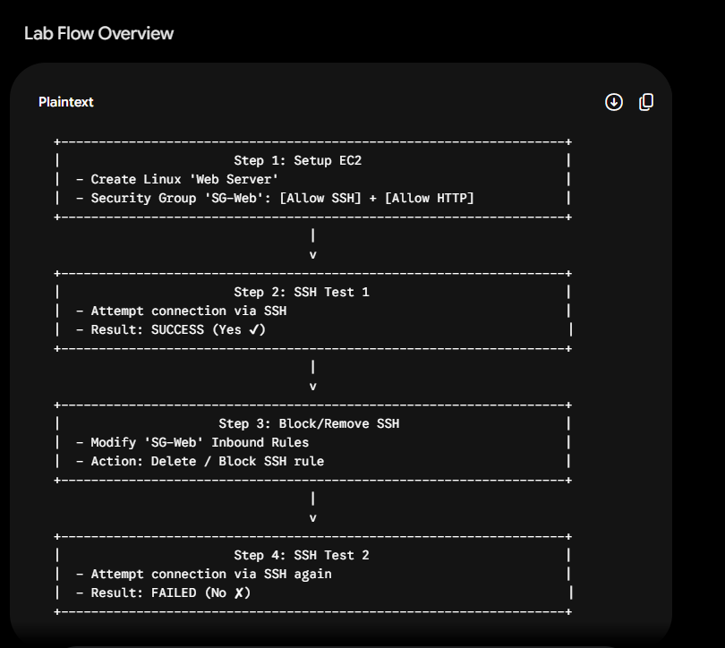

---

### Page (4)

## LAB for AWS Systems Manager

* **LAB for connect EC2 Instance, if SSH port is blocked in security group, connect Instance using AWS Systems Manager.**

---

### Step-by-Step Lab Procedure

#### **Step 1: Create Linux Server**

* **Name:** Web Server
* **VPC:** Default VPC
* **Subnet:** 1a
* **Auto Assign Public IP:** Enable
* **Security Group (SG):** `SG-Web`
* Allow SSH
* Allow HTTP


---

#### **Step 2: Connect to Web Server**

* Connect $\longrightarrow$ **(Yes $\checkmark$)**

---

#### **Step 3: Instances**

* Web Server $\longrightarrow$ Security Groups $\longrightarrow$ `SG-Web` $\longrightarrow$ Inbound rules:
* **SSH** $\longrightarrow$ **(blocked $\mathbf{X}$) / Deleted $\checkmark$**


---

#### **Step 4: Connect to Web Server**

* Connect $\longrightarrow$ **(No $\mathbf{X}$) / Failed $\mathbf{X}$**

---

### Lab Flow Overview

```text
  +-------------------------------------------------------------------+
  |                       Step 1: Setup EC2                           |
  |  - Create Linux 'Web Server'                                      |
  |  - Security Group 'SG-Web': [Allow SSH] + [Allow HTTP]            |
  +-------------------------------------------------------------------+
                                    |
                                    v
  +-------------------------------------------------------------------+
  |                       Step 2: SSH Test 1                          |
  |  - Attempt connection via SSH                                     |
  |  - Result: SUCCESS (Yes ✔)                                        |
  +-------------------------------------------------------------------+
                                    |
                                    v
  +-------------------------------------------------------------------+
  |                     Step 3: Block/Remove SSH                      |
  |  - Modify 'SG-Web' Inbound Rules                                  |
  |  - Action: Delete / Block SSH rule                                |
  +-------------------------------------------------------------------+
                                    |
                                    v
  +-------------------------------------------------------------------+
  |                       Step 4: SSH Test 2                          |
  |  - Attempt connection via SSH again                               |
  |  - Result: FAILED (No ✘)                                          |
  +-------------------------------------------------------------------+

```


---------xxxxxxxxxxxx------------


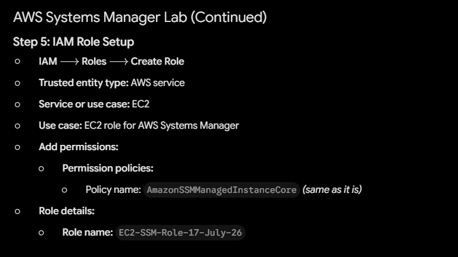


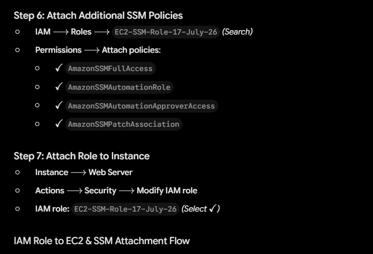


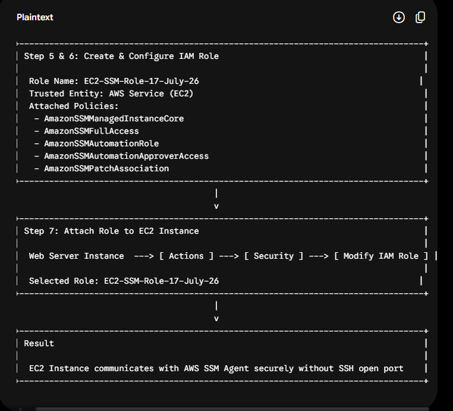


---

### Page (5)

## AWS Systems Manager Lab (Continued)

### **Step 5: IAM Role Setup**

* **IAM** $\longrightarrow$ **Roles** $\longrightarrow$ **Create Role**
* **Trusted entity type:** AWS service
* **Service or use case:** EC2
* **Use case:** EC2 role for AWS Systems Manager
* **Add permissions:**
* **Permission policies:**
* Policy name: `AmazonSSMManagedInstanceCore` *(same as it is)*


* **Role details:**
* **Role name:** `EC2-SSM-Role-17-July-26`


---

### **Step 6: Attach Additional SSM Policies**

* **IAM** $\longrightarrow$ **Roles** $\longrightarrow$ `EC2-SSM-Role-17-July-26` *(Search)*
* **Permissions** $\longrightarrow$ **Attach policies**:
* $\checkmark$ `AmazonSSMFullAccess`
* $\checkmark$ `AmazonSSMAutomationRole`
* $\checkmark$ `AmazonSSMAutomationApproverAccess`
* $\checkmark$ `AmazonSSMPatchAssociation`


---

### **Step 7: Attach Role to Instance**

* **Instance** $\longrightarrow$ **Web Server**
* **Actions** $\longrightarrow$ **Security** $\longrightarrow$ **Modify IAM role**
* **IAM role:** `EC2-SSM-Role-17-July-26` *(Select $\checkmark$)*

---

### IAM Role to EC2 & SSM Attachment Flow

```text
  +---------------------------------------------------------------------------------+
  | Step 5 & 6: Create & Configure IAM Role                                         |
  |                                                                                 |
  |  Role Name: EC2-SSM-Role-17-July-26                                            |
  |  Trusted Entity: AWS Service (EC2)                                              |
  |  Attached Policies:                                                             |
  |   - AmazonSSMManagedInstanceCore                                                |
  |   - AmazonSSMFullAccess                                                         |
  |   - AmazonSSMAutomationRole                                                     |
  |   - AmazonSSMAutomationApproverAccess                                           |
  |   - AmazonSSMPatchAssociation                                                   |
  +---------------------------------------------------------------------------------+
                                          |
                                          v
  +---------------------------------------------------------------------------------+
  | Step 7: Attach Role to EC2 Instance                                             |
  |                                                                                 |
  |  Web Server Instance  ---> [ Actions ] ---> [ Security ] ---> [ Modify IAM Role ] |
  |                                                                                 |
  |  Selected Role: EC2-SSM-Role-17-July-26                                        |
  +---------------------------------------------------------------------------------+
                                          |
                                          v
  +---------------------------------------------------------------------------------+
  | Result                                                                          |
  |                                                                                 |
  |  EC2 Instance communicates with AWS SSM Agent securely without SSH open port    |
  +---------------------------------------------------------------------------------+

```


------------xxxxxxxxxxxxxxx-------------


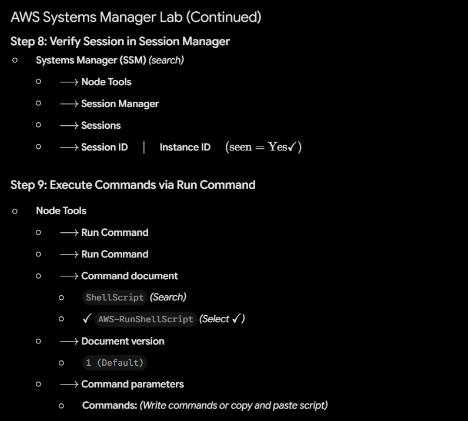


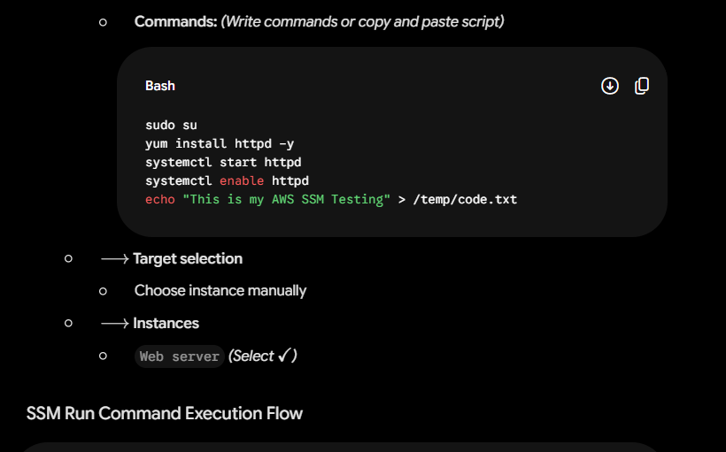


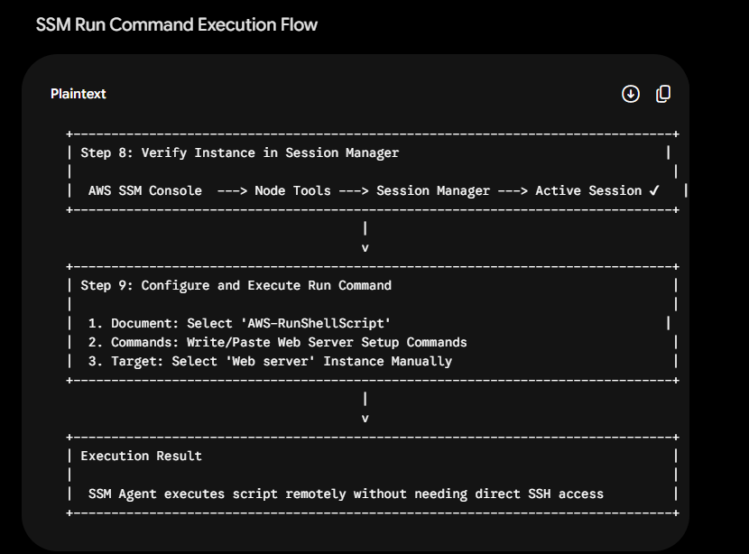

---

### Page (6)

## AWS Systems Manager Lab (Continued)

### **Step 8: Verify Session in Session Manager**

* **Systems Manager (SSM)** *(search)*
* $\longrightarrow$ **Node Tools**
* $\longrightarrow$ **Session Manager**
* $\longrightarrow$ **Sessions**
* $\longrightarrow$ **Session ID** $\quad \mid \quad$ **Instance ID** $\quad (\text{seen} = \text{Yes} \checkmark)$


---

### **Step 9: Execute Commands via Run Command**

* **Node Tools**
* $\longrightarrow$ **Run Command**
* $\longrightarrow$ **Run Command**
* $\longrightarrow$ **Command document**
* `ShellScript` *(Search)*
* $\checkmark$ `AWS-RunShellScript` *(Select $\checkmark$)*


* $\longrightarrow$ **Document version**
* `1 (Default)`


* $\longrightarrow$ **Command parameters**
* **Commands:** *(Write commands or copy and paste script)*
```bash
sudo su
yum install httpd -y
systemctl start httpd
systemctl enable httpd
echo "This is my AWS SSM Testing" > /temp/code.txt

```


* $\longrightarrow$ **Target selection**
* Choose instance manually


* $\longrightarrow$ **Instances**
* `Web server` *(Select $\checkmark$)*


---

### SSM Run Command Execution Flow

```text
  +-------------------------------------------------------------------------------+
  | Step 8: Verify Instance in Session Manager                                   |
  |                                                                               |
  |  AWS SSM Console  ---> Node Tools ---> Session Manager ---> Active Session ✔   |
  +-------------------------------------------------------------------------------+
                                         |
                                         v
  +-------------------------------------------------------------------------------+
  | Step 9: Configure and Execute Run Command                                     |
  |                                                                               |
  |  1. Document: Select 'AWS-RunShellScript'                                    |
  |  2. Commands: Write/Paste Web Server Setup Commands                           |
  |  3. Target: Select 'Web server' Instance Manually                             |
  +-------------------------------------------------------------------------------+
                                         |
                                         v
  +-------------------------------------------------------------------------------+
  | Execution Result                                                              |
  |                                                                               |
  |  SSM Agent executes script remotely without needing direct SSH access         |
  +-------------------------------------------------------------------------------+

```

----------xxxxxxxxxxxx--------------


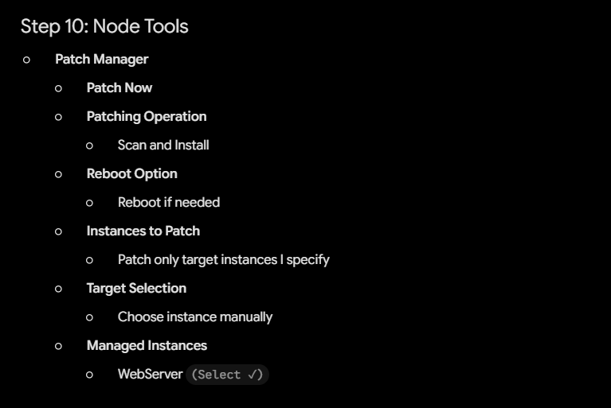


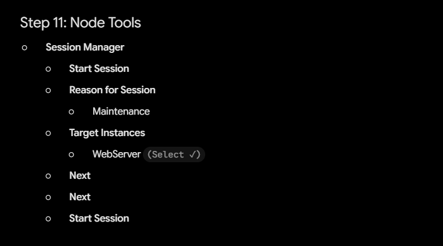


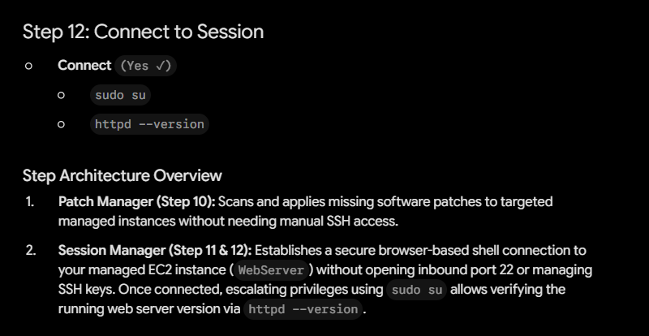


---

## Step 10: Node Tools

* **Patch Manager**
* **Patch Now**
* **Patching Operation**
* Scan and Install


* **Reboot Option**
* Reboot if needed


* **Instances to Patch**
* Patch only target instances I specify


* **Target Selection**
* Choose instance manually


* **Managed Instances**
* WebServer `(Select ✓)`


---

## Step 11: Node Tools

* **Session Manager**
* **Start Session**
* **Reason for Session**
* Maintenance


* **Target Instances**
* WebServer `(Select ✓)`


* **Next**
* **Next**
* **Start Session**


---

## Step 12: Connect to Session

* **Connect** `(Yes ✓)`
* `sudo su`
* `httpd --version`


---

### Step Architecture Overview

1. **Patch Manager (Step 10):** Scans and applies missing software patches to targeted managed instances without needing manual SSH access.
2. **Session Manager (Step 11 & 12):** Establishes a secure browser-based shell connection to your managed EC2 instance (`WebServer`) without opening inbound port 22 or managing SSH keys. Once connected, escalating privileges using `sudo su` allows verifying the running web server version via `httpd --version`.


-------xxxxxxxxxxxx------------


---

## 🎯 Lab Objective

The primary objective of this lab is to demonstrate how to **securely manage, patch, and execute administrative commands on an EC2 instance without opening inbound SSH (Port 22) or RDP ports** in the Security Group.

By utilizing AWS Systems Manager (SSM) agent communication and IAM roles, organizations can eliminate direct public exposure of administrative ports while retaining full shell access and automated patching capabilities.

---

## 💡 Key Takeaways

* **Zero Inbound Port Exposure:** SSM Session Manager allows shell access to EC2 instances through outbound HTTPS communication (TCP port 443) managed by the SSM Agent, requiring no inbound rules for SSH/RDP.
* **IAM-Based Access Control:** Access to servers is governed by AWS IAM policies instead of managing SSH key pairs (`.pem` files), significantly reducing key-management overhead and security risk.
* **Centralized Command Execution:** AWS SSM **Run Command** enables remote execution of scripts across hundreds of instances simultaneously without manual login.
* **Automated Compliance & Patching:** **Patch Manager** allows scheduled or on-demand scanning and installation of operating system patches to keep systems compliant.
* **Auditability:** Every Session Manager connection and executed command can be logged directly to AWS CloudTrail, Amazon S3, or Amazon CloudWatch for security compliance and auditing.

---

## 🌍 Real-World Scenarios & Company Requirements

### Scenario 1: Strict Compliance & Bastion Host Elimination

* **Company Requirement:** A financial institution's security compliance policy strictly bans open SSH ports (Port 22) and public-facing bastion hosts to prevent brute-force attacks and port scanning.
* **How This Lab Helps:** By installing the SSM Agent and assigning the `AmazonSSMManagedInstanceCore` role, engineers can connect securely via the AWS Management Console or AWS CLI using Session Manager—fulfilling zero-inbound-port compliance mandates.

### Scenario 2: Fleet-Wide Fleet Maintenance & Patching

* **Company Requirement:** An e-commerce organization needs to apply critical OS security patches across hundreds of web servers during a low-traffic maintenance window.
* **How This Lab Helps:** Instead of manually connecting to each server via SSH, the DevOps team uses **AWS SSM Patch Manager** and **Run Command** to execute scripts and apply patches automatically across all tagged instances in a single operation.

### Scenario 3: Offboarding & Access Governance

* **Company Requirement:** An enterprise needs to instantly revoke a departing system administrator's access across all cloud infrastructure.
* **How This Lab Helps:** Instead of rotating SSH key pairs across every server, access is instantly controlled by revoking the user's IAM permissions in AWS IAM.

---

## 🧹 Post-Lab Cleanup Instructions

To avoid incurring unnecessary charges on your AWS account, clean up all resources created during this lab in the following order:

### Step 1: Terminate the EC2 Instance

1. Open the **EC2 Console** $\rightarrow$ **Instances**.
2. Select your instance: **Web Server**.
3. Click **Instance state** $\rightarrow$ **Terminate instance**.
4. Confirm termination.

### Step 2: Delete the IAM Role

1. Open the **IAM Console** $\rightarrow$ **Roles**.
2. Search for `EC2-SSM-Role-17-July-26`.
3. Select the role and click **Delete**.
4. Confirm by entering the role name when prompted.

### Step 3: Delete the Security Group

1. Open the **EC2 Console** $\rightarrow$ **Security Groups**.
2. Select `SG-Web`.
3. Click **Actions** $\rightarrow$ **Delete security groups**.
4. Confirm deletion *(Note: Ensure the EC2 instance is completely terminated first, otherwise the Security Group cannot be deleted)*.

-------xxxxxxxxxx-----------