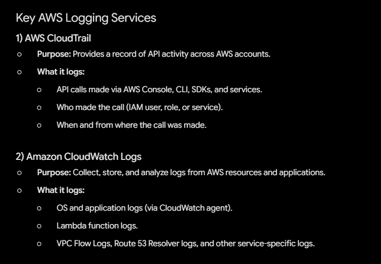


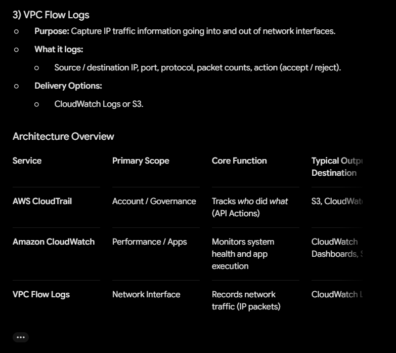


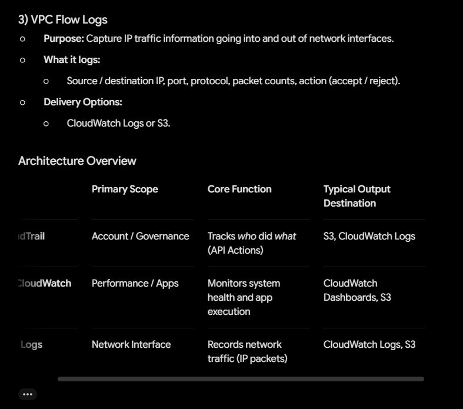

---

## Key AWS Logging Services

### 1) AWS CloudTrail

* **Purpose:** Provides a record of API activity across AWS accounts.
* **What it logs:**
* API calls made via AWS Console, CLI, SDKs, and services.
* Who made the call (IAM user, role, or service).
* When and from where the call was made.


---

### 2) Amazon CloudWatch Logs

* **Purpose:** Collect, store, and analyze logs from AWS resources and applications.
* **What it logs:**
* OS and application logs (via CloudWatch agent).
* Lambda function logs.
* VPC Flow Logs, Route 53 Resolver logs, and other service-specific logs.


---

### 3) VPC Flow Logs

* **Purpose:** Capture IP traffic information going into and out of network interfaces.
* **What it logs:**
* Source / destination IP, port, protocol, packet counts, action (accept / reject).


* **Delivery Options:**
* CloudWatch Logs or S3.


---

### Architecture Overview

| Service | Primary Scope | Core Function | Typical Output Destination |
| --- | --- | --- | --- |
| **AWS CloudTrail** | Account / Governance | Tracks *who* did *what* (API Actions) | S3, CloudWatch Logs |
| **Amazon CloudWatch** | Performance / Apps | Monitors system health and app execution | CloudWatch Dashboards, S3 |
| **VPC Flow Logs** | Network Interface | Records network traffic (IP packets) | CloudWatch Logs, S3 |


---------xxxxxxxxxx-------------


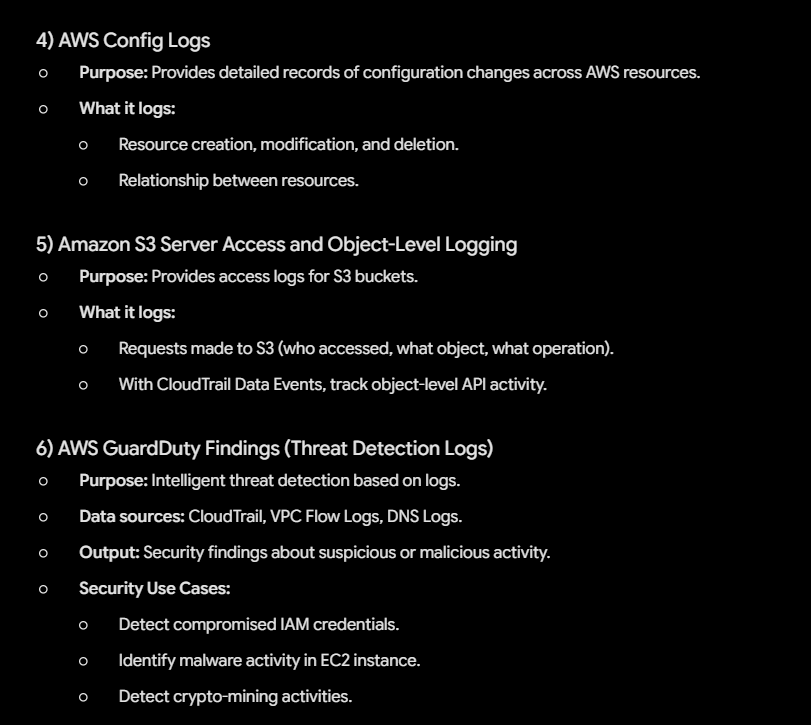


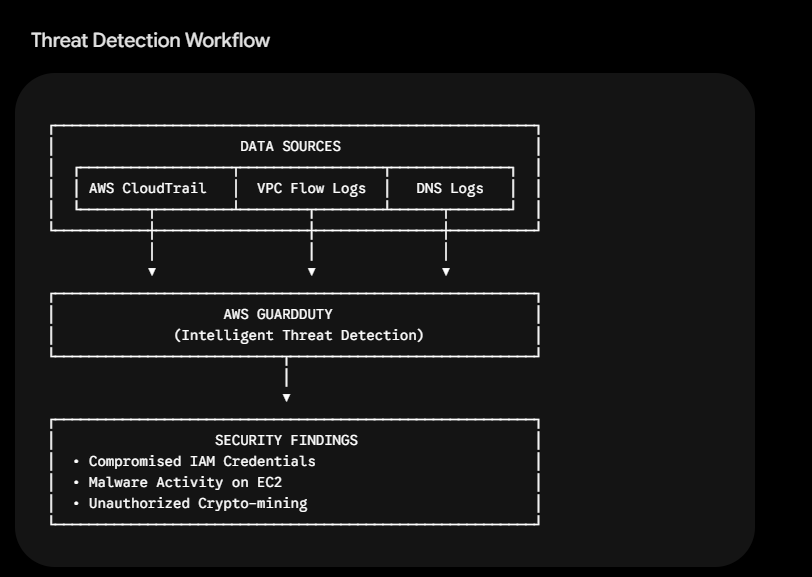


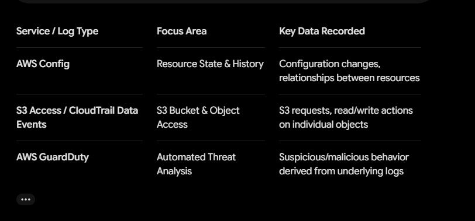

---

### 4) AWS Config Logs

* **Purpose:** Provides detailed records of configuration changes across AWS resources.
* **What it logs:**
* Resource creation, modification, and deletion.
* Relationship between resources.


---

### 5) Amazon S3 Server Access and Object-Level Logging

* **Purpose:** Provides access logs for S3 buckets.
* **What it logs:**
* Requests made to S3 (who accessed, what object, what operation).
* With CloudTrail Data Events, track object-level API activity.


---

### 6) AWS GuardDuty Findings (Threat Detection Logs)

* **Purpose:** Intelligent threat detection based on logs.
* **Data sources:** CloudTrail, VPC Flow Logs, DNS Logs.
* **Output:** Security findings about suspicious or malicious activity.
* **Security Use Cases:**
* Detect compromised IAM credentials.
* Identify malware activity in EC2 instance.
* Detect crypto-mining activities.


---

### Threat Detection Workflow

```
┌─────────────────────────────────────────────────────────┐
│                      DATA SOURCES                       │
│  ┌──────────────────┬─────────────────┬──────────────┐  │
│  │ AWS CloudTrail   │  VPC Flow Logs  │   DNS Logs   │  │
│  └────────┬─────────┴────────┬────────┴──────┬───────┘  │
└───────────┼──────────────────┼───────────────┼──────────┘
            │                  │               │
            ▼                  ▼               ▼
┌─────────────────────────────────────────────────────────┐
│                    AWS GUARDDUTY                        │
│              (Intelligent Threat Detection)             │
└───────────────────────────┬─────────────────────────────┘
                            │
                            ▼
┌─────────────────────────────────────────────────────────┐
│                   SECURITY FINDINGS                     │
│  • Compromised IAM Credentials                          │
│  • Malware Activity on EC2                              │
│  • Unauthorized Crypto-mining                           │
└─────────────────────────────────────────────────────────┘

```

| Service / Log Type | Focus Area | Key Data Recorded |
| --- | --- | --- |
| **AWS Config** | Resource State & History | Configuration changes, relationships between resources |
| **S3 Access / CloudTrail Data Events** | S3 Bucket & Object Access | S3 requests, read/write actions on individual objects |
| **AWS GuardDuty** | Automated Threat Analysis | Suspicious/malicious behavior derived from underlying logs |


----------xxxxxxxxxxx-------------


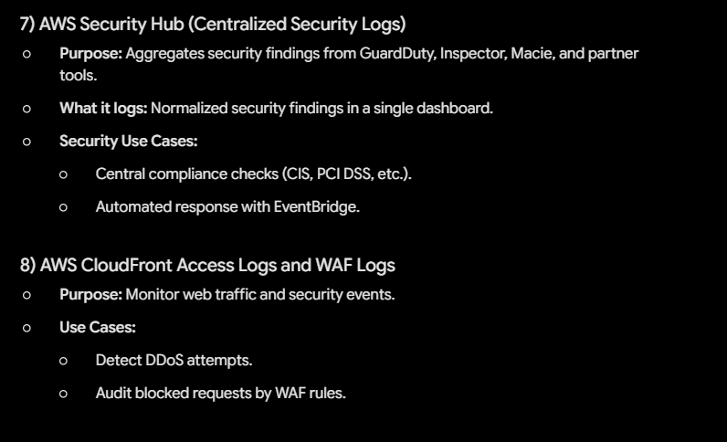


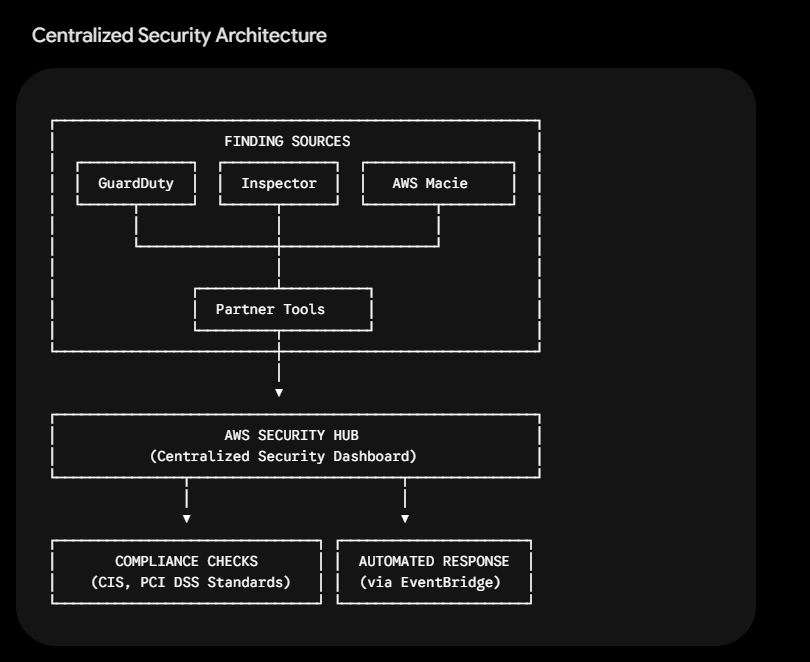


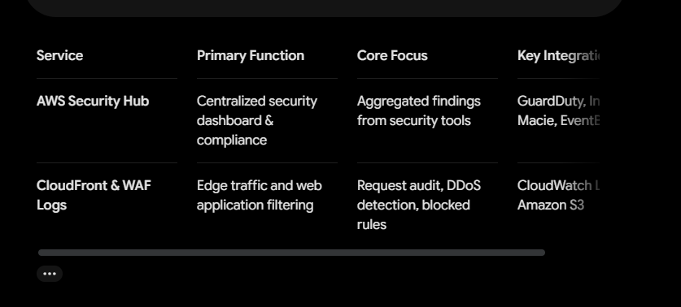


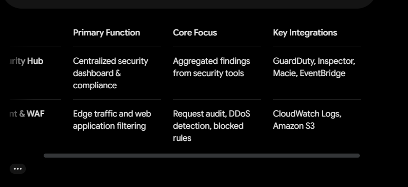

---

### 7) AWS Security Hub (Centralized Security Logs)

* **Purpose:** Aggregates security findings from GuardDuty, Inspector, Macie, and partner tools.
* **What it logs:** Normalized security findings in a single dashboard.
* **Security Use Cases:**
* Central compliance checks (CIS, PCI DSS, etc.).
* Automated response with EventBridge.


---

### 8) AWS CloudFront Access Logs and WAF Logs

* **Purpose:** Monitor web traffic and security events.
* **Use Cases:**
* Detect DDoS attempts.
* Audit blocked requests by WAF rules.


---

### Centralized Security Architecture

```
┌─────────────────────────────────────────────────────────┐
│                    FINDING SOURCES                      │
│  ┌─────────────┐  ┌─────────────┐  ┌─────────────────┐  │
│  │  GuardDuty  │  │  Inspector  │  │   AWS Macie     │  │
│  └──────┬──────┘  └──────┬──────┘  └────────┬────────┘  │
│         │                │                  │           │
│         └────────────────┼──────────────────┘           │
│                          │                              │
│                ┌─────────┴──────────┐                   │
│                │  Partner Tools     │                   │
│                └─────────┬──────────┘                   │
└──────────────────────────┼──────────────────────────────┘
                           │
                           ▼
┌─────────────────────────────────────────────────────────┐
│                    AWS SECURITY HUB                     │
│           (Centralized Security Dashboard)              │
└───────────────┬─────────────────────────┬───────────────┘
                │                         │
                ▼                         ▼
┌───────────────────────────────┐ ┌──────────────────────┐
│       COMPLIANCE CHECKS       │ │  AUTOMATED RESPONSE  │
│    (CIS, PCI DSS Standards)   │ │  (via EventBridge)   │
└───────────────────────────────┘ └──────────────────────┘

```

| Service | Primary Function | Core Focus | Key Integrations |
| --- | --- | --- | --- |
| **AWS Security Hub** | Centralized security dashboard & compliance | Aggregated findings from security tools | GuardDuty, Inspector, Macie, EventBridge |
| **CloudFront & WAF Logs** | Edge traffic and web application filtering | Request audit, DDoS detection, blocked rules | CloudWatch Logs, Amazon S3 |


-----------xxxxxxxxxxxx-------------


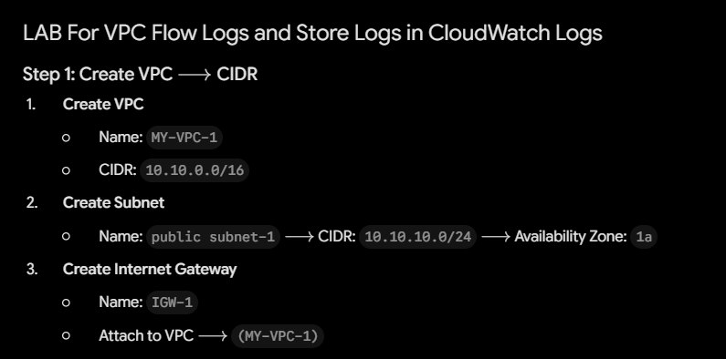


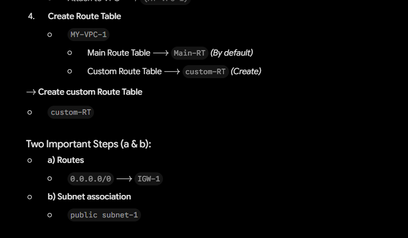


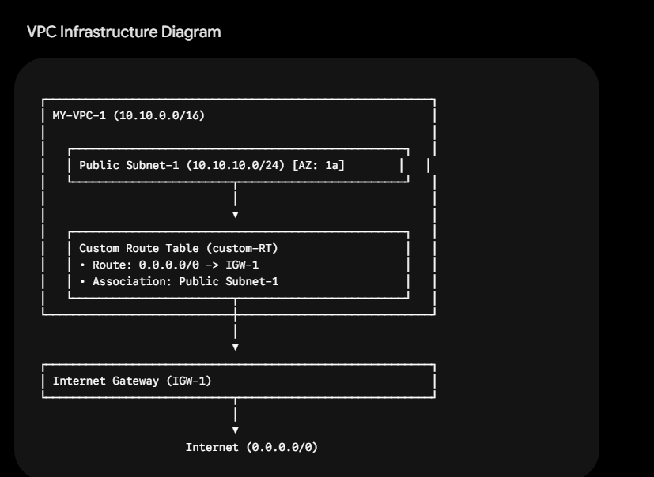


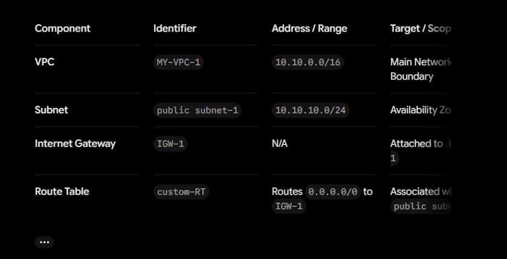


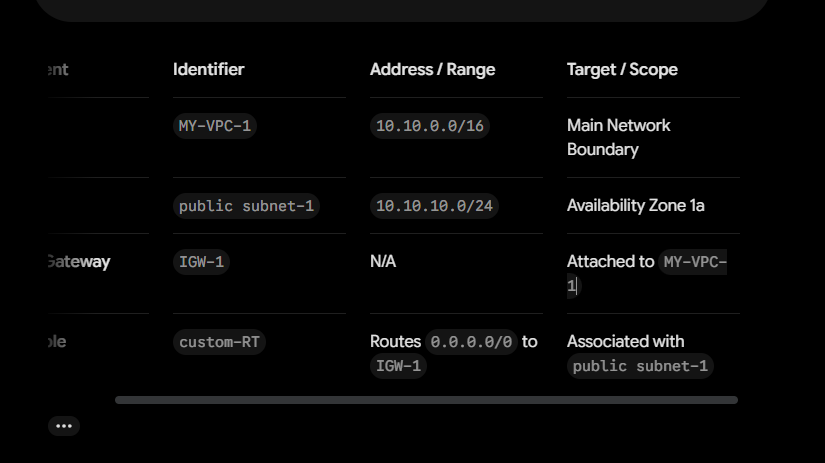


---

## LAB For VPC Flow Logs and Store Logs in CloudWatch Logs

### Step 1: Create VPC $\longrightarrow$ CIDR

1. **Create VPC**
* Name: `MY-VPC-1`
* CIDR: `10.10.0.0/16`


2. **Create Subnet**
* Name: `public subnet-1` $\longrightarrow$ CIDR: `10.10.10.0/24` $\longrightarrow$ Availability Zone: `1a`


3. **Create Internet Gateway**
* Name: `IGW-1`
* Attach to VPC $\longrightarrow$ `(MY-VPC-1)`


4. **Create Route Table**
* `MY-VPC-1`
* Main Route Table $\longrightarrow$ `Main-RT` *(By default)*
* Custom Route Table $\longrightarrow$ `custom-RT` *(Create)*


---

$\rightarrow$ **Create custom Route Table**

* `custom-RT`

#### Two Important Steps (a & b):

* **a) Routes**
* `0.0.0.0/0` $\longrightarrow$ `IGW-1`


* **b) Subnet association**
* `public subnet-1`


---

### VPC Infrastructure Diagram

```
┌──────────────────────────────────────────────────────────┐
│ MY-VPC-1 (10.10.0.0/16)                                  │
│                                                          │
│   ┌──────────────────────────────────────────────────┐   │
│   │ Public Subnet-1 (10.10.10.0/24) [AZ: 1a]        │   │
│   └────────────────────────┬─────────────────────────┘   │
│                            │                             │
│                            ▼                             │
│   ┌──────────────────────────────────────────────────┐   │
│   │ Custom Route Table (custom-RT)                   │   │
│   │ • Route: 0.0.0.0/0 -> IGW-1                      │   │
│   │ • Association: Public Subnet-1                   │   │
│   └────────────────────────┬─────────────────────────┘   │
└────────────────────────────┼─────────────────────────────┘
                             │
                             ▼
┌──────────────────────────────────────────────────────────┐
│ Internet Gateway (IGW-1)                                 │
└────────────────────────────┬─────────────────────────────┘
                             │
                             ▼
                      Internet (0.0.0.0/0)

```

| Component | Identifier | Address / Range | Target / Scope |
| --- | --- | --- | --- |
| **VPC** | `MY-VPC-1` | `10.10.0.0/16` | Main Network Boundary |
| **Subnet** | `public subnet-1` | `10.10.10.0/24` | Availability Zone 1a |
| **Internet Gateway** | `IGW-1` | N/A | Attached to `MY-VPC-1` |
| **Route Table** | `custom-RT` | Routes `0.0.0.0/0` to `IGW-1` | Associated with `public subnet-1` |


------------xxxxxxxxxxxxxx--------------


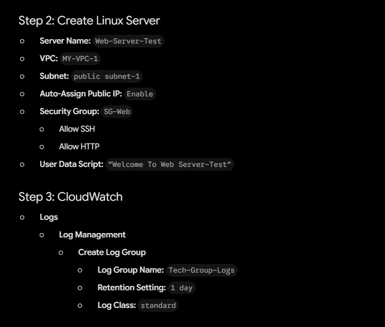


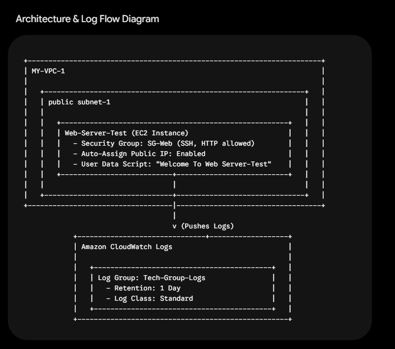

---

## Step 2: Create Linux Server

* **Server Name:** `Web-Server-Test`
* **VPC:** `MY-VPC-1`
* **Subnet:** `public subnet-1`
* **Auto-Assign Public IP:** `Enable`
* **Security Group:** `SG-Web`
* Allow SSH
* Allow HTTP


* **User Data Script:** `"Welcome To Web Server-Test"`

---

## Step 3: CloudWatch

* **Logs**
* **Log Management**
* **Create Log Group**
* **Log Group Name:** `Tech-Group-Logs`
* **Retention Setting:** `1 day`
* **Log Class:** `standard`


---

### Architecture & Log Flow Diagram

```
+-----------------------------------------------------------------------+
| MY-VPC-1                                                              |
|                                                                       |
|   +---------------------------------------------------------------+   |
|   | public subnet-1                                               |   |
|   |                                                               |   |
|   |   +-------------------------------------------------------+   |   |
|   |   | Web-Server-Test (EC2 Instance)                        |   |   |
|   |   |   - Security Group: SG-Web (SSH, HTTP allowed)        |   |   |
|   |   |   - Auto-Assign Public IP: Enabled                    |   |   |
|   |   |   - User Data Script: "Welcome To Web Server-Test"    |   |   |
|   |   +---------------------------+---------------------------+   |   |
|   |                               |                               |   |
|   +-------------------------------+-------------------------------+   |
+-----------------------------------|-----------------------------------+
                                    |
                                    v (Pushes Logs)
            +-------------------------------+-------------------+
            | Amazon CloudWatch Logs                            |
            |                                                   |
            |   +-------------------------------------------+   |
            |   | Log Group: Tech-Group-Logs                |   |
  
            |   |   - Retention: 1 Day                      |   |
            |   |   - Log Class: Standard                   |   |
            |   +-------------------------------------------+   |
            +---------------------------------------------------+

```


-------------xxxxxxxxxxx-------------


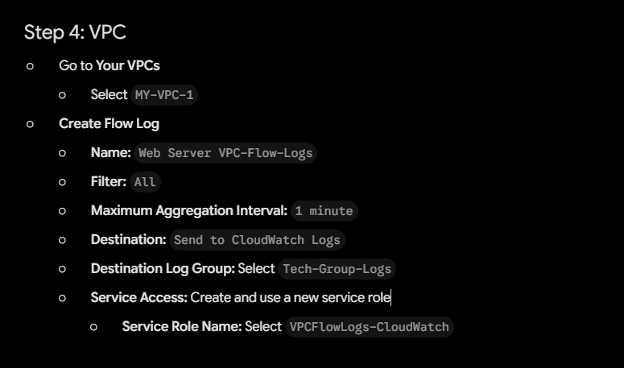


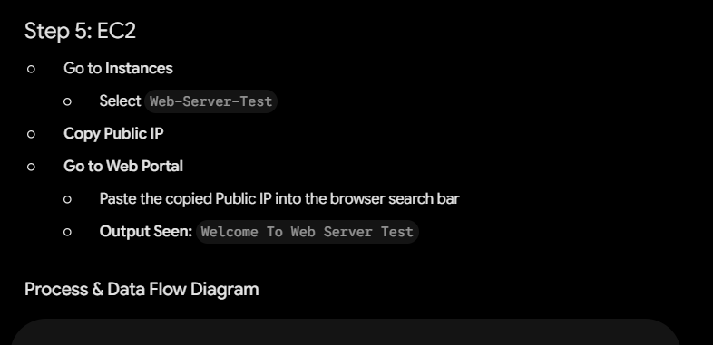


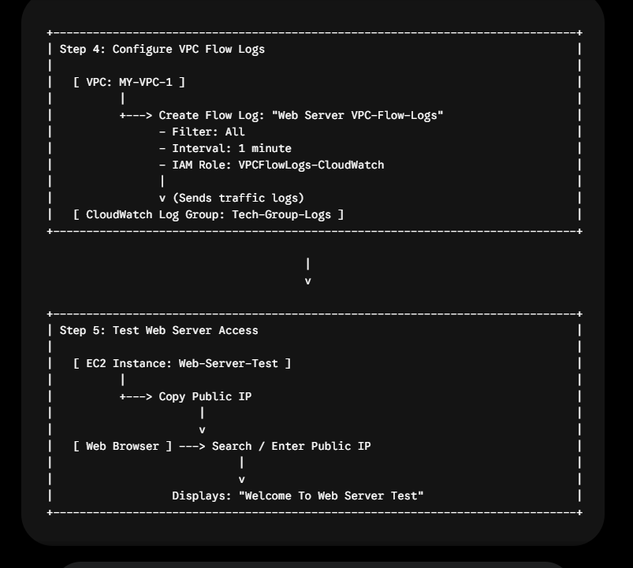


---

## Step 4: VPC

* Go to **Your VPCs**
* Select `MY-VPC-1`


* **Create Flow Log**
* **Name:** `Web Server VPC-Flow-Logs`
* **Filter:** `All`
* **Maximum Aggregation Interval:** `1 minute`
* **Destination:** `Send to CloudWatch Logs`
* **Destination Log Group:** Select `Tech-Group-Logs`
* **Service Access:** Create and use a new service role
* **Service Role Name:** Select `VPCFlowLogs-CloudWatch`


---

## Step 5: EC2

* Go to **Instances**
* Select `Web-Server-Test`


* **Copy Public IP**
* **Go to Web Portal**
* Paste the copied Public IP into the browser search bar
* **Output Seen:** `Welcome To Web Server Test`


---

### Process & Data Flow Diagram

```
+-------------------------------------------------------------------------------+
| Step 4: Configure VPC Flow Logs                                               |
|                                                                               |
|   [ VPC: MY-VPC-1 ]                                                           |
|          |                                                                    |
|          +---> Create Flow Log: "Web Server VPC-Flow-Logs"                    |
|                - Filter: All                                                  |
|                - Interval: 1 minute                                           |
|                - IAM Role: VPCFlowLogs-CloudWatch                             |
|                |                                                              |
|                v (Sends traffic logs)                                         |
|   [ CloudWatch Log Group: Tech-Group-Logs ]                                   |
+-------------------------------------------------------------------------------+

                                       |
                                       v

+-------------------------------------------------------------------------------+
| Step 5: Test Web Server Access                                                |
|                                                                               |
|   [ EC2 Instance: Web-Server-Test ]                                           |
|          |                                                                    |
|          +---> Copy Public IP                                                 |
|                      |                                                        |
|                      v                                                        |
|   [ Web Browser ] ---> Search / Enter Public IP                               |
|                            |                                                  |
|                            v                                                  |
|                  Displays: "Welcome To Web Server Test"                       |
+-------------------------------------------------------------------------------+

```


--------------xxxxxxxxxxxxxxx--------------

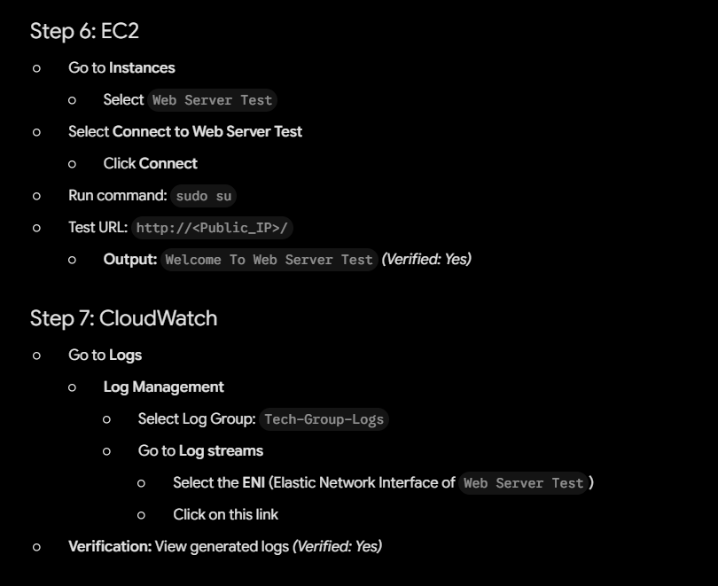


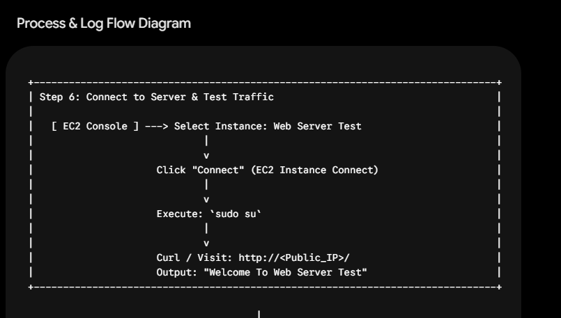


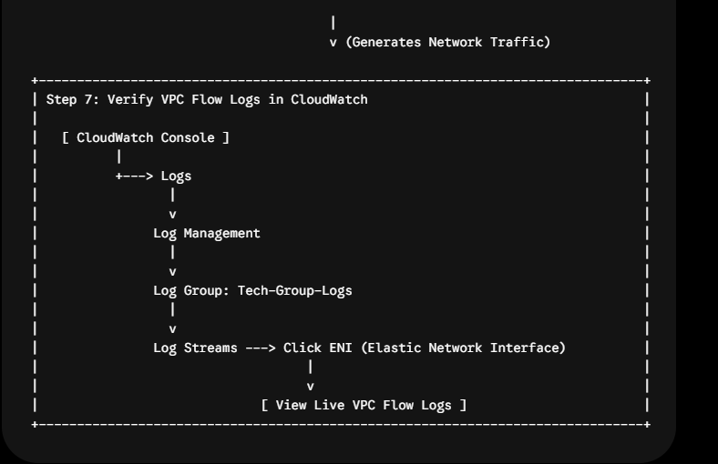


---

## Step 6: EC2

* Go to **Instances**
* Select `Web Server Test`


* Select **Connect to Web Server Test**
* Click **Connect**


* Run command: `sudo su`
* Test URL: `http://<Public_IP>/`
* **Output:** `Welcome To Web Server Test` *(Verified: Yes)*


---

## Step 7: CloudWatch

* Go to **Logs**
* **Log Management**
* Select Log Group: `Tech-Group-Logs`
* Go to **Log streams**
* Select the **ENI** (Elastic Network Interface of `Web Server Test`)
* Click on this link


* **Verification:** View generated logs *(Verified: Yes)*

---

### Process & Log Flow Diagram

```
+-------------------------------------------------------------------------------+
| Step 6: Connect to Server & Test Traffic                                      |
|                                                                               |
|   [ EC2 Console ] ---> Select Instance: Web Server Test                       |
|                             |                                                 |
|                             v                                                 |
|                     Click "Connect" (EC2 Instance Connect)                    |
|                             |                                                 |
|                             v                                                 |
|                     Execute: `sudo su`                                        |
|                             |                                                 |
|                             v                                                 |
|                     Curl / Visit: http://<Public_IP>/                         |
|                     Output: "Welcome To Web Server Test"                      |
+-------------------------------------------------------------------------------+

                                       |
                                       v (Generates Network Traffic)

+-------------------------------------------------------------------------------+
| Step 7: Verify VPC Flow Logs in CloudWatch                                    |
|                                                                               |
|   [ CloudWatch Console ]                                                      |
|          |                                                                    |
|          +---> Logs                                                           |
|                 |                                                             |
|                 v                                                             |
|               Log Management                                                  |
|                 |                                                             |
|                 v                                                             |
|               Log Group: Tech-Group-Logs                                      |
|                 |                                                             |
|                 v                                                             |
|               Log Streams ---> Click ENI (Elastic Network Interface)          |
|                                   |                                           |
|                                   v                                           |
|                             [ View Live VPC Flow Logs ]                       |
+-------------------------------------------------------------------------------+

```


-------------xxxxxxxxxxxxx--------------


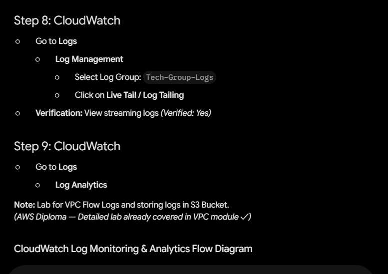


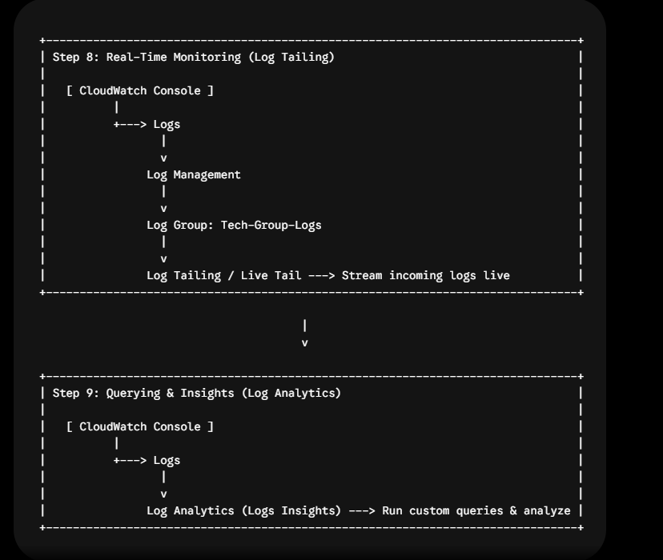


---

## Step 8: CloudWatch

* Go to **Logs**
* **Log Management**
* Select Log Group: `Tech-Group-Logs`
* Click on **Live Tail / Log Tailing**


* **Verification:** View streaming logs *(Verified: Yes)*

---

## Step 9: CloudWatch

* Go to **Logs**
* **Log Analytics**


---

> **Note:** Lab for VPC Flow Logs and storing logs in S3 Bucket.
> *(AWS Diploma — Detailed lab already covered in VPC module ✓)*

---

### CloudWatch Log Monitoring & Analytics Flow Diagram

```
+-------------------------------------------------------------------------------+
| Step 8: Real-Time Monitoring (Log Tailing)                                    |
|                                                                               |
|   [ CloudWatch Console ]                                                      |
|          |                                                                    |
|          +---> Logs                                                           |
|                 |                                                             |
|                 v                                                             |
|               Log Management                                                  |
|                 |                                                             |
|                 v                                                             |
|               Log Group: Tech-Group-Logs                                      |
|                 |                                                             |
|                 v                                                             |
|               Log Tailing / Live Tail ---> Stream incoming logs live          |
+-------------------------------------------------------------------------------+

                                       |
                                       v

+-------------------------------------------------------------------------------+
| Step 9: Querying & Insights (Log Analytics)                                   |
|                                                                               |
|   [ CloudWatch Console ]                                                      |
|          |                                                                    |
|          +---> Logs                                                           |
|                 |                                                             |
|                 v                                                             |
|               Log Analytics (Logs Insights) ---> Run custom queries & analyze |
+-------------------------------------------------------------------------------+

```


------------xxxxxxxxxx-------------


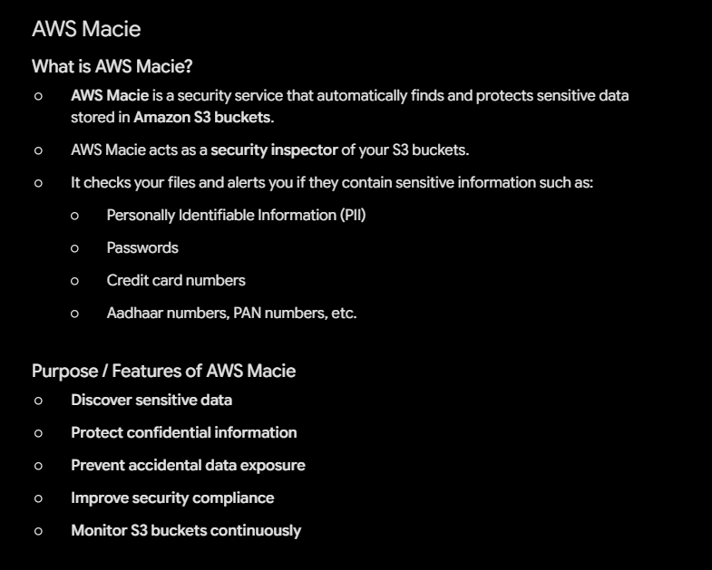


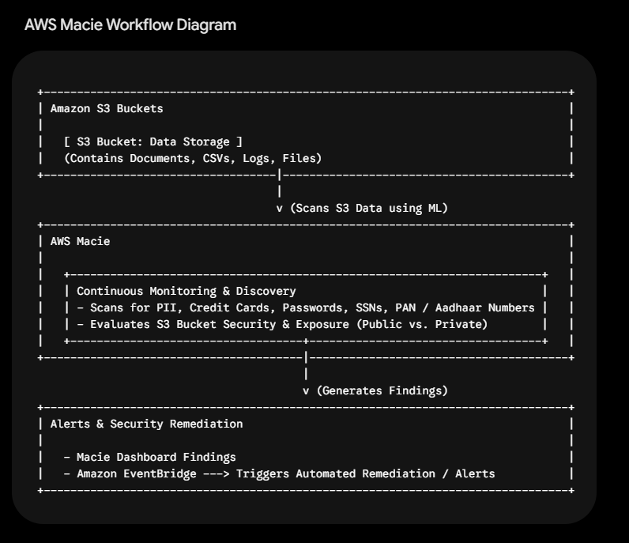


---

## AWS Macie

### What is AWS Macie?

* **AWS Macie** is a security service that automatically finds and protects sensitive data stored in **Amazon S3 buckets**.
* AWS Macie acts as a **security inspector** of your S3 buckets.
* It checks your files and alerts you if they contain sensitive information such as:
* Personally Identifiable Information (PII)
* Passwords
* Credit card numbers
* Aadhaar numbers, PAN numbers, etc.


---

### Purpose / Features of AWS Macie

* **Discover sensitive data**
* **Protect confidential information**
* **Prevent accidental data exposure**
* **Improve security compliance**
* **Monitor S3 buckets continuously**

---

### AWS Macie Workflow Diagram

```
+-------------------------------------------------------------------------------+
| Amazon S3 Buckets                                                             |
|                                                                               |
|   [ S3 Bucket: Data Storage ]                                                 |
|   (Contains Documents, CSVs, Logs, Files)                                     |
+-----------------------------------|-------------------------------------------+
                                    |
                                    v (Scans S3 Data using ML)
+-------------------------------------------------------------------------------+
| AWS Macie                                                                     |
|                                                                               |
|   +-----------------------------------------------------------------------+   |
|   | Continuous Monitoring & Discovery                                     |   |
|   | - Scans for PII, Credit Cards, Passwords, SSNs, PAN / Aadhaar Numbers |   |
|   | - Evaluates S3 Bucket Security & Exposure (Public vs. Private)        |   |
|   +-----------------------------------+-----------------------------------+   |
+---------------------------------------|---------------------------------------+
                                        |
                                        v (Generates Findings)
+-------------------------------------------------------------------------------+
| Alerts & Security Remediation                                                 |
|                                                                               |
|   - Macie Dashboard Findings                                                  |
|   - Amazon EventBridge ---> Triggers Automated Remediation / Alerts           |
+-------------------------------------------------------------------------------+

```


============xxxxxxxxxxxxxxx==========