---
### Class 9
## Lab Objectives

* **Implement VPC Traffic Mirroring:** Learn how to capture, mirror, and analyze live network traffic from an active EC2 instance ENI to a secondary target server without disrupting production workloads.
* **Master Packet Capture Tools:** Configure and execute terminal-based packet capture tools (`tcpdump`) and understand how to export packet captures (`.pcap`) for external inspection (e.g., Wireshark).
* **Establish Private Connectivity:** Securely connect to isolated EC2 instances inside private subnets using AWS EC2 Instance Connect Endpoints (EICE) without assigning public IP addresses or exposing management ports to the internet.
* **Configure Internal DNS Resolution:** Understand VPC DNS settings and establish internal domain name resolution using Route 53 Private Hosted Zones associated with custom VPCs.

---


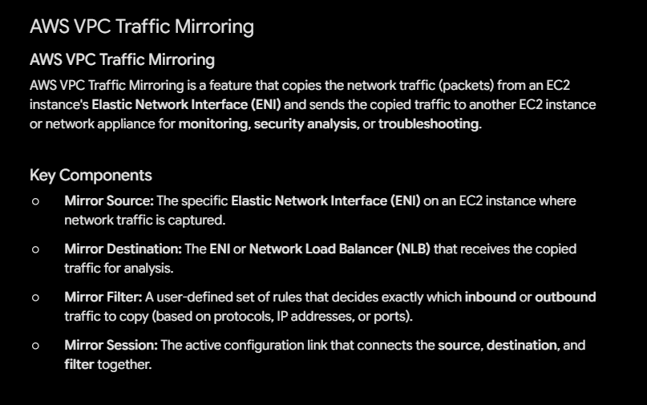


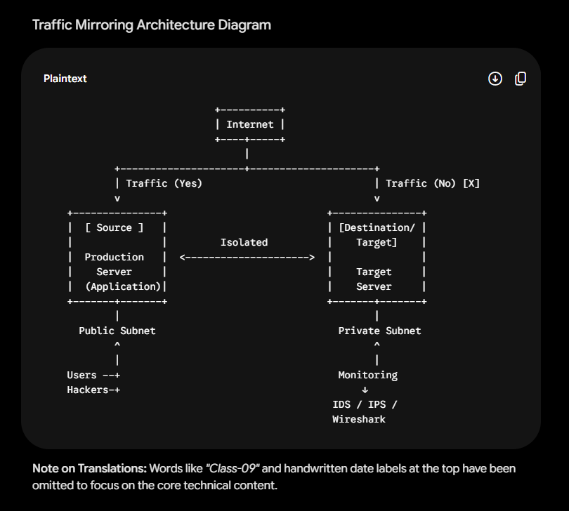


---

## AWS VPC Traffic Mirroring

### AWS VPC Traffic Mirroring

AWS VPC Traffic Mirroring is a feature that copies the network traffic (packets) from an EC2 instance's **Elastic Network Interface (ENI)** and sends the copied traffic to another EC2 instance or network appliance for **monitoring**, **security analysis**, or **troubleshooting**.

---

### Key Components

* **Mirror Source:** The specific **Elastic Network Interface (ENI)** on an EC2 instance where network traffic is captured.
* **Mirror Destination:** The **ENI** or **Network Load Balancer (NLB)** that receives the copied traffic for analysis.
* **Mirror Filter:** A user-defined set of rules that decides exactly which **inbound** or **outbound** traffic to copy (based on protocols, IP addresses, or ports).
* **Mirror Session:** The active configuration link that connects the **source**, **destination**, and **filter** together.

---

### Traffic Mirroring Architecture Diagram

```text
                             +----------+
                             | Internet |
                             +----+-----+
                                  |
            +---------------------+---------------------+
            | Traffic (Yes)                             | Traffic (No) [X]
            v                                           v
    +---------------+                           +---------------+
    |  [ Source ]   |                           | [Destination/ |
    |               |         Isolated          |    Target]    |
    |  Production   |  <--------------------->  |               |
    |    Server     |                           |    Target     |
    |  (Application)|                           |    Server     |
    +-------+-------+                           +-------+-------+
            |                                           |
      Public Subnet                               Private Subnet
            ^                                           ^
            |                                           |
    Users --+                                     Monitoring
    Hackers-+                                         ↓
                                                 IDS / IPS /
                                                 Wireshark

```

---

> **Note on Translations:** Words like *"Class-09"* and handwritten date labels at the top have been omitted to focus on the core technical content.

--------xxxxxxxxxxxx----------------


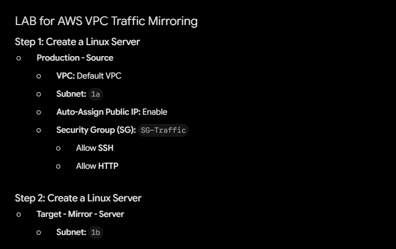


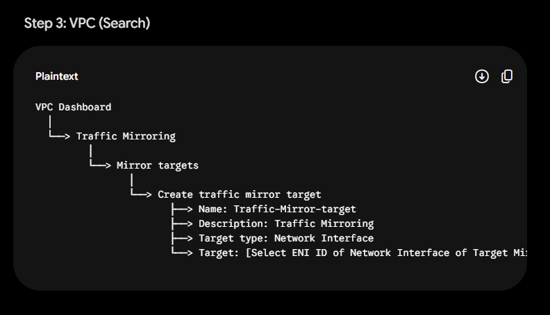


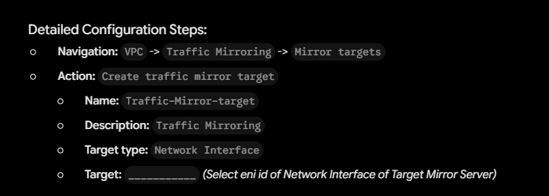


---

## LAB for AWS VPC Traffic Mirroring

### Step 1: Create a Linux Server

* **Production - Source**
* **VPC:** Default VPC
* **Subnet:** `1a`
* **Auto-Assign Public IP:** Enable
* **Security Group (SG):** `SG-Traffic`
* Allow **SSH**
* Allow **HTTP**


---

### Step 2: Create a Linux Server

* **Target - Mirror - Server**
* **Subnet:** `1b`


---

### Step 3: VPC (Search)

```text
VPC Dashboard
  │
  └──> Traffic Mirroring
         │
         └──> Mirror targets
                │
                └──> Create traffic mirror target
                       ├──> Name: Traffic-Mirror-target
                       ├──> Description: Traffic Mirroring
                       ├──> Target type: Network Interface
                       └──> Target: [Select ENI ID of Network Interface of Target Mirror Server]

```

#### Detailed Configuration Steps:

* **Navigation:** `VPC` -> `Traffic Mirroring` -> `Mirror targets`
* **Action:** `Create traffic mirror target`
* **Name:** `Traffic-Mirror-target`
* **Description:** `Traffic Mirroring`
* **Target type:** `Network Interface`
* **Target:** `___________` *(Select eni id of Network Interface of Target Mirror Server)*


------------xxxxxxxxxxxxxx--------------


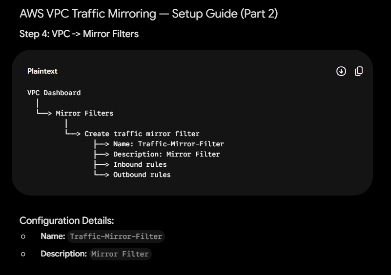


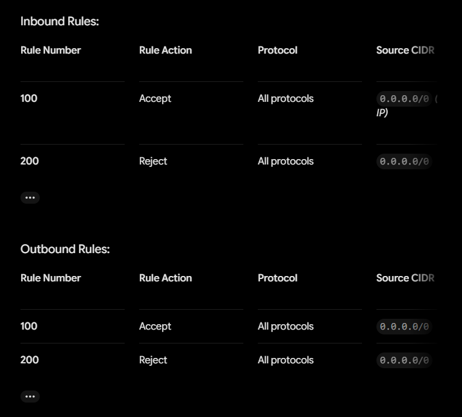


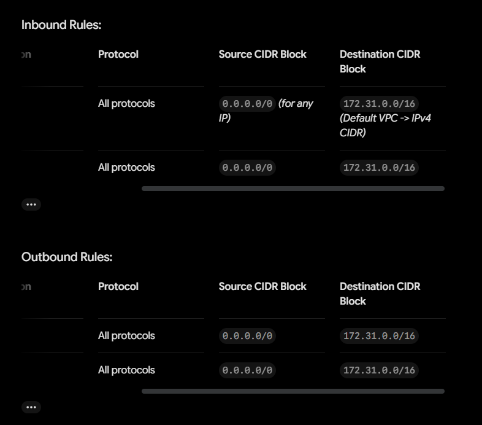


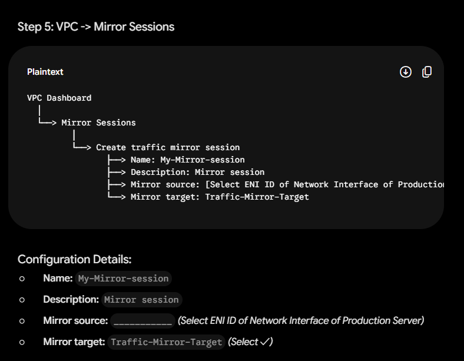


---

## AWS VPC Traffic Mirroring — Setup Guide (Part 2)

### Step 4: VPC -> Mirror Filters

```text
VPC Dashboard
  │
  └──> Mirror Filters
         │
         └──> Create traffic mirror filter
                ├──> Name: Traffic-Mirror-Filter
                ├──> Description: Mirror Filter
                ├──> Inbound rules
                └──> Outbound rules

```

#### Configuration Details:

* **Name:** `Traffic-Mirror-Filter`
* **Description:** `Mirror Filter`

#### Inbound Rules:

| Rule Number | Rule Action | Protocol | Source CIDR Block | Destination CIDR Block |
| --- | --- | --- | --- | --- |
| **100** | Accept | All protocols | `0.0.0.0/0` *(for any IP)* | `172.31.0.0/16` *(Default VPC -> IPv4 CIDR)* |
| **200** | Reject | All protocols | `0.0.0.0/0` | `172.31.0.0/16` |

#### Outbound Rules:

| Rule Number | Rule Action | Protocol | Source CIDR Block | Destination CIDR Block |
| --- | --- | --- | --- | --- |
| **100** | Accept | All protocols | `0.0.0.0/0` | `172.31.0.0/16` |
| **200** | Reject | All protocols | `0.0.0.0/0` | `172.31.0.0/16` |

---

### Step 5: VPC -> Mirror Sessions

```text
VPC Dashboard
  │
  └──> Mirror Sessions
         │
         └──> Create traffic mirror session
                ├──> Name: My-Mirror-session
                ├──> Description: Mirror session
                ├──> Mirror source: [Select ENI ID of Network Interface of Production Server]
                └──> Mirror target: Traffic-Mirror-Target

```

#### Configuration Details:

* **Name:** `My-Mirror-session`
* **Description:** `Mirror session`
* **Mirror source:** `___________` *(Select ENI ID of Network Interface of Production Server)*
* **Mirror target:** `Traffic-Mirror-Target` *(Select ✓)*


-----------xxxxxxxxxxxxx--------------


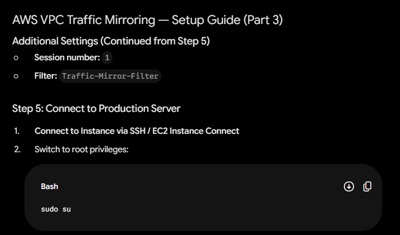


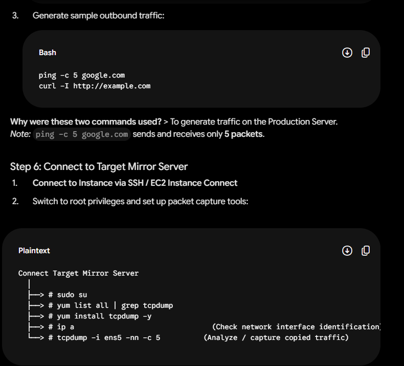


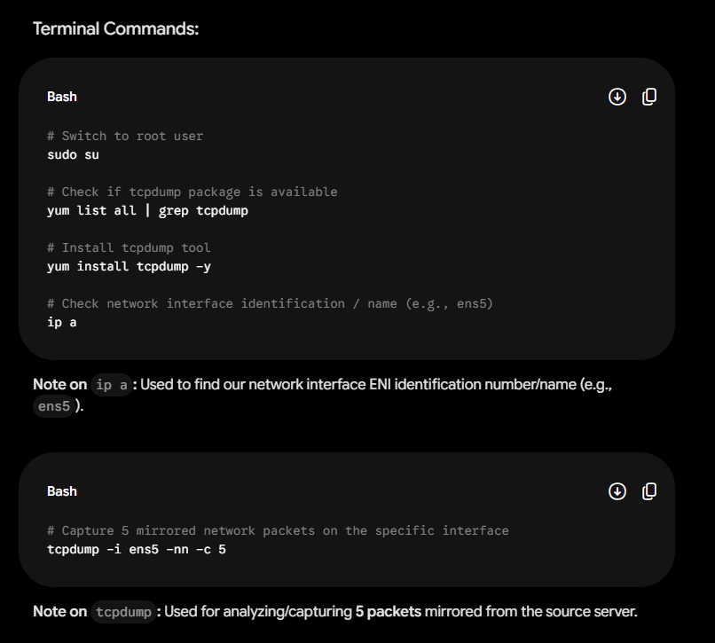


---

## AWS VPC Traffic Mirroring — Setup Guide (Part 3)

### Additional Settings (Continued from Step 5)

* **Session number:** `1`
* **Filter:** `Traffic-Mirror-Filter`

---

### Step 5: Connect to Production Server

1. **Connect to Instance via SSH / EC2 Instance Connect**
2. Switch to root privileges:
```bash
sudo su

```


3. Generate sample outbound traffic:
```bash
ping -c 5 google.com
curl -I http://example.com

```


> **Why were these two commands used?** > To generate traffic on the Production Server.
> *Note:* `ping -c 5 google.com` sends and receives only **5 packets**.

---

### Step 6: Connect to Target Mirror Server

1. **Connect to Instance via SSH / EC2 Instance Connect**
2. Switch to root privileges and set up packet capture tools:

```text
Connect Target Mirror Server
  │
  ├──> # sudo su
  ├──> # yum list all | grep tcpdump
  ├──> # yum install tcpdump -y
  ├──> # ip a                                (Check network interface identification)
  └──> # tcpdump -i ens5 -nn -c 5          (Analyze / capture copied traffic)

```

#### Terminal Commands:

```bash
# Switch to root user
sudo su

# Check if tcpdump package is available
yum list all | grep tcpdump

# Install tcpdump tool
yum install tcpdump -y

# Check network interface identification / name (e.g., ens5)
ip a

```

> **Note on `ip a`:** Used to find our network interface ENI identification number/name (e.g., `ens5`).

```bash
# Capture 5 mirrored network packets on the specific interface
tcpdump -i ens5 -nn -c 5

```

> **Note on `tcpdump`:** Used for analyzing/capturing **5 packets** mirrored from the source server.

-----------xxxxxxxxxxxxxx-------------


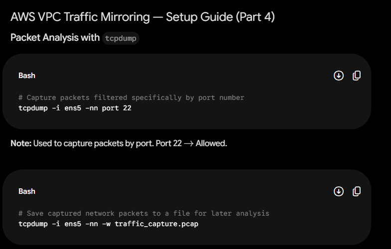


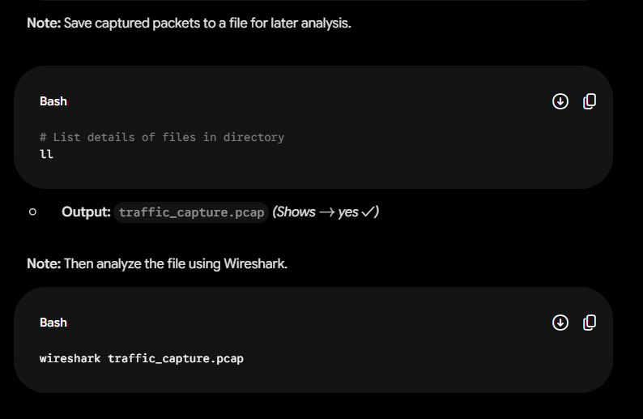


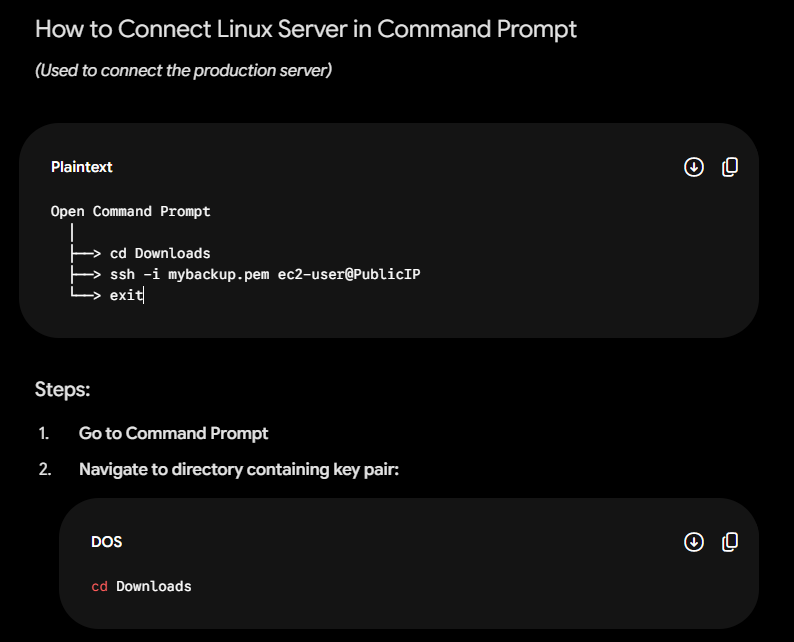


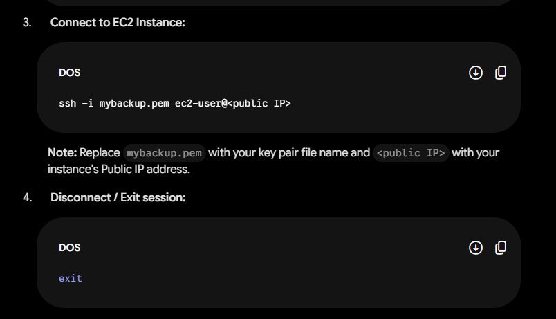


---

## AWS VPC Traffic Mirroring — Setup Guide (Part 4)

### Packet Analysis with `tcpdump`

```bash
# Capture packets filtered specifically by port number
tcpdump -i ens5 -nn port 22

```

> **Note:** Used to capture packets by port. Port 22 $\rightarrow$ Allowed.

```bash
# Save captured network packets to a file for later analysis
tcpdump -i ens5 -nn -w traffic_capture.pcap

```

> **Note:** Save captured packets to a file for later analysis.

```bash
# List details of files in directory
ll

```

* **Output:** `traffic_capture.pcap` *(Shows $\rightarrow$ yes ✓)*

---

> **Note:** Then analyze the file using Wireshark.
> ```bash
> wireshark traffic_capture.pcap
> 
> ```
> 
> 

---

## How to Connect Linux Server in Command Prompt

*(Used to connect the production server)*

```text
Open Command Prompt
  │
  ├──> cd Downloads
  ├──> ssh -i mybackup.pem ec2-user@PublicIP
  └──> exit

```

### Steps:

1. **Go to Command Prompt**
2. **Navigate to directory containing key pair:**
```cmd
cd Downloads

```


3. **Connect to EC2 Instance:**
```cmd
ssh -i mybackup.pem ec2-user@<public IP>

```


> **Note:** Replace `mybackup.pem` with your key pair file name and `<public IP>` with your instance's Public IP address.


4. **Disconnect / Exit session:**
```cmd
exit

```


------------xxxxxxxxxxxxx-------------


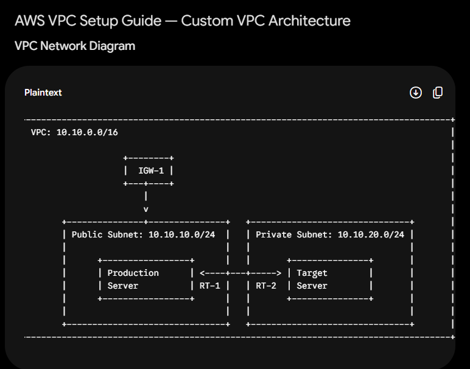


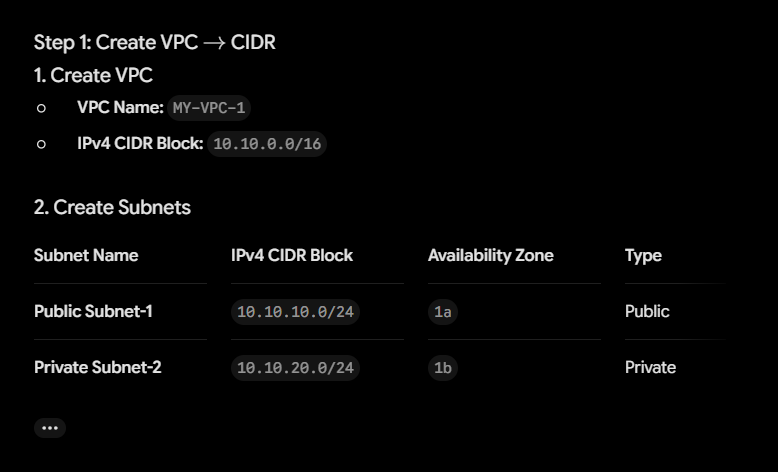


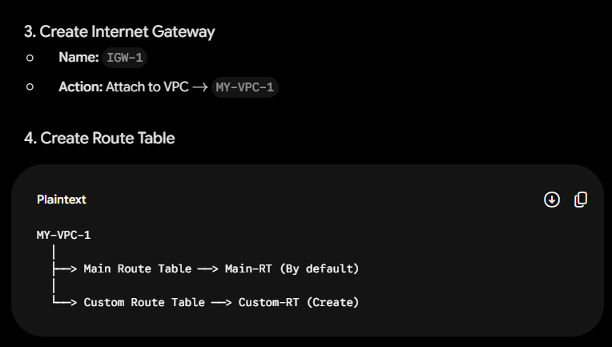


---

## AWS VPC Setup Guide — Custom VPC Architecture

### VPC Network Diagram

```text
+-----------------------------------------------------------------------------------+
| VPC: 10.10.0.0/16                                                                 |
|                                                                                   |
|                   +--------+                                                      |
|                   |  IGW-1 |                                                      |
|                   +---+----+                                                      |
|                       |                                                           |
|                       v                                                           |
|       +---------------+---------------+   +-------------------------------+       |
|       | Public Subnet: 10.10.10.0/24  |   | Private Subnet: 10.10.20.0/24 |       |
|       |                               |   |                               |       |
|       |      +-----------------+      |   |       +---------------+       |       |
|       |      | Production      | <----+---+-----> | Target        |       |       |
|       |      | Server          | RT-1 |   | RT-2  | Server        |       |       |
|       |      +-----------------+      |   |       +---------------+       |       |
|       |                               |   |                               |       |
|       +-------------------------------+   +-------------------------------+       |
+-----------------------------------------------------------------------------------+

```

---

### Step 1: Create VPC $\rightarrow$ CIDR

#### 1. Create VPC

* **VPC Name:** `MY-VPC-1`
* **IPv4 CIDR Block:** `10.10.0.0/16`

#### 2. Create Subnets

| Subnet Name | IPv4 CIDR Block | Availability Zone | Type |
| --- | --- | --- | --- |
| **Public Subnet-1** | `10.10.10.0/24` | `1a` | Public |
| **Private Subnet-2** | `10.10.20.0/24` | `1b` | Private |

#### 3. Create Internet Gateway

* **Name:** `IGW-1`
* **Action:** Attach to VPC $\rightarrow$ `MY-VPC-1`

#### 4. Create Route Table

```text
MY-VPC-1
  │
  ├──> Main Route Table ──> Main-RT (By default)
  │
  └──> Custom Route Table ──> Custom-RT (Create)

```

---------xxxxxxxxxx-----------


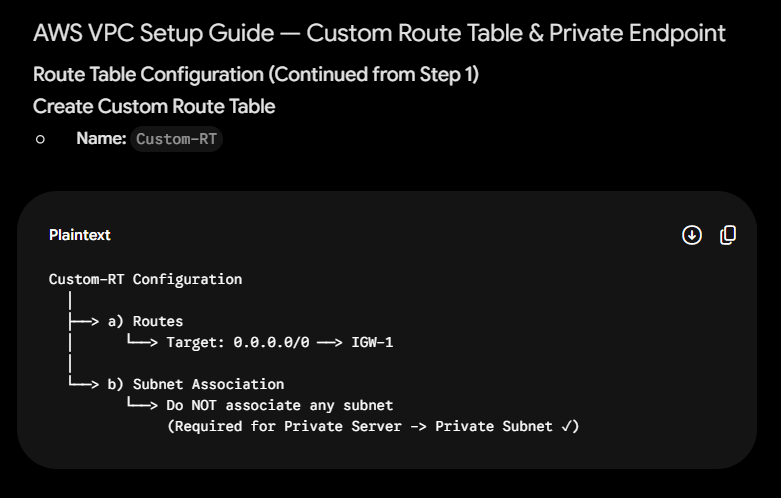


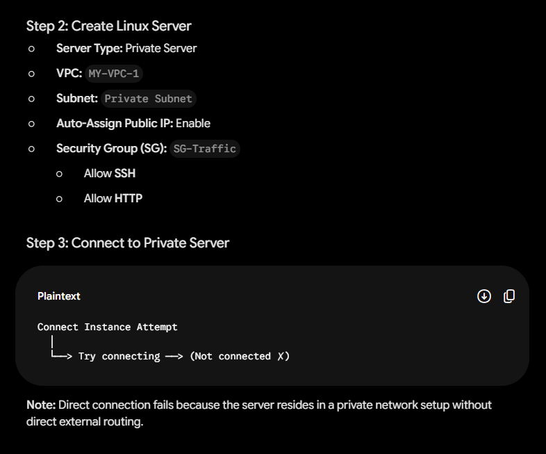


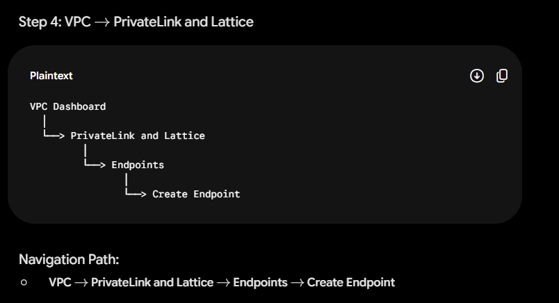


---

## AWS VPC Setup Guide — Custom Route Table & Private Endpoint

### Route Table Configuration (Continued from Step 1)

#### Create Custom Route Table

* **Name:** `Custom-RT`

```text
Custom-RT Configuration
  │
  ├──> a) Routes
  │      └──> Target: 0.0.0.0/0 ──> IGW-1
  │
  └──> b) Subnet Association
         └──> Do NOT associate any subnet 
              (Required for Private Server -> Private Subnet ✓)

```

---

### Step 2: Create Linux Server

* **Server Type:** Private Server
* **VPC:** `MY-VPC-1`
* **Subnet:** `Private Subnet`
* **Auto-Assign Public IP:** Enable
* **Security Group (SG):** `SG-Traffic`
* Allow **SSH**
* Allow **HTTP**


---

### Step 3: Connect to Private Server

```text
Connect Instance Attempt
  │
  └──> Try connecting ──> (Not connected ✗)

```

> **Note:** Direct connection fails because the server resides in a private network setup without direct external routing.

---

### Step 4: VPC $\rightarrow$ PrivateLink and Lattice

```text
VPC Dashboard
  │
  └──> PrivateLink and Lattice
         │
         └──> Endpoints
                │
                └──> Create Endpoint

```

#### Navigation Path:

* **VPC** $\rightarrow$ **PrivateLink and Lattice** $\rightarrow$ **Endpoints** $\rightarrow$ **Create Endpoint**


------------xxxxxxxxxxxxxxx---------------


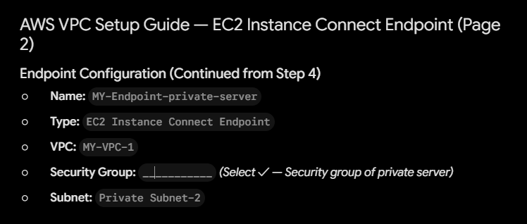


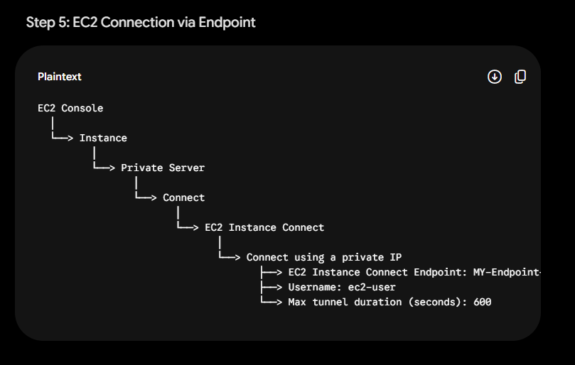


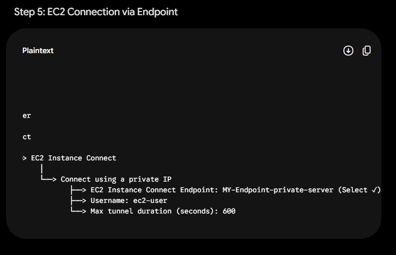


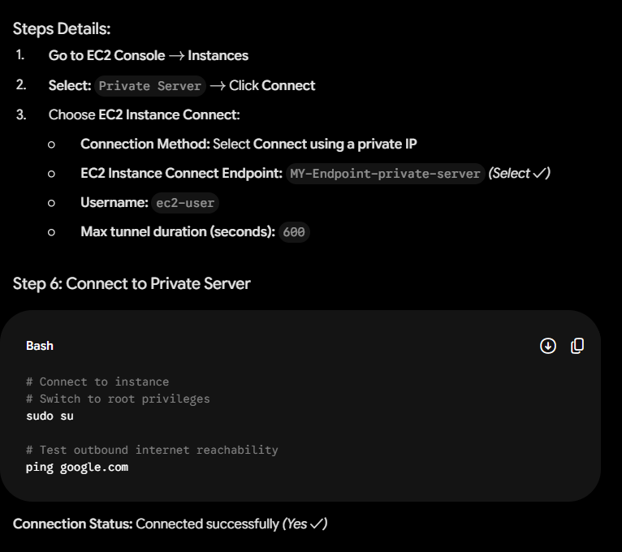


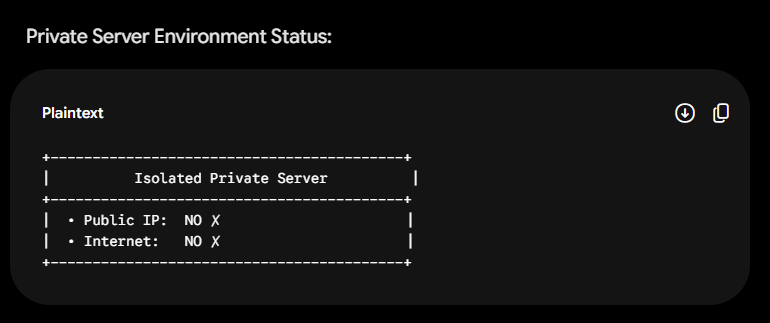
---

## AWS VPC Setup Guide — EC2 Instance Connect Endpoint (Page 2)

### Endpoint Configuration (Continued from Step 4)

* **Name:** `MY-Endpoint-private-server`
* **Type:** `EC2 Instance Connect Endpoint`
* **VPC:** `MY-VPC-1`
* **Security Group:** `___________` *(Select ✓ — Security group of private server)*
* **Subnet:** `Private Subnet-2`

---

### Step 5: EC2 Connection via Endpoint

```text
EC2 Console
  │
  └──> Instance
         │
         └──> Private Server
                │
                └──> Connect
                       │
                       └──> EC2 Instance Connect
                              │
                              └──> Connect using a private IP
                                     ├──> EC2 Instance Connect Endpoint: MY-Endpoint-private-server (Select ✓)
                                     ├──> Username: ec2-user
                                     └──> Max tunnel duration (seconds): 600

```

#### Steps Details:

1. **Go to EC2 Console** $\rightarrow$ **Instances**
2. **Select:** `Private Server` $\rightarrow$ Click **Connect**
3. Choose **EC2 Instance Connect**:
* **Connection Method:** Select **Connect using a private IP**
* **EC2 Instance Connect Endpoint:** `MY-Endpoint-private-server` *(Select ✓)*
* **Username:** `ec2-user`
* **Max tunnel duration (seconds):** `600`


---

### Step 6: Connect to Private Server

```bash
# Connect to instance
# Switch to root privileges
sudo su

# Test outbound internet reachability
ping google.com

```

> **Connection Status:** Connected successfully *(Yes ✓)*

#### Private Server Environment Status:

```text
+------------------------------------------+
|          Isolated Private Server          |
+------------------------------------------+
|  • Public IP:  NO ✗                      |
|  • Internet:   NO ✗                      |
+------------------------------------------+

```


-----------xxxxxxxxxxxx--------------


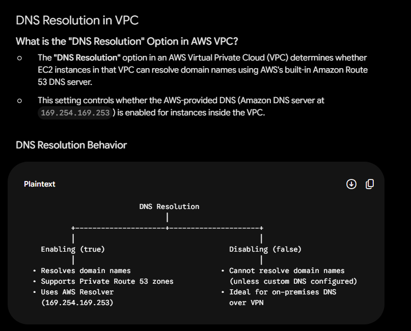


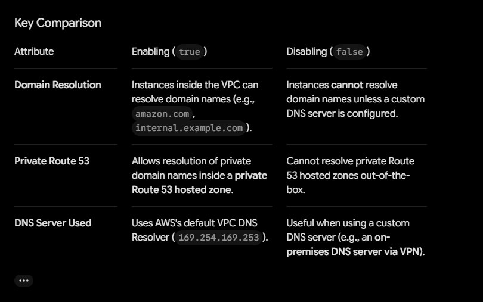


---

## DNS Resolution in VPC

### What is the "DNS Resolution" Option in AWS VPC?

* The **"DNS Resolution"** option in an AWS Virtual Private Cloud (VPC) determines whether EC2 instances in that VPC can resolve domain names using AWS's built-in Amazon Route 53 DNS server.
* This setting controls whether the AWS-provided DNS (Amazon DNS server at `169.254.169.253`) is enabled for instances inside the VPC.

---

### DNS Resolution Behavior

```text
                           DNS Resolution
                                 │
           +---------------------+---------------------+
           │                                           │
    Enabling (true)                             Disabling (false)
           │                                           │
  • Resolves domain names                     • Cannot resolve domain names
  • Supports Private Route 53 zones             (unless custom DNS configured)
  • Uses AWS Resolver                         • Ideal for on-premises DNS
    (169.254.169.253)                           over VPN

```

---

### Key Comparison

| Attribute | Enabling (`true`) | Disabling (`false`) |
| --- | --- | --- |
| **Domain Resolution** | Instances inside the VPC can resolve domain names (e.g., `amazon.com`, `internal.example.com`). | Instances **cannot** resolve domain names unless a custom DNS server is configured. |
| **Private Route 53** | Allows resolution of private domain names inside a **private Route 53 hosted zone**. | Cannot resolve private Route 53 hosted zones out-of-the-box. |
| **DNS Server Used** | Uses AWS's default VPC DNS Resolver (`169.254.169.253`). | Useful when using a custom DNS server (e.g., an **on-premises DNS server via VPN**). |


-----------xxxxxxxxxxxx------------


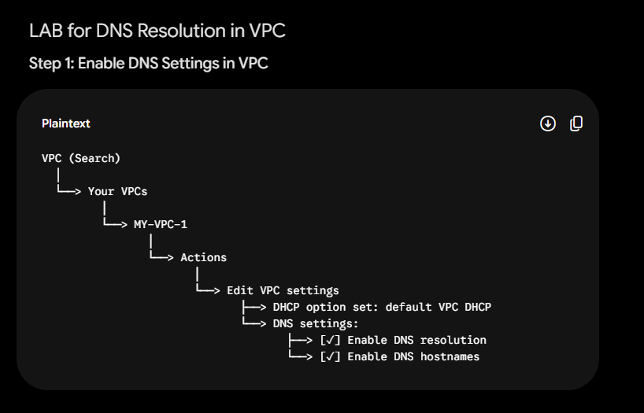


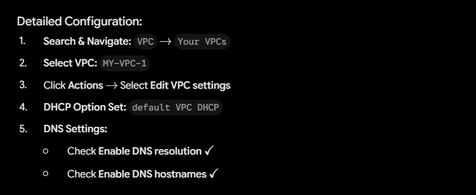


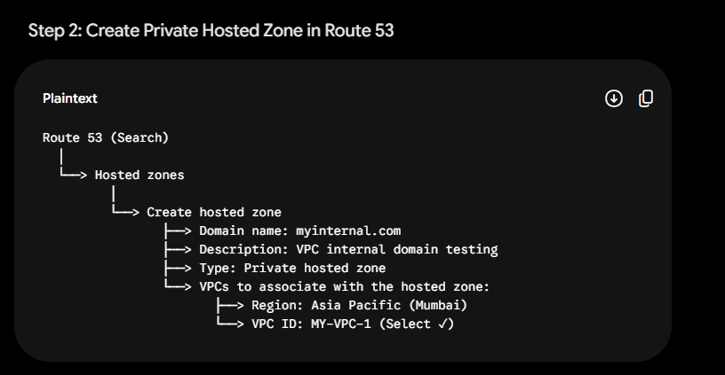


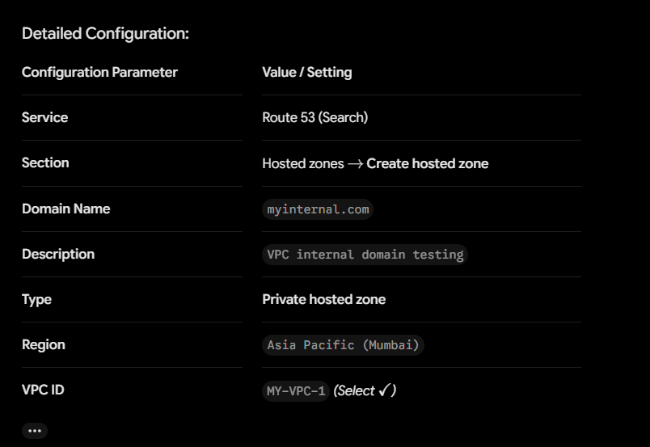

---

## LAB for DNS Resolution in VPC

### Step 1: Enable DNS Settings in VPC

```text
VPC (Search)
  │
  └──> Your VPCs
         │
         └──> MY-VPC-1
                │
                └──> Actions
                       │
                       └──> Edit VPC settings
                              ├──> DHCP option set: default VPC DHCP
                              └──> DNS settings:
                                     ├──> [✓] Enable DNS resolution
                                     └──> [✓] Enable DNS hostnames

```

#### Detailed Configuration:

1. **Search & Navigate:** `VPC` $\rightarrow$ `Your VPCs`
2. **Select VPC:** `MY-VPC-1`
3. Click **Actions** $\rightarrow$ Select **Edit VPC settings**
4. **DHCP Option Set:** `default VPC DHCP`
5. **DNS Settings:**
* Check **Enable DNS resolution** $\checkmark$
* Check **Enable DNS hostnames** $\checkmark$


---

### Step 2: Create Private Hosted Zone in Route 53

```text
Route 53 (Search)
  │
  └──> Hosted zones
         │
         └──> Create hosted zone
                ├──> Domain name: myinternal.com
                ├──> Description: VPC internal domain testing
                ├──> Type: Private hosted zone
                └──> VPCs to associate with the hosted zone:
                       ├──> Region: Asia Pacific (Mumbai)
                       └──> VPC ID: MY-VPC-1 (Select ✓)

```

#### Detailed Configuration:

| Configuration Parameter | Value / Setting |
| --- | --- |
| **Service** | Route 53 (Search) |
| **Section** | Hosted zones $\rightarrow$ **Create hosted zone** |
| **Domain Name** | `myinternal.com` |
| **Description** | `VPC internal domain testing` |
| **Type** | **Private hosted zone** |
| **Region** | `Asia Pacific (Mumbai)` |
| **VPC ID** | `MY-VPC-1` *(Select $\checkmark$)* |


----------xxxxxxxxxxx------------------


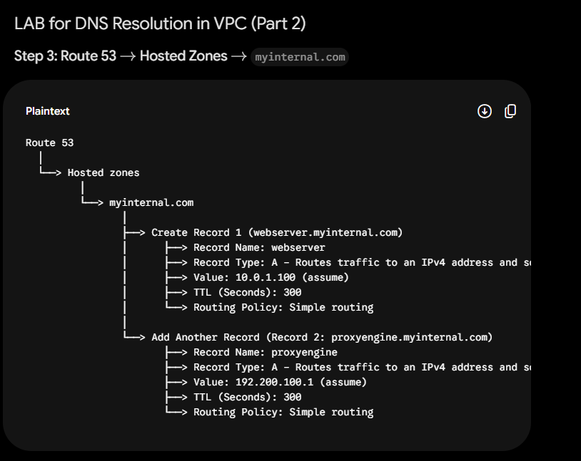


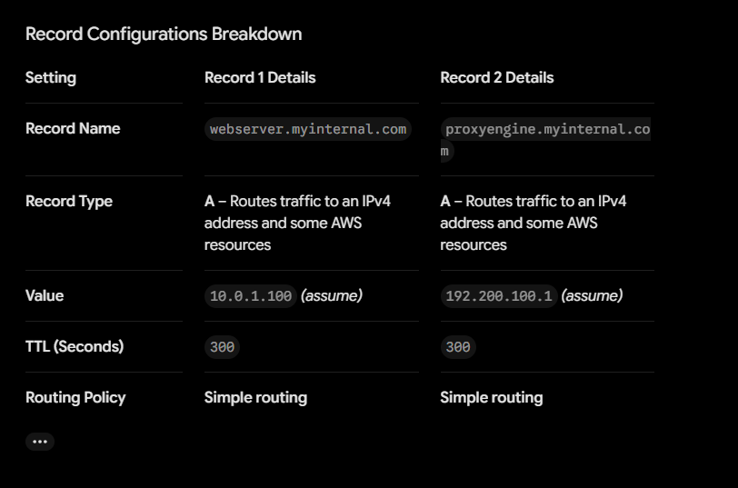


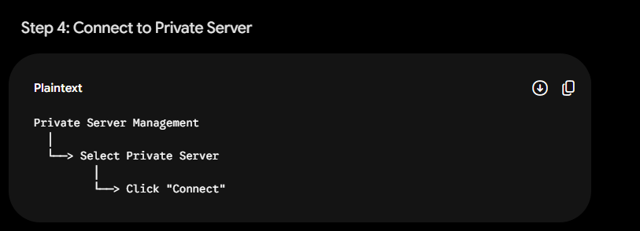

---

## LAB for DNS Resolution in VPC (Part 2)

### Step 3: Route 53 $\rightarrow$ Hosted Zones $\rightarrow$ `myinternal.com`

```text
Route 53
  │
  └──> Hosted zones
         │
         └──> myinternal.com
                │
                ├──> Create Record 1 (webserver.myinternal.com)
                │      ├──> Record Name: webserver
                │      ├──> Record Type: A - Routes traffic to an IPv4 address and some AWS resources
                │      ├──> Value: 10.0.1.100 (assume)
                │      ├──> TTL (Seconds): 300
                │      └──> Routing Policy: Simple routing
                │
                └──> Add Another Record (Record 2: proxyengine.myinternal.com)
                       ├──> Record Name: proxyengine
                       ├──> Record Type: A - Routes traffic to an IPv4 address and some AWS resources
                       ├──> Value: 192.200.100.1 (assume)
                       ├──> TTL (Seconds): 300
                       └──> Routing Policy: Simple routing

```

---

#### Record Configurations Breakdown

| Setting | Record 1 Details | Record 2 Details |
| --- | --- | --- |
| **Record Name** | `webserver.myinternal.com` | `proxyengine.myinternal.com` |
| **Record Type** | **A** – Routes traffic to an IPv4 address and some AWS resources | **A** – Routes traffic to an IPv4 address and some AWS resources |
| **Value** | `10.0.1.100` *(assume)* | `192.200.100.1` *(assume)* |
| **TTL (Seconds)** | `300` | `300` |
| **Routing Policy** | **Simple routing** | **Simple routing** |

---

### Step 4: Connect to Private Server

```text
Private Server Management
  │
  └──> Select Private Server
         │
         └──> Click "Connect"

```


------------xxxxxxxx-----------------

---

## Key Takeaways

### 1. Network Traffic Inspection (Traffic Mirroring)

* **Non-Intrusive Monitoring:** Traffic mirroring operates at the Elastic Network Interface (ENI) level, sending exact duplicate packets to your target server without adding overhead to application performance.
* **Filtering Precision:** Mirror Filters allow fine-grained control over inbound/outbound rules so you only capture relevant traffic (e.g., specific protocols or CIDR ranges).
* **Tooling:** Packet analyzers like `tcpdump` let you filter by port (`tcpdump -i <interface> -nn port 22`) and write output directly to PCAP files (`-w filename.pcap`) for forensic analysis.

### 2. Isolated Management (EC2 Instance Connect Endpoint)

* **Zero Public Exposure:** EC2 Instance Connect Endpoints allow SSH connections to private instances without requiring a Public IP or a public-facing Bastion host.
* **Time-Bound Sessions:** Secure connections can be restricted using maximum tunnel durations (e.g., 600 seconds).

### 3. DNS & Name Resolution

* **VPC DNS Prerequisites:** Both **DNS Resolution** and **DNS Hostnames** options must be enabled on the VPC for Route 53 Private Hosted Zones to work.
* **Custom Resolver Address:** AWS reserves `169.254.169.253` as the default VPC DNS resolver address for instances inside the network.

---

## Post-Labs Cleanup Guide

To prevent unnecessary charges on your AWS account, clean up resources in the exact order below:

```text
               CLEANUP ORDER
                     │
 1. Delete Traffic Mirror Sessions & Filters
                     │
 2. Delete EC2 Instances (Production & Target)
                     │
 3. Delete VPC Endpoints (EC2 Instance Connect)
                     │
 4. Delete Route 53 Hosted Zone Records & Zones
                     │
 5. Delete Custom VPC, Subnets, & Gateways

```

### Step 1: Remove Traffic Mirroring Components

1. Open the **VPC Console** $\rightarrow$ **Traffic Mirroring**.
2. Go to **Mirror Sessions** $\rightarrow$ Select `My-Mirror-session` $\rightarrow$ Click **Actions** $\rightarrow$ **Delete session**.
3. Go to **Mirror Targets** $\rightarrow$ Select `Traffic-Mirror-target` $\rightarrow$ Click **Actions** $\rightarrow$ **Delete target**.
4. Go to **Mirror Filters** $\rightarrow$ Select `Traffic-Mirror-Filter` $\rightarrow$ Click **Actions** $\rightarrow$ **Delete filter**.

### Step 2: Terminate EC2 Instances

1. Open the **EC2 Console** $\rightarrow$ **Instances**.
2. Select both `Production Server` and `Target Server`.
3. Click **Instance state** $\rightarrow$ **Terminate instance**.

### Step 3: Delete EC2 Instance Connect Endpoint

1. Open **VPC Console** $\rightarrow$ **Endpoints**.
2. Select `MY-Endpoint-private-server`.
3. Click **Actions** $\rightarrow$ **Delete endpoints**.

### Step 4: Clean Up Route 53 Private Hosted Zone

1. Open the **Route 53 Console** $\rightarrow$ **Hosted zones**.
2. Select `myinternal.com`.
3. Delete custom records:
* Delete `webserver.myinternal.com`
* Delete `proxyengine.myinternal.com`
*(Do not delete the NS and SOA records).*


4. Click **Delete zone** at the top right.

### Step 5: Clean Up Custom VPC Infrastructure

1. Go to **VPC Console** $\rightarrow$ **Internet Gateways**.
* Select `IGW-1` $\rightarrow$ Click **Actions** $\rightarrow$ **Detach from VPC**.
* Click **Actions** $\rightarrow$ **Delete internet gateway**.


2. Go to **Your VPCs**.
* Select `MY-VPC-1`.
* Click **Actions** $\rightarrow$ **Delete VPC** *(AWS will automatically remove attached subnets, route tables, and security groups associated with this VPC)*.

-------xxxxxxxxxx-------------